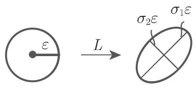
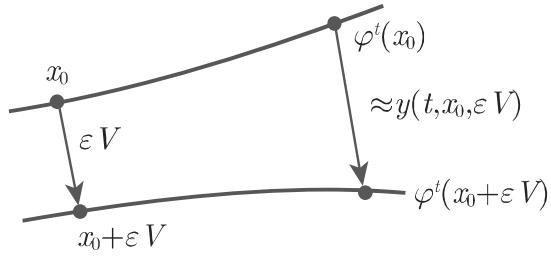

# 数学手册(原书第10版) 17.2.3 李雅普诺夫指数

本页对应《数学手册》(原书第10版)（见 [[entities/数学手册(原书第10版)]]）17.2「吸引子的量化描述」的第 3 小节，是 [[sources/10-数学手册原书第10版--12-172-吸引子的量化描述--1xwtdfm]] 的子节。主题为**李雅普诺夫指数**：以沿轨道累积的雅可比矩阵（cocycle）奇异值的对数平均渐近速率，定量刻画吸引子上轨道的局部拉伸与压缩，并建立其与测度熵的联系。全节四小节递进：奇异值 → 指数定义 → 指数计算 → 熵关系。

## 小节结构与对应页面

1. **矩阵的奇异值**：[[concepts/矩阵奇异值]]——定义与椭球几何解释（图 17.13(a)）。
2. **李雅普诺夫指数的定义**：[[concepts/李雅普诺夫指数]] 与 [[concepts/Oseledec定理]]（式 17.38 子空间滤链）。
3. **李雅普诺夫指数的计算**：[[concepts/变分方程]]、赋范基本矩阵与重正规化（[[methodology/李雅普诺夫指数数值计算流程]]）；指数和公式 (17.39a)/(17.39b)；特例 A（平衡点）、B（周期轨）。
4. **测度熵与李雅普诺夫指数**：[[concepts/测度熵与正指数和不等式]] 与 [[concepts/佩辛熵公式]]（式 17.40）。

## 核心内容逐字转录

以下按源文顺序转录；明显的 OCR 脱字与乱码以〔〕补注标出，系统清单见 [[queries/17-2-3全节系统性转写讹误清单]]。

### 1. 矩阵的奇异值

设 $L$ 是任意的 $(n,n)$ 型矩阵〔源文句首脱 $L$〕，$L$ 的奇异值 $\sigma_1 \geqslant \sigma_2 \geqslant \cdots \geqslant \sigma_n$ 指半正定矩阵 $L^{\mathrm{T}}L$ 的非负特征值 $\alpha_1 \geqslant \cdots \geqslant \alpha_n \geqslant 0$，其中 $\alpha_i$ 的排列将重数考虑在内。奇异值有几何上的解释：如果 $K_\varepsilon$ 表示中心在原点半径为 $\varepsilon > 0$ 的球，则像集 $L(K_\varepsilon)$ 是一个半轴长度为 $\sigma_i \varepsilon\ (i=1,2,\cdots,n)$ 的椭球体（图 17.13(a)）。

〔编者复算注〕源文径称 $\sigma_i$ 为 $L^{\mathrm{T}}L$ 的特征值 $\alpha_i$，但由椭球半轴 $\sigma_i\varepsilon$ 复算（如 $L=\mathrm{diag}(2,1)$ 时 $L^{\mathrm{T}}L$ 特征值为 $4,1$，而像椭球半轴为 $2\varepsilon,\varepsilon$）可知 $\sigma_i = \sqrt{\alpha_i}$，疑脱「平方根」三字。此为复算推断，非源文明文。

### 2. 李雅普诺夫指数的定义

设 $\{\varphi^t\}_{t \in T}$ 是 $M \subset \mathbb{R}^n$ 上的光滑动力系统〔源文脱「系」字〕，$\varLambda$ 为其一个吸引子，$\mu$ 为支撑在〔$\varLambda$ 上的〕遍历不变概率测度。对任意 $t \geqslant 0$ 及 $x \in \varLambda$，$\sigma_1(t,x) \geqslant \cdots \geqslant \sigma_n(t,x)$ 表示 $\varphi^t$ 在 $x$ 点处雅可比矩阵 $D\varphi^t(x)$ 的奇异值。则存在一列数 $\lambda_1 \geqslant \cdots \geqslant \lambda_n$，满足对 $\mu$-几乎处处 $x$，

$$\frac{1}{t}\ln\sigma_i(t,x) \xrightarrow{\,L^1\,} \lambda_i,\quad t \to \infty,$$

这一列数即为李雅普诺夫指数〔源文作 "$t + \infty$"，疑为 "$t \to \infty$"；几乎处处与 $L^1$ 两种收敛口径并置存疑，见 [[queries/李雅普诺夫指数收敛方式L1与几乎处处之辨]]〕。

由 Oseledec 定理，对 $\mu$-几乎处处 $x$，存在 $\mathbb{R}^n$ 的一列子空间

$$
\mathbb{R}^{n} = E_{s_1}^{x} \supset E_{s_2}^{x} \supset \dots \supset E_{s_{r+1}}^{x} = \{0\},\tag{17.38}
$$

满足 $\frac{1}{t}\ln\|D\varphi^t(x)v\|$ 关于 $v \in E_{s_j}^{x} \backslash E_{s_{j+1}}^{x}$ 一致地收敛于 $\{\lambda_1, \cdots, \lambda_n\}$ 中某元素 $\lambda_{s_j}$。

### 3. 李雅普诺夫指数的计算

若将位于〔$x$〕点的单位球面经过算子 $D\varphi^t(x)$ 作用后得到的椭球面的半轴长度记为 $\sigma_i(t,x)$，利用某些重新正规化方法（例如豪斯霍尔德 (Householder) 变换）后，通过公式 $\chi_i(x) = \limsup_{t\to\infty} \frac{1}{t}\ln\sigma_i(t,x)$ 可计算得到李雅普诺夫指数。

函数 $y(t,x,v) = D\varphi^t(x)v$〔源文脱尾参量 $v$〕是流 $\{\varphi^t\}$ 的半轨 $\gamma^+(x)$ 关于〔$x$〕的变分方程在 $t=0$ 时刻的解。事实上，如果 $\{\varphi^t\}_{t\in\mathbb{R}}$ 是 (17.1) 对应的流，则相应的变分方程为 $\dot{y} = Df(\varphi^t(x))\,y$。该方程在 $t=0$ 时刻初始值为〔$v$〕的解可表示为 $y(t,x,v) = \varPhi_x(t)v$，其中 $\varPhi_x(t)$ 为变分方程在 $t=0$ 的赋范基本矩阵；由解关于初值的可微性定理（参见第 1117〔页〕17.1.1.1, 2），它是矩阵微分方程 $\dot{Z} = Df(\varphi^t(x))\,Z$ 关于初值条件 $Z(0) = E_n$ 的解。

$\chi(x,v) = \limsup_{t\to\infty} \frac{1}{t}\ln\|D\varphi^t(x)v\|$〔源文脱范数记号〕描述了初始点为 $x + \varepsilon v\ (0 < \varepsilon \ll 1)$ 的轨道 $\gamma(x+\varepsilon v)$ 关于初始轨道 $\gamma(x)$ 沿方向〔$v$〕的动力学行为。如果 $\chi(x,v) < 0$，则随 $t$ 增加轨道沿 $v$ 方向接近 $x$ 点；反之，轨道沿 $v$ 方向远离 $x$ 点（图 17.13(b)）。

设 $\varLambda$ 为动力系统 $\{\varphi^t\}$〔源文作 $t\in\gamma$，疑为 $t\in T$〕的吸引子，$\mu$ 为支撑在 $\varLambda$ 上不变的遍历测度，$\mu$-几乎处处 $x \in \varLambda$，在流的情形 (17.1) 下，所有李雅普诺夫指数之和为

$$
\sum_{i=1}^{n}\lambda_{i} = \lim_{t \to \infty}\frac{1}{t}\int_{0}^{t} \mathrm{div}\, f(\varphi^{s}(x))\,\mathrm{d}s,\tag{17.39a}
$$

在离散情形 (17.3) 下，所有李雅普诺夫指数之和为

$$
\sum_{i=1}^{n}\lambda_{i} = \lim_{k \to \infty}\frac{1}{k}\sum_{i=0}^{k-1}\ln\|\det D\varphi(\varphi^{i}(x))\|.\tag{17.39b}
$$

〔编者注〕(17.39b) 对标量 $\det$ 使用范数记号 $\|\cdot\|$ 疑应为绝对值 $|\cdot|$，且求和哑标 $i$ 与左端 $\lambda_i$ 的指标重用，见 [[queries/式17-39b范数记号与哑标重用之辨]]。

因此对耗散系 $\sum_{i=1}^{n}\lambda_i < 0$。如果吸引子不是一个平衡点且至少有一个李雅普诺夫指数为零，则关于李雅普诺夫指数的计算可被简化（见 [17.16]）。

**特例**（分别只对所支撑的测度断言）：

- **A**〔源文脱标签「A」〕：设 $x_0$ 为流 (17.1) 的一个平衡点，$\alpha_i$ 为雅可比矩阵在 $x_0$ 的特征值。对支撑在 $x_0$ 点的测度，李雅普诺夫指数为 $\lambda_i = \mathrm{Re}\,\alpha_i\ (i = 1, 2, \cdots, n)$。
- **B**：$\gamma(x_0) = \{\varphi^t(x_0), t \in [0, T]\}$ 为 (17.1) 周期轨，$\rho_i$ 为 $\gamma(x_0)$ 点的相应乘子，则对支撑在 $\gamma(x_0)$ 的测度有 $\lambda_i = \frac{1}{T}\ln|\rho_i|,\ i = 1, 2, \cdots, n$。

### 4. 测度熵与李雅普诺夫指数

设 $\varLambda \subset \mathbb{R}$〔疑为 $\mathbb{R}^n$〕为动力系统 $\{\varphi^t\}$ 的吸引子，$\mu$ 为支撑在 $\varLambda$ 上遍历的概率测度，$h_\mu$ 为测度熵〔源文作「测度炳」〕，则 $h_\mu \leqslant \sum_{\lambda_i > 0}\lambda_i$，其中加和项为对所〔有〕正李雅普诺夫指数相加，且记重数。等式

$$
h_{\mu} = \sum_{\lambda_i > 0}\lambda_i \quad (\text{佩辛(Pesin)熵公式})\tag{17.40}
$$

一般不成立（可参见第 1153〔页〕17.2.4.4, B）。如果 $\mu$ 绝对连续〔于〕勒贝格测度，且 $\varphi: M \to M$ 是 $C^2$ 微分同胚，则佩辛熵公式成立。

〔编者注〕该充分条件仅对离散微分同胚情形断言，不得推广到流或奇异（非绝对连续）测度。

## 证据强度与转写质量

本节内容为教科书级标准结果（乘性遍历定理、正指数和熵不等式、Pesin 公式），作为参考手册权威性高，数学内容可独立复算验证（见下方四则发现）。但转写质量差：全节讹误约 30 处（脱字、形近误植、乱码、页码脱「页」字等），系统清单见 [[queries/17-2-3全节系统性转写讹误清单]]；结构性回指缺口（[17.16]、第 1117 页 17.1.1.1, 2、第 1153 页 17.2.4.4, B 及未入库的 17.2.1、17.2.2）见 [[queries/17-2-3未入库回指缺口]]。

## 与既有 wiki 的互证与衔接

- 式 (17.39a) 是 [[findings/式17-17乘子公式与17-9a周期轨双法复算]] 所载乘子散度积分公式（式 17.17）的渐近推广，两者互证。
- 特例 B 直接衔接 [[concepts/弗洛凯定理与乘子]] 与 [[concepts/周期轨乘子与安德罗诺夫—维特定理]]；特例 A 衔接 [[concepts/双曲平衡点]] 与 [[concepts/双曲平衡点与汇源鞍分类]]。
- 「耗散系 $\sum\lambda_i < 0$」为 [[concepts/耗散系统与保守系统]] 提供指数刻画；(17.39a) 与 [[concepts/刘维尔定理（流的体积变化）]] 同源（体积对数增长率 = 散度积分）。
- 解对初值可微性回指 [[sources/10-数学手册原书第10版--9-1711-动力系统--gads4o]]（17.1.1）与 [[concepts/皮卡—林德勒夫定理]]。
- 指数谱为 [[concepts/吸引子]]、[[concepts/吸收集]]、[[concepts/米尔诺吸引子]] 的量化描述增加新维度。

## 插图

## 本源衍生页面

实体：[[entities/Oseledec]]、[[entities/佩辛]]；概念：[[concepts/李雅普诺夫指数]]、[[concepts/矩阵奇异值]]、[[concepts/Oseledec定理]]、[[concepts/变分方程]]、[[concepts/佩辛熵公式]]、[[concepts/测度熵与正指数和不等式]]、[[concepts/遍历不变测度]]；方法学：[[methodology/李雅普诺夫指数数值计算流程]]；发现：[[findings/式17-38Oseledec滤链转录复算]]、[[findings/式17-39a至17-39b指数和公式转录复算]]、[[findings/平衡点与周期轨李雅普诺夫指数特例复算]]、[[findings/式17-40佩辛熵公式与熵不等式条件转录]]；查询：[[queries/17-2-3全节系统性转写讹误清单]]、[[queries/17-2-3未入库回指缺口]]、[[queries/李雅普诺夫指数收敛方式L1与几乎处处之辨]]、[[queries/式17-39b范数记号与哑标重用之辨]]；比较：[[comparisons/李雅普诺夫指数与李雅普诺夫稳定性比较]]、[[comparisons/流与离散李雅普诺夫指数和公式比较]]。

<!-- llm-wiki:embedded-images -->
## Embedded Images

### Document

<!-- llm-wiki:embedded-images -->
