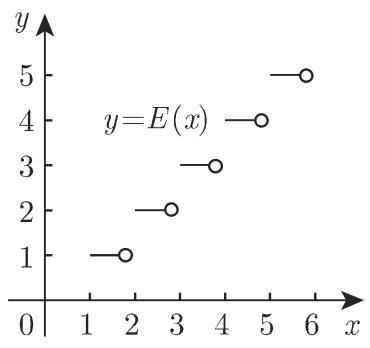
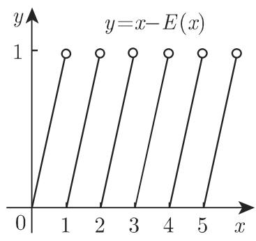
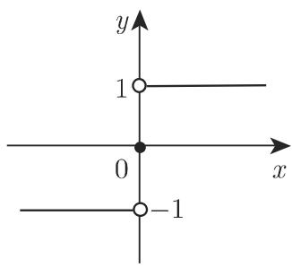

# 数学手册(原书第10版) 2.1.2 实函数的定义方法

## 概述

本页对应《数学手册（原书第10版）》第 2 章函数部分的第二节，紧接 [[sources/10-数学手册原书第10版--9-211-函数的定义--191yjep]]（2.1.1 函数的定义）。2.1.1 给出函数的集合论定义与按定义域/值域的分类体系；本节转向操作层面，回答“一个实函数可以用哪些方式定义与表示”：给出四种定义载体、三种解析表示形式（式 2.4–2.6），并以例 A–D 给出四个标准分段函数。

## 2.1.2.1 函数的定义：四种载体与缺省定义域

手册原文（定义性约定）：

> 函数可以按不同方式来定义, 如值表、图示 (曲线)、公式 (解析表达式), 或不同公式构成的分段函数. 其中的自变量只有在属于解析表达式的定义域时, 函数才有意义, 即函数取得唯一有限实值. 当没有给出定义域时, 认为定义域为使得该函数有意义的最大集合.

要点：四种载体（值表、图示、公式、分段函数）；“唯一有限实值”与 2.1.1 的单值对应口径一致（重申并细化 [[findings/函数的单值对应定义与定义域值域记号]]）；缺省定义域取使函数有意义的最大集合（自然定义域约定）。详见 [[findings/函数定义的四种载体与缺省最大定义域约定]]。

## 2.1.2.2 函数的解析表示：三种形式

**1. 显形式（式 2.4）**

$$
y = f (x).\tag{2.4}
$$

例：$y = \sqrt{1 - x^2}, -1 \leqslant x \leqslant 1, y \geqslant 0.$ 其图像为以原点为圆心的单位圆的上半部分。（本 wiki 注记：对主值平方根而言 $y \geqslant 0$ 为冗余条件。）

**2. 隐形式（式 2.5）**

$$
F (x, y) = 0.\tag{2.5}
$$

手册给出的条件：此时对每个 $x$ 存在满足该方程的唯一一个 $y$，也可以看出哪些解是函数值。

例：$x^{2} + y^{2} - 1 = 0, -1 \leqslant x \leqslant +1, y \geqslant 0$。该图像仍为以原点为圆心的单位圆的上半部分。手册特别强调：

> 要注意 $x^{2} + y^{2} - 1 = 0$ 本身并没有定义一个实函数。

即整圆在 $|x| < 1$ 处每点对应两个 $y$，须附加限制才能函数化。详见 [[findings/隐式方程整圆不定义函数须附加限制]]。

**3. 参数形式（式 2.6）**

$$
x = \varphi (t), \quad y = \psi (t).\tag{2.6}
$$

$x, y$ 是辅助变量即参数 $t$ 的函数，并根据 $t$ 取得相应的数值。手册给出的条件：函数 $\varphi(t)$ 和 $\psi(t)$ 的定义域必相同，且“只有当 $x = \varphi(t)$ 是 $t$ 与 $x$ 的一一对应时，该表达式才定义一个实函数”。

例：$\varphi(t) = \cos t$，$\psi(t) = \sin t$，$0 \leqslant t \leqslant \pi$。该图像仍为以原点为圆心的单位圆的上半部分。（本 wiki 验证注记：此区间上 $\cos t$ 严格单调，满足一一对应条件。）

注（手册原文）：参数形式的函数有时并不能表示为不含参数的显方程或隐方程。例：

$$
x = t + 2\sin t = \varphi (t), \quad y = t - \cos t = \psi (t)
$$

手册未给出此例 $t$ 的定义域。详见 [[findings/参数式的同域与一一对应条件及不可消参示例]]。

## 分段函数举例（例 A–D，原文定义照录）

**例 A（取整函数）**：当 $n \leqslant x < n + 1$ 且 n 为整数时，

$$
y = E (x) = \operatorname{int} (x) = [ x ] = n.
$$

函数 $E(x)$ 或 $\operatorname{int}(x)$（读作 “x 的整部”）表示小于等于 x 的最大整数（图 2.1(a)）。图 2.1(a), (b) 是相应的图示，其中空心圆表示终点不在曲线上（“终点”按上下文应指区间端点）。

**例 B（小数部分函数）**：函数 $y = \text{frac}(x) = x - [x]$（读作 “x 的小数部分”）表示 x 与 [x] 的差（图 2.1(b)）。

**例 C（分段衔接示例）**：

$$
y = \left\{\begin{array}{ll} x, & x \leqslant 0, \\ x^{2}, & x \geqslant 0 \end{array}\right.
$$

（图 2.2(a)）。本 wiki 验证注记：两支在 $x = 0$ 处同为 0，定义无冲突。

**例 D（符号函数）**：原文 LaTeX 转写破损，原文转写如下（说明文字被嵌入 cases 环境内部）：

```latex
■ D: $y = \text{sign}(x) = \left\{\begin{array}{ll}-1,&x<0,\\0,&x=0,(\text{图2.2(b)}),\text{sign}(x)(\text{读作“}x\text{的符号”})\text{为符}\\+1,&x>0\end{array}\right.$
```

按语义整理后的定义为：

$$
y = \operatorname{sign}(x) = \begin{cases} -1, & x < 0,\\ 0, & x = 0,\\ +1, & x > 0, \end{cases}
$$

（图 2.2(b)），$\operatorname{sign}(x)$（读作 “x 的符号”）为符号函数。转写问题详见 [[queries/例D符号函数与图2-2图题的转写错乱如何修复]]。

## 图示

图 2.1（取整函数与小数部分函数）：





图 2.2（例 C 分段函数与符号函数；注意原图题“图2.2”与 (b) 标注的相对位置在转写中疑有错位）：


## 疑点与张力

1. **参数式条件表述过强**：“只有当 $x = \varphi(t)$ 是 $t$ 与 $x$ 的一一对应时，该表达式才定义一个实函数”将充分条件误作必要条件——若不同 $t$ 映到同一 $x$ 时 $\psi(t)$ 取值相同（曲线重走自身），参数式仍可定义函数。见 [[queries/参数式一一对应条件是否将充分条件误作必要条件]]。
2. **不可消参示例与自身条件冲突**：例 $x = t + 2\sin t,\ y = t - \cos t$ 中 $\varphi'(t) = 1 + 2\cos t$ 在 $(2\pi/3,\, 4\pi/3)$ 上为负，$\varphi$ 在 $\mathbb{R}$ 上并非一一对应；且 $\psi'(t) = 1 + \sin t \geqslant 0$ 使 $\psi$ 严格递增，故同一 $x$ 对应不同 $y$。该例在未限定 $t$ 区间的情形下按手册自己的条件并不定义 $x$ 的函数，疑有遗漏。见 [[queries/不可消参示例是否应限定t的区间]]。
3. **转写错乱**：例 D 的说明文字嵌入 cases 环境；图 2.2 图题被夹在两图之间、(b) 标注顺序疑颠倒。与已收录的式 1.132b 转写问题同型。见 [[queries/例D符号函数与图2-2图题的转写错乱如何修复]]。

本节与 2.1.1 的定义口径一致，与现有 wiki 其他页面无跨来源矛盾。

## 派生页面

- 概念：[[concepts/显函数]]、[[concepts/隐函数]]、[[concepts/参数方程]]、[[concepts/分段函数]]、[[concepts/取整函数]]、[[concepts/小数部分函数]]、[[concepts/符号函数]]
- 发现：[[findings/函数定义的四种载体与缺省最大定义域约定]]、[[findings/实函数解析表示三形式及其成立条件]]、[[findings/隐式方程整圆不定义函数须附加限制]]、[[findings/参数式的同域与一一对应条件及不可消参示例]]、[[findings/取整与小数部分函数的定义记号与空心圆图示约定]]、[[findings/符号函数的三值分段定义]]
- 比较：[[comparisons/函数三种解析表示形式比较]]

<!-- llm-wiki:embedded-images -->
## Embedded Images

### Document



<!-- llm-wiki:embedded-images -->
