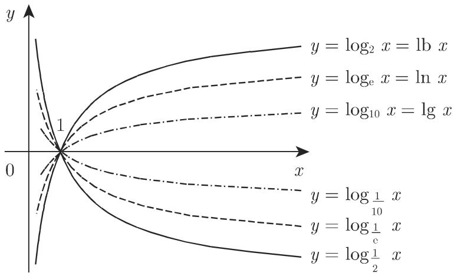
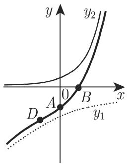
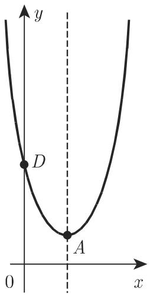
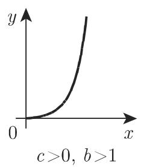
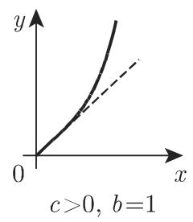
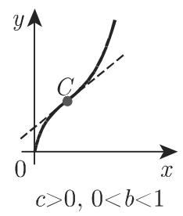
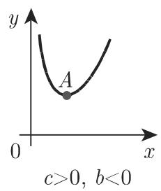
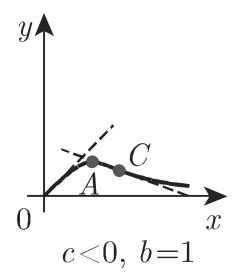
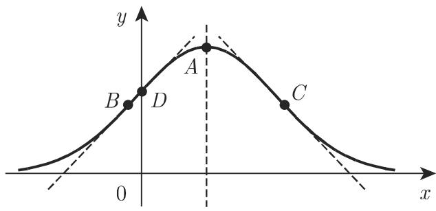
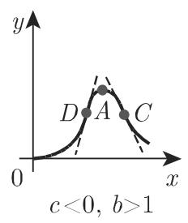

# 数学手册(原书第10版) 2.6 指数函数和对数函数

本节是 [[数学手册原书第10版]] 第 2 章（初等函数）的第六节，以「要素式函数图像目录」的形式给出六个含指数/对数的函数族：[[指数函数]]、[[对数函数]]、[[误差曲线]]、[[指数和]]、[[广义误差函数]]、[[幂函数与指数函数的乘积]]。每个族均给出对称性、截距、单调性、[[极值]]、[[拐点]]、[[渐近线]]的闭式公式，并按参数符号分类行为——方法论上是 [[多项式图像绘制法]]、[[有理函数图像绘制法]] 系列的第三篇（见 [[指数对数类函数图像绘制法]]）。经复核，式 (2.54)–(2.60) 与 (2.62) 的公式全部成立；式 (2.61) 与 2.6.6 的 b=1 切线共三处高置信度疑误（见「疑误登记」）。

## 2.6.1 指数函数（式 2.54–2.55）

$$
y = a^{x} = \mathrm{e}^{bx} \quad (a > 0,\ b = \ln a) \tag{2.54}
$$

令 a = e（e 为自然对数的底）得自然指数曲线 y = e^x（式 2.55）。要点（已复核）：只取正值，定义域 (−∞, +∞)；a > 1（即 b > 0）严格递增、值由 0 到 +∞，a < 1（即 b < 0）严格递减、值由 +∞ 到 0；|b| 越大增减越快；过点 (0, 1)；b > 0 时在左侧渐近趋近 x 轴，b < 0 时在右侧渐近趋近 x 轴，且 |b| 越大趋近越快；若 a < 1，y = a^{−x} = (1/a)^x 是增函数，若 a > 1，y 是减函数（增减性反转）。→ [[指数函数]]、[[指数函数的单调性与渐近行为]]

## 2.6.2 对数函数（式 2.56–2.57）

$$
y = \log_a x \quad (a > 0,\ a \neq 1) \tag{2.56}
$$

对数曲线可由指数曲线沿直线 y = x 反射得到——[[反函数]]图像定理（[[严格单调保证反函数存在且图像沿y等于x反射]]、[[连续严格单调函数的反函数存在且连续]]）在手册内的第一个应用实例。仅当 x > 0 时实对数函数才有定义；a > 1 严格递增、取值 −∞ 到 +∞，a < 1 严格递减、取值 +∞ 到 −∞；过点 (1, 0)；a > 1 时向下渐近趋近 y 轴，a < 1 时向上渐近趋近 y 轴。双速度陈述：|ln a| 越小增/减越快；|ln a| 越大趋近 y 轴越快——与 2.6.1 方向相反，系反函数对偶所致，复核均正确、并非错误。令 a = e 得自然对数曲线 y = ln x（式 2.57）。→ [[对数函数]]、[[对数函数为指数函数的反射反函数及双速度陈述]]

## 2.6.3 误差曲线（式 2.58–2.59）

$$
y = \mathrm{e}^{-(ax)^{2}} \tag{2.58}
$$

（高斯误差分布曲线，Gauss 仅为定语提及）：[[偶函数]]，关于 y 轴对称；|a| 越大渐近趋近 x 轴越快；x = 0 处取得极大值 1，极值点 A(0, 1)；拐点 B, C 在 $\left(\pm\frac{1}{a\sqrt{2}},\ \frac{1}{\sqrt{\mathrm{e}}}\right)$，拐点处切线斜率 $\tan\varphi = \mp a\sqrt{2/\mathrm{e}}$。复核全部通过（y″ = 0 代数求解 + a = 1 数值代入）。误差曲线在描述观测误差的正态分布性质时的重要应用（前向引用第 1069 页 16.2.4.1 与第 1107 页 16.4.1.2,3）：

$$
y = \varphi(x) = \frac{1}{\sigma\sqrt{2\pi}} \exp\left(-\frac{x^{2}}{2\sigma^{2}}\right) \tag{2.59}
$$

小瑕疵：横坐标 ±1/(a√2) 隐含 a > 0 而速度句用 |a|；(2.59) 未声明 σ > 0。「误差曲线」与标准特殊函数 erf 不同名不同义（消歧义见 [[误差曲线]] 页）。→ [[误差曲线]]、[[误差曲线的对称性极值与拐点公式]]

## 2.6.4 指数和（式 2.60）

$$
y = a\,\mathrm{e}^{bx} + c\,\mathrm{e}^{dx} \tag{2.60}
$$

通过把两曲线的坐标相加（y₁ = a·e^{bx} 与 y₂ = c·e^{dx} 求和）得到，且该函数为连续函数——[[连续函数的和差积商与复合均连续]]（式 2.31）的直接引用。若 a, b, c, d 均不等于 0，曲线是图 2.29 中的四种形式之一；依参数符号不同，图像可能沿坐标轴反射。特征点：

$$
A(0,\ a+c),\qquad
B\left(\frac{\ln(-a/c)}{d-b},\ 0\right),\qquad
x_C = \frac{1}{d-b}\ln\left(-\frac{ab}{cd}\right),\qquad
x_D = \frac{1}{d-b}\ln\left(-\frac{ab^{2}}{cd^{2}}\right).
$$

四情形分类（原文结构化数据）：

| 情形 | a 与 c | b 与 d | 单调性 | 值的走向 | 极值 | 拐点 | 渐近线 |
|---|---|---|---|---|---|---|---|
| a) | 同号 | 同号 | 严格单调 | 0 ↔ ±∞ | 无 | 无 | x 轴 |
| b) | 同号 | 异号 | 单谷 / 单峰 | +∞→+∞（有极小）或 −∞→−∞（有极大） | 有 | 无 | 无 |
| c) | 异号 | 同号 | 极值两侧各自严格单调，变号一次 | 0→极值→±∞ 或反向 | 有 C | 有 D | x 轴 |
| d) | 异号 | 异号 | 严格单调 | −∞→+∞ 或 +∞→−∞ | 无 | 有 D | 无 |

复核全部通过（全节验证最完整的公式体系）：A、B、C、D 四式分别由 y = 0、y′ = 0、y″ = 0 直接解出；四情形由符号分析逐一证实（极值存在性看 sgn(ab) 与 sgn(cd)，拐点存在性看 sgn(a) 与 sgn(c)，因 ab²、cd² 分别承 a、c 之号）。→ [[指数和]]、[[指数和四情形分类与特征点公式]]、[[指数和四情形比较]]

## 2.6.5 广义误差函数（式 2.61）

$$
y = a\,\mathrm{e}^{bx+cx^{2}} = a\,\mathrm{e}^{-\frac{b^{2}}{4c^{2}}}\,\mathrm{e}^{c\left(x+\frac{b}{2c}\right)^{2}} \quad (c \neq 0) \tag{2.61}
$$

图像可看作误差函数 (2.58) 的推广：关于铅直直线 x = −b/(2c) 对称；与 x 轴无交点；与 y 轴交点 D(0, a)。仅讨论 a > 0（a < 0 时只需将前一图形沿 x 轴反射）。

- 情形 a) c > 0：函数先由 +∞ 减小到极小值，然后再增加到 +∞，取值恒为正；极值点 A 为 $\left(-\frac{b}{2c},\ a\mathrm{e}^{\frac{b^{2}}{4c}}\right)$；无拐点和渐近线。
- 情形 b) c < 0：渐近线为 x 轴；极大值点 A 为 $\left(-\frac{b}{2c},\ a\mathrm{e}^{-\frac{b^{2}}{4c}}\right)$；拐点 B, C 为 $\left(\frac{-b\pm\sqrt{-2c}}{2c},\ a\mathrm{e}^{\frac{-(b^{2}+2c)}{4c}}\right)$。

复核：对称轴与 D(0, a) ✓；情形 b) 全部公式 ✓（取 b = 0、c = −1、a = 1 退化为误差曲线 e^{−x²}，顶点值 1、拐点 ±√2/2、拐点值 e^{−1/2}，与 2.6.3 完全吻合）。⚠️ 两处高置信度疑误：① (2.61) 中间因子 e^{−b²/(4c²)} 与左侧 a·e^{bx+cx²} 不等价（配方应为 e^{−b²/(4c)}）；② 情形 a) 极小值 a·e^{b²/(4c)} 疑漏负号（顶点值应统为 a·e^{−b²/(4c)}）。均仅涉及本族，不影响其他族。→ [[广义误差函数]]、[[广义误差函数的对称轴极值与拐点]]、[[误差曲线与广义误差函数比较]]

## 2.6.6 幂函数与指数函数的乘积（式 2.62）

$$
y = a\,x^{b}\,\mathrm{e}^{cx} \quad (c \neq 0) \tag{2.62}
$$

仅讨论 a > 0（a < 0 时只需将前一图形沿 x 轴反射）。若 b 不是整数，仅在 x > 0 时给出定义；若 b 是整数，x < 0 时曲线形状可归入同样情况。图 2.31 给出任意参数下曲线的性状。若 b > 0，曲线过原点：b > 1 时原点切线为 x 轴；b = 1 时原点切线原文作 y = x（⚠️ 疑漏系数，y′(0) = a，应为 y = ax）；0 < b < 1 时原点切线为 y 轴。若 b < 0，y 轴为渐近线。若 c > 0，函数不断增加且超过任何给定的值；若 c < 0，函数渐近趋近于 0。若 b, c 异号，函数在 x = −b/c（点 A）有极值；曲线在 x = (−b±√b)/c 有 0 个、1 个或 2 个拐点（参见图 2.31(c)(e)(f)(g) 中的点 C, D）。

复核：极值横坐标（y′/y = b/x + c = 0）✓；拐点横坐标（y″/y = (b/x+c)² − b/x² = 0 即 c²x² + 2bcx + b² − b = 0，根为 (−b±√b)/c）✓；b < 0 时判别式 4c²b < 0 故无拐点，「0/1/2 个」成立 ✓；切线分档中 b > 1 与 0 < b < 1 两档 ✓。→ [[幂函数与指数函数的乘积]]、[[幂指乘积函数的切线渐近线极值与拐点]]

⚠️ 图 2.31 的总图题「图2.31」在转写源中错落于子图 (f) 与 (g) 之间，与 [[图2-18与图2-20子图标号错乱如何修复]] 同构，强化「转写版图像标号系统性错乱」的判断（[[图2-31图题错位于子图之间如何修复]]）。

## 与现有 Wiki 的关联

- **实例化既有 finding**：2.6.2「对数曲线由指数曲线沿 y = x 反射得到」落实 [[严格单调保证反函数存在且图像沿y等于x反射]] 与 [[连续严格单调函数的反函数存在且连续]]（指数函数连续且严格单调 → 对数反函数存在且连续），是 2.1.3/2.1.5 定理的第一个手册内应用实例。
- **夯实 2.1.4 的量级结论**：[[朗道符号定义与指数对数量级结论]] 所论的指数、对数量级比较，其函数本体至此才正式定义（式 2.54–2.57）。
- **扩展既有概念**：[[渐近线]]（新增水平/垂直渐近线实例及「无渐近线」反例：2.6.4 情形 b)、d) 与 2.6.5 情形 a)）；[[拐点]]（新增四族闭式拐点公式）；[[偶函数]]（误差曲线为偶）。
- **连续性定理引用**：2.6.4「两连续函数之和为连续函数」是 [[连续函数的和差积商与复合均连续]]（式 2.31）的直接引用。
- **方法论系列延续**：[[指数对数类函数图像绘制法]]（承 [[多项式图像绘制法]]、[[有理函数图像绘制法]]）。
- **前向引用登记**：16.2.4.1（第 1069 页）与 16.4.1.2,3（第 1107 页）——观测误差的正态分布，待第 16 章摄入时回链（正态分布概念页暂缓，暂由 [[误差曲线]] 页承载）。

## 疑误登记（高置信度，均系代数层面硬性矛盾）

1. [[式2-61配方因子4c平方是否应为4c]]：式 (2.61) 配方因子 e^{−b²/(4c²)} 应为 e^{−b²/(4c)}。
2. [[广义误差函数情形a极小值是否漏负号]]：情形 a) 极小值 a·e^{b²/(4c)} 应为 a·e^{−b²/(4c)}。
3. [[幂指乘积b等于1时切线y等于x是否应为y等于ax]]：b = 1 切线 y = x 应为 y = ax。

易误读但**非**矛盾：2.6.2 的双速度陈述（|ln a| 越小增长越快 vs 越大趋近 y 轴越快）为反函数对偶所致，复核正确，已显式记录于 [[对数函数为指数函数的反射反函数及双速度陈述]]，防止后续误标为错误。本源与现有 wiki 内容无冲突。

<!-- llm-wiki:embedded-images -->
## Embedded Images

### Document

<!-- llm-wiki:embedded-images -->
