# 数学手册(原书第10版) 3.4.3 球面三角形的计算

本节是 [[concepts/球面三角学]] 的计算与应用部分（母书见 [[entities/数学手册原书第10版]]），承接 [[sources/10-数学手册原书第10版--8-34-球面三角学--8twnfs]] 中 3.4.1–3.4.2 建立的球面正弦定律、余弦定律等基本公式（(3.187a)–(3.201)）与「欧拉三角形」概念，内容包括：

1. 基本问题与精度评估（3.4.3.1），见 [[methodology/球面三角形公式选择与精度规则]]；
2. 直角球面三角形的专门公式、表 3.8 与 [[concepts/纳皮尔法则]]（3.4.3.2），见 [[concepts/直角球面三角形]]；
3. 斜球面三角形的 [[concepts/球面三角形六基本问题]]（3.4.3.3，表 3.9–3.12），含四面体算例（[[findings/四面体棱间夹角算例]]）与无线电定向（[[findings/岸对船定向三步解算链]]）；
4. 球面曲线（3.4.3.4）：[[concepts/大圆航线]]、[[concepts/小圆]]、[[concepts/斜航线]] 及其交点，应用于航海、大地勘测与机器人运动设计；
5. [[entities/高斯—克吕格坐标系]] 中的 [[concepts/子午线收敛角]] 应用段（[[findings/子午线收敛角近似式与算例]]）。

本节含两个经独立数值复算验证的算例与多处可高置信复原的转写脱落（见下文「转写讹误与复原一览」）。

## 一、3.4.3.1 基本问题与精度评估

「基本问题」指球面三角形计算中最常出现的情形。对锐角球面三角形，每个基本问题有多种解法，取决于计算是否仅基于 (3.187a)–(3.191b)、是否还用 (3.192a)–(3.201)，以及只求一个量还是多个量。精度规则：**含正切函数的公式在数值上更精确**，尤其相比于该量接近 90° 时用正弦、接近 0°/180° 时用余弦确定它；对欧拉三角形，用正弦定律计算的量有两个值（正弦在第一、二象限均取正），其他函数结果唯一。

## 二、3.4.3.2 直角球面三角形

### 1. 专门公式

记法仿平面直角三角形：γ = 90° 时 c 为斜边，a、b 为直角边，α、β 为侧角（源文「叶昭」为 α 的 OCR 讹误）。由 γ = 90° 自 (3.187d)–(3.191b) 推出：

```
sin a = sin α sin c        (3.202a)      tan a = cos β tan c   (3.202e)
sin b = sin β sin c        (3.202b)      tan b = cos α tan c   (3.202f)
cos c = cos a cos b        (3.202c)      tan b = sin a tan β   (3.202g)
cos c = cot α cot β        (3.202d)      tan a = sin b tan α   (3.202h)
【本体缺失，复原·推断】cos α = cos a sin β   (3.202i)
【本体缺失，复原·推断】cos β = cos b sin α   (3.202j)
```

(3.202i)(3.202j) 的本体在转写中仅剩编号，据表 3.8 的引用关系与代数一致性复原，见 [[queries/式3-202i与3-202j本体脱落是否可复原]]。若问题给定其他边角组合（如 b, γ, α），可通过量的轮换得到所需等式。

### 2. 表 3.8 确定球面直角三角形中的量

| 基本问题 | 已知的确定量 | 确定其余的量所需公式的编号 |
|---|---|---|
| (1) | 斜边和一直角边 c, a | α (3.202a), β (3.202e), b (3.202c) |
| (2) | 两直角边 a, b | α (3.202h), β (3.202g), c (3.202c) |
| (3) | 斜边和一个角 c, α | a (3.202a), b (3.202f), β (3.202d) |
| (4) | 一直角边和其上的角 a, β | c (3.202e), b (3.202j), α (3.202i) |
| (5) | 一直角边和其所对的角 a, α | b (3.202h), c (3.202a), β (3.202i) |
| (6) | 两个角 α, β | a (3.202i), b (3.202j), c (3.202d) |

### 3. 纳皮尔法则

将直角球面三角形的五个确定量（不算直角）按其在三角形中的顺序沿一个圆排列，并将直角边替换为余角 90°−a、90°−b（图 3.97），则：
(1) 每个确定量的余弦等于其**相邻**量的余切值之积；
(2) 每个确定量的余弦等于其**不相邻**量的正弦值之积。

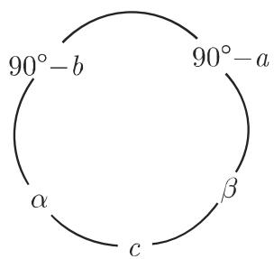

源中例 A：cos α = cot(90°−b)·cot c = tan b/tan c（即 3.202f）；例 B：cos(90°−a) = sin c·sin α = sin a（即 3.202a）。

### 4. 高斯—克吕格坐标系与子午线收敛角（无标题段落）

例 A、B 之后紧接一段以「：」开头、无标签无编号的文字（疑为脱标的应用例框，见 [[queries/高斯—克吕格段落是否为脱标应用例]]），内容为：将球的经纬线绘制在沿中央子午线与球相切的圆柱体上，中央子午线与赤道构成 [[entities/高斯—克吕格坐标系]] 的坐标轴（图 3.98(a),(b)）；过 P 垂直于中央子午线的大圆映射为垂直于轴的直线 g′，过 P 平行于该子午线的小圆映射为平行于 x 轴的直线 k′（格网子午线），过 P 的真实子午线之像 m′ 为曲线；m′ 在 P′ 处切线向上方向为地理北向，k′ 向上方向为坐标系北向，两者夹角 γ 为 [[concepts/子午线收敛角]]。

推导：在 c = 90°−φ、b = η、α = 90°−γ 的直角球面三角形 QPN（源误作 QPN^r）中，纳皮尔法则给出 cos α = tan b/tan c，即 sin γ = tan η·tan φ；因 η 极小，sin γ ≈ γ、tan η ≈ η，且对小距离 η 圆柱图长度偏差极小，可取 η = y/R（y 为 P 的纵坐标），故

```
γ = (y/R)·tan φ
算例：φ = 50°, y = 100 km ⇒ γ = 0.018706 rad = 1°04′19″
```

该式与算例已经独立复算验证，见 [[findings/子午线收敛角近似式与算例]]。

## 三、3.4.3.3 斜球面三角形

对三个已知量区分六个基本问题（角的记号 α, β, γ，所对的边 a, b, c）。表 3.9–3.12 汇总应使用的公式。记法：S = 边、W = 角（表头说明在转写中脱落），如 SWS 即两边及其夹角已知。问题 3–6 也可将一般三角形分解为两个直角三角形求解：问题 3、4（图 3.100, 3.101）用从 C 点出发的球面垂线，问题 5、6（图 3.102）用从 A/B 点出发的垂线。

### 表 3.9 第一、第二基本问题

| 第一基本问题 已知：3 边 a, b, c（SSS） | 第二基本问题 已知：3 角 α, β, γ（WWW） |
|---|---|
| 条件：0° < a+b+c < 360°, a+b > c, a+c > b, b+c > a | 条件：180° < α+β+γ < 540°, α+β < 180°+γ, α+γ < 180°+β, β+γ < 180°+α |
| 解 1：求 α。cos α = (cos a − cos b cos c)/(sin b sin c)【转写缺分数线，作 cosα = cosa−cosbcos c/sinb sinc】 | 解 1：求 a。cos a = (cos α + cos β cos γ)/(sin β sin γ)【转写作 cosα = cosα+cosβcosγ，疑同类脱落】；或 cot(a/2) = √[cos(σ−β)cos(σ−γ)]，σ = (α+β+γ)/2【疑有脱落】 |
| 解 2：求 α, β, γ。k = √[sin(s−a)sin(s−b)sin(s−c)/sin s]，tan(α/2) = k/sin(s−a)（β、γ 同理）。检验：(s−a)+(s−b)+(s−c) = s，tan(α/2)tan(β/2)tan(γ/2)·sin s = k | 解 2：求 a, b, c。k′ = √[cos(σ−α)cos(σ−β)cos(σ−γ)/(−cos σ)]【转写作减号「−cos σ」，四面体算例表明应为除法，见 [[queries/表3-9中k撇公式的分数线是否在转写中脱落]]】，cot(a/2) = k′/cos(σ−α)（b、c 同理）。检验：(σ−α)+(σ−β)+(σ−γ) = σ，cot(a/2)cot(b/2)cot(c/2)·(−cos σ) = k′ |

### 表 3.10 第三基本问题（SWS：2 边及其夹角，如 a, b, γ；条件：无）

- 解 1（求 c 或 c 和 α）：cos c = cos a cos b + sin a sin b cos γ；sin α = sin a sin γ/sin c；α 可位于象限 I 或 II（用「较大的角所对的边较大」或检验 cos a − cos b cos c ⩾ 0 → α 在象限 I 判定象限）。
- 解 2（求 α 或 α 和 c）：tan u = tan a cos γ；tan α = tan γ sin u/sin(b−u)；tan c = tan(b−u)/cos α。
- 解 3（求 α 和(或)β）：tan((α+β)/2) = [cos((a−b)/2)/cos((a+b)/2)]·cot(γ/2)，tan((α−β)/2) = [sin((a−b)/2)/sin((a+b)/2)]·cot(γ/2)（−90° < (α−β)/2 < 90°），α = (α+β)/2 + (α−β)/2，β = (α+β)/2 − (α−β)/2【转写中括号全部错乱为「tan α − β/2」等】。
- 解 4（求 α, β, c）：转写严重粘连（Z/N、Z′/N′ 结构），末两行可辨为 cos(c/2) = Z/(2 sin((α+β)/2))、sin(c/2) = Z′/(2 sin((α−β)/2))；候选复原见 [[queries/表3-10解4与表3-12方法2的错乱是否需据原书核定]]。
- 检验：关于 c 的双重计算。

### 表 3.11 第四基本问题（WSW：一边和两个邻角，如 α, β, c；条件：无）

- 解 1（求 γ 或 γ 和 a）：cos γ = −cos α cos β + sin α sin β cos c；sin a = sin c sin α/sin γ；a 可位于象限 I 或 II；检验 cos α + cos β cos γ ⩾ 0 → a 在象限 I【转写误作 α，见查询页】。
- 解 2（求 a 或 a 和 γ）：cot μ = tan α cos c；tan a = tan c cos μ/cos(β−μ)；tan γ = cot(β−μ)/cos a。
- 解 3（求 a 和(或)b）：tan((a+b)/2) = [cos((α−β)/2)/cos((α+β)/2)]·tan(c/2)；tan((a−b)/2) = [sin((α−β)/2)/sin((α+β)/2)]·tan(c/2)。
- 检验：关于 γ 的双重计算。

### 表 3.12 第五、第六基本问题（条件见分情况讨论）

SSW（已知 2 边及其中一边所对之角，如 a, b, α）与 WWS（已知 2 角及其中一角所对之边，如 a, α, β）：sin β = sin b sin α/sin a 可有两值 β₁（锐）、β₂ = 180°−β₁（钝）；分支：>1 无解；=1 一解（90°）；<1 时若 sin a > sin b 唯一解（随 b 锐钝取 β₁ 或 β₂），若 sin a < sin b 则 a、α 同锐或同钝两解、一锐一钝无解。第六问题与上述条件互为（极）对偶。转写中「1 0 个解」粘连、编号 3.1.2 重复、第六问题分支重复两行，见 [[findings/SSW与WWS歧义分支]] 与查询页。

方法 1：tan u = tan b cos α，tan v = tan a cos β，c = u+v；cot φ = cos b tan α，cot ψ = cos a tan β，γ = φ+ψ。
方法 2（纳皮尔类比）：tan(c/2) = tan((a+b)/2)·cos((α+β)/2)/cos((α−β)/2)，tan(c/2) = tan((a−b)/2)·sin((α+β)/2)/sin((α−β)/2)；tan(γ/2) = cot((α+β)/2)·cos((a−b)/2)/cos((a+b)/2)【转写分母作 sin((a+b)/2)，疑应为 cos，见查询页】，tan(γ/2) = cot((α−β)/2)·sin((a−b)/2)/sin((a+b)/2)。检验：关于 c/2 与 γ/2 的双重计算。

### 四面体算例

四面体具有底 ABC 和顶点（顶点名在转写中脱落，从面名 ABS、BCS、CAS 可知为 S）。面 BCS 与 CAS 交成角 α = 80°00′，CAS 与 ABS 交成角 β = 74°18′，ABS 与 BCS 交成角 γ = 63°40′（源中「GAS」为 CAS 的 OCR 讹误）。以棱锥顶点为球心的球面从三面角截出球面三角形：面间二面角 = 球面三角形的角，棱间夹角 = 边。按第二基本问题解 2：

```
σ = 108°59′,  σ−α = 28°59′,  σ−β = 34°41′,  σ−γ = 45°19′
k′ = 1.246983,  cot(a/2) = 1.425514,  cot(b/2) = 1.516440,  cot(c/2) = 1.773328
```

上述数值已经独立复算验证（6 位有效数字吻合），并据此裁决了 k′ 公式的分数线脱落问题，见 [[findings/四面体棱间夹角算例]]。


### 无线电定向（岸对船定向）

两固定站 P₁(λ₁, φ₁)、P₂(λ₂, φ₂) 接收船发出的方位角 δ₁、δ₂，求船位 P₀ 的地理坐标。此问题在航海学中称岸对船定向，是球面上的交会问题，解法与平面交会问题类似（源交叉引用「第 196 3.2.2.3」，页码-节号粘连）。三步解算链：(1) 三角形 P₁P₂N（边 90°−φ₁、90°−φ₂，角 Δλ）按第三基本问题求 ε₁、ε₂、e；(2) 三角形 P₁P₂P₀（ξ₁ = δ₁−ε₁，ξ₂ = 360°−(δ₂+ε₂)）按第四基本问题解 3 求 e₁、e₂；(3) 三角形 NP₁P₀ 按第三基本问题解 2 求 90°−φ₀ 与 Δλ₁，并在 NP₀P₂ 中复算检验；λ₀ = λ₁+Δλ₁ = λ₂−Δλ₂。详见 [[findings/岸对船定向三步解算链]]、[[comparisons/平面交会与球面岸对船定向比较]]。


## 四、3.4.3.4 球面曲线

球面三角学在航海中有非常重要的应用；基本问题之一是确定给出最优航线的航向角。其他应用领域为大地勘测与机器人运动设计。

### 1. 大圆航线

```
【(3.203) 本体缺失；据 (3.227a)、(3.212) 与赤道交点条件复原·推断】
tan φ = tan φ_N·cos(λ − λ_N)
φ_N = arccos(sin|α_A|·cos φ_A)                                    (3.204a)
λ_N = λ_A + sign(α_A)·|arccos(tan φ_A/tan φ_N)|                   (3.204b)
λ_red = 2 arctan(tan(λ/2))    （λ ≠ ±k·180°，角的简化）            (3.205)
λ_Eν = λ_N ∓ 90°    (ν = 1, 2)                                     (3.206)
d = arccos[sin φ_A sin φ_B + cos φ_A cos φ_B cos(λ_B−λ_A)]         (3.207a)
d = arccos[...]·πR/180°                                             (3.207b)
α_A = arctan[cos φ_A cos φ_B sin(λ_B−λ_A)/(sin φ_B − sin φ_A cos d)]   (3.208)
λ_Xν = λ_N ∓ arccos(tan φ_X/tan φ_N)    (ν = 1, 2)                  (3.209)
|α_Xν| = arcsin(cos φ_N/cos φ_X)    (ν = 1, 2)                      (3.210)
|α_X min| = 90° − φ_N    （在赤道交点处最小）                        (3.211)
φ_Y = arctan[tan φ_N cos(λ_Y − λ_N)]                                (3.212)
```

大圆航线由最接近北极的点 P_N(λ_N, φ_N)（φ_N > 0°，该处 α_N = 90°）唯一确定；(3.209) 的解仅当 |φ_X| ⩽ φ_N 时存在；多处需按 (3.205) 做角的简化。详见 [[findings/大圆航线公式组]]。

### 2. 小圆

```
cos r = sin φ sin φ_M + cos φ cos φ_M cos(λ − λ_M)                  (3.213a)
cos r = sin φ sin(φ_N − r) + cos φ cos(φ_N − r) cos(λ − λ_N)        (3.213b)
s = sin r·arccos[(cos d − cos²r)/sin²r]·πR/180°                    (3.214)
α_Orth = arctan[cos φ_A cos φ_M sin(λ_M−λ_A)/(sin φ_M − sin φ_A cos r)]   (3.215a)
α_A = (|α_Orth| − 90°)·sign(α_Orth)                                 (3.215b)
λ_Xν = λ_M ∓ arccos[(cos r − sin φ_X sin φ_M)/(cos φ_X cos φ_M)]    (3.216)
φ_T = arcsin(sin φ_M/cos r)                                         (3.217a)
λ_Tν = λ_M ∓ arccos[(cos r − sin φ_X sin φ_M)/(cos φ_X cos φ_M)]    (3.217b)【φ_X 疑应为 φ_T，见查询】
φ_Yν = arcsin[(−AC ± B√(A²+B²−C²))/(A²+B²)]    (ν = 1, 2)           (3.218a)
A = sin φ_M,   B = cos φ_M cos(λ_Y − λ_M),   C = −cos r             (3.218b)
```

A²+B² > C² 时两解；A²+B² = C² 且无极点在圆上时子午线在切点（纬度 φ_T）处与小圆相切；极点在小圆上则丢掉一解。详见 [[findings/小圆公式组与切向子午线]]。

### 3. 斜航线

```
tan α = R cos φ dλ/(R dφ)  ⇒  dλ = tan α dφ/cos φ                   (3.219a)
λ − λ_A = tan α·ln[tan(45°+φ/2)/tan(45°+φ_A/2)]·180°/π   (α ≠ 90°)  (3.219b)
λ − λ_E = tan α·ln tan(45°+φ/2)·180°/π   (α ≠ 90°)                 (3.219c)
ds = R dφ/cos α  ⇒  s = |φ_B − φ_A|/cos α·πR/180°   (α ≠ 90°)       (3.220a/b)
sin α = cos((φ_A+φ_B)/2)·(λ_B−λ_A)/l·πR/180°   （近似）             (3.221a)
l = cos((φ_A+φ_B)/2)/sin α·(λ_B−λ_A)·πR/180°   （近似）             (3.221b)
α = arctan{(λ_B−λ_A)/ln[tan(45°+φ_B/2)/tan(45°+φ_A/2)]}·π/180°     (3.222a)
α = arctan{(λ_A−λ_E)/ln tan(45°+φ_A/2)}·π/180°                     (3.222b)
λ_X = λ_A + tan α·ln[tan(45°+φ_X/2)/tan(45°+φ_A/2)]·180°/π          (3.223)
λ_E = λ_A − tan α·ln tan(45°+φ_A/2)·180°/π   (α ≠ 90°)              (3.224)
φ_Yν = 2 arctan{exp[(λ_Y−λ_A+ν·360°)/tan α·π/180°]·tan(45°+φ_A/2)} − 90°   (ν ∈ ℤ)   (3.225)
φ_Yν = 2 arctan exp[(λ_Y−λ_E+ν·360°)/tan α·π/180°] − 90°   (ν ∈ ℤ)  (3.226)
```

详见 [[findings/斜航线对数方程与极点渐近]]。


### 4. 球面曲线的交点

```
tan φ_N1 cos(λ_S − λ_N1) = tan φ_S                                 (3.227a)
tan φ_N2 cos(λ_S − λ_N2) = tan φ_S                                 (3.227b)
tan λ_S = −[tan φ_N1 cos λ_N1 − tan φ_N2 cos λ_N2]/[tan φ_N1 sin λ_N1 − tan φ_N2 sin λ_N2]   (3.228)
φ_Sν = arctan[tan φ_N1 cos(λ_Sν − λ_N1)]    (ν = 1, 2)              (3.229)
λ_S − λ_E1 = tan α_1·ln tan(45°+φ_S/2)·180°/π                      (3.230a)
λ_S − λ_E2 = tan α_2·ln tan(45°+φ_S/2)·180°/π                      (3.230b)
φ_Sν = 2 arctan exp[(λ_E1−λ_E2+ν·360°)/(tan α_2−tan α_1)·π/180°] − 90°   (ν ∈ ℤ)   (3.231)
λ_Sν = λ_E1 + tan α_1·ln tan(45°+φ_Sν/2)·180°/π   (ν ∈ ℤ)           (3.232)
```

两条大圆航线的交点恒为对径点对；两条斜航线（α₁ ≠ α₂）的交点有无穷多。详见 [[findings/球面曲线交点对径点与无穷交点]]。

## 五、转写讹误与复原一览

- 公式本体缺失但被引用：(3.202i)(3.202j)（表 3.8 引用）、(3.203)（正文与 (3.227a)、(3.212) 隐含引用）——均可高置信复原，见两个查询页。
- 表 3.9 中 k′ 公式分数线脱落（呈减号）——已由四面体算例数值裁决，见 [[queries/表3-9中k撇公式的分数线是否在转写中脱落]]。
- 表 3.10 解 4 与表 3.12 方法 2 的括号、分母、编号错乱，及表 3.11 检验行的 α/a 之疑——待据原书核定，见 [[queries/表3-10解4与表3-12方法2的错乱是否需据原书核定]]。
- (3.217b) 切点公式中的 φ_X 疑应为 φ_T，见 [[queries/式3-217b中的φX是否应为φT]]。
- 结构性错位：高斯—克吕格段落无标签，见 [[queries/高斯—克吕格段落是否为脱标应用例]]。
- 系统性 OCR 错字：社→γ、「叶昭」→α、β（另见「勹」「釭」等残字）、「计砌」→η、GAS/OCS→CAS、「球而」→球面、「千」→于、QPN 误作 QPN^r、四面体顶点名 S 与「确定边 a, b, c」脱落、表头 S/W 记号缺失、「问题 3～问题___」缺编号等，见 [[queries/3-4-3全节符号成片脱落是否为转写丢字]]；交叉引用「第 196 3.2.2.3」「第 213 3.4.1.1」「第 207 3.3.4」「第 227 3.4.3.2」再现页码-节号粘连，印证 [[queries/平面三角学节交叉引用页码节号是否粘连]]。

## 六、与其他 wiki 页面的联系

- 承接 [[concepts/球面三角学]]（3.4.1–3.4.2）与 [[concepts/正弦定律]]、[[concepts/余弦定律]] 的球面版本。
- SSS 存在条件（0° < a+b+c < 360° 且两边和大于第三边）恰是 [[findings/多面角全等对称与面角和]] 中三面角面角和定理的条件；四面体算例是 [[concepts/多面角]]、[[concepts/二面角]]、[[concepts/四面体]] 的直接应用。
- 岸对船定向与 [[concepts/交会法]] 系列、[[methodology/交会定位计算流程]]、[[comparisons/交会定位三法比较]] 同构（已知—所测—所求—解范式 + 三角形链 + 复算检验）。
- 平面/球面基本问题对偶扩展（而非否定）[[findings/平面三角形边不可仅由角得到]] 与 [[findings/一般三角形四个基本问题与SSA分支]]，见 [[comparisons/平面与球面三角形基本问题比较]]。
- 几何基础：[[concepts/球]]、[[concepts/球冠]]（小圆平面为球冠底）、[[concepts/弧度]]（πR/180° 换算遍布全节）、[[concepts/测地坐标]]、[[concepts/方位角]]（大地测量语境）。

<!-- llm-wiki:embedded-images -->
## Embedded Images

### Document

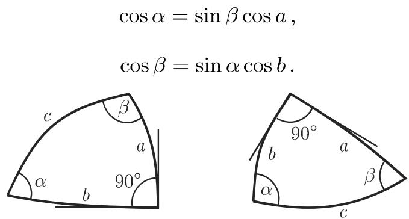

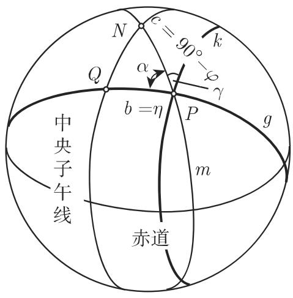
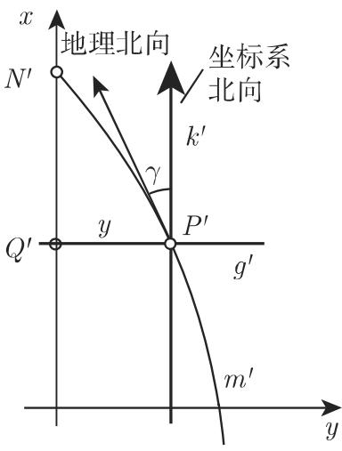

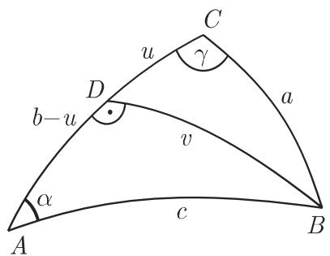
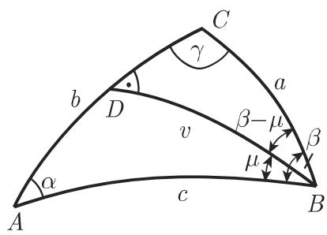
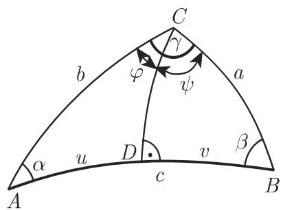


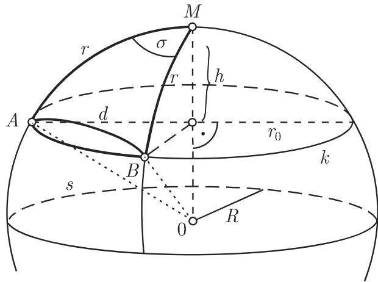
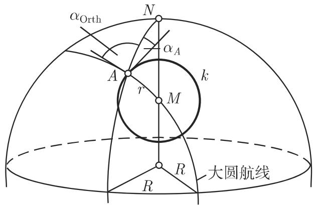
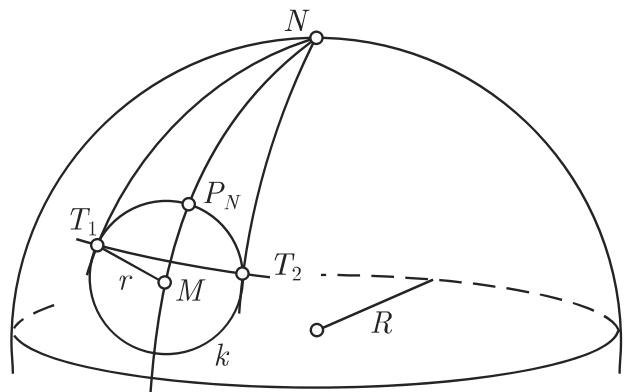

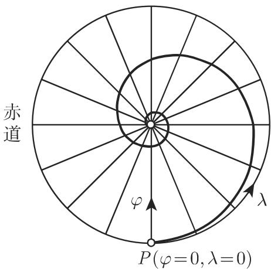
<!-- llm-wiki:embedded-images -->
