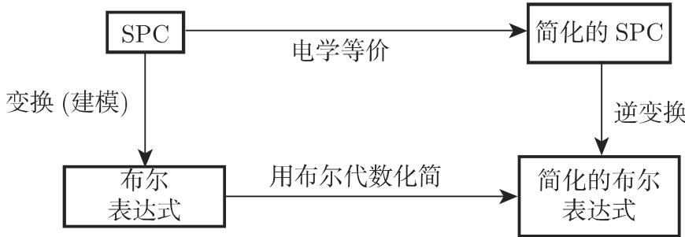
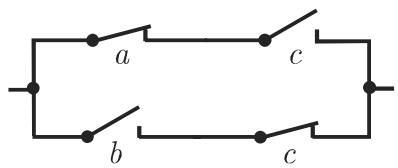
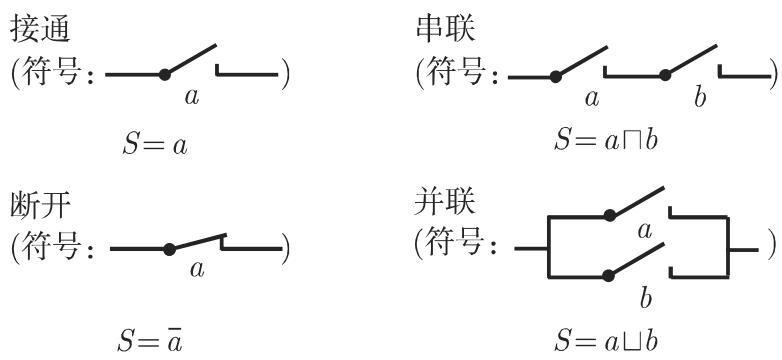

# 数学手册(原书第10版) 5.7 布尔代数和开关代数

**来源类型**：数学手册章节（第 5 章代数结构之布尔代数分支，小节 5.7.1–5.7.7），延续本系列「定义—定理—算例」体例。

**主题**：布尔代数的公理化定义（5.7.1）、对偶原理（5.7.2）、有限布尔代数的完全分类（5.7.3）、布尔代数导出的序关系与哈塞图解（5.7.4）、布尔函数与布尔表达式（5.7.5）、主正规形式 PDNF/PCNF（5.7.6）、开关代数与 SPC 化简（5.7.7）。开篇将布尔代数定位为：与集代数（5.2.2.3，第 441 页）及命题演算（5.1.1.6，第 434 页）中确立的相类似计算法则在其他数学对象上的公理化研究。

**⚠️ 转写质量警示**：本节是手册已入库各节中转写讹误最重的一节——运算符 $\sqcap$、$\sqcup$、否定号及 $0$、$1$、$B$ 等符号整批脱落，且**两条分配律（式 5.290/5.291）被抄成数学上为假的命题**（已在 $B=\{0,1\}$ 中用反例证伪）。引用本节任何公式前，务必先核对 [[queries/5-7全节系统性转写讹误清单]]；本页及衍生页中的公式均已标注转写状态。

## 5.7.1 定义（式 5.284–5.297）

集合 $B$、两个二元运算 $\sqcap$（「合取」）与 $\sqcup$（「析取」）、一元运算 $\bar{\ }$（「否定」），以及 $B$ 中两个互异的中性元素 $0$、$1$ 一起称为布尔代数 $B=(B,\sqcap,\sqcup,\bar{\ },0,1)$，如果满足六组公理（转写原文，讹误处以注释标出）：

```
(1) 结合律
    (a ⊓ b) ⊓ c = a ⊓ (b ⊓ c)                          (5.284)
    (a ⊔ b) ⊔ c = a ⊔ (b ⊔ c)                          (5.285)
(2) 交换律
    a ⊓ b = b ⊓ a                                       (5.286)
    a ⊔ b = b ⊔ a                                       (5.287)
(3) 吸收律
    a ⊓ (a ⊔ b) = a                                     (5.288)
    a ⊔ (a ∩ b) = a        [「∩」为「⊓」之转写混用]     (5.289)
(4) 分配律
    (a ⊔ b) ⊓ c = (a ⊓ b) ⊔ (b ⊓ c)    [假命题，见下]  (5.290)
    (a ⊓ b) ⊔ c = (a ⊔ b) ⊓ (b ⊔ c)    [假命题，见下]  (5.291)
(5) 中性元素
    a ⊓ 1 = a                                           (5.292)
    a ⊔ 0 = a                                           (5.293)
    a ⊓ 0 = 0                                           (5.294)
    a ⊔ 1 = 1                                           (5.295)
(6) [组名在转写中脱落，据内容应为「补律」]
    a ⊓ ā = 0                                           (5.296)
    a ⊔ ā = 1                                           (5.297)
```

**分配律讹误（本节最严重的数学性转写讹误）**：按转写文本，(5.290) 在 $B=\{0,1\}$ 中取 $a=b=1,\ c=0$ 得左 $0$ 右 $1$；(5.291) 取 $a=0,\ b=1,\ c=0$ 得左 $0$ 右 $1$——两式均为假命题，与公理系统其余部分不自洽。正确形式应为

$$(a\sqcup b)\sqcap c=(a\sqcap c)\sqcup(b\sqcap c),\qquad (a\sqcap b)\sqcup c=(a\sqcup c)\sqcap(b\sqcup c),$$

即右端是 $c$（而非 $b$）分别与 $a$、$b$ 运算后合并。详见 [[findings/布尔代数公理组与分配律讹误]] 与 [[queries/式5-290与5-291分配律右端是否抄错]]。另注：(5.294)、(5.295) 可由其余公理导出，手册却将其与 (5.292)、(5.293) 并列于「中性元素」名下，体例待核。

**格论定位**：一个具有结合律、交换律和吸收律的结构称为**格**；如果分配律也成立，则称作**分配格**。因此布尔代数是一个特殊的分配格（[[concepts/格与分配格]]）。应用于布尔代数的记号不一定与命题演算中的运算记号相同。

## 5.7.2 对偶原理（式 5.298–5.302）

**对偶化**：在布尔代数的公理中，用 $\sqcup$ 代替 $\sqcap$、用 $\sqcap$ 代替 $\sqcup$、用 $1$ 代替 $0$、用 $0$ 代替 $1$，总是给出同一行中另一个公理；同一行中的公理互相对偶（转写文本中此替换规则的符号整批脱落，此处为依公理表复原）。

**对偶原理**：一个对于布尔代数正确的陈述，其对偶陈述也对于布尔代数正确——对每个被证明的命题，对偶命题也被证明。

**由公理导出的性质**（详见 [[findings/布尔代数对偶性质组]]）：

```
(E1) 幂等律    a ⊓ a = a (5.298)    a ⊔ a = a (5.299)
(E2) 德摩根法则  ¬(a ⊓ b) = ā ⊔ b̄ (5.300)   ¬(a ⊔ b) = ā ⊓ b̄ (5.301)
(E3) 对合（自对偶）  ā̄ = a (5.302)
```

每对性质只需证明其一（另一条是对偶性质）；最后一个性质自身对偶。

## 5.7.3 有限布尔代数（式 5.303）

**同构**：设 $B_1,B_2$ 是布尔代数，$f:B_1\to B_2$ 为双射。$f$ 称为同构，如果

$$f(a\sqcap b)=f(a)\sqcap f(b),\quad f(a\sqcup b)=f(a)\sqcup f(b),\quad f(\bar a)=\overline{f(a)}.\tag{5.303}$$

**结构定理**（源未给证明）：每个有限布尔代数同构于一个有限集幂集的布尔代数。特别地，每个有限布尔代数恰有 $2^n$ 个元素，且每两个元素个数相同的有限布尔代数是同构的。详见 [[findings/有限布尔代数幂集表示定理]]。

**二元布尔代数 $B=\{0,1\}$ 的运算表**（转写完整，已逐项核对；详见 [[entities/二元布尔代数b]]）：

```
⊓ | 0 1        ⊔ | 0 1        补 | 值
--+---        --+---        --+----
0 | 0 0        0 | 0 1        0 | 1
1 | 0 1        1 | 1 1        1 | 0
```

**$B^n$（$B$ 的 $n$ 重直接积）**：在重笛卡儿积 $B^n=\{0,1\}\times\cdots\times\{0,1\}$ 上按分量定义 $\sqcap$、$\sqcup$ 与补，则 $B^n$ 是布尔代数，其 $0=(0,\dots,0)$、$1=(1,\dots,1)$。因为 $B^n$ 含 $2^n$ 个元素，这样就得到所有有限布尔代数（不计同构者）。

## 5.7.4 作为序关系的布尔代数（图 5.20）

可对每个布尔代数确定一个序关系：若 $a\sqcap b=a$（或等价地 $a\sqcup b=b$）成立，则 $a\le b$。因此每个有限布尔代数可以用哈塞图解表示（手册引 5.2.4.4，第 449 页，未入库）。

**算例**：30 的因子集合 $\{1,2,3,5,6,10,15,30\}$ 上，以最小公倍数为 $\sqcup$、最大公因子为 $\sqcap$、补为一元运算 $a\mapsto 30/a$，构成布尔代数。转写句「数 30 对应千互异元素 1」严重损毁；据结构复原应为「0 元素对应 1、1 元素对应 30」。该 8 元格即 $B^3$ 之实例（推断，源未明言）。详见 [[findings/30因子布尔代数哈塞图例]]。


## 5.7.5 布尔函数、布尔表达式（式 5.304–5.311，表 5.6）

**布尔函数**：设 $B$ 为有两个元素的布尔代数（5.7.3），则 $n$ 重布尔函数是从 $B^n$ 到 $B$ 的映射，共有 $2^{2^n}$ 个。**转写讹误**：正文讹为「$2^n$ 个」，与源自身「n=2 时存在 16 个」矛盾，见 [[queries/布尔函数个数是否应为2的2的n次方]]。

所有 $n$ 重布尔函数的集合对逐点运算构成布尔代数：

$$(f\sqcap g)(b)=f(b)\sqcap g(b),\quad(f\sqcup g)(b)=f(b)\sqcup g(b),\quad\bar f(b)=\overline{f(b)}\tag{5.304–5.306}$$

（$b\in B^n$，右边运算在 $B$ 中实施）；互异元素 $0,1$ 对应常值函数 $f_0(b)=0,\ f_1(b)=1$（式 5.307）。

**n=1 的四个函数（式 5.308，含更正）**：恒等 $f(b)=b$、否定 $f(b)=\bar b$、重言 $f(b)=1$、矛盾 $f(b)=0$。转写把重言与矛盾均讹抄为 $f(b)=b$，见 [[queries/式5-308重言与矛盾式是否应为1与0]]。

**n=2 的 16 个函数**：最重要的五种列于表 5.6（值表已全部复算无误；XOR 与等价两行的公式否定号位置抄错，更正后逐点吻合，见 [[queries/表5-6中xor与等价的否定号位置是否抄错]]）：

```
函数名称          不同的记号                              值表 (a,b) = (0,0),(0,1),(1,0),(1,1)
Sheffer 或 NAND   (a·b) 的否定,  a|b,  NAND(a,b)          1, 1, 1, 0
Peirce 或 NOR     (a+b) 的否定,  a↓b,  NOR(a,b)           1, 0, 0, 0
反等价或 XOR      āb+ab̄ [更正],  a XOR b,  a≠b,  a⊕b      0, 1, 1, 0
等价              āb̄+ab [更正],  a≡b,  a↔b                1, 0, 0, 1
蕴涵              ā+b,  a→b                               1, 1, 0, 1
（「不同的符号」列在转写中为空，疑为电路符号，原图不可核验）
```

（XOR 与等价的转写原文分别为 $\overline{ab}+a\bar b$ 与 $\overline{ab}+ab$，均与自身值表不符。）

**布尔表达式**：归纳定义——常数 $0,1$ 及布尔变量（只能在 $\{0,1\}$ 中取值，变量集 $X$ 可数）恰为布尔表达式（5.309）；若 $S,T$ 是布尔表达式，则 $\bar S$、$(S\sqcap T)$、$(S\sqcup T)$ 也是布尔表达式（5.310）。含变量 $x_1,\dots,x_n$ 的表达式 $T$ 按式 (5.311a–d) 指派布尔函数 $f_T$（常数→$f_0/f_1$；变量→$b_i$；对否定、$\sqcap$、$\sqcup$ 逐点递推）。详见 [[findings/布尔表达式归纳定义与函数指派]]。

**语义等价**：表示相同布尔函数的表达式称为「共点或语义等价」（源译名）；布尔表达式相等，当且仅当可依据布尔代数的公理互相变换。变换的两个特别方向：形式尽可能「简单」（5.7.7）与「正规形式」（5.7.6）。

## 5.7.6 正规形式（式 5.312–5.313）

**基本合取／基本析取**：每个合取（析取），若其中每个变量或其否定恰出现一次，则称为（变量 $x_1,\dots,x_n$ 的）基本合取（基本析取）。若基本合取的析取 $D$ 满足 $D=T$，称 $D$ 为 $T$ 的主析取正规形式（PDNF）；若基本析取的合取 $C$ 满足 $C=T$，称 $C$ 为 $T$ 的主合取正规形式（PCNF）。PDNF 的基本合取属于使函数取值 1 的赋值（变量值 1 取本身、值 0 取否定）；PCNF 对偶地取值 0 的赋值（值 1 取否定、值 0 取本身）。若变量的顺序和赋值的顺序给定（赋值视为二进数按递增排列），则 PDNF 与 PCNF 唯一确定，可作等价性判据（主正规形式按字母逐个恒等 ⟹ 语义等价）。

**核心算例**（真值表与两式均已逐点复算吻合，详见 [[findings/pdnf与pcnf构造算例]]）：

| x | y | z | f(x,y,z) |
|---|---|---|---|
| 0 | 0 | 0 | 0 |
| 0 | 0 | 1 | 1 |
| 0 | 1 | 0 | 0 |
| 0 | 1 | 1 | 0 |
| 1 | 0 | 0 | 0 |
| 1 | 0 | 1 | 1 |
| 1 | 1 | 0 | 1 |
| 1 | 1 | 1 | 0 |

$$\text{PDNF:}\ (\bar x\sqcap\bar y\sqcap z)\sqcup(x\sqcap\bar y\sqcap z)\sqcup(x\sqcap y\sqcap\bar z)\tag{5.312}$$

$$\text{PCNF:}\ (x\sqcup y\sqcup z)\sqcap(x\sqcup\bar y\sqcup z)\sqcap(x\sqcup\bar y\sqcup\bar z)\sqcap(\bar x\sqcup y\sqcup z)\sqcap(\bar x\sqcup\bar y\sqcup\bar z)\tag{5.313}$$

部分 C 给出两个与上例语义等价的表达式；按转写文本两式均不等于 $f$（各脱落否定号），高置信复原后与 PDNF 逐点一致，见 [[queries/部分c两表达式是否脱落否定号]]。

## 5.7.7 开关代数（式 5.314–5.315，图 5.21–5.24）

布尔代数的典型应用是串联-并联电路（SPC）的化简，工作流为：SPC →（变换）指派布尔表达式 → 依布尔代数法则化简 →（逆变换）指派 SPC，得到与初始系统同样效果的简化电路。开关函数的布尔表达式有一特殊性质：**否定符号只可能出现在变量的上方（从不在子表达式的上方）**——此性质仅属开关函数。详见 [[concepts/开关代数]] 与 [[methodology/spc布尔表达式化简流程]]。

核心算例（化简链每步已复算等价，详见 [[findings/spc化简算例]]）：

```
S = (ā⊓b) ⊔ (a⊓b⊓c̄) ⊔ (ā⊓(b⊔c))                    (5.314)
  = (b⊓(ā⊔(a⊓c̄))) ⊔ (ā⊓(b⊔c))
  = (b⊓(ā⊔c̄)) ⊔ (ā⊓(b⊔c))
  = (ā⊓b) ⊔ (b⊓c̄) ⊔ (ā⊓c)
  = (ā⊓b⊓c) ⊔ (ā⊓b⊓c̄) ⊔ (b⊓c̄) ⊔ (a⊓b⊓c̄) ⊔ (ā⊓c) ⊔ (ā⊓b̄⊓c)
  = (ā⊓c) ⊔ (b⊓c̄)                                    (5.315)
```

（式号 (5.315) 在转写中被误标为「(5)」。）源结语：该例表明通常通过变换得到最简布尔表达式并不那么容易，文献中可找到不同的化简方法（未具名）。






## 转写讹误清单（摘要）

本源转写讹误的完整清单与状态见 [[queries/5-7全节系统性转写讹误清单]]，要点：(a) 式 5.290/5.291 假分配律（已反例证伪并更正）；(b) 式 5.308 重言与矛盾讹为 $f(b)=b$；(c) 函数计数讹为 $2^n$；(d) 表 5.6 中 XOR/等价否定号位置抄错；(e) 5.7.6 部分 C 两表达式脱落否定号；(f) 5.7.4「数 30 对应千互异元素 1」句损毁；(g) 运算符与符号（$\sqcap$、$\sqcup$、否定号、$0$、$1$、$B$）在 5.7.2、5.7.5 等处整批脱落；(h) 公理第 (6) 组标题脱落；(i) SPC/SPD 混用；(j)「千/于」混淆与页码节号粘连贯穿全节。

## 与现有 wiki 的联系

- 同属手册系列源（5.3.7、5.3.8、5.4.1–5.4.6 已入库），将覆盖推进到 5.7；**拓展**而非挑战现有内容，与现有页面无矛盾。
- [[concepts/最大公因子与最小公倍数]]：5.7.4 的 30 因子例以 gcd/lcm 为 $\sqcap$/$\sqcup$，是该页运算的跨节复用。
- [[comparisons/gf-pn与zp-n比较]]、[[comparisons/素域q与zp比较]]：$B=\{0,1\}$ 的载体与 ℤ₂ = GF(2) 相同；表 5.6 中 XOR 的记号 $a\oplus b$ 取值恰为 ℤ₂ 加法（推断，源未陈述），见 [[entities/二元布尔代数b]]。
- 依赖缺口：本源引用的 5.1.1.6（命题演算）、5.2.2.3（集代数）、5.2.4.4（哈塞图解）均未入库，见 [[queries/5-7未入库依赖缺口]]，与 [[queries/5-4-1对5-2-3及1-1-1-4的未入库依赖缺口]] 同型。

## 证据强度小结

- 公理与定义属规定性内容，但转写版本的分配律为假命题，引用前必须更正。
- 有限布尔代数结构定理为标准结果，源未给证明（教科书权威 + 可独立验证），强度中高。
- 全部算例——二元运算表、表 5.6 值表、PDNF/PCNF（式 5.312–5.313）、SPC 化简链（式 5.314–5.315）、n=1/2 计数（4/16）——均经复算吻合，或已定位讹误并给出经逐点验证的复原，强度高。
- 四张插图（图 5.20–5.24）原图不可核验，仅存文件；相关论断均以正文为据。

## 由本源生成的页面

- 概念：[[concepts/布尔代数]]、[[concepts/格与分配格]]、[[concepts/对偶原理]]、[[concepts/德摩根法则]]、[[concepts/有限布尔代数]]、[[concepts/布尔函数]]、[[concepts/布尔表达式]]、[[concepts/主正规形式]]、[[concepts/开关代数]]
- 实体：[[entities/二元布尔代数b]]
- 发现：[[findings/布尔代数公理组与分配律讹误]]、[[findings/布尔代数对偶性质组]]、[[findings/有限布尔代数幂集表示定理]]、[[findings/30因子布尔代数哈塞图例]]、[[findings/布尔函数计数与两变量函数值表]]、[[findings/布尔表达式归纳定义与函数指派]]、[[findings/pdnf与pcnf构造算例]]、[[findings/spc化简算例]]
- 方法：[[methodology/由真值表构造pdnf与pcnf流程]]、[[methodology/spc布尔表达式化简流程]]
- 比较：[[comparisons/pdnf与pcnf比较]]、[[comparisons/五种两变量布尔函数比较]]
- 查询：[[queries/5-7全节系统性转写讹误清单]]、[[queries/式5-290与5-291分配律右端是否抄错]]、[[queries/式5-308重言与矛盾式是否应为1与0]]、[[queries/布尔函数个数是否应为2的2的n次方]]、[[queries/表5-6中xor与等价的否定号位置是否抄错]]、[[queries/部分c两表达式是否脱落否定号]]、[[queries/5-7未入库依赖缺口]]

<!-- llm-wiki:embedded-images -->
## Embedded Images

### Document





<!-- llm-wiki:embedded-images -->
