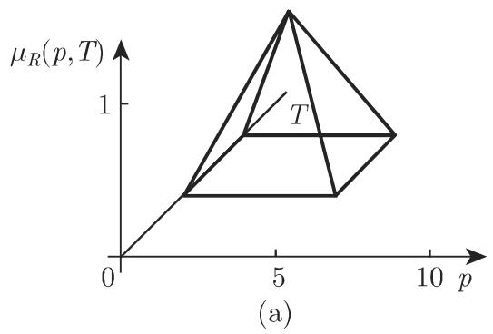

# 数学手册(原书第10版) 5.9.4 模糊推理(近似推理)

《数学手册(原书第10版)》5.9.4 节（第 594 页），主题为**模糊推理**，即由模糊关系导出模糊逻辑结论的推理框架。全节含式 5.380–5.381 与图 5.76–5.77，是 [[concepts/模糊逻辑]]（5.9 节）的推理应用小节；其算子层面与已入库的 5.9.2（[[concepts/模糊集的聚合]]，见 [[sources/10-数学手册原书第10版--12-592-模糊集的连接聚合--wb9q68]]）相互印证。

## 内容概要

### 1. 模糊推理的定义与定位

- 模糊推理是**模糊关系的一个重要应用**，目的是对不明确信息获得模糊逻辑结论。原文前向引用「（参见第 576 5.9.6.3)」，疑脱「页」字且页码可疑（5.9.6.3 应位于 594 页之后）。
- 「不明确信息」指**模糊信息**而非「不确知信息」——模糊 ≠ 不确知。
- 模糊推理也称作**蕴涵**，包含**一个或多个法则、一个事实和一个结论**。
- [[entities/扎德]] 称模糊推理为**近似推理**。
- **不可能用经典逻辑刻画**。
- 概念性注意事项：本节虽称模糊推理「也称作蕴涵」，但式 5.381b 实以 min（合取型算子）定义关系 R，是合取型而非经典蕴涵型构造；源本身已声明不可能用经典逻辑刻画，故二者在源内自洽。

### 2. 模糊蕴涵、IF THEN 法则

最简单情形下，模糊蕴涵含一个 IF THEN 法则：IF 部分称为**前提**（表示条件），THEN 部分是**结论**。计算规定为：

```
μ₂ = μ₁ ∘ R        (5.380)
```

μ₂ 是 μ₁ 在模糊关系 R 下的**模糊推理象**。转录中「在模糊关系 下的」脱符号 R；「产生」之后疑脱漏公式或图（见 [[queries/式5-380产生之后是否脱漏公式或图]]）。∘ 与 R 的正式定义位于未入库的 5.9.3（见 [[queries/5-9-3模糊关系及式5-359至5-379未入库缺口]]）。

### 3. 广义模糊推理格式

法则形式（逐字保留）：

```
IF（若 A₁ 和 A₂ 和 A₃ ⋯ 和 Aₙ）THEN（则）B
其中 Aᵢ: μᵢ: Xᵢ → [0,1]  (i = 1, 2, …, n)
```

结论 B 的隶属函数 μ: Y → [0,1]（转录「结论 的隶属函数」脱 B）由一个 (n+1) 元关系（转录作「(n+1)－值关系」，「值」疑应为「元」）刻画：

```
R: X₁ × X₂ × ⋯ × Xₙ × Y → [0,1]        (5.381a)
```

对于具有清晰值 x₁′, x₂′, …, xₙ′ 的确实输入（转录「吐确实的输入」衍字「吐」），法则 (5.381a) 通过

```
μ_{B′}(y) = μ_R(x₁′, x₂′, …, xₙ′, y)
          = min{μ₁(x₁′), μ₂(x₂′), …, μₙ(xₙ′), μ_B(y)}   (y ∈ Y)   (5.381b)
```

定义确实的模糊输出。

**注**（转录「注量」疑为「注：量」）：min{μ₁(x₁′), μ₂(x₂′), ⋯, μₙ(xₙ′)} 称为**法则的满足等级**；转录中「并且量 min{…} 表示模糊值输入量」重复了同一 min 公式，疑第二处应为不同内容（见 [[queries/满足等级注释两个min公式是否重复]]）。

### 4. 柱面扩充（图 5.76）

形成连接「中等」压力与「高」温间的模糊关系（图 5.76）：

```
μ̃₁(p, T) = μ₁(p)  ∀T ∈ X₂   (μ₁: X₁ → [0,1])   — 模糊集「中等压力」（图 5.76(a)）的柱面扩充（图 5.76(c)）
μ̃₂(p, T) = μ₂(T)  ∀p ∈ X₁   (μ₂: X₂ → [0,1])   — 模糊集「高温」（图 5.76(b)）的柱面扩充（图 5.76(d)）
μ̃₁, μ̃₂: G = X₁ × X₂ → [0,1]
```

### 5. 用极小值/极大值算子构成 AND/OR 模糊关系（图 5.77）

```
AND（和）: μ_R(p, T) = min{μ₁(p), μ₂(T)}
OR（或）:  μ_R(p, T) = max{μ₁(p), μ₂(T)}
```

转录矛盾：正文先称「5.77(a) 给出形成模糊关系的图形结果」，随后 min-AND 与 max-OR 两处均标「图 5.77(b)」，而转录仅含两幅 5.77 图像——分图编号与文字描述不一致（见 [[queries/5-9-4全节系统性转写讹误清单]]）。

## 图示（转录图像，内容未复算）

图 5.76：(a) 中等压力 μ₁(p)；(b) 高温 μ₂(T)；(c)(d) 相应的柱面扩充（(c) 的分图标签在转录中脱落，按顺序推断）：


图 5.77（AND/OR 复合结果；分图编号存疑，转录仅含两幅）：




## 与本 wiki 的联系

- **扩展** [[findings/zadeh算子与and-or-not对应]]、[[concepts/t-范数]]、[[concepts/s-范数]]：min/max 作 AND/OR 从同论域模糊集聚合（5.9.2）推广到跨论域关系复合（先柱面扩充、再逐点 min/max），见 [[comparisons/同论域聚合与跨论域关系复合比较]] 与 [[methodology/柱面扩充与and-or复合构造流程]]。
- **充实** [[entities/扎德]]：补充「近似推理」命名（本页已同步更新该实体页）。
- **相邻但须区分** [[concepts/扩张原理]]：柱面扩充与扩张原理同为「提升」构造但方向不同，辨析见 [[concepts/柱面扩充]]。
- **印证** [[concepts/模糊集的聚合]]：本节的 AND/OR 复合是该聚合概念在关系层面的应用。
- **依赖缺口**：∘ 复合与关系 R 的正式定义在未入库的 5.9.3（式 5.359–5.379），见 [[queries/5-9-3模糊关系及式5-359至5-379未入库缺口]]；5.9 各小节整体进度另见 [[queries/5-9小节未入库缺口]]。

## 转写质量

数学内核可信（定义性内容，公式自洽，且 min=AND、max=OR 与 5.9.2 交叉一致），但转录层讹误密度与此前各节相当，系统性清单见 [[queries/5-9-4全节系统性转写讹误清单]]。本节无算例可复算（纯图示，无数值）。

<!-- llm-wiki:embedded-images -->
## Embedded Images

### Document


<!-- llm-wiki:embedded-images -->
