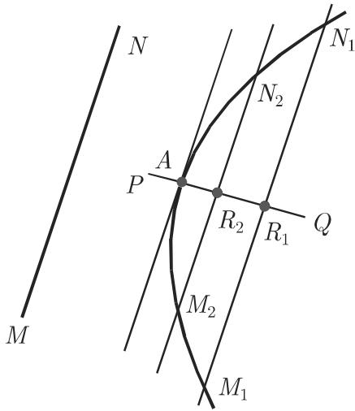
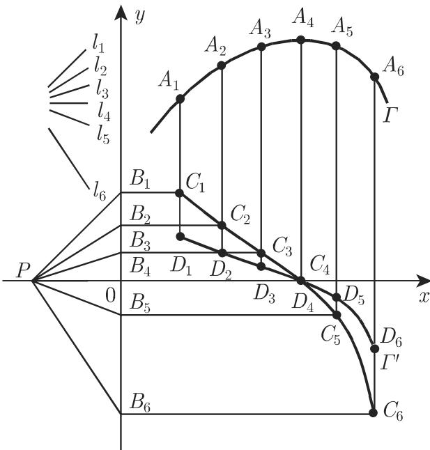

# 数学手册(原书第10版) 6.1.2 一元函数微分法则

《数学手册（原书第10版）》第 6 章（微分学）6.1.2 节“一元函数微分法则”的源页。本 wiki 此前仅入库该书 5.8.x（图论）与 5.9.x（模糊逻辑）系列，本节为第 6 章首个入库小节，全部内容为增量，与既有页面无知识交集。全节由两部分组成：6.1.2.1 初等函数的导数（表 6.1，36 对导数公式）；6.1.2.2 微分基本法则（编号 1–11 的法则序列与表 6.2 汇总，式 6.4–6.20）。

## 节次结构

**6.1.2.1 初等函数的导数**：初等函数除某些点外在整个定义域（分母非零）内均可导（图 6.2，被引用但未随文给出）；导数公式汇总于表 6.1，亦可经表 8.1 的不定积分逆运算得到。为便于微分，可先将函数化为更简单的形式：展开为不含括号的和式（参见 1.1.6.1）、分离出表达式的整有理部分（参见 1.1.7）或取对数（参见 1.1.4.3）。

**6.1.2.2 微分基本法则**：设 u, v, w, y 为 x 的函数，其微分为 du, dv, dw, dy（参见 6.2.1.3）。法则依次为：1 常函数（式 6.4）、2 数乘（式 6.5）、3 和（式 6.6a–b）、4 乘积（式 6.7a–c）、5 商（式 6.8）、6 链式（式 6.9–6.10）、7 对数微分（式 6.11–6.14）、8 反函数（式 6.15）、9 隐函数（式 6.16）、10 参数式（式 6.17，含极坐标式 6.18–6.19 与复数表示式 6.20）、11 图解微分法。表 6.2 为 14 行汇总表。

## 核心论断（均已独立复算）

1. **表 6.1**：36 对初等函数导数公式全部复算无误，含 lg e ≈ 0.4343、$\sqrt[n]{x}$ 的导数 $\frac{1}{n\sqrt[n]{x^{n-1}}}$ 等易错项。→ [[表6-1初等函数导数公式表逐字转录]]
2. **式 6.4–6.8 与表 6.2**：线性性（常函数、数乘、和差）、乘积、商法则及各微分形式全部正确；tan x 经商法则的推导复算无误。→ [[微分基本法则与表6-2式6-4至6-8]]
3. **式 6.9–6.10 链式法则**：算例 $e^{\sin^2 x}$、$e^{\tan\sqrt{x}}$ 复算无误。→ [[链式法则及算例式6-9至6-10]]
4. **式 6.11–6.14 对数微分法**：手册断言其为幂指函数 $y = u(x)^{v(x)}$ 求导的唯一方法（在初等手法范围内，此为手册立场）；算例 $(2x+1)^{3x}$、$\sqrt{x^3 e^{4x}\sin x}$ 及乘积/商法则的反推（$u,v>0$）复算无误。→ [[对数微分法与幂指函数式6-11至6-14]]
5. **式 6.15–6.16 反函数与隐函数求导**：arcsin 算例与椭圆切线斜率 $y' = -\frac{b^2}{a^2}\frac{x}{y}$ 复算无误。→ [[反函数与隐函数求导式6-15至6-16]]
6. **式 6.17–6.20 参数式、极坐标与复数切向量**：圆周运动 $\dot{z} = rw\,e^{\mathrm{i}(wt+\pi/2)}$（切向量超前位置向量 $\pi/2$）复算无误。→ [[参数式极坐标与复数求导式6-17至6-20]]
7. **图解微分法（第 11 条）**：割线中点法定切点 + 极点法构造导数曲线 $y = a f'(x)$；标度关系的几何推导已独立复核成立，但“线段 PO = a 越长曲线越平缓”与 $y = a f'(x)$ 存在内部矛盾。→ [[图解微分法极点法标度关系的几何复核]]、[[极点距a越长越平缓与y等于af是否矛盾]]
8. **适用性限定（贯穿全节）**：手册在“和”“乘积”“链式”三处强调，各组成部分可以均不可微而整体（和、乘积、复合函数）可微，此时必须回到 6.1.1 的定义公式 (6.1) 求导——即各法则为**充分条件而非必要条件**。

## 表 6.1 初等函数的导数（逐字转录）

表题原文转写损坏为“6.1 分母不为 的定义域内初等函数的导数”，疑应为“表 6.1 分母不为零的定义域内初等函数的导数”。

| 函数 | 导数 | 函数 | 导数 |
|---|---|---|---|
| C(常数) | 0 | sec x | $\frac{\sin x}{\cos^2 x}$ |
| x | 1 | cosec x | $\frac{-\cos x}{\sin^2 x}$ |
| $x^n$ (n∈ℝ) | $nx^{n-1}$ | arcsin x (\|x\|<1) | $\frac{1}{\sqrt{1-x^2}}$ |
| $\frac{1}{x}$ (x≠0) | $-\frac{1}{x^2}$ (x≠0) | arccos x (\|x\|<1) | $-\frac{1}{\sqrt{1-x^2}}$ |
| $\frac{1}{x^n}$ (x≠0) | $-\frac{n}{x^{n+1}}$ | arctan x | $\frac{1}{1+x^2}$ |
| $\sqrt{x}$ (x>0) | $\frac{1}{2\sqrt{x}}$ | arccot x | $-\frac{1}{1+x^2}$ |
| $\sqrt[n]{x}$ (n∈ℝ, n≠0, x>0) | $\frac{1}{n\sqrt[n]{x^{n-1}}}$ | arcsec x (x>1) | $\frac{1}{x\sqrt{x^2-1}}$ |
| $e^x$ | $e^x$ | arccosec x (x>1) | $-\frac{1}{x\sqrt{x^2-1}}$ |
| $e^{bx}$ (b∈ℝ) | $be^{bx}$ | sinh x | cosh x |
| $a^x$ (a>0) | $a^x\ln a$ | cosh x | sinh x |
| $a^{bx}$ (b∈ℝ, a>0) | $ba^{bx}\ln a$ | tanh x | $\frac{1}{\cosh^2 x}$ |
| ln x (x>0) | $\frac{1}{x}$ | coth x (x≠0) | $-\frac{1}{\sinh^2 x}$ |
| $\log_a x$ (a>0, a≠1, x>0) | $\frac{1}{x}\log_a e = \frac{1}{x\ln a}$ | Arsinh x | $\frac{1}{\sqrt{1+x^2}}$ |
| lg x (x>0) | $\frac{1}{x}\lg e \approx \frac{0.4343}{x}$ | Arcosh x (x>1) | $\frac{1}{\sqrt{x^2-1}}$ |
| sin x | cos x | Artanh x (\|x\|<1) | $\frac{1}{1-x^2}$ |
| cos x | −sin x | Arcoth x (\|x\|>1) | $-\frac{1}{x^2-1}$ |
| tan x (x≠(2k+1)π/2, k∈ℤ) | $\frac{1}{\cos^2 x}=\sec^2 x$ | $[f(x)]^n$ (n∈ℝ) | $n[f(x)]^{n-1}f'(x)$ |
| cot x (x≠kπ, k∈ℤ) | $\frac{-1}{\sin^2 x}=-\csc^2 x$ | ln f(x) (f(x)>0) | $\frac{f'(x)}{f(x)}$ |

存疑条目：arcsec x、arccosec x 的条件记为 (x>1)，与同表 Arcoth x 的 (\|x\|>1) 记法不一致，疑"\|"脱漏，见 [[arcsec与arccosec条件x大于1是否应为绝对值大于1]]（在 x>1 分支上公式本身正确）。

## 表 6.2 微分法则（逐字转录）

| 表达式 | 求导数公式 |
|---|---|
| 常函数 | $c' = 0$（c 为常数） |
| 常数倍 | $(cu)' = cu'$（c 为常数） |
| 和 | $(u \pm v)' = u' \pm v'$ |
| 两函数乘积 | $(uv)' = u'v + uv'$ |
| n 个函数的乘积 | $(u_1 u_2 \cdots u_n)' = \sum_{i=1}^{n} u_1 \cdots u'_i \cdots u_n$ |
| 商 | $\left(\frac{u}{v}\right)' = \frac{vu' - uv'}{v^2}\ (v \neq 0)$ |
| 两函数的链式法则 | $y = u(v(x)):\ y' = \frac{\mathrm{d}u}{\mathrm{d}v}\frac{\mathrm{d}v}{\mathrm{d}x}$ |
| 三个函数的链式法则 | $y = u(v(w(x))):\ y' = \frac{\mathrm{d}u}{\mathrm{d}v}\frac{\mathrm{d}v}{\mathrm{d}w}\frac{\mathrm{d}w}{\mathrm{d}x}$ |
| 幂 | $(u^\alpha)' = \alpha u^{\alpha-1}u'\ (\alpha \in \mathbb{R}, \alpha \neq 0)$；特别地 $\left(\frac{1}{u}\right)' = -\frac{u'}{u^2}\ (u \neq 0)$ |
| 对数微分 | $\frac{\mathrm{d}(\ln y(x))}{\mathrm{d}x} = \frac{1}{y}y' \Rightarrow y' = y\frac{\mathrm{d}(\ln y)}{\mathrm{d}x}$；特别地 $(u^v)' = u^v\left(v'\ln u + \frac{vu'}{u}\right)\ (u > 0)$ |
| 反函数可微 | 设 φ 为 f 的反函数，即 $y = f(x) \Leftrightarrow x = \varphi(y)$：$f'(x) = \frac{1}{\varphi'(y)}$ 或 $\frac{\mathrm{d}y}{\mathrm{d}x} = \frac{1}{\mathrm{d}x/\mathrm{d}y}$ |
| 隐函数微分 | $F(x,y) = 0:\ F_x + F_y y' = 0$ 或 $y' = -\frac{F_x}{F_y}\ (F_x = \frac{\partial F}{\partial x}, F_y = \frac{\partial F}{\partial y}; F_y \neq 0)$ |
| 参数形式函数可微 | $x = x(t), y = y(t)$（t 为参数）：$y' = \frac{\mathrm{d}y}{\mathrm{d}x} = \frac{\dot{y}}{\dot{x}}\ (\dot{x} = \frac{\mathrm{d}x}{\mathrm{d}t}, \dot{y} = \frac{\mathrm{d}y}{\mathrm{d}t})$ |
| 极坐标形式函数可微 | $\rho = \rho(\varphi):\ x = \rho(\varphi)\cos\varphi$（角 φ 为参数），$y' = \frac{\dot{\rho}\sin\varphi + \rho\cos\varphi}{\dot{\rho}\cos\varphi - \rho\sin\varphi}\ (\dot{\rho} = \frac{\mathrm{d}\rho}{\mathrm{d}\varphi})$ |

注：幂法则限定 α≠0 为保守条件（α=0 时公式在 u≠0 处亦给出 0），非矛盾。

## 编号公式 6.4–6.20（逐字转录）

```latex
(6.4)  c' = 0
(6.5)  (cu)' = cu',  d(cu) = c du
(6.6a) (u+v−w)' = u'+v'−w'
(6.6b) d(u+v−w) = du+dv−dw
(6.7a) (uv)' = u'v+uv',  d(uv) = v du+u dv
(6.7b) (uvw)' = u'vw+uv'w+uvw',  d(uvw) = vw du+uw dv+uv dw
(6.7c) (u₁u₂⋯uₙ)' = Σ_{i=1}^n u₁u₂⋯u_i'⋯uₙ
(6.8)  (u/v)' = (vu'−uv')/v²,  d(u/v) = (v du−u dv)/v²
(6.9)  dy/dx = u'(v)v'(x) = (du/dv)(dv/dx)
(6.10) y' = (du/dv)(dv/dw)(dw/dx)
(6.11) d(ln y(x))/dx = (1/y(x))·y'
(6.12) y' = y(x)·d(ln y(x))/dx
(6.13) y = u(x)^{v(x)},  u(x) > 0
(6.14) y' = u^v(v' ln u + v u'/u)
(6.15) f'(x) = 1/φ'(y)  或  dy/dx = 1/(dx/dy)
(6.16) F_x + F_y·y' = 0  ⟹  y' = −F_x/F_y
(6.17) dy/dx = ẏ/ẋ  (ẋ(t) ≠ 0)
(6.18) x = ρ(φ)cos φ,  y = ρ(φ)sin φ
(6.19) y' = (ρ̇ sin φ + ρ cos φ)/(ρ̇ cos φ − ρ sin φ),  ρ̇ = dρ/dφ
(6.20) x(t)+iy(t) = z(t),  ẋ(t)+iẏ(t) = ż(t)
```

## 图解微分法（第 11 条）

图 6.4（割线中点法确定切点）与图 6.5（极点法构造导数曲线）：





方法概述：作两条平行于已知切线方向 MN 的割线，取中点连线以定位切点 A；再在 x 轴负半轴取极点 P（PO = a），过 P 作平行于各切线方向的直线交 y 轴于 B_i，与过切点 A_i 的垂线交于 C_i，用曲线尺连接诸 C_i 得 $y = a f'(x)$；a ≠ 1 时各纵坐标乘 $1/a$。详见 [[图解微分法]] 与 [[图解微分法构造流程]]。

## 转写质量与存疑

本节存在与 5.8.x/5.9.x 各节同型的系统性 OCR 损坏（“于”→“千”、“几/由此”→“儿”、名词后符号系统性脱落、页码与节号粘连），详见 [[6-1-2全节系统性转写讹误清单]]。数学性存疑另立 query：[[极点距a越长越平缓与y等于af是否矛盾]]、[[arcsec与arccosec条件x大于1是否应为绝对值大于1]]、[[圆周运动之w是否应为ω]]、[[偏导数f等于Fy之f是否衍文]]。

## 未入库引用（缺口）

本节回指 6.1.1（定义公式 6.1，被三次引用）、6.2（多元函数微分法）、6.2.1.3（微分记号）、表 8.1（不定积分表）、1.1.4.3、1.1.6.1、1.1.7、2.1.5.5（复合函数）、3.5.2.2（极坐标）、3.6.1.2（切线斜率）；图 6.2 被引用但未随文给出。见 [[6-1-1及式6-1与图6-2未入库缺口]]。

## 关联页面

- 概念：[[微分法则]]（总纲）、[[乘积法则]]、[[商法则]]、[[链式法则]]、[[对数微分法]]、[[反函数求导法则]]、[[隐函数求导]]、[[参数式求导]]、[[图解微分法]]
- 逐字转录与复算：[[表6-1初等函数导数公式表逐字转录]]、[[微分基本法则与表6-2式6-4至6-8]]、[[链式法则及算例式6-9至6-10]]、[[对数微分法与幂指函数式6-11至6-14]]、[[反函数与隐函数求导式6-15至6-16]]、[[参数式极坐标与复数求导式6-17至6-20]]、[[图解微分法极点法标度关系的几何复核]]

<!-- llm-wiki:embedded-images -->
## Embedded Images

### Document


<!-- llm-wiki:embedded-images -->
