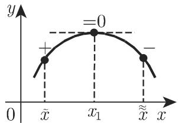
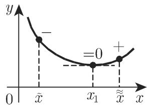
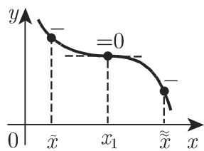

# 数学手册(原书第10版) 6.1.5 极值和拐点的确定

《数学手册（原书第10版）》6.1“一元函数的微分”的第 5 个子小节，主题是一元函数极值与拐点的判定。全节依次给出：相对极值与绝对极值的定义（式 6.34）、相对极值存在的必要条件、可微显函数极值与拐点的三种判定途径（符号改变法、高阶导数法、单调性条件与拐点刻画）、区间上绝对极值的确定（含四个算例）以及隐函数极值的判定。本节把 6.1.1（[[sources/10-数学手册原书第10版--6-611-微商--y9fryb]]）与 6.1.2（[[sources/10-数学手册原书第10版--12-612-一元函数微分法则--1l44go8]]）建立的求导工具推进到极值应用，并将 [[concepts/隐函数求导]] 从求导法则延伸到极值判定。

## 小节结构与对应页面

| 子小节 | 内容 | 对应页面 |
|---|---|---|
| 6.1.5.1 | 极大值和极小值的定义（式 6.34a–b） | [[concepts/相对极值与绝对极值]]、[[findings/式6-34极值定义]] |
| 6.1.5.2 | 相对极值存在的必要条件及非充分性（图 6.10、6.11） | [[concepts/极值存在的必要条件]]、[[findings/极值必要条件与非充分性-图6-10-6-11]] |
| 6.1.5.3 | 可微显函数 y=f(x) 极值与拐点的确定：符号改变法、高阶导数法、其他条件及拐点 | [[concepts/符号改变法]]、[[concepts/高阶导数法]]、[[concepts/拐点]] |
| 6.1.5.4 | 绝对极值的确定（四算例，图 6.13） | [[findings/绝对极值四算例-图6-13]] |
| 6.1.5.5 | 隐函数极值的确定 | [[concepts/隐函数极值判定]]、[[findings/隐函数极值Fy与Fxx符号判据]] |

## 关键内容逐字转录

**极值定义（6.1.5.1，式 6.34）**——若对任意足够小的正数或负数 $h$，都有

$$f(x_0+h) < f(x_0)\quad(\text{极大值})\tag{6.34a}$$

或

$$f(x_0+h) > f(x_0)\quad(\text{极小值})\tag{6.34b}$$

则 $f(x_0)$ 称为相对极大值（M）或相对极小值（m）。相对极大值比它邻域内的任何值都大，类似地，相对极小值比它邻域内的任何值都小；二者合称相对极值或局部极值。函数在一个区间上的最大值或最小值称为全局或绝对极大值、极小值。

**符号改变法失效边界的病态算例（6.1.5.3）**：

$$f(x)=\begin{cases}x^{2}\left(2+\sin(1/x)\right), & x\neq 0,\\ 0, & x=0.\end{cases}$$

**隐函数极值判定规程（6.1.5.5，原文转录）**——设函数由隐形式 $F(x,y)=0$ 给出，且函数本身及其偏导数 $F_x$、$F_y$ 连续：

1. 解方程组 $F(x,y)=0$、$F_x(x,y)=0$，把得到的结果 $(x_1,y_1),(x_2,y_2),\dots,(x_i,y_i),\dots$ 代入到 $F_y$、$F_{xx}$；
2. 对比 $F_y$、$F_{xx}$ 在点 $(x_i,y_i)$ 的符号：当它们异号时，函数 $y=f(x)$ 在点 $x_i$ 取得极小值；当它们同号时，取得极大值。若 $F_y$ 或 $F_{xx}$ 在 $(x_i,y_i)$ 取值为 0，则需要用更复杂的方法去研究。

## 绝对极值四算例（图 6.13，含独立复算）

| 算例 | 函数与区间 | 手册结论 | 独立复算 |
|---|---|---|---|
| A | $y=e^{-x^2},\ x\in[-1,1]$ | $x=0$ 处最大，端点处最小 | ✓ max $=1$；min $=e^{-1}$ 于 $x=\pm1$ |
| B | $y=x^3-x^2,\ x\in[-1,2]$ | 端点 $x=+2$ 最大，$x=-1$ 最小 | ✓ 4 与 $-2$；内部驻点 $x=0,\tfrac23$ 之值 $0$、$-\tfrac{4}{27}$ 均非最值 |
| C | $y=\dfrac{1}{1+e^{1/x}},\ x\in[-3,3],\,x\neq0$ | 无最大最小值；$x=-3$ 相对极小、$x=3$ 相对极大；补定义 $y(0)=1$ 则 $x=0$ 绝对极大 | ✓ sup $=1$、inf $=0$ 均不达到；补定义后仍无绝对极小（手册未言明） |
| D | $y=2-x^{2/3},\ x\in[-1,1]$ | $x=0$ 处最大（导数不是有限数） | ✓ $y'=-\tfrac23 x^{-1/3}$ 在 0 处 $\to\mp\infty$；端点 min $=1$ 未提 |

## 证据强度与独立复核

全节内容为标准微积分定理，并经独立复算验证：

- 隐函数判据方向复核：由 $y'=-F_x/F_y$ 可推出在 $F_x=0$ 处 $y''=-F_{xx}/F_y$，“异号⇒极小、同号⇒极大”与 $y''$ 符号判据一致（[[findings/隐函数极值Fy与Fxx符号判据]]）。
- 病态算例复算通过：$f'(0)=0$、$x=0$ 为严格极小、$f'$ 在 0 附近无穷次变号（[[findings/拐点与导函数极值及病态算例]]）。
- 四算例复算全部通过（[[findings/绝对极值四算例-图6-13]]）。
- 弱点：“导数不变号⇒拐点”在退化情形不严格（[[queries/导数不变号是否必然拐点]]）。
- 各判据适用对象互不相同（可微显函数 / 不可导点 / 隐函数 / 端点），不得互相移植。

## 转写讹误

本节 OCR 转写存在系统性讹误：“等千”≡“等于 0”、“平行千”≡“平行于”（多处脱漏 0 或轴名）、“对千”≡“对于”、“单调递赠”≡“单调递增”、“x=O”大写 O 代 0、“图 6.lO”字母混入编号、多处脱漏“f(x) 在”等，详见 [[queries/6-1-5全节系统性转写讹误清单]] 与 [[queries/图6-10b平行于后脱漏的轴名是否为y轴]]。

## 插图

## 与本 wiki 的关联

- 同书系列：[[sources/10-数学手册原书第10版--10-61-一元函数的微分--6vscw8]]（母小节）、[[sources/10-数学手册原书第10版--6-611-微商--y9fryb]]、[[sources/10-数学手册原书第10版--12-612-一元函数微分法则--1l44go8]]。
- 概念衔接：[[concepts/可微性]]、[[concepts/左导数与右导数]]、[[concepts/尖点]]（图 6.10(b)(c) 的不可导极值点）、[[concepts/导数的几何意义]]、[[concepts/导函数]]、[[concepts/微商]]、[[concepts/隐函数求导]]。
- 算例 D 的 $x^{2/3}$ 垂直切线与 [[findings/立方根函数垂直切线算例-图6-2a]] 互为镜像。
- 方法论与比较：[[methodology/显函数极值与拐点判定流程]]、[[methodology/隐函数极值判定流程]]、[[comparisons/符号改变法与高阶导数法比较]]、[[comparisons/相对极值与绝对极值比较]]、[[comparisons/显函数与隐函数极值判定比较]]。
- 缺口：6.1.3、6.1.4 尚未入库，见 [[queries/6-1-3及6-1-4未入库缺口]]。

<!-- llm-wiki:embedded-images -->
## Embedded Images

### Document

<!-- llm-wiki:embedded-images -->
