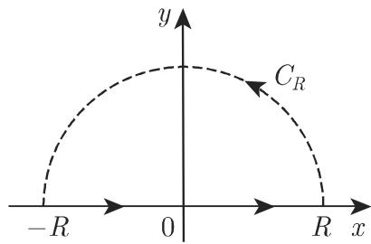

# 数学手册(原书第10版) 14.4 用复积分计算实积分

## 概述

本节是《数学手册(原书第10版)》第 14 章「复变函数」的第 4 节，主题是用复积分方法计算实定积分与实反常积分，沿三条方法主线递进展开：

1. **14.4.1 柯西积分定理的应用**：把 f(z) = e^z 代入柯西积分公式 (14.42) 的导数形式，用圆周参数化 (14.43)（即 [[methodology/复积分圆周参数化计算流程]]）导出一个无编号的周期积分恒等式。注意：小节标题称「柯西积分定理」，实际使用的是柯西积分**公式**——标题与内容存在轻微错位。
2. **14.4.2 留数定理的应用**：给出式 (14.56)——在无穷远衰减条件与上半平面有限奇点条件下，全实轴积分等于上半平面留数和的 2πi 倍；算例 ∫dx/(1+x²)³ = 3π/8。所引留数公式 (14.54b) 属 14.3（未入库）。
3. **14.4.3 若尔当引理的应用**：先陈述 [[concepts/若尔当引理]] (14.57a–c) 的五种情形，再给出五个算例：(14.58c)、[[concepts/正弦积分]] (14.59)、[[concepts/阶梯函数]] (14.60)、[[concepts/矩形脉冲]] (14.61)、[[concepts/菲涅耳积分]] (14.62)。

全节共七项可复算断言，经独立代数复算**全部通过**；其中两处数学级转写疑误（(14.62) 的 I_III 指数负号、(14.58a) 的条件 a ⩾ 0）经复算定位，见「矛盾与张力」。

## 核心公式（依源转录；OCR 缺洞处已按数学上下文修复并在正文标注）

```latex
% ---------- 14.4.1（无编号；依 (14.42)(14.43) 推得；n 为非负整数——源文未显式说明）----------
\int_0^{2\pi} e^{r\cos\varphi}\cos(r\sin\varphi - n\varphi)\,d\varphi = \frac{2\pi r^n}{n!}

% ---------- (14.56) 留数定理计算实积分 ----------
% 条件：包含实轴的上半平面中除实轴上方有限个奇点 z_1..z_n 外 f 解析；
%       f(1/z)=0 在 z=0 处有重数 m>=2 的根（源文未点明根的位置）
\int_{-\infty}^{+\infty} f(x)\,dx = 2\pi i \sum_{i=1}^{n} \operatorname{Res} f(z)\big|_{z=z_i}

% ---------- (14.57a/b/c) 若尔当引理 ----------
\int_{C_R} f(z)\,e^{i\alpha z}\,dz \to 0 \quad (R\to\infty)   % 情形 a)–d)
\int_{C_R^*} f(z)\,e^{\alpha z}\,dz \to 0                     % 情形 e)

% ---------- (14.58b) 例 1 的偶/奇分解 ----------
2i\int_0^R \frac{x\sin\alpha x}{x^2+a^2}\,dx
= i\int_{-R}^R \frac{x\sin\alpha x}{x^2+a^2}\,dx
+ \underbrace{\int_{-R}^R \frac{x\cos\alpha x}{x^2+a^2}\,dx}_{=0\ \text{（奇被积函数）}}
= \int_{-R}^R \frac{x\,e^{i\alpha x}}{x^2+a^2}\,dx

% ---------- (14.58c) 例 1 结论（源文条件 a>=0，见「矛盾与张力」）----------
\int_0^\infty \frac{x\sin\alpha x}{x^2+a^2}\,dx = \frac{\pi}{2}e^{-\alpha a} \quad (\alpha>0,\ a\geqslant 0)

% ---------- (14.59) 正弦积分 ----------
\int_0^\infty \frac{\sin x}{x}\,dx = \frac{\pi}{2}

% ---------- (14.60) 阶梯函数（路径沿实轴向下绕开原点）----------
F(t)=\frac{1}{2\pi i}\int_{-\smile\rightarrow}\frac{e^{itz}}{z}\,dz
=\begin{cases}1,&t>0\\ 1/2,&t=0\\ 0,&t<0\end{cases}

% ---------- (14.61) 矩形脉冲（路径同 14.60）----------
\Psi(t)=\frac{1}{2\pi i}\int\frac{e^{i(b-t)z}}{z}\,dz-\frac{1}{2\pi i}\int\frac{e^{i(a-t)z}}{z}\,dz
=\begin{cases}0,&t<a\ \text{或}\ t>b\\ 1,&a<t<b\\ 1/2,&t=a\ \text{或}\ t=b\end{cases}

% ---------- (14.62) 菲涅耳积分 ----------
\int_0^\infty \sin(x^2)\,dx=\int_0^\infty \cos(x^2)\,dx=\frac{1}{2}\sqrt{\pi/2}

% ---------- 菲涅耳例大弧段 I_II 的 α-分割估计（0<α<π/2）----------
|I_{II}| \leqslant R\int_0^{\pi/4} e^{-R^2\cos 2\varphi}\,d\varphi
< \frac{\alpha R}{2}\,e^{-R^2\cos\alpha} + \frac{1-e^{-R^2\cos\alpha}}{2R\sin\alpha}
```

## 七项断言概览

复算细节见 [[findings/式14-56至14-62及ez例复积分计算实积分转录复算]]：

| # | 断言（归属对象） | 结论 | 证据强度 |
|---|---|---|---|
| 1 | e^z 例（14.4.1 无编号公式） | ∫₀^{2π} e^{r cosφ} cos(r sinφ − nφ)dφ = 2πrⁿ/n! | 高（推导完整，逐步复算通过） |
| 2 | [[concepts/留数定理]] (14.56) 及算例 | Res｜_{z=i} = −3i/16，积分 = 3π/8 | 高（与独立已知结果一致） |
| 3 | [[concepts/若尔当引理]] (14.57a–c) | 五种情形陈述 | 中（仅陈述无证明；情形 d) 表述宽泛） |
| 4 | (14.58c) | (π/2)e^{−αa}，a=0 退化为 π/2 | 高（全链复算；条件 a≥0 有内部张力） |
| 5 | [[concepts/正弦积分]] (14.59) | π/2（Dirichlet 积分） | 高（复算且与独立已知值一致） |
| 6 | [[concepts/阶梯函数]] (14.60) 与 [[concepts/矩形脉冲]] (14.61) | 三段取值 | 高（逐段验证通过） |
| 7 | [[concepts/菲涅耳积分]] (14.62) | 两积分均为 ½√(π/2) | 高（I_III 修正负号后全链自洽） |

## 与现有维基的联系

- 14.4.1 完整复用 (14.42)(14.43)（已由 14.2 的 findings 覆盖），是 [[concepts/柯西积分公式]] 入库以来首次用于**实积分求值**的扩展，操作即 [[methodology/复积分圆周参数化计算流程]]。
- 菲涅耳例的扇形围道闭合与 I_II 估计是 [[concepts/柯西积分定理]] 与 [[concepts/复积分的绝对值估计]] 的直接应用，为两页补充了新场景。
- 三阶极点 z = i 的留数计算链是 [[concepts/解析函数的奇点]] 中「极点阶数」概念的操作化实例。
- **前置缺口**：本节依赖 14.3 的 (14.54b) 与留数定理一般形式，而 14.3 尚未入库（见 [[queries/14-4未入库回指缺口]]）。
- 本节与 14.2 已入库内容（柯西积分定理/公式、奇点分类）完全相容，无跨节矛盾，属纯扩展。

## 矛盾与张力

1. **(14.62) I_III 指数疑漏负号（数学内部不一致，复算证实）**：源文写 e^{iπ/4}∫_R^0 e^{ir²}dr，但 π/4 射线上 z² = ir²，应有 e^{−z²} = e^{−ir²}；其后括号展开亦仅与 e^{−ir²} 自洽。见 [[queries/式14-62菲涅耳III指数疑漏负号]]。
2. **(14.58a) 条件 a ⩾ 0 与推导的内部张力**：推导要求极点 z = ai 严格位于上半平面围道内部（即 a > 0）；a = 0 时极点落在实轴上，所述围道论证失效（该情形恰为例 2 的 Dirichlet 积分，需缩进围道另行处理）。公式对 a = 0 取极限成立，但所述证明不覆盖。见 [[queries/式14-58a条件a大于等于0与极点位置之辨]]。
3. **(14.56) 条件表述模糊**：「f(1/z) = 0 的根之一有重数 m ⩾ 2」未点明位置；按数学含义应指 z = 0 处的重根（等价于 f 在无穷远至少二阶衰减）。见 [[queries/式14-56无穷远条件根之位置表述之辨]]。
4. **14.4.1 标题与内容错位**：标题为「柯西积分定理的应用」，实际使用柯西积分公式 (14.42) 的导数形式。
5. **系统性转写讹误**：与 13.x、14.1、14.2 各节模式一致——「千/于」混写、多处缺字（六重根、三阶极点句、从 0 跳到 c 等）、噪声词符、(14.57c) 后整段 ν 串噪声等，见 [[queries/14-4全节系统性转写讹误清单]]。

## 图示




## 跨章回指与未入库引用

表 21.8（第 1418 页，同类可计算积分表）、式 (8.95)（8.2.5，正弦积分的一般定义）、15.2.1.3（第 1011/1012 页，阶梯函数与矩形脉冲）、第 561 页 6.3.1（根的重数定义）、文献 [14.18]（留数定理的进一步应用）——均未入库，汇总见 [[queries/14-4未入库回指缺口]]。

## 本节产出的方法与比较页

- 方法：[[methodology/上半平面围道留数计算流程]]、[[methodology/实轴极点缩进围道计算流程]]、[[methodology/扇形围道指数估计流程]]
- 比较：[[comparisons/若尔当引理五种情形比较]]、[[comparisons/三种实积分复计算方法比较]]、[[comparisons/阶梯函数与矩形脉冲比较]]

<!-- llm-wiki:embedded-images -->
## Embedded Images

### Document


<!-- llm-wiki:embedded-images -->
