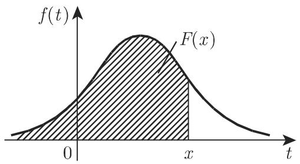

# 数学手册(原书第10版) 16.2.2 随机变量、分布函数

## 概述

本源是《数学手册》(原书第 10 版) 第 16 章概率论的定义性核心节，主题为随机变量及其分布的刻画。开篇即言明动机：「要应用概率论中的分析方法，变量和函数的概念是很有必要的。」全节四个小节：

- **16.2.2.1 随机变量**：以随机变量描述基本事件集，给出离散/连续/混合三分类，并配例 A（离散，源自第 1057 页例）与例 B（连续，随机选取灯泡的寿命 $T$）。
- **16.2.2.2 分布函数**：定义 $F(x)=P(X\leqslant x)$（式 16.44）及其三条性质，明示两种文献约定；分离散（式 16.45）与连续（密度函数、式 16.46–16.47）两轨；以面积解释引入分位数（式 16.48）。
- **16.2.2.3 期望和方差、切比雪夫不等式**：期望（16.49–16.50）、矩与中心矩（16.51）、方差与标准差（16.52–16.53）、加权平均与算术平均（16.54–16.55）、连续均匀分布（16.56–16.57）、切比雪夫不等式（16.58）。
- **16.2.2.4 多维随机变量**：随机向量、联合分布函数（16.59）、联合密度（16.60）、边际分布（点到即止）与独立性（16.61）。

## 核心概念（本节派生）

- [[concepts/随机变量]] — 在实数子集中随机取值的量，离散/连续/混合三分类。
- [[concepts/分布函数]] — $F(x)=P(X\leqslant x)$，唯一刻画分布；含 $P(X<x)$ 备选约定。
- [[concepts/密度函数（概率密度）]] — 使 $P(X\in S)=\int_S f\,\mathrm{d}x$ 的非负函数，附面积解释。
- [[concepts/分位数]] — $P(X>x_\alpha)=\alpha$ 的横坐标，上侧尾部约定。
- [[concepts/期望]] — $E(g(X))$ 的离散求和/连续积分双轨定义，仿射性 $E(aX+b)=a\mu_X+b$。
- [[concepts/矩与中心矩]] — $E(X^n)$ 与 $E((X-\mu_X)^n)$。
- [[concepts/方差与标准差]] — 二阶中心矩；$D^2(X)=E(X^2)-\mu_X^2$；$D^2(aX+b)=a^2D^2(X)$。
- [[concepts/均匀分布]] — 离散 $p_k=1/n$ 与连续 $1/(b-a)$，$E=(a+b)/2$、$\sigma^2=(b-a)^2/12$。
- [[concepts/切比雪夫不等式]] — $P(|X-\mu|\geqslant\lambda\sigma)\leqslant 1/\lambda^2$。
- [[concepts/随机向量]] — 联合分布函数与联合密度、边际分布。
- [[concepts/随机变量的独立性]] — 分布函数与密度的双重因子分解。

## 编号公式转录（21 条）

以下为原文编号公式的逐条转录（正文句中脱落的符号依上下文复原，公式本体忠实于源）：

### 16.2.2.2 分布函数

$$F(x) = P(X \leqslant x), \quad -\infty \leqslant x \leqslant \infty \tag{16.44}$$

分布函数性质：(1) $F(-\infty)=0,\ F(+\infty)=1$；(2) $F(x)$ 是关于 $x$ 的非减函数；(3) $F(x)$ 是右连续的。

附注一（原文标号「1)」）：$P(X=a)=F(a)-\lim_{x\to a-0}F(x)$。

附注二（原文标号「(2)」）：文献中也经常使用 $F(x)=P(X<x)$ 作为定义，此时 $P(X=a)=\lim_{x\to a+0}F(x)-F(a)$。

$$F(x) = \sum_{x_i \leqslant x} p_i \tag{16.45}$$

$$P(a \leqslant X \leqslant b) = \int_a^b f(t)\,\mathrm{d}t \tag{16.46}$$

$$F(x) = P(X \leqslant x) = \int_{-\infty}^{x} f(t)\,\mathrm{d}t \tag{16.47}$$

$f(x)$ 连续的点处有 $F'(x)=f(x)$。

$$P(X > x) = \alpha \tag{16.48}$$

满足此式的横坐标 $x=x_\alpha$ 称为分位数。

### 16.2.2.3 期望和方差、切比雪夫不等式

$$E(g(X)) = \sum_k g(x_k)p_k, \quad \text{若级数 } \sum_{k=1}^{\infty}|g(x_k)|p_k \text{ 收敛} \tag{16.49a}$$

$$E(g(X)) = \int_{-\infty}^{+\infty} g(x)f(x)\,\mathrm{d}x, \quad \text{若 } \int_{-\infty}^{+\infty}|g(x)|f(x)\,\mathrm{d}x \text{ 存在} \tag{16.49b}$$

$$\mu_X = E(X) = \sum_k x_kp_k \quad \text{或} \quad \int_{-\infty}^{+\infty} xf(x)\,\mathrm{d}x \tag{16.50a}$$

$$E(aX+b) = a\mu_X + b \quad (a, b \text{ 是常数}) \tag{16.50b}$$

$$\text{a) } E(X^n); \qquad \text{b) } E((X-\mu_X)^n) \tag{16.51a/b}$$

$$E((X-\mu_X)^2) = D^2(X) = \sigma_X^2 = \begin{cases} \sum_k (x_k-\mu_X)^2p_k, \\ \text{或} \\ \int_{-\infty}^{+\infty} (x-\mu_X)^2f(x)\,\mathrm{d}x, \end{cases} \tag{16.52}$$

$$D^2(X) = \sigma_X^2 = E(X^2)-\mu_X^2, \qquad D^2(aX+b) = a^2D^2(X) \tag{16.53}$$

$$E(X) = p_1x_1 + \dots + p_nx_n \tag{16.54}$$

$$E(X) = \frac{x_1 + x_2 + \dots + x_n}{n} \tag{16.55}$$

$$f(x) = \begin{cases} \dfrac{1}{b-a}, & a \leqslant x \leqslant b, \\ 0, & \text{其他}, \end{cases} \tag{16.56}$$

$$E(X) = \frac{1}{b-a}\int_a^b x\,\mathrm{d}x = \frac{a+b}{2}, \qquad \sigma_X^2 = \frac{(b-a)^2}{12} \tag{16.57}$$

$$P(|X-\mu| \geqslant \lambda\sigma) \leqslant \frac{1}{\lambda^2} \quad (\lambda > 0) \tag{16.58}$$

### 16.2.2.4 多维随机变量

$$F(x_1,\dots,x_n) = P(X_1 \leqslant x_1, \dots, X_n \leqslant x_n) \tag{16.59}$$

$$F(x_1,\dots,x_n) = \int_{-\infty}^{x_1}\dots\int_{-\infty}^{x_n} f(t_1,\dots,t_n)\,\mathrm{d}t_1\dots\mathrm{d}t_n \tag{16.60}$$

$$F(x_1,\dots,x_n) = F_1(x_1)F_2(x_2)\dots F_n(x_n), \qquad f(x_1,\dots,x_n) = f_1(x_1)f_2(x_2)\dots f_n(x_n) \tag{16.61}$$

## 插图

图 16.1(a) 概率的面积解释：

图 16.1(b) 分位数：

## 转写质量警示

本节 21 条编号公式经复算**全部数学上无误**，但文字层转写损伤严重，符号脱落密度为已入库各节中较高者，几乎每段都有数学符号脱落或形近字替换，原文段落不自足。任何引用本节的页面须以复原后符号为准，不宜直接摘抄原文。系统性模式（详见 [[queries/16-2-2全节系统性转写讹误清单]]）：

1. **数学符号系统性脱落**：变量 $X$、寿命变量 $T$、参数 $\alpha$、$\lambda$、维数 $n$、积分变量 $t$ 在正文句中大量脱落（如「随机变量 来描述」「等千 a」「是指 个随机变量」「密度函数连续随机变量」）。
2. **「千」代「于」**：取值千/等千/关千/对千/趋千 → 取值于/等于/关于/对于/趋于。
3. **「入」代 λ**：切比雪夫不等式解释句「标准差的入倍（入很大）」。
4. **「笫」代「第」**：「笫一类显著性水平或犯笫一类错误」。
5. **衍字**：式 (16.49a) 收敛条件中的「凇」。
6. **页码粘连**：「第 106216.2.2.2, 2.」「第 39 1.4.2.10」疑脱「页」字。
7. **标号体例不一**：分布函数性质后的注记标号「1)」与「(2)」混用。
8. **词句残缺**：「密度函f(t) 下方」「称为分位数或 分位数」（疑脱 α）等。

## 与现有维基的联系

- [[sources/10-数学手册原书第10版--7-161-组合学--1e2f2ed]]（16.1 组合学，含 [[concepts/排列]]、[[concepts/组合]]、[[concepts/全排列]]）：组合计数是离散概率 $p_k$ 计算的预备工具；本节延续第 16 章内容块，属顺序扩展（extend），不加强也不挑战既有知识。
- 15.x 积分变换系列（如 [[concepts/傅里叶变换]]、[[concepts/拉普拉斯变换]]）：仅共享反常积分、分段函数处理等计算技术，无概念重叠，不需修改既有页面。
- 本节引用但未入库的内容见 [[queries/16-2-2未入库回指缺口]]：16.2.1（第 1057 页例之源）、1.4.2.10（第 39 页，切比雪夫不等式另见）、16.3.1.1（第 1084 页，随机向量深化）、表 21.16–21.20（第 1456–1463 页，分位数表）。

## 矛盾与张力

- 与现有维基无冲突（既有内容为 15.x 变换与 16.1 组合学，主题不相交）。
- **源内自述的双约定张力**（源已明示文献分歧，非错误）：分布函数 $P(X\leqslant x)$（右连续）与 $P(X<x)$（左连续）并存；分位数右尾面积 $P(X>x_\alpha)=\alpha$ 与左侧面积约定并存——同一记号 $x_\alpha$ 含义相反。将来表 21.16–21.20 入库时须核对约定，详见 [[comparisons/分布函数两种定义约定比较]]。
- **手册自身不完备**：混合随机变量、边际分布点到即止并推给文献，本维基不替源补充超出其文本的内容。

## 关联页面

- 发现（4）：[[findings/式16-44至16-48分布函数密度与分位数转录复算]]、[[findings/式16-49至16-53期望矩与方差转录复算]]、[[findings/式16-54至16-58加权平均均匀分布与切比雪夫不等式转录复算]]、[[findings/式16-59至16-61随机向量与独立性转录复算]]
- 疑点（8）：[[queries/16-2-2全节系统性转写讹误清单]]、[[queries/16-2-2未入库回指缺口]]、[[queries/第106216.2.2.2页码节号粘连之辨]]、[[queries/第1057页例例号脱落之辨]]、[[queries/分位数或分位数疑脱α]]、[[queries/面积解释句疑脱与x轴]]、[[queries/式16-49a凇字衍文之辨]]、[[queries/入倍疑为λ倍]]
- 比较（3）：[[comparisons/分布函数两种定义约定比较]]、[[comparisons/离散随机变量与连续随机变量比较]]、[[comparisons/离散均匀分布与连续均匀分布比较]]
- 方法（1）：[[methodology/期望与矩的双轨计算流程]]

## 开放问题

1. 第 1057 页例的例号与内容须待 16.2.1 入库方能补全——是否应优先补录该节？
2. 「精确定义见第 106216.2.2.2, 2.」的粘连指向究竟为何？
3. 表 21.16–21.20 的分位数采用哪侧约定？
4. 式 (16.49a)「凇存在」的原版措辞与「曲面重心的横坐标」的原版表述，需对照原书核实。

<!-- llm-wiki:embedded-images -->
## Embedded Images

### Document

<!-- llm-wiki:embedded-images -->
