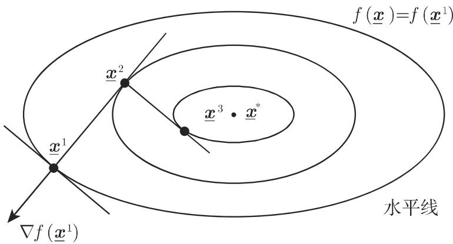

# 数学手册（原书第 10 版）18.2.5 无约束问题的解法

本页是《数学手册（原书第 10 版）》第 18 章 18.2「非线性优化问题」第 5 小节的入库总页。该节讨论**无约束**非线性优化问题的一般迭代解法：先建立统一的下降法框架（式 18.72–18.74），再依次介绍四种方法——最速下降法（18.2.5.1，式 18.75–18.77）、牛顿法与阻尼牛顿法（18.2.5.2，式 18.78–18.80）、共轭梯度法（18.2.5.3，式 18.81–18.83）、Davidon–Fletcher–Powell（DFP）方法（18.2.5.4，式 18.84–18.86）。本节是继 [[sources/10-数学手册原书第10版--14-1821-问题的提法理论基础--16xlwe7]]（18.2.1）与 [[sources/10-数学手册原书第10版--14-1822-特殊非线性优化问题--1d674j5]]（18.2.2）之后入库的第三个小节，父节页为 [[sources/10-数学手册原书第10版--11-182-非线性优化问题--1gv38ye]]。

源文档存在系统性 OCR 转写讹误（「共轭」误作「共谓/共辄」、「于」误作「千」、乱码符号、多处脱 f(x) 或矩阵符号 C 等），汇总见 [[queries/18-2-5全节系统性转写讹误清单]]；其中影响数学内容的最重要疑点为式 18.85 的两处分母，见 [[queries/式18-85首分母vkTvk疑为vkTwk且末分母下标Mk疑为Mk-1之辨]]。以下公式按原书编号转录（向量记号由源文档的下划线粗体归一为普通粗体，数学内容不变）。

## 一、问题设定与下降法框架（式 18.72–18.74）

$$
f(\boldsymbol{x}) = \min!, \quad \boldsymbol{x} \in \mathbb{R}^{n}, \tag{18.72}
$$

其中 f 连续可微（原文「这里 是连续可微函数」脱主语 f(x)）。本节每一种方法一般是构建无穷序列 $\{\boldsymbol{x}^{k}\} \subset \mathbb{R}^{n}$，其聚点是一平稳点（$\nabla f(\boldsymbol{x})=0$，∇ 为梯度算子，原文回指第 933 页 13.2.6.1，未入库）。点列从 x¹ 起，按递推

$$
\boldsymbol{x}^{k+1} = \boldsymbol{x}^{k} + \alpha_k \boldsymbol{d}^{k} \quad (k = 1, 2, \dots), \tag{18.73}
$$

即先在 x^k 处确定方向 d^k，步长 α_k 表示沿 d^k 方向离 x^{k+1} 有多远。这样的方法称作**下降法**，是指

$$
f(\boldsymbol{x}^{k+1}) < f(\boldsymbol{x}^{k}) \quad (k = 1, 2, \dots). \tag{18.74}
$$

转录与总括陈述适用范围的讨论见 [[findings/式18-72至18-74无约束问题与下降法框架转录]]、[[concepts/无约束优化问题]]、[[concepts/下降法]]、[[concepts/平稳点]]。

## 二、最速下降法（18.2.5.1，式 18.75–18.77）

从现时点 x^k 出发（原文「发」前疑脱「出」字），函数下降最快速的方向是

$$
\boldsymbol{d}^{k} = -\nabla f(\boldsymbol{x}^{k}), \tag{18.75a}
$$
$$
\boldsymbol{x}^{k+1} = \boldsymbol{x}^{k} - \alpha_k \nabla f(\boldsymbol{x}^{k}). \tag{18.75b}
$$

步长 α_k 由线搜索确定，即 α_k 是一维问题

$$
f(\boldsymbol{x}^{k} + \alpha \boldsymbol{d}^{k}) = \min!, \quad \alpha \geqslant 0 \tag{18.76}
$$

的解；源文档称上述一维问题可用第 1208 页 18.2.4 给出的方法求解（未入库）。源断言：最速下降法收敛得相当慢；对序列 $\{\boldsymbol{x}^{k}\}$ 的每个聚点 x* 有 $\nabla f(\boldsymbol{x}^{*})=0$。在二次目标 $f(\boldsymbol{x})=\boldsymbol{x}^{\mathrm{T}}\boldsymbol{C}\boldsymbol{x}+\boldsymbol{p}^{\mathrm{T}}\boldsymbol{x}$ 情形下取特殊形式：

$$
\boldsymbol{x}^{k+1} = \boldsymbol{x}^{k} + \alpha_k \boldsymbol{d}^{k}, \tag{18.77a}
$$
$$
\boldsymbol{d}^{k} = -(2\boldsymbol{C}\boldsymbol{x}^{k} + \boldsymbol{p}), \quad
\alpha_k = \frac{\boldsymbol{d}^{k\mathrm{T}}\boldsymbol{d}^{k}}{2\,\boldsymbol{d}^{k\mathrm{T}}\boldsymbol{C}\,\boldsymbol{d}^{k}}. \tag{18.77b}
$$

以水平线 $f(\boldsymbol{x})=f(\boldsymbol{x}^{i})$（记号待核）绘制的示意图为图 18.6（迭代轨线沿水平线锯齿状推进）：

式 18.77b 的精确步长已由维基独立推导复原（见 [[findings/式18-75至18-77最速下降法与二次精确步长复算]]）；流程见 [[methodology/最速下降法迭代流程]]，概念页 [[concepts/最速下降法]]、[[concepts/线搜索]]。

## 三、牛顿法的应用（18.2.5.2，式 18.78–18.80）

在当前近似点 x^k 处以二次函数逼近 f（原文「函数 由如下二次函数逼近」脱 f(x)）：

$$
q(\boldsymbol{x}) = f(\boldsymbol{x}^{k}) + (\boldsymbol{x}-\boldsymbol{x}^{k})^{\mathrm{T}} \nabla f(\boldsymbol{x}^{k})
+ \tfrac{1}{2} (\boldsymbol{x}-\boldsymbol{x}^{k})^{\mathrm{T}} \boldsymbol{H}(\boldsymbol{x}^{k}) (\boldsymbol{x}-\boldsymbol{x}^{k}), \tag{18.78}
$$

其中 H(x^k) 是黑塞矩阵（f 在 x^k 处的二阶偏导数矩阵）。若 H(x^k) 正定，则 q 在 x^{k+1} 处达到绝对极小且 $\nabla q(\boldsymbol{x}^{k+1})=0$，从而得牛顿方法：

$$
\boldsymbol{x}^{k+1} = \boldsymbol{x}^{k} - \boldsymbol{H}^{-1}(\boldsymbol{x}^{k}) \nabla f(\boldsymbol{x}^{k}) \quad (k = 1, 2, \dots), \tag{18.79a}
$$
$$
\boldsymbol{d}^{k} = -\boldsymbol{H}^{-1}(\boldsymbol{x}^{k}) \nabla f(\boldsymbol{x}^{k}), \quad \alpha_k\ \text{见}\ (18.73)\ [\text{回指存疑}]. \tag{18.79b}
$$

牛顿法收敛速度快，但有五项缺点：a) H(x^k) 必须正定；b) 仅对充分好的初始点收敛；c) 「步长可能没有影响」〔措辞待核〕；d) 并不是一种下降法；e) 计算逆矩阵 H⁻¹(x^k) 的计算量相当大。通过所谓阻尼牛顿法（原文回指第 1251 页 19.2.2.2，未入库）可能会适当减少某些缺点：

$$
\boldsymbol{x}^{k+1} = \boldsymbol{x}^{k} - \alpha_k \boldsymbol{H}^{-1}(\boldsymbol{x}^{k}) \nabla f(\boldsymbol{x}^{k}) \quad (k = 1, 2, \dots), \tag{18.80}
$$

其中松弛因子 α_k 比如可通过 18.2.5.1 给出的原则（即线搜索）确定。详见 [[findings/式18-78至18-80牛顿法与阻尼牛顿法转录复算]]、[[concepts/牛顿法（无约束优化）]]、[[concepts/阻尼牛顿法]]、[[concepts/黑塞矩阵]]、[[comparisons/牛顿法与阻尼牛顿法比较]]；回指疑点见 [[queries/式18-79b步长回指18-73疑为18-76之辨]]。

## 四、共轭梯度法（18.2.5.3，式 18.81–18.83；原文题名「共谓梯度法」系「共轭」之讹）

两个向量 d¹, d² 称作相对〔于〕对称正定矩阵 C 的共轭向量（原文两处脱矩阵符号 C），是指

$$
\boldsymbol{d}^{1\mathrm{T}} \boldsymbol{C}\, \boldsymbol{d}^{2} = 0. \tag{18.81}
$$

若 d¹, …, dⁿ 相对 C 两两共轭，则凸二次问题 $q(\boldsymbol{x})=\boldsymbol{x}^{\mathrm{T}}\boldsymbol{C}\boldsymbol{x}+\boldsymbol{p}^{\mathrm{T}}\boldsymbol{x}$（x∈ℝⁿ）可经 n 步求解：从 x¹ 出发构建 $\boldsymbol{x}^{k+1}=\boldsymbol{x}^{k}+\alpha_k\boldsymbol{d}^{k}$，α_k 为最优步长。设 f 在 x* 邻域内近似二次，即 $C \approx \tfrac{1}{2}H(\boldsymbol{x}^{*})$，则为二次目标研发的方法也可应用于更一般的 f，而无须明显〔原文「明着」〕使用矩阵 H(x*)。共轭梯度法步骤：

$$
\boldsymbol{x}^{1} \in \mathbb{R}^{n}, \quad \boldsymbol{d}^{1} = -\nabla f(\boldsymbol{x}^{1}); \tag{18.82}
$$
$$
\boldsymbol{x}^{k+1} = \boldsymbol{x}^{k} + \alpha_k \boldsymbol{d}^{k}\ (k=1,\dots,n),\ \alpha_k \geqslant 0
\ \text{使 } f(\boldsymbol{x}^{k}+\alpha \boldsymbol{d}^{k}) \text{ 达到极小}; \tag{18.83a}
$$
$$
\boldsymbol{d}^{k+1} = -\nabla f(\boldsymbol{x}^{k+1}) + \mu_k \boldsymbol{d}^{k} \quad (k=1,\dots,n-1), \tag{18.83b}
$$
$$
\mu_k = \frac{\nabla f(\boldsymbol{x}^{k+1})^{\mathrm{T}} \nabla f(\boldsymbol{x}^{k+1})}{\nabla f(\boldsymbol{x}^{k})^{\mathrm{T}} \nabla f(\boldsymbol{x}^{k})}, \quad
\boldsymbol{d}^{n+1} = -\nabla f(\boldsymbol{x}^{n+1}), \tag{18.83c}
$$

并以 x^{n+1}、d^{n+1} 代替 x¹、d¹ 重复步骤 b（n 步重启）。维基辨识（推断，源文档未点名）：式 18.83c 的 μ_k 即后世所称 Fletcher–Reeves 型系数。C ≈ ½H 与 Hess(xᵀCx+pᵀx)=2C 自洽（复算 ✓）。详见 [[findings/式18-81至18-83共轭梯度法与重启机制转录复算]]、[[concepts/共轭向量（C-共轭）]]、[[concepts/共轭梯度法]]、[[methodology/共轭梯度法迭代与n步重启流程]]。

## 五、DFP 方法（18.2.5.4，式 18.84–18.86）

即戴维顿（Davidon）、弗莱彻（Fletcher）和鲍威尔（Powell）方法。从 x¹ 出发的点列按

$$
\boldsymbol{x}^{k+1} = \boldsymbol{x}^{k} - \alpha_k \boldsymbol{M}_k \nabla f(\boldsymbol{x}^{k}) \quad (k = 1, 2, \dots) \tag{18.84}
$$

确定，其中 M_k 是对称正定矩阵。f 为二次函数时（原文「在 为二次函数的情形下」脱 f(x)），方法的想法是逆黑塞矩阵由 M_k 逐步近似：从对称正定矩阵 M₁（例如 M₁=I，I 为单位矩阵）出发，M_k 由 M_{k−1} 加上一个秩〔数脱漏，疑为 2〕修正矩阵确定：

$$
\boldsymbol{M}_k = \boldsymbol{M}_{k-1} + \frac{\boldsymbol{v}^{k} \boldsymbol{v}^{k\mathrm{T}}}{\boldsymbol{v}^{k\mathrm{T}} \boldsymbol{v}^{k}}
  - \frac{(\boldsymbol{M}_{k-1}\boldsymbol{w}^{k})(\boldsymbol{M}_{k-1}\boldsymbol{w}^{k})^{\mathrm{T}}}{\boldsymbol{w}^{k\mathrm{T}} \boldsymbol{M}_k \boldsymbol{w}^{k}}, \tag{18.85}
$$

其中 $\boldsymbol{v}^{k} = \boldsymbol{x}^{k}-\boldsymbol{x}^{k-1}$，$\boldsymbol{w}^{k} = \nabla f(\boldsymbol{x}^{k})-\nabla f(\boldsymbol{x}^{k-1})$（k=2,3,…）。步长 α_k 由

$$
f(\boldsymbol{x}^{k} - \alpha \boldsymbol{M}_k \nabla f(\boldsymbol{x}^{k})) = \min!, \quad \alpha \geqslant 0 \tag{18.86}
$$

得到。若 f 是二次函数，则 DFP 方法变成共轭梯度法（相应初始 M₁=I）。

**关键复算发现**：式 18.85 照印不满足拟牛顿（割线）方程 $M_k w^k = v^k$，且末分母出现 M_k 自指；若将首分母改为 $v^{k\mathrm{T}}w^k$、末分母改为 $w^{k\mathrm{T}}M_{k-1}w^k$（标准 DFP 形式），割线方程成立。详见 [[findings/式18-84至18-86DFP更新公式转录复算]] 与 [[queries/式18-85首分母vkTvk疑为vkTwk且末分母下标Mk疑为Mk-1之辨]]、[[queries/秩修正矩阵脱秩数之辨]]；概念页 [[concepts/DFP方法]]、流程页 [[methodology/DFP方法矩阵修正与线搜索流程]]、人物页 [[entities/戴维顿]]、[[entities/弗莱彻]]、[[entities/鲍威尔]]。

## 转写讹误与内部张力

- 系统性 OCR 讹误清单：[[queries/18-2-5全节系统性转写讹误清单]]。
- 未入库回指（18.2.4、13.2.6.1、19.2.2.2）：[[queries/18-2-5未入库回指缺口]]。
- 内部张力一：开篇总括「每一种方法……其聚点是一平稳点」与牛顿法「仅对充分好的初始点收敛」「并不是一种下降法」、共轭梯度法二次情形 n 步有限终止并存；总括应理解为在各自收敛条件下成立（见 [[concepts/下降法]]）。
- 内部张力二：式 18.85 照印与 DFP 的数学定义冲突（割线方程反例），为本节最高优先级疑点。

## 与其他维基页面的联系

- 父节：[[sources/10-数学手册原书第10版--11-182-非线性优化问题--1gv38ye]]；覆盖进度追踪：[[queries/18-2小节覆盖与开放问题待明]]（18.2.3、18.2.4 仍缺）。
- 平稳点 ∇f=0 是 [[concepts/库恩—塔克条件]] 在无约束情形的特例，也是 [[concepts/非线性优化问题]] 理论的自然衔接点。
- 本节的无约束二次特殊情形（f=xᵀCx+pᵀx）与 18.2.2 的带约束 [[concepts/二次优化]] 互补；C 与 ½H 的对应关系需与 18.2.2 的二次型记法交叉核对。
- 与 18.1.x 线性规划方法（如 [[concepts/单纯形法]]）共同构成第 18 章「约束—无约束」方法谱系。

## 本节入库页面

- 概念（11）：[[concepts/无约束优化问题]]、[[concepts/下降法]]、[[concepts/平稳点]]、[[concepts/最速下降法]]、[[concepts/线搜索]]、[[concepts/黑塞矩阵]]、[[concepts/牛顿法（无约束优化）]]、[[concepts/阻尼牛顿法]]、[[concepts/共轭向量（C-共轭）]]、[[concepts/共轭梯度法]]、[[concepts/DFP方法]]
- 人物（3）：[[entities/戴维顿]]、[[entities/弗莱彻]]、[[entities/鲍威尔]]
- 方法论（3）：[[methodology/最速下降法迭代流程]]、[[methodology/共轭梯度法迭代与n步重启流程]]、[[methodology/DFP方法矩阵修正与线搜索流程]]
- 发现（5）：[[findings/式18-72至18-74无约束问题与下降法框架转录]]、[[findings/式18-75至18-77最速下降法与二次精确步长复算]]、[[findings/式18-78至18-80牛顿法与阻尼牛顿法转录复算]]、[[findings/式18-81至18-83共轭梯度法与重启机制转录复算]]、[[findings/式18-84至18-86DFP更新公式转录复算]]
- 比较（2）：[[comparisons/四种无约束优化方法比较]]、[[comparisons/牛顿法与阻尼牛顿法比较]]
- 疑问（5）：[[queries/18-2-5全节系统性转写讹误清单]]、[[queries/18-2-5未入库回指缺口]]、[[queries/式18-85首分母vkTvk疑为vkTwk且末分母下标Mk疑为Mk-1之辨]]、[[queries/式18-79b步长回指18-73疑为18-76之辨]]、[[queries/秩修正矩阵脱秩数之辨]]

<!-- llm-wiki:embedded-images -->
## Embedded Images

### Document

<!-- llm-wiki:embedded-images -->
