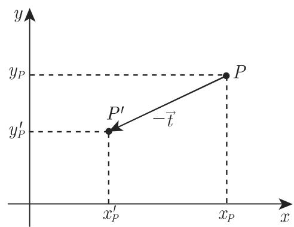
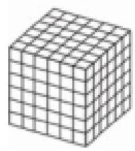
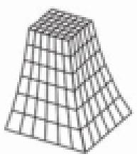
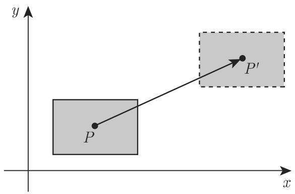
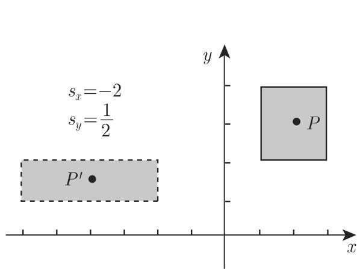
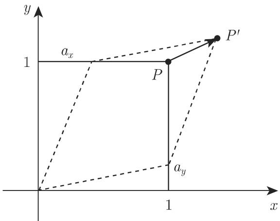
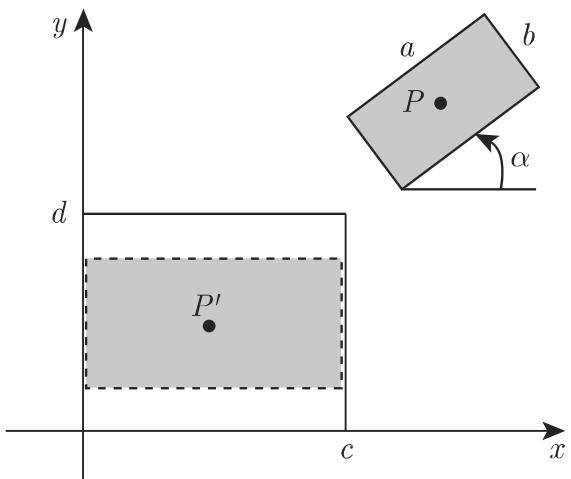

# 数学手册(原书第10版) 3.5.4 几何变换和坐标变换

## 本节定位

本节是《数学手册(原书第10版)》3.5「向量代数与解析几何学」的第四小节，上承 3.5.1 向量代数（[[sources/10-数学手册原书第10版--8-351-向量代数--19olzz1]]，章总节见 [[sources/10-数学手册原书第10版--13-35-向量代数与解析几何学--1uj7znc]]）。本节给出平面上与空间中几何变换、坐标变换、齐次坐标矩阵表示与形变变换的完整公式体系：公式编号 3.430–3.472，插图 3.201–3.209（含 3.205a/b、3.209a–e，共 14 幅）。公式编号 3.286–3.429 与图号 3.200 之前存在空档，属尚未转写的 3.5.2／3.5.3 内容。

## 双重观点

变换刻画平面上或空间中对象的位置或形式的改变。本节开篇指出有两种相互密切联系的考虑（文献 [3.22]）：

1. **几何变换**（主动观点）：在固定坐标系中对点或对象进行变换（3.5.4.1、3.5.4.5.1、3.5.4.6），见 [[concepts/几何变换]]。
2. **坐标变换**（被动观点）：对象保持不变，对与对象关联的坐标系进行变换；发生改变的不是对象而是其坐标表示（3.5.4.3、3.5.4.5.2），见 [[concepts/坐标变换]]。

解题时其中一个可能比另一个更适合。两者的对偶关系见 [[comparisons/几何变换与坐标变换比较]]。

应用领域（背景性清单）：在其本身的对象坐标系中刻画建筑构件；相互关联零件的运动描述（例如机器人）；再现三维对象的二维投影；在计算机图形学或计算机动画中刻画运动与变形。

## 二维基本几何变换（式 3.430–3.437）

**平移**：点 $P(x_P, y_P)$ 沿 x 轴正向平移 $t_x$、沿 y 轴正向平移 $t_y$（图 3.201）：

$$x'_P = x_P + t_x,\qquad y'_P = y_P + t_y.\tag{3.430}$$

$$\binom{x'_P}{y'_P} = \binom{x_P}{y_P} + \binom{t_x}{t_y},\tag{3.431a}\qquad
\binom{x_P}{y_P} = \binom{x'_P}{y'_P} - \binom{t_x}{t_y}.\tag{3.431b}$$

**绕原点旋转**：$\alpha > 0$ 时为逆时针（图 3.202）：

$$x'_P = x_P\cos\alpha - y_P\sin\alpha,\qquad y'_P = x_P\sin\alpha + y_P\cos\alpha,\tag{3.432}$$

$$\binom{x'_P}{y'_P} = \begin{pmatrix}\cos\alpha & -\sin\alpha\\ \sin\alpha & \cos\alpha\end{pmatrix}\binom{x_P}{y_P},\tag{3.433a}$$

逆变换对应于旋转 $-\alpha$ 角（原文「逆对应千旋转—Q角」为 −α 之转写讹误）：

$$\binom{x_P}{y_P} = \begin{pmatrix}\cos\alpha & \sin\alpha\\ -\sin\alpha & \cos\alpha\end{pmatrix}\binom{x'_P}{y'_P}.\tag{3.433b}$$

**关于原点的缩放**（图 3.203）：

$$x'_P = s_x x_P,\qquad y'_P = s_y y_P,\tag{3.434}$$

$$\binom{x'_P}{y'_P} = \begin{pmatrix}s_x & 0\\ 0 & s_y\end{pmatrix}\binom{x_P}{y_P},\tag{3.435a}\qquad
\binom{x_P}{y_P} = \begin{pmatrix}1/s_x & 0\\ 0 & 1/s_y\end{pmatrix}\binom{x'_P}{y'_P}.\tag{3.435b}$$

$0 < s_x < 1$ 为该方向上的收缩，$s_x > 1$ 为扩张，$s_x < 0$ 为关于 y 轴的反射（对 $s_y$ 相应陈述亦成立）。三种反射特例（原文轴名脱落，此处按符号型复原）：

- 关于 x 轴的反射：$s_x = 1,\ s_y = -1$；
- 关于 y 轴的反射：$s_x = -1,\ s_y = 1$；
- 关于原点的反射：$s_x = s_y = -1$。

**剪切**（图 3.204）：每个坐标的改变量与另一坐标成比例，记 $m = 1 - a_x a_y$：

$$x'_P = x_P + a_x y_P,\qquad y'_P = y_P + a_y x_P,\tag{3.436}$$

$$\binom{x'_P}{y'_P} = \begin{pmatrix}1 & a_x\\ a_y & 1\end{pmatrix}\binom{x_P}{y_P},\tag{3.437a}\qquad
\binom{x_P}{y_P} = \begin{pmatrix}1/m & -a_x/m\\ -a_y/m & 1/m\end{pmatrix}\binom{x'_P}{y'_P}.\tag{3.437b}$$

**性质**：以上变换均为仿射变换——像点 $P'(x', y')$ 的坐标可用原坐标 $(x, y)$ 的线性方程组表示；它们保持共线性与平行性（直线的像是直线，平行线的像平行），且平移、旋转和反射还是保距、保角映射。详见 [[concepts/仿射变换]]、[[findings/二维基本变换公式组]]。

## 齐次坐标与矩阵表示（式 3.438–3.443）

旋转、缩放、剪切可用 $2\times2$ 矩阵乘法刻画，但平移不具有这种表示。为统一处理，引入[[concepts/齐次坐标]]：平面上的每个点得到附加坐标 $w \ne 0$，点 $P(x, y)$ 具有齐次坐标 $(x^h, y^h, w)$，其中

$$x = \frac{x^h}{w},\qquad y = \frac{y^h}{w}.\tag{3.438}$$

以下固定 $w = 1$，即 $P(x, y) \mapsto (x, y, 1)$，于是全部基本变换统一为 $3\times3$ 矩阵乘法 $\underline{\boldsymbol x}'_P = M\,\underline{\boldsymbol x}_P$：

$$\begin{pmatrix}x'_P\\ y'_P\\ 1\end{pmatrix} = \begin{pmatrix}m_{11} & m_{12} & m_{13}\\ m_{21} & m_{22} & m_{23}\\ 0 & 0 & 1\end{pmatrix}\begin{pmatrix}x_P\\ y_P\\ 1\end{pmatrix},\tag{3.439}$$

$$T(t_x, t_y) = \begin{pmatrix}1 & 0 & t_x\\ 0 & 1 & t_y\\ 0 & 0 & 1\end{pmatrix},\tag{3.440}$$

$$R(\alpha) = \begin{pmatrix}\cos\alpha & -\sin\alpha & 0\\ \sin\alpha & \cos\alpha & 0\\ 0 & 0 & 1\end{pmatrix},\tag{3.441}$$

$$S(s_x, s_y) = \begin{pmatrix}s_x & 0 & 0\\ 0 & s_y & 0\\ 0 & 0 & 1\end{pmatrix},\tag{3.442}$$

$$V(a_x, a_y) = \begin{pmatrix}1 & a_x & 0\\ a_y & 1 & 0\\ 0 & 0 & 1\end{pmatrix}.\tag{3.443}$$

详见 [[findings/齐次坐标与基本变换矩阵]]。

## 坐标变换（式 3.444–3.447）

几何变换在固定坐标系中变换对象；坐标变换给出固定对象在两个不同坐标系中的坐标表示之间的关系（图 3.205）。若借助向量 $\vec t$ 将坐标系移位，则点 $P(x_P, y_P)$ 的坐标成为 $x'_P = x_P - t_x,\ y'_P = y_P - t_y$——坐标系沿 $\vec t$ 平移的结果与点沿 $-\vec t$ 平移的结果相同；旋转与缩放同理。**因此：坐标系的变换等价于对象的逆变换。**

由平移、旋转或缩放导致的坐标变换由 $3\times3$ 矩阵 $\bar T, \bar R, \bar S$ 给出（对照式 3.440–3.442）：

$$\bar T(t_x, t_y) = T(-t_x, -t_y) = T^{-1}(t_x, t_y),\tag{3.444}$$

$$\bar R(\alpha) = R(-\alpha) = R^{-1}(\alpha),\tag{3.445}$$

$$\bar S(s_x, s_y) = S\!\left(\frac{1}{s_x}, \frac{1}{s_y}\right) = S^{-1}(s_x, s_y).\tag{3.446}$$

所有基本坐标变换统一为 $\underline{\boldsymbol x}'_P = \bar M\,\underline{\boldsymbol x}_P$（矩阵结构同式 3.439）：

$$\begin{pmatrix}x'_P\\ y'_P\\ 1\end{pmatrix} = \begin{pmatrix}\bar m_{11} & \bar m_{12} & \bar m_{13}\\ \bar m_{21} & \bar m_{22} & \bar m_{23}\\ 0 & 0 & 1\end{pmatrix}\begin{pmatrix}x_P\\ y_P\\ 1\end{pmatrix}.\tag{3.447}$$

详见 [[findings/坐标变换等价于逆几何变换]]。

## 变换的复合（式 3.448–3.449）与三个二维算例

复杂变换由基本变换组合实现。设矩阵 $M_1, M_2, \dots, M_n$ 给出的一列变换连续执行，则总变换矩阵是这些矩阵的乘积（最先执行者在最右），逆变换反序取逆：

$$M = M_n \cdot M_{n-1} \cdots M_2 \cdot M_1,\tag{3.448}$$

$$M^{-1} = M_1^{-1} \cdot M_2^{-1} \cdots M_{n-1}^{-1} \cdot M_n^{-1}.\tag{3.449}$$

本节并断言：每个仿射变换可作为一连串平移、旋转和缩放的复合给出；甚至剪切也可作为一次旋转 $R(\alpha)$、一次缩放 $S(s_x, s_y)$、再一次旋转 $R(\beta)$ 的相继应用给出，使 $V(a, b) = R(\beta)\cdot S(s_x, s_y)\cdot R(\alpha)$ 成立（无证明，见 [[findings/变换复合律与仿射分解断言]]）。

**算例 1：绕任意点 $Q(x_q, y_q)$ 旋转角 α**（图 3.206，三步：移到原点—绕原点旋转—原点平移回 Q）：

$$M = M_3 M_2 M_1 = T(x_q, y_q)\, R(\alpha)\, T(-x_q, -y_q)
= \begin{pmatrix}\cos\alpha & -\sin\alpha & x_q(1-\cos\alpha) + y_q\sin\alpha\\ \sin\alpha & \cos\alpha & y_q(1-\cos\alpha) - x_q\sin\alpha\\ 0 & 0 & 1\end{pmatrix}.$$

**算例 2：关于直线 $y = mx + n$ 的反射**（五步：$M_1 = T(0, -n)$；$M_2 = R(-\alpha)$，$\tan\alpha = m$；$M_3 = S(1,-1)$；$M_4 = R(\alpha)$；$M_5 = T(0, n)$）：

$$M = T(0, n)\, R(\alpha)\, S(1,-1)\, R(-\alpha)\, T(0, -n)
= \begin{pmatrix}\dfrac{1-m^2}{m^2+1} & \dfrac{2m}{m^2+1} & \dfrac{-2mn}{m^2+1}\\[2mm] \dfrac{2m}{m^2+1} & \dfrac{m^2-1}{m^2+1} & \dfrac{2n}{m^2+1}\\[2mm] 0 & 0 & 1\end{pmatrix},$$

其中利用 $\sin\alpha = m/\sqrt{m^2+1}$、$\cos\alpha = 1/\sqrt{m^2+1}$（取正根，隐含 $m \ge 0$）。

**算例 3：边长为 $a\times b$ 的矩形到宽 $c$、高 $d$ 窗口中相似矩形的完全居中变换**（图 3.207；原文题干中 a、b、c、d 参数脱落）。四步：$M_1 = T(-x_P, -y_P)$；$M_2 = R(-\alpha)$；$M_3 = S(s, s)$，$s = \min(c/a,\ d/b)$；$M_4 = T(c/2, d/2)$：

$$M = T\!\left(\frac{c}{2}, \frac{d}{2}\right) S(s, s)\, R(-\alpha)\, T(-x_P, -y_P)
= \begin{pmatrix}s\cos\alpha & s\sin\alpha & \frac{c}{2} - s(x_P\cos\alpha + y_P\sin\alpha)\\ -s\sin\alpha & s\cos\alpha & \frac{d}{2} - s(y_P\cos\alpha - x_P\sin\alpha)\\ 0 & 0 & 1\end{pmatrix}.$$

四个复合算例（含下文绕空间轴一例）的矩阵均经独立符号重推验证自洽，见 [[findings/复合变换四算例矩阵]]。

## 三维变换（式 3.450–3.458）

三维空间中几何变换与坐标变换的数学刻画基于二维情形同样的思想：三维仿射变换是平移、绕坐标轴旋转与关于原点缩放等基本变换的复合，利用齐次坐标以 $4\times4$ 矩阵给出，复合变换用矩阵乘法实现：

$$\begin{pmatrix}x'_P\\ y'_P\\ z'_P\\ 1\end{pmatrix} = \begin{pmatrix}m_{11} & m_{12} & m_{13} & m_{14}\\ m_{21} & m_{22} & m_{23} & m_{24}\\ m_{31} & m_{32} & m_{33} & m_{34}\\ 0 & 0 & 0 & 1\end{pmatrix}\begin{pmatrix}x_P\\ y_P\\ z_P\\ 1\end{pmatrix},\tag{3.450}$$

$$T(t_x, t_y, t_z) = \begin{pmatrix}1&0&0&t_x\\ 0&1&0&t_y\\ 0&0&1&t_z\\ 0&0&0&1\end{pmatrix},\tag{3.451}$$

$$S(s_x, s_y, s_z) = \begin{pmatrix}s_x&0&0&0\\ 0&s_y&0&0\\ 0&0&s_z&0\\ 0&0&0&1\end{pmatrix},\tag{3.452}$$

$$R_x(\alpha) = \begin{pmatrix}1&0&0&0\\ 0&\cos\alpha&-\sin\alpha&0\\ 0&\sin\alpha&\cos\alpha&0\\ 0&0&0&1\end{pmatrix},\tag{3.453}$$

$$R_y(\alpha) = \begin{pmatrix}\cos\alpha&0&\sin\alpha&0\\ 0&1&0&0\\ -\sin\alpha&0&\cos\alpha&0\\ 0&0&0&1\end{pmatrix},\tag{3.454}$$

$$R_z(\alpha) = \begin{pmatrix}\cos\alpha&-\sin\alpha&0&0\\ \sin\alpha&\cos\alpha&0&0\\ 0&0&1&0\\ 0&0&0&1\end{pmatrix},\tag{3.455}$$

$$V_{xy}(a_x, a_y) = \begin{pmatrix}1&0&a_x&0\\ 0&1&a_y&0\\ 0&0&1&0\\ 0&0&0&1\end{pmatrix}\quad(\text{平行于 } x,y \text{ 平面的剪切}).\tag{3.456}$$

方向约定：对于正的 α，旋转从坐标轴正向朝原点看是逆时针的——这是 [[concepts/右手法则]] 的直接实例。逆变换：

$$T^{-1}(t_x, t_y, t_z) = T(-t_x, -t_y, -t_z),\qquad S^{-1}(s_x, s_y, s_z) = S\!\left(\frac{1}{s_x}, \frac{1}{s_y}, \frac{1}{s_z}\right),\tag{3.457}$$

$$R_x^{-1}(\alpha) = R_x(-\alpha),\qquad R_y^{-1}(\alpha) = R_y(-\alpha),\qquad R_z^{-1}(\alpha) = R_z(-\alpha).\tag{3.458}$$

详见 [[findings/三维基本变换矩阵组]]。

## 三维坐标变换、世界坐标系与局部坐标系（式 3.459–3.468）

类似于二维情形，坐标系的变换对点的坐标表示而言与逆几何变换具有相同效果：

$$\bar T(t_x, t_y, t_z) = T(-t_x, -t_y, -t_z) = T^{-1}(t_x, t_y, t_z),\tag{3.459}$$

$$\bar R_x(\alpha_x) = R_x(-\alpha_x) = R_x^{-1}(\alpha_x),\qquad
\bar R_y(\alpha_y) = R_y(-\alpha_y) = R_y^{-1}(\alpha_y),\qquad
\bar R_z(\alpha_z) = R_z(-\alpha_z) = R_z^{-1}(\alpha_z),\tag{3.460\text{–}3.462}$$

$$\bar S(s_x, s_y, s_z) = S\!\left(\frac{1}{s_x}, \frac{1}{s_y}, \frac{1}{s_z}\right) = S^{-1}(s_x, s_y, s_z).\tag{3.463}$$

实际应用中常需从一个右手笛卡儿坐标系变换到另一个笛卡儿坐标系：最初的称为**世界坐标系**，另一个称为**局部（对象）坐标系**（见 [[concepts/世界坐标系与局部坐标系]]）。若在世界坐标系中给出局部坐标系的原点 $U(x_u, y_u, z_u)$ 与单位向量 $\vec e_i = \{l_1, m_1, n_1\}$、$\vec e_j = \{l_2, m_2, n_2\}$、$\vec e_k = \{l_3, m_3, n_3\}$，则从世界坐标系到局部坐标系的变换及其逆为：

$$\bar M = \begin{pmatrix}l_1 & m_1 & n_1 & -l_1 x_u - m_1 y_u - n_1 z_u\\ l_2 & m_2 & n_2 & -l_2 x_u - m_2 y_u - n_2 z_u\\ l_3 & m_3 & n_3 & -l_3 x_u - m_3 y_u - n_3 z_u\\ 0&0&0&1\end{pmatrix},\tag{3.464}$$

$$\bar M^{-1} = \begin{pmatrix}l_1 & l_2 & l_3 & x_u\\ m_1 & m_2 & m_3 & y_u\\ n_1 & n_2 & n_3 & z_u\\ 0&0&0&1\end{pmatrix}.\tag{3.465}$$

若点 P 在世界坐标系中坐标为 $(x_P, y_P, z_P)$、在局部坐标系中为 $(x'_P, y'_P, z'_P)$，则

$$\underline{\boldsymbol x}'_P = \bar M\, \underline{\boldsymbol x}_P,\tag{3.466}\qquad
\underline{\boldsymbol x}_P = \bar M^{-1}\, \underline{\boldsymbol x}'_P.\tag{3.467}$$

若 $\bar M_1$、$\bar M_2$ 为从世界坐标系到两个局部坐标系的变换矩阵，则两局部系之间的变换为

$$\bar M = \bar M_1 \cdot \bar M_2^{-1},\qquad \bar M^{-1} = \bar M_2 \cdot \bar M_1^{-1}\tag{3.468}$$

（$\bar M_1 \bar M_2^{-1}$ 把「系 2 中的坐标」变为「系 1 中的坐标」）。

**算例 4：绕过点 $Q(x_q, y_q, z_q)$、方向向量 $\vec v = \{v_x, v_y, v_z\}$（取 $|\vec v| = 1$）的直线旋转 θ 角**（图 3.208）。先将该直线变换成 z 轴，绕 z 轴旋转 θ，再变换回去：

1. Q 平移到原点：$M_1 = T(-x_q, -y_q, -z_q)$；
2. 绕 z 轴旋转 $\alpha_z$，使旋转轴映射到 $y, z$ 平面：$\cos\alpha_z = v_y/\sqrt{v_x^2 + v_y^2}$，$\sin\alpha_z = v_x/\sqrt{v_x^2 + v_y^2}$；此时点 $P_2$ 具有坐标 $(0, \sqrt{v_x^2 + v_y^2}, v_z) = (0, m, v_z)$，$m = \sqrt{v_x^2 + v_y^2}$（原文根号内作 $v_x^2 + v_z^2$，疑为转写讹误，见 [[queries/绕轴算例P2坐标根号内vz是否应为vy]]）；
3. 绕 x 轴旋转 $\alpha_x$，使 $\vec v$ 的像落到 z 轴上：$\cos\alpha_x = v_z/|\vec v|$，$\sin\alpha_x = m/|\vec v|$；点 $P_3 = (0, 0, |\vec v|)$。

方向向量到 z 轴的变换矩阵及其逆：

$$M_A = R_x(\alpha_x)\cdot R_z(\alpha_z)\cdot T(-x_q, -y_q, -z_q)
= \begin{pmatrix}\dfrac{v_y}{m} & \dfrac{-v_x}{m} & 0 & \dfrac{v_x y_q - v_y x_q}{m}\\[2mm] \dfrac{v_x v_z}{m} & \dfrac{v_y v_z}{m} & -m & m z_q - \dfrac{v_x v_z x_q + v_y v_z y_q}{m}\\[2mm] v_x & v_y & v_z & -v_x x_q - v_y y_q - v_z z_q\\[1mm] 0&0&0&1\end{pmatrix},$$

$$M_A^{-1} = \begin{pmatrix}\dfrac{v_y}{m} & \dfrac{v_x v_z}{m} & v_x & x_q\\[2mm] \dfrac{-v_x}{m} & \dfrac{v_y v_z}{m} & v_y & y_q\\[2mm] 0 & -m & v_z & z_q\\[1mm] 0&0&0&1\end{pmatrix}.$$

将 $M_A$、$M_A^{-1}$ 与式 (3.465)、(3.464) 比较表明：**空间直线到 z 轴的几何变换等同于从世界坐标系到原点为 Q、z 轴方向是 $\vec v$ 的局部坐标系的坐标变换**——这把主动变换与被动变换两条主线在三维中闭合。在局部坐标系中旋转绕 z 轴进行（矩阵由式 3.455 给出），总变换为

$$M = M_A^{-1}\cdot R_z(\theta)\cdot M_A.$$

文末预告：在第 386 页 4.4 中将利用四元数的性质给出另一种刻画旋转矩阵的方法。

## 形变变换（式 3.469–3.472）

仿射变换只改变对象的位置并产生沿给定方向的拉伸或压缩。若变换矩阵 $M = (m_{ij})$ 的元素不是常数而是位置的函数，则导致广义的改变结构的变换类（见 [[concepts/形变变换]]）：

$$m_{ij} = m_{ij}(x, y, z).\tag{3.469}$$

**收缩**（缩放的推广；沿 z 轴方向收缩时 $s_x, s_y$ 是 z 的函数）：

$$S(s_x(z), s_y(z), 1) = \begin{pmatrix}s_x(z)&0&0&0\\ 0&s_y(z)&0&0\\ 0&0&1&0\\ 0&0&0&1\end{pmatrix}.\tag{3.470}$$

$s_x(z) > 1$ 沿 x 轴拉伸、$s_x(z) < 1$ 压缩。例（图 3.209b）：单位立方体经 $s_x(z) = s_y(z) = 1/(1 - z^2)$ 变换（该函数在 $z = \pm 1$ 处奇异，见 [[queries/收缩函数1-1-z2在z等于正负1处的奇异性是否原书如此]]）。

**绕 z 轴的扭曲**（绕 z 轴旋转的推广；旋转角沿 z 轴改变）：

$$R_z(\alpha(z)) = \begin{pmatrix}\cos\alpha(z)&-\sin\alpha(z)&0&0\\ \sin\alpha(z)&\cos\alpha(z)&0&0\\ 0&0&1&0\\ 0&0&0&1\end{pmatrix}.\tag{3.471}$$

例（图 3.209c）：单位立方体旋转 $\alpha(z) = \frac{\pi}{4} z$（原文「函数a(z)」为 α(z) 之转写讹误）。

**绕 x 轴的弯曲**（旋转角沿与旋转轴垂直的方向改变）：

$$R_x(\alpha(z)) = \begin{pmatrix}1&0&0&0\\ 0&\cos\alpha(z)&-\sin\alpha(z)&0\\ 0&\sin\alpha(z)&\cos\alpha(z)&0\\ 0&0&0&1\end{pmatrix}.\tag{3.472}$$

例（图 3.209d）：单位立方体以 $\alpha(z) = \frac{\pi}{8} z$ 角弯曲。形变可像仿射变换一样系列应用；图 3.209(e) 为单位立方体先收缩后扭曲的结果。

## 适用条件与内部疑点

- 绕线反射算例取 $\sin\alpha = m/\sqrt{m^2+1}$ 正根，隐含 $m \ge 0$；负斜率需调整符号（文本未言明）。
- 绕轴构造在 $m = \sqrt{v_x^2 + v_y^2} = 0$（轴平行于 z 轴）时除零失效（文本未言明）。
- 收缩例 $s(z) = 1/(1-z^2)$ 在 $z = \pm 1$ 处奇异，对单位立方体恰在边界。
- 「每个仿射变换 = 平移＋旋转＋缩放的复合」依赖负缩放因子（即把反射作为缩放特例）；文本已列反射为缩放特例，自洽但未明示该依赖。
- 范围张力：开篇应用清单承诺「再现三维对象的二维投影」，但本节固定 $w = 1$，未发展 $w \ne 1$ 的透视投影。
- 全节唯一数学层面不自洽处：绕轴算例第 (2) 步 $P_2$ 坐标根号内的 $v_z$（应为 $v_y$，见对应 query）。

## 转写质量注记

- 轴名（x／y／z 轴）与数学符号（α、θ、a／b／c／d、M、n 次等）成片脱落：如「关千 轴的反射」「围绕 轴的旋转」「沿 轴被拉伸」「旋转 角」「经 步」「变换矩阵 一是」。
- 字形讹误：「关于→关千」「几何→儿何」「于是→千是」（「对于→对千」「基于→基千」「等同于→等同千」同型）。
- 「逆对应千旋转—Q角」中「—Q」应为 −α（α 误识为 Q）；「函数a(z)」应为 α(z)。
- 式 3.457 前正文「对于正的 $\dot\alpha$」中 α 上方疑有转写噪声加点（见 [[queries/式3-457前alpha上方的加点是否为转写噪声]]，同既有 ϱ 加点先例）。
- 窗口算例题干参数脱落（「所裁边长为 的矩形到宽为 且高为 的窗口」缺 a、b、c、d）。
- 行内夹原书页码（308、311、314、315、386）为转写痕迹。

系统性脱落问题与前几节同型，已立总 query：[[queries/3-5-4全节轴名与数学符号成片脱落是否为转写丢字]]。

## 与现有 wiki 的联系

- 来源系列延续：3.2、3.3、3.4.1–3.4.3、3.5、3.5.1 各节 source 页已建；本节为 3.5.4。公式空档 3.286–3.429 属未转写的 3.5.2／3.5.3。
- 概念回链：本节在 [[concepts/笛卡儿坐标]] 框架下展开；[[concepts/仿射坐标]] 与[[concepts/仿射变换]]同族不同物（前者是坐标系概念、后者是映射概念）；3D 旋转方向约定是 [[concepts/右手法则]] 的直接实例；局部坐标系以 [[concepts/单位向量]] 表出；仿射变换的线性方程组表示可回链 [[concepts/线性组合]]、[[concepts/向量]]。
- 对照而非矛盾：3.2 节 [[findings/测地左手坐标系定则]] 用左手测地系，本节坚持右手笛卡儿系——领域约定差异。
- 前向钩子：第 4.4 节（第 386 页）四元数——待该节转写后回链本节绕轴旋转构造。

## 本节提取的页面

- 概念：[[concepts/几何变换]]、[[concepts/坐标变换]]、[[concepts/仿射变换]]、[[concepts/齐次坐标]]、[[concepts/基本仿射变换]]、[[concepts/复合变换]]、[[concepts/世界坐标系与局部坐标系]]、[[concepts/形变变换]]
- 发现：[[findings/二维基本变换公式组]]、[[findings/齐次坐标与基本变换矩阵]]、[[findings/坐标变换等价于逆几何变换]]、[[findings/变换复合律与仿射分解断言]]、[[findings/复合变换四算例矩阵]]、[[findings/三维基本变换矩阵组]]、[[findings/世界与局部坐标系变换矩阵与绕轴旋转构造]]、[[findings/形变变换公式组]]
- 方法：[[methodology/复合变换构造流程]]；比较：[[comparisons/几何变换与坐标变换比较]]
- 待查：[[queries/绕轴算例P2坐标根号内vz是否应为vy]]、[[queries/3-5-4全节轴名与数学符号成片脱落是否为转写丢字]]、[[queries/式3-457前alpha上方的加点是否为转写噪声]]、[[queries/收缩函数1-1-z2在z等于正负1处的奇异性是否原书如此]]

<!-- llm-wiki:embedded-images -->
## Embedded Images

### Document

<!-- llm-wiki:embedded-images -->
