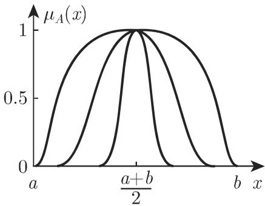
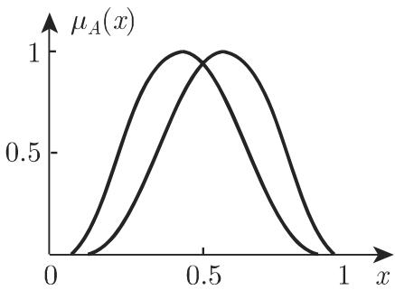
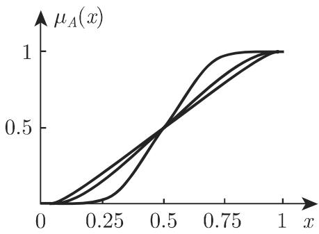
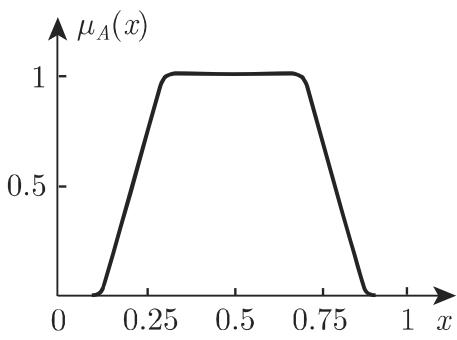
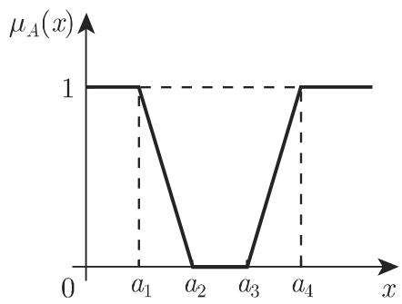

# 数学手册(原书第10版) 5.9.1 模糊逻辑的基本概念

本页对应《数学手册(原书第10版)》5.9 节「模糊逻辑」的第一小节，父级来源见 [[10-数学手册原书第10版--7-59-模糊逻辑--150f34q]]。本小节把 5.9 引言的框架（两种模糊性：**不明确性**与**不确知性**；两个从属概念：模糊集合论与模糊测度论）落实为正文，系统给出模糊集合论的基础：模糊集与隶属函数的定义链条（5.9.1.1）、实直线上的隶属函数族（5.9.1.2）、模糊集的结构概念——支撑、核、高、容许区间、展形、α-切割、表示定理、相似（5.9.1.3）。模糊测度论本节未展开。本节把模糊集定位为**多值逻辑的基本数学工具**，并与 5.7 布尔代数体系直接桥接：「经典的布尔集代数同构于二值命题逻辑」（该断言针对经典布尔集代数）。

## 引言框架

现实世界中经常有多种程度的不确知的或不明确的情况，「模糊」意味着某种不确定性。基本上存在两种不同类型的模糊性——**不明确性**与**不确知性**——分别对应两个从属概念：模糊集合论与模糊测度论。本节讨论来源于实际的模糊集思想、方法和概念。

## 定义链条（5.9.1.1.1）

经典的（清晰）集概念是二值的，并且经典的布尔集代数同构于二值命题逻辑。令 X 为称作全域的基本集，对每个 $A\subseteq X$ 存在特征函数

$$f_A: X\to\{0,1\}\tag{5.326a}$$
$$f_A(x)=1\Leftrightarrow x\in A,\qquad f_A(x)=0\Leftrightarrow x\notin A\tag{5.326b}$$

模糊集的思想：将集合元素的从属关系考虑为一个语句，其真值由区间 [0,1] 中的值刻画。模糊集 A 的数学建模必须有值域为 [0,1]（用以代替 {0,1}）的函数

$$\mu_A: X\to[0,1]\tag{5.327}$$

$\mu_A$ 称为**隶属函数**，$\mu_A(x)$ 称为**隶属等级**；X 上的模糊集也称作 X 的模糊子集，全体记作 $F(X)$。详见 [[模糊集]]、[[隶属函数]]。

## 基本性质 E1–E5 与离散表示（5.9.1.1.2）

- (E1) 清晰集可解释为隶属等级只取 0 与 1 的模糊集（转写脱落「0 与 1」二值）。
- (E2) 支撑与核：

$$\operatorname{supp}(A)=\{x\in X\mid \mu_A(x)>0\}\tag{5.328}$$
$$\ker(A)=\{x\in X\mid \mu_A(x)=1\}\ \text{（E2 处译作「柱芯」）}$$

- (E3) 相等：若对每个 $x\in X$ 有 $\mu_A(x)=\mu_B(x)$，则 $A=B$（式 5.329）。
- (E4) 离散表示（有限全域 $X=\{x_1,\dots,x_n\}$）：

$$A:=\mu_A(x_1)/x_1+\dots+\mu_A(x_n)/x_n=\sum_{i=1}^{n}\mu_A(x_i)/x_i\tag{5.330}$$

分数线和加号仅有符号意义。表格表示（表 5.7，逐字保留）：

| $x_1$ | $x_2$ | $\cdots$ | $x_n$ |
| --- | --- | --- | --- |
| $\mu_A(x_1)$ | $\mu_A(x_2)$ | $\cdots$ | $\mu_A(x_n)$ |

- (E5) 超模糊集（依扎德 / Zadeh 的定义）：如果模糊集的隶属函数本身也是一个模糊集，那么它称为超模糊集（见 [[超模糊集]]）。

## 模糊语言学（5.9.1.1.3）

设定了语言值（如「小」「中」「大」）的量称为语言量或语言变量；每个语言值用模糊集（如具有支撑 (5.328) 的隶属函数）的图象刻画。详见 [[语言变量]]。

## 实直线上的隶属函数（5.9.1.2）

### 1. 梯形隶属函数

**A：梯形函数（式 5.331，图 5.65）**

$$\mu_A(x)=\left\{\begin{array}{ll}0,& x\leqslant a_1\\[2pt]\dfrac{x-a_1}{a_2-a_1},& a_1<x<a_2\\[6pt]1,& a_2\leqslant x\leqslant a_3\\[2pt]\dfrac{a_4-x}{a_4-a_3},& a_3<x<a_4\\[6pt]0,& x\geqslant a_4\end{array}\right.\tag{5.331}$$

特例条件原文作「$a_2=a_3=a_3$」，显系转写讹误，应为 $a_2=a_3=a$；对称三角形条件 $|a-a_1|=|a_4-a|$（复算成立）。

**B：对应于 (5.332) 的「左侧和右侧有界」的隶属函数（图 5.66）**

$$\mu_A(x)=\left\{\begin{array}{ll}1,& x\leqslant a_1\\[2pt]\dfrac{a_2-x}{a_2-a_1},& a_1<x<a_2\\[6pt]0,& a_2\leqslant x\leqslant a_3\\[2pt]\dfrac{x-a_3}{a_4-a_3},& a_3<x<a_4\\[6pt]1,& x\geqslant a_4\end{array}\right.\tag{5.332}$$

⚠ 该函数两侧取 1、中部取 0，支撑无界，与标题「有界」矛盾（见 [[式5-332标题有界与图象是否矛盾]]）。

**C：广义梯形函数（式 5.333，图 5.67）**

$$\mu_A(x)=\left\{\begin{array}{ll}0,& x\leqslant a_1\\[2pt]\dfrac{b_2(x-a_1)}{a_2-a_1},& a_1<x<a_2\\[6pt]\dfrac{(b_3-b_2)(x-a_2)}{a_3-a_2}+b_2,& a_2\leqslant x\leqslant a_3\\[6pt]b_3=b_4=1,& a_3<x<a_4\\[2pt]\dfrac{(b_4-b_5)(a_4-x)}{a_5-a_4}+b_5,& a_4\leqslant x\leqslant a_5\\[6pt]\dfrac{b_5(a_6-x)}{a_6-a_5},& a_5<x<a_6\\[6pt]0,& a_6\leqslant x\end{array}\right.\tag{5.333}$$

⚠ 已复算：第 5 分支在 $x=a_4$ 处取 $b_5$ 而非 $b_4$，端点不连续，$(a_4-x)$ 疑应为 $(a_5-x)$；第 4 分支「$b_3=b_4=1$」是参数约束混入函数值位置（见 [[式5-333第五分支a4-x是否应为a5-x]]）。

### 2. 钟形隶属函数

**A：指数母函数（式 5.334，图 5.68–5.69）**

$$f(x)=\left\{\begin{array}{ll}0,& x\leqslant a\\ e^{-1/p(x)},& a<x<b\\ 0,& x\geqslant b\end{array}\right.\tag{5.334}$$

取 $p(x)=k(x-a)(b-x)$（$k=10$ 或 $k=1$ 或 $k=0.1$），经 $\mu_A(x)=f(x)/f\!\left(\tfrac{a+b}{2}\right)$ 归一化得一族不同宽度的曲线（外曲线由 $k=10$ 得到，内曲线由 $k=0.1$ 生成）。取 $p(x)=x(1-x)(2-x)$ 或 $p(x)=x(1-x)(x+1)$ 得 [0,1] 中的反对称隶属函数：前者因子 $(2-x)$ 使极大值左移（极大点 $x=1-\tfrac{1}{\sqrt3}\approx0.423$），后者因子 $(x+1)$ 使极大值右移（极大点 $x=\tfrac{1}{\sqrt3}\approx0.577$），二者满足 $p_1(1-x)=p_2(x)$，互为关于 $x=\tfrac12$ 的镜像（均已复算）。

**B：变换生成的族（式 5.335，图 5.70–5.71）**

$$F_t(x)=\frac{\int_a^x f(t(u))\,\mathrm{d}u}{\int_a^b f(t(u))\,\mathrm{d}u}\tag{5.335}$$

其中 $t$ 为 $[a,b]$ 上的单调光滑变换；三次多项式族 $t(x)=-\tfrac{2}{3}cx^3+cx^2+\left(1-\tfrac{c}{3}\right)x$，$c\in[-6,3]$；$c=-6$ 给出 $q(x)=4x^3-6x^2+3x$（$q'(x)=3(2x-1)^2\geqslant0$、$q(0)=0$、$q(1)=1$，已复算）；递推 $q_i=q\circ q_{i-1}$ 生成的 $F_{q_i}$ 收敛于一条直线，用 $F_{q_2}$ 及其反射与水平线可用可微函数逼近梯形隶属函数。

结束语：不精确的和非清晰的信息可以用模糊集描述，并且可用隶属函数表示。

## 模糊集（5.9.1.3）

1. **空模糊集 / 泛模糊集**：$\mu_A(x)=0$（$\forall x\in X$）为空集；$\mu_A(x)=1$（$\forall x\in X$）为泛集。
2. **模糊子集**：若 $\mu_B(x)\leqslant\mu_A(x)$（$\forall x\in X$），则 $B\subseteq A$。
3. **容许区间和展形（式 5.336）**：

$$[a,b]=\{x\in X\mid \mu_A(x)=1\}\ (a<b)\ \text{为容许区间}，\qquad [c,d]=\operatorname{cl}(\operatorname{supp}A)\ \text{为展形}\tag{5.336}$$

仅当核所含点数多于 1 时容许区间和核才相重合（转写脱落「1」）。图 5.65 中 $[a_2,a_3]$ 是容许区间、$[a_1,a_4]$ 是展形。
4. **连续/离散全域的转换**：连续全域离散化后每个离散点与其隶属值确定一个模糊单元素集；反之可经离散点间插值转换为连续全域上的模糊集。
5. **正规和次正规模糊集（式 5.337）**：$H(A):=\max\{\mu_A(x)\mid x\in X\}$；$H(A)=1$ 为正规，否则次正规。本节概念限于正规模糊集，但容易扩充到次正规模糊集。

$$H(A):=\max\{\mu_A(x)\mid x\in X\}\tag{5.337}$$

6. **切割（式 5.338）与表示定理（式 5.339）**：

$$A^{>\alpha}=\{x\in X\mid \mu_A(x)>\alpha\},\qquad A^{\geqslant\alpha}=\{x\in X\mid \mu_A(x)\geqslant\alpha\},\qquad \alpha\in[0,1]\tag{5.338}$$

（转写另补一句 $A^{\geqslant 0}=\operatorname{cl}(A^{>0})$，与定义矛盾，见 [[α大于等于0等于闭包是否矛盾]]。）性质：α-切割是清晰集；$\operatorname{supp}(A)=A^{>0}$；$A^{\geqslant 1}=\ker(A)$（均复算成立）。表示定理：

$$\alpha<\beta\Rightarrow A^{>\alpha}\supseteq A^{>\beta}\ \text{且}\ A^{\geqslant\alpha}\supseteq A^{\geqslant\beta}\tag{5.339a}$$
$$\mu_U(x)=\sup\{\alpha\in[0,1)\mid x\in U_\alpha\},\qquad \mu_V(x)=\sup\{\alpha\in(0,1]\mid x\in V_\alpha\}\tag{5.339b}$$

模糊集与其切割的单调族一一对应（重构公式已复算，含 $\mu(x)=1$ 的边界情形）。
7. **相似（式 5.340–5.342）**：A,B 模糊相似 ⟺ 对每个 $\alpha\in(0,1]$ 存在 $\alpha_i\in(0,1]$（$i=1,2$）使

$$\operatorname{supp}(\alpha_1\mu_A)_\alpha\subseteq\operatorname{supp}(\mu_B)_\alpha,\qquad \operatorname{supp}(\alpha_2\mu_B)_\alpha\subseteq\operatorname{supp}(\mu_A)_\alpha\tag{5.340}$$

辅助构造 $(\mu_C)_\alpha$、$(\beta\mu_C)$ 按转写原文均用严格「>」，导致 5.341b 不成立且定义退化；若改读「≥」则定理（同核 ⟹ 模糊相似，式 5.341）有干净证明（见 [[式5-340辅助定义大于号是否应为大于等于]]）。强模糊相似 = 同核且同支撑（式 5.342）。

## 主要发现

- [[模糊集与隶属函数定义-式5-326-327]] — 定义链条（特征函数 → 隶属函数）
- [[模糊集基本性质与离散表示-式5-328-330]] — E1–E5 与表 5.7
- [[梯形与广义梯形隶属函数-式5-331-333]] — 分段线性族（含两处已复算的转写疑点）
- [[钟形隶属函数族与反对称镜像对-式5-334]] — 极大点偏移与镜像性（已复算）
- [[光滑变换生成隶属函数与q迭代-式5-335]] — q(x) 与单调性（已复算）
- [[容许区间与展形-式5-336]] — 容许区间、展形、高与正规性（算例已复算）
- [[α切割与表示定理-式5-338-339]] — 切割、三性质与表示定理（已复算）
- [[模糊相似核定理-式5-340-342]] — 转写损坏，待对照原书核验

## 转写讹误与内部矛盾

系统性清单见 [[5-9-1全节系统性转写讹误清单]]；影响数学内容的四处单列：[[式5-333第五分支a4-x是否应为a5-x]]、[[式5-340辅助定义大于号是否应为大于等于]]、[[α大于等于0等于闭包是否矛盾]]、[[式5-332标题有界与图象是否矛盾]]。译名问题见 [[依扎德与柱芯译名问题]]。

## 与现有 wiki 的联系

- 补全 [[5-9小节未入库缺口]] 的第一块：5.9.1 已入库，5.9.2 及以后仍缺。
- 充实 [[模糊逻辑]]：现有页面仅覆盖 5.9 引言层面，本节提供其全部基础定义。
- 与 5.7 布尔代数体系桥接：[[布尔代数]]、[[二元布尔代数b]]、[[布尔函数]]（详见 [[清晰集与模糊集比较]]）。

## 相关页面

概念：[[模糊集]]、[[隶属函数]]、[[支撑与核]]、[[语言变量]]、[[梯形隶属函数]]、[[钟形隶属函数]]、[[α切割]]、[[模糊相似]]、[[超模糊集]]、[[容许区间与展形]]；实体：[[依扎德]]；方法：[[多项式变换构造光滑隶属函数流程]]；比较：[[清晰集与模糊集比较]]、[[梯形与钟形隶属函数比较]]。

<!-- llm-wiki:embedded-images -->
## Embedded Images

### Document

<!-- llm-wiki:embedded-images -->
