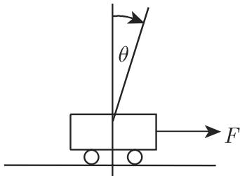
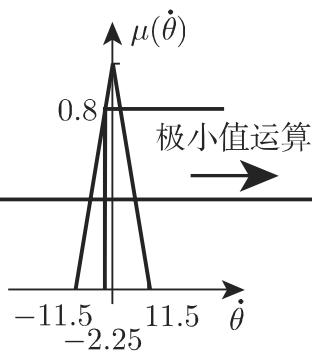
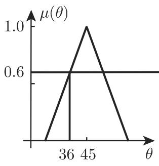
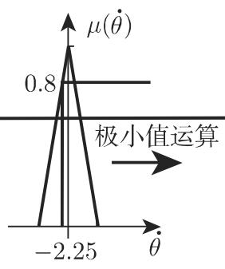
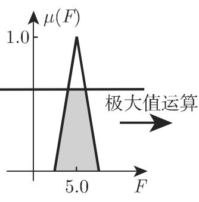

# 数学手册(原书第10版) 5.9.6 基于知识的模糊系统

## 定位与概述

本小节是模糊逻辑章（5.9，见 [[模糊逻辑]]）的应用性收官部分，主题为**基于知识的模糊系统**：将单位区间上的多值模糊逻辑应用于技术与非技术领域，一般流程为「量和特征数的模糊化 → 通过适当的知识基础与运算聚合 → 必要时将模糊结果集合逆模糊化」。全节含四个子节：

- 5.9.6.1 Mamdani 方法（见 [[mamdani方法]]）
- 5.9.6.2 管野/Sugeno 方法（见 [[菅野方法]]；译名讹误见 [[管野营野菅野译名问题]]）
- 5.9.6.3 认知系统：活动底座上的逆摆算例（见 [[认知系统]]、[[逆摆]]）
- 5.9.6.4 基于知识的插值系统（见 [[基于知识的插值系统]]）

本小节是 [[10-数学手册原书第10版--9-591-模糊逻辑的基本概念--1n6otka]]（5.9.1 模糊集与语言变量）、[[10-数学手册原书第10版--12-592-模糊集的连接聚合--wb9q68]]（5.9.2 t/s 范数与聚合）、[[10-数学手册原书第10版--9-593-模糊值关系--hgnh2r]]（5.9.3 模糊关系与复合）的下游应用：[[α切割]] 被用作「以法则权截断后件」的运算，[[t-范数]] 被用于合成实现等级，式 5.394 即 [[模糊关系的复合]]（极大-极小复合）的控制应用。

## 5.9.6.1 Mamdani 方法

模糊控制过程分四步（详见 [[mamdani方法]] 与 [[mamdani四步控制流程-式5-389]]）：

1. **法则基础**：例如对第 $i$ 个法则

$$
R^{i}:\ \text{如果 } e \text{ 是 } E^{i} \text{ 并且 } \dot{e} \text{ 是 } \Delta E^{i},\ \text{那么 } u \text{ 是 } U^{i}.\tag{5.389}
$$

其中 $e$ 刻画误差，$\dot{e}$ 刻画误差的变化，$u$ 刻画（非模糊值的）输出值的变化；误差与误差的变化在整个区域 $E\times\Delta E\times U$ 中通过语言描述模糊化。

2. **模糊化**：清晰测量值与法则基础的 IF–THEN 前提比较，判定哪些法则起作用及其权有多大。
3. **聚合**：具有各自不同权的起作用法则以一个代数运算相结合，用于逆模糊化。
4. **决策（逆模糊化）**：从可能值（清晰量的集合）中确定非模糊值的控制量，以保持偏差极小。

模糊控制意味着步骤 (1)–(4) 重复进行，直至取得最小的偏差及其变化。

## 5.9.6.2 管野方法（Sugeno 方法）

与 Mamdani 概念的差别在于法则基础与逆模糊化方法（详见 [[菅野方法]]）。

(1) 法则基础：

$$
R^{i}: \text{如果 } x_1 \text{ 是 } A_1^{i},\ \dots,\ \text{并且 } x_k \text{ 是 } A_k^{i},\ \text{那么 } u_i = p_0^i + p_1^i x_1 + p_2^i x_2 + \dots + p_k^i x_k.\tag{5.390}
$$

其中 $A_j^i$ 为由隶属函数确定的模糊集，$x_j$ 为清晰输入值（如误差 $e$ 与误差变化 $\dot e$），$p_j^i$ 为 $x_j$ 的权，$u_i$ 为属于第 $i$ 个法则的输出值。

(2) 模糊化：对每个法则 $R^i$ 算出 $\mu_i\in[0,1]$（源文作「模糊算法」，疑为「模糊化算法」讹误，见 [[5-9-6全节系统性转写讹误清单]]）。

(3) 决策：非模糊值的量由 $u_i$ 的加权平均算出，权是模糊化中的 $\mu_i$：

$$
u = \sum_{i=1}^{n} \mu_i u_i \left(\sum_{i=1}^{n} \mu_i\right)^{-1}.\tag{5.391}
$$

在此不进行 Mamdani 方法中的逆模糊化；问题是要得到有效的权参数 $p_j^i$，这些参数可用机器学习方法（例如人工神经网络 ANN）确定（源文未展开）。

## 5.9.6.3 认知系统：活动底座上的逆摆

（完整算例见 [[逆摆]] 与 [[逆摆mamdani算例-式5-392-395]]；方法论定位见 [[认知系统]]。）

**模型**：控制目的是保持摆杆垂直（角位移与角速度为零），控制量为作用于摆下端的力 $F$；模型基于人类「控制专家」的能动性（认知问题），专家用语言法则表述知识，法则由前提（测量值的说明）与结论（适当的控制值）组成。

**分区**：角 $\theta\in X_1:=[-90^\circ,90^\circ]$；角速度 $\dot\theta\in X_2:=[-45^\circ\mathrm{s}^{-1},45^\circ\mathrm{s}^{-1}]$；力 $F\in Y:=[-10\mathrm{N},10\mathrm{N}]$。每个量取七个语言项：负大 (nl)、负中 (nm)、负小 (ns)、零 (z)、正小 (ps)、正中 (pm)、正大 (pl)。初始值取精确测量值 $\theta=36^\circ,\ \dot\theta=-2.25^\circ\mathrm{s}^{-1}$。

**法则表**（$49(=7\times7)$ 个可能法则中 19 个实际重要；逐字转录。**注意：表头方向与正文 R₁/R₂ 存在矛盾**，见 [[逆摆法则表行列是否与r1r2转置]]）：

| Θ\Θ̇ | nl | nm | ns | z | ps | pm | pl |
|---|---|---|---|---|---|---|---|
| nl | | | ps | pl | | | |
| nm | | | | pm | | | |
| ns | nm | | ns | ps | | | |
| z | nl | nm | ns | z | ps | pm | pl |
| ps | | | | ns | ps | | pm |
| pm | | | | nm | | | |
| pl | | | | nl | ns | | |

**激发**：$\mu_{ps}(36^\circ)=0.4$、$\mu_{pm}(36^\circ)=0.6$、$\mu_z(-2.25^\circ\mathrm{s}^{-1})=0.8$（由正文 $\min\{\cdot,\cdot\}$ 中的数值反推的自然读法）；仅两条法则激发：$R_1$（Θ 是 ps 并且 Θ̇ 是 z ⟹ F 是 ps），权 $\alpha=\min\{0.4,0.8\}=0.4$；$R_2$（Θ 是 pm 并且 Θ̇ 是 z ⟹ F 是 pm），权 $\alpha=\min\{0.6,0.8\}=0.6$。

以 [[α切割]] 得输出集：

$$
\mu^{\text{输出}(R_1)}_{36;-2.25}(y) = \left\{ \begin{array}{ll} \frac{2}{5}y, & 0 \le y < 1, \\ 0.4, & 1 \le y \le 4, \\ 2 - \frac{2}{5}y, & 4 < y \le 5, \\ 0, & \text{其他}. \end{array} \right.\tag{5.392}
$$

$$
\mu^{\text{输出}(R_2)}_{36;-2.25}(y) = \left\{ \begin{array}{ll} \frac{2}{5}y - 1, & 2.5 \le y < 4, \\ 0.6, & 4 \le y \le 6, \\ 3 - \frac{2}{5}y, & 6 < y \le 7.5, \\ 0, & \text{其他}. \end{array} \right.\tag{5.393}
$$

**聚合**（决策逻辑，算子聚合即 5.9.3.2 的极大-极小复合，见 [[模糊关系的复合]]）：

$$
\mu^{\text{输出}}_{x_1,\dots,x_n}: Y\to[0,1];\ y\mapsto \max_{r\in\{1,\dots,k\}}\Big\{\min\{\mu^{(1)}_{i_{l,r}}(x_1),\dots,\mu^{(n)}_{i_{l,r}}(x_n),\mu_{i_r}(y)\}\Big\}.\tag{5.394}
$$

$$
\mu^{\text{输出}}_{36;-2.25}(y) = \left\{ \begin{array}{ll} \frac{2}{5}y, & 0 \le y < 1, \\ 0.4, & 1 \le y < 3.5, \\ \frac{2}{5}y - 1, & 3.5 \le y < 4, \\ 0.6, & 4 \le y < 6, \\ 3 - \frac{2}{5}y, & 6 \le y \le 7.5, \\ 0, & \text{其他}. \end{array} \right.\tag{5.395}
$$

其余 17 个法则对前提的满足等级等于零，得到本身是零的模糊集。

**逆模糊化**：重心法得 $F=3.95$，极大值准则法得 $F=5.0$（见 [[重心法与极大值准则法比较]]）。

**注记**：(1) 「基于知识」的路线建立在法则基础之上，最终目的以法则偏差最小为中心；(2) 应用逆模糊化时迭代过程被引进，最终抵达分区空间的中心，即得到零控制量；(3) 每个非线性特征域可通过在紧域上选择适当参数以任意精确度逼近。

## 5.9.6.4 基于知识的插值系统

（详见 [[基于知识的插值系统]] 与 [[sugeno插值三条件与凸组合界-式5-396-400]]。）

模糊系统可用于函数逼近或插值；最简单的研究实例是 Sugeno 控制器，其法则形如

$$
\begin{array}{rl} & {R_i: \text{IF（如果）} \xi_1 \text{ 是 } A_1^{(i)}, \text{ 并且} \dots, \text{ 并且 } \xi_n \text{ 是 } A_n^{(i)},}\\ & {\qquad\qquad \text{THEN（那么）} y = f_i(\xi_1,\dots,\xi_n)\quad (i=1,2,\dots,n)}\end{array}\tag{5.396}
$$

（记号混乱见 [[式5-396规则数n与n矛盾]]）。结论为单元素集，可省去昂贵的逆模糊化，输出为加权和：

$$
y = \frac{\sum_{i=1}^{N} \alpha_i f_i(\xi_1,\cdots,\xi_n)}{\sum_{i=1}^{N} \alpha_i}.\tag{5.397}
$$

一维情形（三角形隶属函数、相邻模糊集在高度 0.5 处相交）满足三条件：

1. 对每个法则 $R_i$ 存在仅满足一个法则的输入 $x_i$，输出在结点 $x_1,\dots,x_N$ 上固定（精确插值的充分非必要条件，等价于 $\alpha_1(x_2)=\alpha_2(x_1)=0$）；
2. 相邻结点间至多两个法则满足，插值曲线

$$
y = \frac{\alpha_1(x) f_1(x) + \alpha_2(x) f_2(x)}{\alpha_1(x)+\alpha_2(x)} = f_1(x) + g(x)[f_2(x)-f_1(x)],\qquad g := \frac{\alpha_2(x)}{\alpha_1(x)+\alpha_2(x)},\tag{5.398}
$$

其形状仅与隶属函数的比 $\mu_1/\mu_2$ 有关；

3. 输出是结论 $f_i$ 的凸组合：

$$
\min\{f_1,f_2\} \le y \le \max\{f_1,f_2\},\tag{5.399}
$$

$$
\min_{i\in\{1,2,\dots,n\}} f_i \le y \le \max_{i\in\{1,2,\dots,n\}} f_i.\tag{5.400}
$$

线性相关结论 + 和为常数的隶属函数 ⟹ 二次插值多项式；一般地，n 次多项式结论 ⟹ (n+1) 次插值多项式。在此意义下，除用多项式局部插值（例如用样条）的约束插值方法外，模糊系统是**基于法则的插值系统**（见 [[模糊插值与样条插值比较]]）。

## 已复算要点

本小节是 5.9 章入库内容中少见的可完全数值复核的部分，以下复算全部通过（详见 [[逆摆mamdani算例-式5-392-395]]）：

- 法则表非空格数恰为 **19**（49 个可能法则中）；
- $\mu_{ps}(36^\circ)+\mu_{pm}(36^\circ)=0.4+0.6=1$，与划分一致性吻合（推断）；
- 19−2=**17** 条法则权为零，与正文「其余 17 个法则」一致；
- 式 5.395 确为式 5.392 与 5.393 的逐点最大值：分支交点 $y=3.5$ 处 $\tfrac25\cdot3.5-1=0.4$，衔接无误；
- 重心法：分子 $\int y\mu\,dy=12.25$，分母 $\int\mu\,dy=3.10$，$12.25/3.10\approx3.9516$，与手册 $F=3.95$ 完全吻合；
- 极大值准则法 $F=5.0$ 与平台段 $[4,6]$（高度 0.6）的中点一致（推断，源文未指明具体变体）；
- 式 5.398 的比值主张：$g=\alpha_2/(\alpha_1+\alpha_2)=1/(1+\mu_1/\mu_2)$，代数成立；凸组合界（5.399–5.400）平凡成立。

## 矛盾与转写讹误

（详见 [[5-9-6全节系统性转写讹误清单]]。）

1. **法则表与正文 R₁/R₂ 方向矛盾**：按表头「Θ\Θ̇」查 (ps, z) 得 ns、(pm, z) 得 nm，但正文 R₁/R₂ 结论为 ps/pm，且式 5.392/5.393/5.395 与 F=3.95>0 全部与正文一致；若行列对调则与正文吻合。见 [[逆摆法则表行列是否与r1r2转置]]。此矛盾属算例内部，不构成对 Mamdani 方法本身的评价。
2. **菅野译名内部不一致**：标题「管野方法」vs 正文「营野 (Sugeno) 方法」。见 [[管野营野菅野译名问题]]。
3. **式 5.396 记号混乱**：「n 个输出变量」疑应为输入变量；法则下标 (i=1,…,n) 与式 5.397 求和上限 N 不一致。见 [[式5-396规则数n与n矛盾]]。
4. **交叉引用页码可疑**：「第 570 页 …5.9.3.2」「第 572 …5.9.4」与既有页码序列（5.9.1→591、5.9.2→592、5.9.3→593、5.9.6→596）不符，疑 OCR 讹误；同时揭示 5.9.4（模糊推理）未入库，见 [[5-9-4及5-9-5未入库缺口]]。
5. **系统性转写讹误**：「用千/基千/垂直千/对千/限千」=「于」；「聚合模/决策模」脱「块」；「控制址」=「控制量」；「儿乎」=「几乎」；「(£)」为图 5.80 子图标号损坏；「在此不进行 Mamdani 方法的逆模糊化问题是要…」语序损坏；「在高 0.5 的切割」语义残缺（疑为「在高度 0.5 处相交」）等。

## 图片

## 相关页面

- 实体：[[mamdani方法]]、[[菅野方法]]、[[逆摆]]
- 概念：[[模糊控制]]、[[法则基础]]、[[模糊化]]、[[逆模糊化]]、[[认知系统]]、[[基于知识的插值系统]]
- 发现：[[mamdani四步控制流程-式5-389]]、[[菅野方法函数后件与加权平均-式5-390-391]]、[[逆摆mamdani算例-式5-392-395]]、[[sugeno插值三条件与凸组合界-式5-396-400]]
- 方法论：[[mamdani模糊控制计算流程]]
- 比较：[[mamdani与菅野方法比较]]、[[重心法与极大值准则法比较]]、[[模糊插值与样条插值比较]]
- 待决问题：[[5-9-6全节系统性转写讹误清单]]、[[逆摆法则表行列是否与r1r2转置]]、[[管野营野菅野译名问题]]、[[式5-396规则数n与n矛盾]]、[[5-9-4及5-9-5未入库缺口]]

本节章末署名：朱尧辰译。

<!-- llm-wiki:embedded-images -->
## Embedded Images

### Document

<!-- llm-wiki:embedded-images -->
