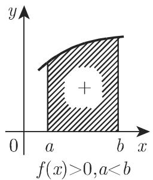
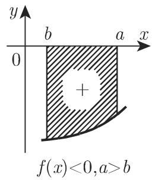
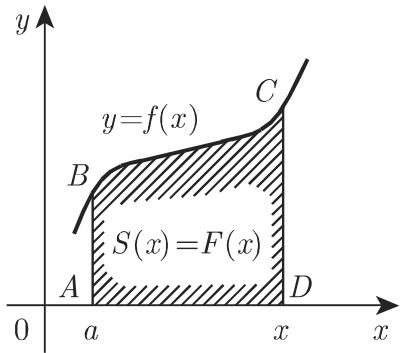
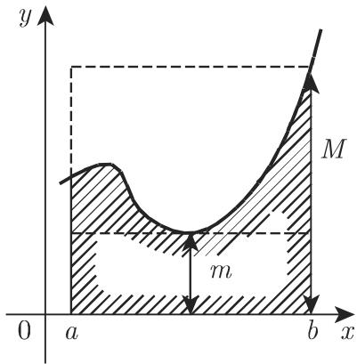
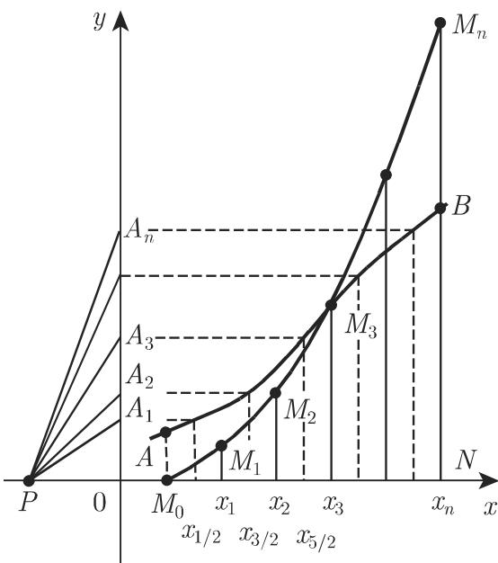

# 数学手册(原书第10版) 8.2.1 基本概念、法则和定理

## 概述

本源是[[entities/数学手册原书第10版]]第 8 章定积分部分（8.2）的开篇小节，上承已入库的 8.1.1–8.1.5 不定积分诸节（如 [[sources/10-数学手册原书第10版--11-811-原函数或反导数--2tviw2]]、[[sources/10-数学手册原书第10版--8-812-积分法则--k7f2d5]]），下启 8.2.3（广义积分）、8.2.4（含参积分）与 19.3.1（数值积分）。全节给出定积分的黎曼和定义与存在性、性质表（表 8.5）、积分限定理与整套计算方法，是 8.2 章的理论地基。

小节结构：

- **8.2.1.1 定积分的定义与存在性**：黎曼和极限构造（式 8.37–8.39），分情形 A（a<b）/ 情形 B（a>b）；
- **8.2.1.2 定积分的性质**：表 8.5；微积分基本定理；几何意义及符号法则；变上限；积分区间的分解；
- **8.2.1.3 关于积分限的其他定理**：积分变量记号的独立性、等积分限、交换积分限、中值定理与中值、定积分的估计；
- **8.2.1.4 定积分的计算**：主要方法（FTC / 表 21.7 / 计算机代数系统）；定积分的变换（代换与分部）；较难积分的计算方法（复变量积分、含参微分定理 式 8.53）；利用级数展开式积分（式 8.54–8.56）；图形积分法（式 8.57）；面积仪与积分仪；数值积分指针。

## 核心定义组（式 8.37–8.39，逐字转录）

有界闭区间 $[a,b]$ 上的有界函数 $y=f(x)$ 的定积分是一个数，当 $a<b$（情形 A）、$a>b$（情形 B）时，定积分为和的极限。构造分五步（分点、取点、乘积、求和、取极限）：

$$a = x_0 < x_1 < x_2 < \dots < x_i < \dots < x_{n-1} < x_n = b \quad (\text{情形A})\tag{8.37a}$$

$$a = x_0 > x_1 > x_2 > \dots > x_i > \dots > x_{n-1} > x_n = b \quad (\text{情形B})\tag{8.37b}$$

在每个子区间的内部或边界任取一点 $\xi_i$，使得 $x_{i-1}\leqslant\xi_i\leqslant x_i$（情形 A 中）或 $x_{i-1}\geqslant\xi_i\geqslant x_i$（情形 B 中）(8.37c)。用 $f(\xi_i)$ 乘以子区间的长度，即差 $\Delta x_{i-1}=x_i-x_{i-1}$（情形 A 取正号，情形 B 取负号），将所有 $n$ 个乘积相加，得积分近似和或黎曼和

$$\sum_{i=1}^{n} f(\xi_i)\Delta x_{i-1}\tag{8.38}$$

当每个子区间的长度都趋于 $0$（$n\to\infty$）时取极限。若无论 $x_i$ 及 $\xi_i$ 的取法如何，极限都存在，则称该极限为定黎曼积分：

$$\int_{a}^{b}f(x)\,\mathrm{d}x = \lim_{\substack{\Delta x_{i-1}\to 0\\ n\to\infty}}\sum_{i=1}^{n}f(\xi_{i})\Delta x_{i-1}.\tag{8.39}$$

**存在性**：闭区间上的连续函数定积分存在；有界且仅有有限个间断点的函数定积分也存在。定积分存在的函数称为该区间上的可积函数。详见 [[findings/式8-37至8-39定义组逐字转录与存在性]]。

## 表 8.5 定积分的重要性质（逐字转录）

| 性质 | 公式 |
|------|------|
| 微积分基本定理（$f(x)$ 连续） | $\int_a^b f(x)\,\mathrm{d}x = F(x)\big\vert_a^b = F(b)-F(a)$，其中 $F(x)=\int f(x)\,\mathrm{d}x+C$ 或 $F'(x)=f(x)$ |
| 交换法则 | $\int_a^b f(x)\,\mathrm{d}x = -\int_b^a f(x)\,\mathrm{d}x$ |
| 等积分限 | $\int_a^a f(x)\,\mathrm{d}x = 0$ |
| 区间法则 | $\int_a^b f(x)\,\mathrm{d}x = \int_a^c f(x)\,\mathrm{d}x + \int_c^b f(x)\,\mathrm{d}x$ |
| 积分变量记号的独立性 | $\int_a^b f(x)\,\mathrm{d}x = \int_a^b f(u)\,\mathrm{d}u = \int_a^b f(t)\,\mathrm{d}t$ |
| 关于积分上限函数的可微性 | $\dfrac{\mathrm{d}}{\mathrm{d}x}\displaystyle\int_a^x f(t)\,\mathrm{d}t = f(x)$，其中 $f(x)$ 为连续函数 |
| 积分中值定理 | $\int_a^b f(x)\,\mathrm{d}x = (b-a)f(\xi)\ (a<\xi<b)$ |

详见 [[findings/表8-5定积分重要性质逐字转录]]。

## 关键公式组（编号保留）

$$\int_{a}^{b} f(x)\,\mathrm{d}x = \int_{a}^{b} F'(x)\,\mathrm{d}x = F(x)\Big|_{a}^{b} = F(b)-F(a),\quad F(x)=\int f(x)\,\mathrm{d}x+C\tag{8.40–8.41}$$

$$A = \int_{a}^{b} f(x)\,\mathrm{d}x \quad (a<b,\ \text{且当 } a\leqslant x\leqslant b \text{ 时 } f(x)\geqslant 0)\tag{8.42}$$

$$S(x)=\int_{a}^{x}f(t)\,\mathrm{d}t,\qquad \frac{\mathrm{d}}{\mathrm{d}x}\int_{a}^{x}f(t)\,\mathrm{d}t = f(x)\tag{8.43–8.44}$$

$$\int_{a}^{b} f(x)\,\mathrm{d}x = \int_{a}^{c} f(x)\,\mathrm{d}x + \int_{c}^{b} f(x)\,\mathrm{d}x\tag{8.45}$$

$$\int_{a}^{b} f(x)\,\mathrm{d}x = \int_{a}^{b} f(u)\,\mathrm{d}u = \int_{a}^{b} f(t)\,\mathrm{d}t,\quad \int_{a}^{a} f(x)\,\mathrm{d}x = 0,\quad \int_{a}^{b} f(x)\,\mathrm{d}x = -\int_{b}^{a} f(x)\,\mathrm{d}x\tag{8.46–8.48}$$

$$\int_{a}^{b} f(x)\,\mathrm{d}x = (b-a)f(\xi),\quad m=\frac{1}{b-a}\int_{a}^{b} f(x)\,\mathrm{d}x\tag{8.49–8.50}$$

$$\int_{a}^{b} f(x)\varphi(x)\,\mathrm{d}x = f(\xi)\int_{a}^{b}\varphi(x)\,\mathrm{d}x\tag{8.51}$$

$$m(b-a)\leqslant\int_{a}^{b} f(x)\,\mathrm{d}x\leqslant M(b-a)\tag{8.52}$$

$$\frac{\mathrm{d}}{\mathrm{d}t}\int_{a}^{b} f(x,t)\,\mathrm{d}x = \int_{a}^{b}\frac{\partial f(x,t)}{\partial t}\,\mathrm{d}x\tag{8.53}$$

$$\int_{a}^{b} f(x)\,\mathrm{d}x = \int_{a}^{b} \varphi_1(x)\,\mathrm{d}x + \int_{a}^{b} \varphi_2(x)\,\mathrm{d}x + \dots + \int_{a}^{b} \varphi_n(x)\,\mathrm{d}x + \dots\tag{8.56}$$

$$\int_{a}^{b}f(x)\,\mathrm{d}x \approx \overline{OP}\cdot\overline{NM_n}\tag{8.57}$$

（式 8.54–8.55 为一致收敛级数展开及其逐项积分的不定积分形式，见 [[findings/式8-54至8-57级数展开与图形积分法及算例复算]]。）

## 算例与独立复算（全部通过）

| 算例 | 结果 | 复算 |
|------|------|------|
| A：$\int_0^\pi \sin x\,\mathrm{d}x$ | $=2$ | ✓ |
| B：$\int_0^{2\pi} \sin x\,\mathrm{d}x$ | $=0$（符号法则示例） | ✓ |
| 代换法：$\int_0^a \sqrt{a^2-x^2}\,\mathrm{d}x$ | $=\pi a^2/4$（两次代换 $x=a\sin t$、$z=2t$，四分之一圆面积） | ✓ |
| 分部积分：$\int_0^1 xe^x\,\mathrm{d}x$ | $=1$ | ✓ |
| 含参微分（式 8.53）：$\int_0^1 \frac{x-1}{\ln x}\,\mathrm{d}x$ | $=\ln 2\approx 0.6931$ | ✓ |
| 级数展开：$\int_0^{1/2} e^{-x^2}\,\mathrm{d}x$ | $=0.4613$（精确到 0.0001；真值 0.461281；截断误差 $<\frac12\cdot\frac{1}{55296}\approx 9\times 10^{-6}$） | ✓ |

其中 $e^{-x^2}$ 算例是 [[entities/误差函数]] 的原型积分，但本节原文未使用 erf 记号；级数项 $1/12$、$1/160$、$1/2688$、$1/55296$ 均复算无误。

## 与既有 wiki 内容的联系

- 经 [[concepts/微积分基本定理]] 与 8.1 章的 [[concepts/原函数]]、[[concepts/不定积分]] 沟通；
- [[concepts/级数展开求积分]] 在此获得定积分版本（式 8.54–8.56）与数值算例；[[concepts/逐项积分与逐项微分]] 由 7.3 的式 7.82 延伸至定积分；
- [[concepts/换元积分法]]、[[concepts/分部积分]] 新增定积分应用算例（须同步变换积分限）；
- $e^{-x^2}$ 级数一致收敛引用 [[concepts/阿贝尔定理]]；截断误差控制引用 [[concepts/莱布尼茨审敛法]] 与 [[concepts/级数余项估计]]；
- [[concepts/非初等积分]]：式 8.53 与级数法是不定积分非初等时定积分仍可求值的两条出路。

## 矛盾、张力与转写讹误

1. **式 8.52 条件存疑**：$f(x)\geqslant 0$ 并非必要（任意有界 $f$、$a<b$ 即可），且正文「上确界的乘积」处脱漏符号 $M$——见 [[queries/式8-52的f非负条件与M脱漏复原]]；
2. **符号撞名**：$m$ 在式 8.50 表中值、在式 8.52 表下确界；
3. **下限不一致**：变上限段落行文用 $\int_0^x f(t)\,\mathrm{d}t$，而式 8.44 用 $\int_a^x$——见 [[queries/变上限积分下限不一致与特别积分术语]]；
4. **图号混乱**：正文两引「第 641 页图 8.1」（本文件未含），取 $\xi_i$ 处引「图 8.4」；本文件实含图 8.4–8.10 共 10 幅——见 [[queries/图8-1与图8-4指向问题]]；
5. **方法学张力**：式 8.53 的假设条件推迟至 8.2.4 给出，却在 $\ln 2$ 算例中先行使用；$(x-1)/\ln x$ 在 $x=1$ 为可去奇性，手册未按自身「代换积分限前先查广义积分」的告诫显式处理；
6. **系统性转写讹误**（「趋千/等千/属千/关千」「儿何意义」「位丁」「而积」、「情形 [A/B]」字母脱漏、页码「页」字脱漏等）——见 [[queries/8-2-1全节系统性转写讹误清单]]。

## 本源生成的页面

- 概念：[[concepts/定积分]]、[[concepts/微积分基本定理]]、[[concepts/变上限积分]]、[[concepts/定积分的性质]]、[[concepts/积分中值定理]]、[[concepts/定积分的估计]]、[[concepts/含参变量积分的微分定理]]、[[concepts/图形积分法]]
- 实体：[[entities/面积仪]]（积分仪作为关联提及，不单独建页）
- 发现：[[findings/式8-37至8-39定义组逐字转录与存在性]]、[[findings/表8-5定积分重要性质逐字转录]]、[[findings/式8-40至8-42基本定理几何意义与两算例复算]]、[[findings/式8-43至8-45变上限与区间分解逐字转录]]、[[findings/式8-46至8-48积分限三定理逐字转录]]、[[findings/式8-49至8-52中值定理组与估计逐字转录]]、[[findings/定积分的变换两算例复算]]、[[findings/式8-53含参微分与ln2算例复算]]、[[findings/式8-54至8-57级数展开与图形积分法及算例复算]]
- 方法论：[[methodology/定积分计算方法选择流程]]；比较：[[comparisons/定积分与不定积分比较]]

## 未入库回指

8.2.3（广义积分，p. 673）、8.2.3.3.1（p. 677）、8.2.4（含参积分，p. 679）、19.3.1（数值积分/求积公式，p. 1252）、第 20 章（计算机代数系统）、表 21.7（p. 1382 积分表）、984–989 页复变量积分例子、文献 [19.27]（积分仪）均未入库——见 [[queries/8-2-3及8-2-4与19-3-1未入库回指缺口]]；表 21.7 的既有缺口记录见 [[queries/表6-1与表21-7未入库回指缺口]]。

<!-- llm-wiki:embedded-images -->
## Embedded Images

### Document

<!-- llm-wiki:embedded-images -->
