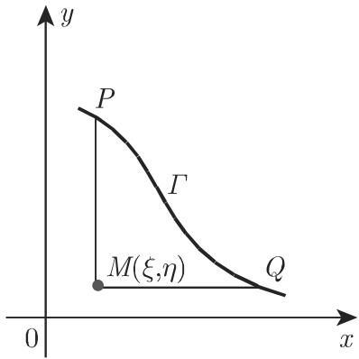

# 数学手册(原书第10版) 9.2.2 二阶线性偏微分方程

## 来源定位与结构

本小节是手册第 9 章偏微分方程部分的核心小节，属「数学手册逐节转写—复算」工程（承接 9.1、9.1.1–9.1.3 与 8.x 各节）。结构分三层：

1. **9.2.2.1 两个自变量的二阶线性微分方程的分类和性质**：一般形式 (9.82a)、判别式 (9.82b)、特征方程 (9.83)、双曲/抛物/椭圆/混合四类、典范形式约化 (9.84a–f)、一般化形式 (9.85)。
2. **9.2.2.2 多于两个自变量的情形**：n 变量一般形式 (9.86)；n ≥ 3 变系数一般不能化为单一典范形式；常系数经线性齐次变换化为 (9.87)，按 κᵢ ∈ {−1, 0, +1} 符号模式分类（含超双曲型）；消一阶导代换 (9.88) 与简单形式 (9.89)/(9.90)。
3. **9.2.2.3 积分法**：[[分离变量法]]（算例 A 弦振动、B 棒纵向振动、C 圆膜振动、D 矩形狄利克雷、E 半无限杆热传导）；双曲柯西问题的[[黎曼方法]]（含[[电报方程]]完整算例）；两变量与三变量边值问题的[[格林函数与格林方法]]（圆盘与球两例、[[泊松积分]]）；算子方法概述（回指 15.1/15.1.6）；[[偏微分方程的逼近方法]]总览。

## 结构化公式转录

### 分类与特征（9.2.2.1）

```
A ∂²u/∂x² + 2B ∂²u/∂x∂y + C ∂²u/∂y² + a ∂u/∂x + b ∂u/∂y + cu = f   (9.82a)
δ = AC − B²                                                            (9.82b)
δ < 0 双曲型；δ = 0 抛物型；δ > 0 椭圆型；δ 改变符号：混合型
A dy² − 2B dx dy + C dx² = 0，或 dy/dx = (B ± √(−δ))/A                (9.83)
```

特征性态：双曲型两族实特征；抛物型一族；椭圆型无实特征；坐标变换不改变特征；特征与坐标线一致则相应二阶导数项消失；抛物型无混合导数项。

### 典范形式（ξ = φ(x,y)，η = ψ(x,y)，式 9.84a）

```
u_ξξ − u_ηη + … = 0   （δ < 0，双曲型）   (9.84b)
u_ηη + … = 0          （δ = 0，抛物型）   (9.84c)
u_ξξ + u_ηη + … = 0   （δ > 0，椭圆型）   (9.84d)
u_{ξ₁η₁} + … = 0      （双曲第一典范形式） (9.84e)
ξ = ξ₁ + η₁，η = ξ₁ − η₁                  (9.84f)
```

抛物型：唯一特征族取 ξ = 常数，η 取不依赖 ξ 的任意函数。椭圆型：系数解析时取复共轭特征 φ、ψ，代换 ξ = φ + ψ，η = i(φ − ψ)。一般化形式 (9.85)：A u_xx + 2B u_xy + C u_yy + F(x, y, u, u_x, u_y) = 0，F 可对 u 及一阶导数非线性，分类与约化陈述仍成立。

### 常系数约化（9.2.2.2）

```
Σ_{i,k} a_ik ∂²u/∂x_i∂x_k + … = 0                      (9.86)
Σ_i κ_i ∂²u/∂x_i² + … = 0，κ_i ∈ {−1, 0, +1}           (9.87)
u = v exp(−½ Σ_k (b_k/κ_k) x_k)   （对 κ_k ≠ 0 求和）    (9.88)
椭圆型：Δv + kv = g                                      (9.89)
双曲型：∂²v/∂t² − Δv + kv = g                            (9.90)
```

### 分离变量与黎曼方法骨架

```
u(x₁,…,xₙ) = φ₁(x₁)φ₂(x₂)…φₙ(xₙ)                        (9.91)
u_xy + a u_x + b u_y + cu = F                            (9.97a)
v_xy − (av)_x − (bv)_y + cv = 0（伴随方程）               (9.97b)
v(x,η;ξ,η) = exp(∫_ξ^x b(s,η)ds)，v(ξ,y;ξ,η) = exp(∫_η^y a(ξ,s)ds)   (9.97c)
```

### 格林函数条件与泊松积分

```
二维奇性部分：G = U ln(1/r) + V，r = √((x−ξ)²+(y−η)²)，U(ξ,η) = 1   (9.99c/d)
三维奇性部分：G = U/r + V                                             (9.100c)
圆盘：G = ln(1/r) + ln(r₁ρ/R)，OM·OM₁ = R²                            (9.101b/c)
u(ξ,η) = (1/2π)∫₀^{2π} (R²−ρ²)/(R²+ρ²−2Rρcos(ψ−φ))·u(φ)dφ           (9.101d)
球：G = 1/r − R/(r₁ρ)                                                 (9.102b)
u(ξ,η,ζ) = (1/4π)∬_S (R²−ρ²)/(Rr³)·u ds                              (9.102c)
```

## 五个分离变量算例一览

| 算例 | 方程 | 类型 | 定解条件 | 本征函数系（谱） |
|---|---|---|---|---|
| A 弦振动 (9.92) | u_tt = a²u_xx | 双曲 | 双端 Dirichlet + 初位移/初速度 | sin(nπx/l)，n ≥ 1，离散 |
| B 棒纵向振动 (9.93) | u_tt = a²u_xx（齐次化后非齐次） | 双曲 | x=0 Neumann 齐次 + x=l Neumann 非齐次 | cos(nπx/l)，n ≥ 0，离散 |
| C 圆膜振动 (9.94) | 极坐标波动方程 | 双曲 | ρ=R Dirichlet + φ 周期 + ρ=0 有界 | Jₙ(μ_nk ρ/R)，带权 ρ，二重指标 |
| D 矩形狄利克雷 (9.95) | Δu = 0 | 椭圆 | 四边取给定值 | sin(nπx/a)×sinh 组合，离散 |
| E 半无限杆热传导 (9.96) | u_t = a²u_xx | 抛物 | x=0 Dirichlet + 无穷远趋零 | sin λx，λ 连续（傅里叶积分） |

各算例的逐字转录与复算见 findings 页（见下方索引）。

## 复算结论摘要

- 分类理论（9.83 解出、三类型示例、典范形式组）：复算通过（[[findings/式9-82至9-85分类特征与典范形式转录复算]]）。
- 常系数约化（9.88 消一阶导机制以单变量模型核验）：通过（[[findings/式9-86至9-90多变量与常系数约化复算]]）。
- 五个分离变量算例：分离步骤、本征值、系数公式均复算通过（[[findings/式9-92弦振动分离变量解转录复算]]、[[findings/式9-93棒纵向振动齐次化代换复算]]、[[findings/式9-94圆膜振动贝塞尔本征函数复算]]、[[findings/式9-95矩形狄利克雷问题复算]]、[[findings/式9-96半无限杆热传导复算]]）。
- [[黎曼方法]]：独立推导（Lagrange 恒等式 + Green 公式）与两组数值算例表明式 9.97f 的两个线积分项应**异号**（dx 项与 dy 项反号），与转写文本“同取负号”矛盾——本节最重要的实质性问题（[[findings/式9-97黎曼方法独立推导与符号核对]]）。
- [[电报方程]]：约化链（9.98a→j）全部复算通过；黎曼函数为 I₀(√((ξ−ξ₀)(η−η₀)))，原文称 (9.98g) 为“零阶贝塞尔微分方程”，实为零阶**变形**贝塞尔方程；n² = (b²−ac)/a² 可为负而原文未讨论（[[findings/式9-98电报方程约化链复算]]）。
- [[格林函数与格林方法]]：条件组转录自洽（[[findings/式9-99至9-100格林方法条件组转录]]）；圆盘格林函数边界为零（相似三角形）与两个[[泊松积分]]均核验通过（[[findings/式9-101至9-102圆盘与球格林函数复算]]）。

## 约定差异警示（防误迁移）

- 手册判别式 δ = AC − B²，双曲型 δ < 0；通行教材多用 B² − AC（或 B² − 4AC），双曲型为正——方向相反，属约定差异而非错误，见 [[comparisons/判别式两种符号约定比较]]。
- 手册格林公式 (9.99e) 的 ∂/∂n 为**指向区域内部**的法向导数，与常见外法向约定符号相反但自洽。

## 主要讹误与存疑（建查询追踪）

1. (9.82a)/(9.82b) 四次被误引为 (9.28a)/(9.28b)（[[queries/式9-28a与9-28b回指是否应为9-82a与9-82b]]）。
2. 9.93h 与 9.93m 系数说明写作 f(x) − kpx²/2，与 9.93f 的 kpx²/(2l) 不一致且量纲不符（[[queries/式9-93h系数说明是否漏除以l]]）。
3. 9.94c 初始条件写作 f(ρ, R)，疑为 f(ρ, φ) 之误；“n=0 时分子 2 改为 1”规则正确但转写脱落“2”（[[queries/式9-94c初始条件疑为fρφ之误]]）。
4. 9.97f/9.97g 线积分符号结构问题（[[queries/式9-97f与9-97g线积分符号结构]]）。
5. 电报方程 n² < 0 情形未讨论（[[queries/电报方程n平方为负情形为何未讨论]]）。
6. 系统性 OCR 讹误（千/于、入/λ、式号 l→1 如 9.931/9.941/9.961、乱码等）汇总于 [[queries/9-2-2全节系统性转写讹误清单]]。
7. 大量未入库回指（7.4.1.1 傅里叶级数被引六次以上、13.2.6.5、13.5.1、15.1.x、19.5、表 21.8.2/(21.27)、式 (2.122)、文献 [9.5]、图 9.17–9.19 等）见 [[queries/9-2-2未入库回指缺口]]。

## 与既有库的联系

- 直接强化（提供 PDE 应用场景）：[[斯图姆-刘维尔问题]]、[[本征值与本征函数]]、[[权函数]]（圆膜带权 ρ 正交）、[[周期边界条件]]（Φ 的条件）、[[奇异边值问题]]（ρ=0 有界性）、[[自伴微分方程]]。
- 特殊函数应用：[[贝塞尔函数]]（零点 μ_nk、带权正交范数）、[[变形贝塞尔函数与麦克唐纳函数]]（I₀ 作黎曼函数）、[[贝塞尔微分方程]]（9.98g 称谓辨析）。
- 方法自 ODE 延伸至 PDE：[[非齐次边值问题齐次化代换]]（例 B 的 z = u − kpx²/(2l)）、[[叠加原理与分解定理]]（z = v + w、D 例两半问题叠加）、[[边值问题]]与[[初值问题]]、[[通解与特解]]（“参数解族非通解”）。
- 术语辨析：[[特征方程法]]（ODE）与本节 [[偏微分方程的特征]]（PDE 特征线）同名异义，见 [[comparisons/ODE特征方程与PDE特征线辨析]]。

## 附图

- 图 9.17（矩形狄利克雷问题示意）：`media/10-数学手册原书第10版--13-922-二阶线性偏微分方程--rs45gz/001-7a9c41bb955ec065681a500c5604bd76015a5deb1aed07c60da3abe1eba5445f.jpg`
- 图 9.18（黎曼公式中的曲线与区域）：`media/10-数学手册原书第10版--13-922-二阶线性偏微分方程--rs45gz/002-e31d85e7667d997c4edff3526e2ba28d67e908c8b459471fc2c57011989e6acc.jpg`
- 图 9.19（圆盘格林函数镜像点）：`media/10-数学手册原书第10版--13-922-二阶线性偏微分方程--rs45gz/003-c74e9170976089f37c936b0f86363d276fdf435eebf429d3df2581ccc6006a93.jpg`

<!-- llm-wiki:embedded-images -->
## Embedded Images

### Document




<!-- llm-wiki:embedded-images -->
