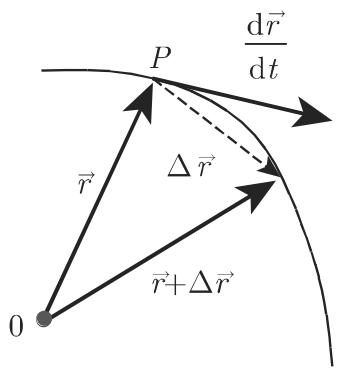
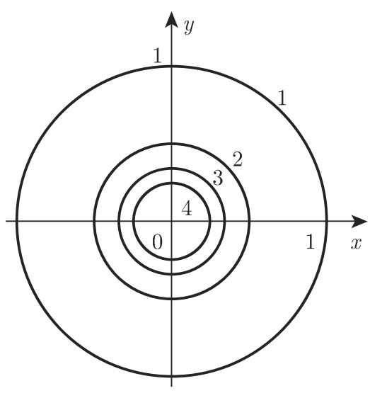
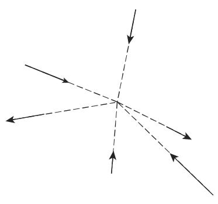
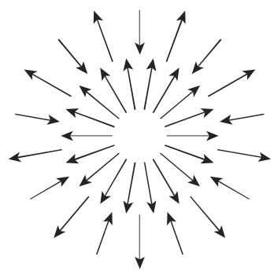
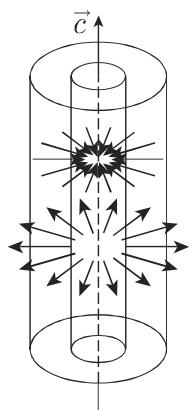
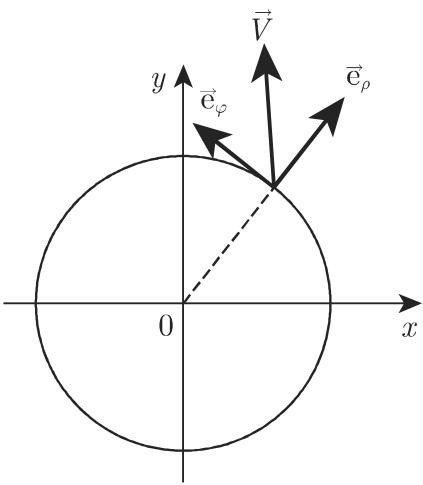

# 数学手册(原书第10版) 13.1 向量场理论的基本概念

本来源是《数学手册(原书第10版)》第 13 章（向量场理论）的首节，为全章提供概念基础：13.1.1 处理一个标量变量的向量函数（定义、速端曲线、导数、微分法则、泰勒展开、微分）；13.1.2 定义标量场及其特殊情形（平面场、中心场、轴向场）与等值面/等值线；13.1.3 定义向量场及其特殊情形（中心向量场、球面向量场、柱面向量场），给出笛卡儿/柱面/球面三系坐标表示与分量变换（表 13.1 与式 13.18–13.21），并以向量线（式 13.26）作结。媒体路径内部 ID 为 `14-131`，正文节号为 13.1，与前几节"批次-页码"式 ID 模式一致。

本节是 wiki 中第 13 章向量分析簇的第一个入库小节，与已有第 12 章泛函分析簇（12.2–12.7）无主题重叠，属横向扩展；入库工作延续"转录复算 findings + 全节讹误清单 query + 未入库回指缺口 query"的既有模式。

## 内容主线

1. **13.1.1 一个标量变量的向量函数**：定义 (13.1)、速端曲线、导数 (13.2)、五条微分法则 (13.3a–e) 与常模推论、泰勒展开 (13.4)、微分定义 (13.5)。
2. **13.1.2 标量场**：定义 (13.6a,b)、平面场、中心场 (13.7)、轴向场、坐标表示 (13.8–13.9)、等值面 (13.10) 与等值线 (13.11)。
3. **13.1.3 向量场**：定义 (13.12a,b)、中心向量场 (13.13)、球面向量场 (13.14)、柱面向量场 (13.15)、坐标表示 (13.16–13.17)、坐标系变换（表 13.1、式 13.18–13.25）、向量线 (13.26)。

## 核心公式转录

```latex
% 一元向量函数（13.1–13.5）
\vec{a}(t) = a_x(t)\vec{e}_x + a_y(t)\vec{e}_y + a_z(t)\vec{e}_z                              (13.1)
\frac{\mathrm{d}\vec{a}}{\mathrm{d}t} = \lim_{\Delta t\to 0}\frac{\vec{a}(t+\Delta t)-\vec{a}(t)}{\Delta t}   (13.2)
\frac{\mathrm{d}}{\mathrm{d}t}(\vec{a}\pm\vec{b}\pm\vec{c}) = \frac{\mathrm{d}\vec{a}}{\mathrm{d}t} \pm \frac{\mathrm{d}\vec{b}}{\mathrm{d}t} \pm \frac{\mathrm{d}\vec{c}}{\mathrm{d}t}   (13.3a)
\frac{\mathrm{d}}{\mathrm{d}t}(\varphi\vec{a}) = \frac{\mathrm{d}\varphi}{\mathrm{d}t}\vec{a} + \varphi\frac{\mathrm{d}\vec{a}}{\mathrm{d}t}   (13.3b)
\frac{\mathrm{d}}{\mathrm{d}t}(\vec{a}\vec{b}) = \frac{\mathrm{d}\vec{a}}{\mathrm{d}t}\vec{b} + \vec{a}\frac{\mathrm{d}\vec{b}}{\mathrm{d}t}   (13.3c)
\frac{\mathrm{d}}{\mathrm{d}t}(\vec{a}\times\vec{b}) = \frac{\mathrm{d}\vec{a}}{\mathrm{d}t}\times\vec{b} + \vec{a}\times\frac{\mathrm{d}\vec{b}}{\mathrm{d}t}   (13.3d)
\frac{\mathrm{d}}{\mathrm{d}t}\vec{a}[\varphi(t)] = \frac{\mathrm{d}\vec{a}}{\mathrm{d}\varphi}\cdot\frac{\mathrm{d}\varphi}{\mathrm{d}t}   (13.3e)
\vec{a}(t+h) = \vec{a}(t) + h\frac{\mathrm{d}\vec{a}}{\mathrm{d}t} + \frac{h^2}{2!}\frac{\mathrm{d}^2\vec{a}}{\mathrm{d}t^2} + \dots + \frac{h^n}{n!}\frac{\mathrm{d}^n\vec{a}}{\mathrm{d}t^n} + \dots   (13.4)
\mathrm{d}\vec{a} = \frac{\mathrm{d}\vec{a}}{\mathrm{d}t}\Delta t   % 记号存疑：Δt 疑为 dt   (13.5)

% 标量场（13.6–13.11）
U = U(P),\quad U = U(\vec{r})                                                       (13.6a,b)
U = f(|\vec{r}|),\qquad U = \frac{c}{r^2}                                           (13.7a,b)
U = \varPhi(x,y,z),\quad U = \varPsi(\rho,\varphi,z),\quad U = \chi(r,\vartheta,\varphi)   (13.8a)
U = \varPhi(x,y),\quad U = \varPsi(\rho,\varphi)                                    (13.8b)
U = U(\sqrt{x^2+y^2+z^2}) = U(\sqrt{\rho^2+z^2}) = U(r)                             (13.9a)
U = U(\sqrt{x^2+y^2}) = U(\rho) = U(r\sin\vartheta)                                 (13.9b)
U = U(P) = \text{常数}                                                              (13.10a)
U = \varPhi(x,y,z) = \text{常数},\quad U = \varPsi(\rho,\varphi,z) = \text{常数},\quad U = \chi(r,\vartheta,\varphi) = \text{常数}   (13.10b)
U = \text{常数}                                                                     (13.11)

% 向量场（13.12–13.17）
\vec{V} = \vec{V}(P),\quad \vec{V} = \vec{V}(\vec{r})                               (13.12a,b)
\vec{V} = f(\vec{r})\vec{r},\qquad \vec{V} = \varphi(\vec{r})\frac{\vec{r}}{r}\ (r=|\vec{r}|)   (13.13a,b)
\vec{V} = \frac{c}{r^3}\vec{r} = \frac{c}{r^2}\frac{\vec{r}}{r}                     (13.14)
\vec{V} = \varphi(\rho)\frac{\vec{r}^{*}}{\rho},\qquad \vec{r}^{*} = \vec{c}\times(\vec{r}\times\vec{c})   (13.15a,b)
\vec{V} = V_1\vec{e}_1 + V_2\vec{e}_2 + V_3\vec{e}_3                                (13.16a)
\vec{V} = V_x(x,y,z)\vec{i} + V_y(x,y,z)\vec{j} + V_z(x,y,z)\vec{k}                (13.16b)
\vec{e}_\rho,\ \vec{e}_\varphi,\ \vec{e}_z(=\vec{k});\qquad \vec{e}_r(=\vec{r}/r),\ \vec{e}_\vartheta,\ \vec{e}_\varphi   (13.17a)
\vec{V} = V_\rho(\rho,\varphi,z)\vec{e}_\rho + V_\varphi(\rho,\varphi,z)\vec{e}_\varphi + V_z(\rho,\varphi,z)\vec{e}_z   (13.17b)
\vec{V} = V_r(r,\vartheta,\varphi)\vec{e}_r + V_\varphi(r,\vartheta,\varphi)\vec{e}_\varphi + V_\vartheta(r,\vartheta,\varphi)\vec{e}_\vartheta   (13.17c)

% 特殊场的笛卡儿表示与向量线（13.22–13.26）
\vec{V} = \varphi(\sqrt{x^2+y^2+z^2})(x\vec{i}+y\vec{j}+z\vec{k})                   (13.22)
\vec{V} = \varphi(\sqrt{x^2+y^2})(x\vec{i}+y\vec{j})                                (13.23)
\vec{V} = V_x(x,y)\vec{i} + V_y(x,y)\vec{j} = V_\rho(\rho,\varphi)\vec{e}_\rho + V_\varphi(\rho,\varphi)\vec{e}_\varphi   (13.24)
\vec{V} = \varphi(\sqrt{x^2+y^2})(x\vec{i}+y\vec{j}) = \varphi(\rho)\vec{e}_\rho    % 两端差 ρ 因子，见 query   (13.25)
\frac{\mathrm{d}x}{V_x} = \frac{\mathrm{d}y}{V_y} = \frac{\mathrm{d}z}{V_z},\qquad \frac{\mathrm{d}x}{V_x} = \frac{\mathrm{d}y}{V_y}   (13.26a,b)
```

坐标系变换公式（复算对象）：

```latex
V_x = V_\rho\cos\varphi - V_\varphi\sin\varphi,\quad V_y = V_\rho\sin\varphi + V_\varphi\cos\varphi,\quad V_z = V_z                  (13.18)
V_\rho = V_x\cos\varphi + V_y\sin\varphi,\quad V_\varphi = -V_x\sin\varphi + V_y\cos\varphi,\quad V_z = V_z                            (13.19)
V_x = V_r\sin\vartheta\cos\varphi - V_\varphi\sin\varphi + V_\vartheta\cos\varphi\cos\vartheta                                        (13.20)
V_y = V_r\sin\vartheta\sin\varphi + V_\varphi\cos\varphi + V_\vartheta\sin\varphi\cos\vartheta
V_z = V_r\cos\vartheta - V_\vartheta\sin\vartheta
V_r = V_x\sin\vartheta\cos\varphi + V_y\sin\vartheta\sin\varphi + V_z\cos\vartheta                                                    (13.21)
V_\vartheta = V_x\cos\vartheta\cos\varphi + V_y\cos\vartheta\sin\varphi - V_z\sin\vartheta
V_\varphi = -V_x\sin\varphi + V_y\cos\varphi
```

## 表 13.1（笛卡儿、柱面和球面坐标系中一个向量的分量之间的关系，原文照录）

| 笛卡儿坐标系 | 柱面坐标系 | 球面坐标系 |
|---|---|---|
| $\vec{V} = V_x \vec{e}_x + V_y \vec{e}_y + V_z \vec{e}_z$ | $V_\rho \vec{e}_\rho + V_\varphi \vec{e}_\varphi + V_z \vec{e}_z$ | $V_r \vec{e}_r + V_\vartheta \vec{e}_\vartheta + V_\varphi \vec{e}_\varphi$ |
| $V_x$ | $= V_\rho \cos \varphi - V_\varphi \sin \varphi$ | $= V_r \sin \vartheta \cos \varphi + V_\vartheta \cos \vartheta \cos \varphi - V_\varphi \sin \varphi$ |
| $V_y$ | $= V_\rho \sin \varphi + V_\varphi \cos \varphi$ | $= V_r \sin \vartheta \sin \varphi + V_\vartheta \cos \vartheta \sin \varphi + V_\varphi \cos \varphi$ |
| $V_z$ | $= V_z$ | $= V_r \cos \vartheta - V_\vartheta \sin \vartheta$ |
| $V_x \cos \varphi + V_y \sin \varphi$ | $= V_\rho$ | $= V_r \sin \vartheta + V_\vartheta \cos \vartheta$ |
| $-V_x \sin \varphi + V_y \cos \varphi$ | $= V_\varphi$ | $= V_\varphi$ |
| $V_z$ | $= V_z$ | $= V_r \cos \vartheta - V_\vartheta \sin \vartheta$ |
| $V_x \sin \vartheta \cos \varphi + V_y \sin \vartheta \sin \varphi + V_z \cos \vartheta$ | $= V_\rho \sin \vartheta + V_z \cos \vartheta$ | $= V_r$ |
| $V_x \cos \vartheta \cos \varphi + V_y \cos \vartheta \sin \varphi - V_z \sin \varphi$（⚠️ 应为 $-V_z \sin \vartheta$） | $= V_\rho \cos \vartheta - V_z \sin \vartheta$ | $= V_\vartheta$ |
| $-V_x \sin \varphi + V_y \cos \varphi$ | $= V_\varphi$ | $= V_\varphi$ |

## 复算结论

经逐式复算：

- 式 (13.18)–(13.21) 的四组分量变换公式**全部正确**（以单位向量点积投影重建验证）；
- 表 13.1 的柱面列与球面列**全部正确**，并隐含单位向量投影关系 $\vec{e}_\rho = \sin\vartheta\,\vec{e}_r + \cos\vartheta\,\vec{e}_\vartheta$、$\vec{e}_r = \sin\vartheta\,\vec{e}_\rho + \cos\vartheta\,\vec{e}_z$、$\vec{e}_\vartheta = \cos\vartheta\,\vec{e}_\rho - \sin\vartheta\,\vec{e}_z$，$\vec{e}_\varphi$ 在柱面、球面两系中相同；
- 表 13.1 仅一处疑误：$V_\vartheta$ 行**笛卡儿列**的 $-V_z\sin\varphi$ 应为 $-V_z\sin\vartheta$（与式 (13.21) 矛盾，复算支持式 (13.21)）；
- 柱面向量场投影式 $\vec{r}^* = \vec{c}\times(\vec{r}\times\vec{c})$ 经三重积展开复算正确；
- 向量线例 A（中心场→过中心的射线）与例 B（$\vec{V}=\vec{c}\times\vec{r}$→垂直于 $\vec{c}$ 的平面内圆周，圆心在平行于 $\vec{c}$ 的轴上）均经积分复算验证。

详见 [[式13-1至13-5向量函数与微分法则转录复算]]、[[式13-6至13-11标量场与等值面线转录复算]]、[[式13-12至13-17向量场与特殊向量场转录复算]]、[[表13-1与式13-18至13-25坐标系变换转录复算]]、[[式13-26向量线微分方程与两例转录复算]]。

## 讹误与存疑

系统性转写讹误（形近字、脱字符、乱码、英文拼写、列表编号丢失、页码回指脱"页"字等）详见 [[13-1全节系统性转写讹误清单]]。内容性疑点：

1. [[表13-1的Vϑ行sinφ疑为sinϑ]]——表 13.1 与式 (13.21) 的直接矛盾；
2. [[柱面向量场坐标形式疑为Vρeρ]]——正文"柱面坐标系即形式 $\vec{V}=V(\varphi)\vec{e}_\varphi$ 最方便"与式 (13.15a)、(13.25) 矛盾；
3. [[式13-5微分记号Δt疑为dt]]；
4. [[式13-25圆场标量函数记号差ρ因子疑误]]——同名标量函数 $\varphi$ 相差 $\rho$ 因子；同类记号张力亦见于 (13.22)/(13.13b)（差 $r$ 因子）与 (13.23)/(13.15a)（差 $\rho$ 因子）；
5. 补充观察：正文球面坐标形式 $\vec{V}=V(r)\vec{e}_\tau$ 的下标 $\tau$ 疑为 $r$（球面系单位向量仅有 $\vec{e}_r,\vec{e}_\vartheta,\vec{e}_\varphi$）。

## 未入库回指

见 [[13-1未入库回指缺口]]：3.5.1.1（极点与位置向量）、3.5.2（平面向量场）、9.1.1.2 与 9.2.1.1（向量线 ODE 解法）、14.3.2（向量项级数收敛性类比复数项级数）、第 915 页图 13.3。

## 附属资源

插图 图 13.1–13.9（速端曲线、切向量、等值线四例、三类特殊向量场、柱面/球面坐标单位向量、平面向量场、向量线）以媒体文件形式随本页存档于 `media/10-数学手册原书第10版--14-131-向量场理论的基本概念--qrwpe3/`。

## 关联页面

- 概念：[[向量函数]]、[[速端曲线]]、[[向量函数的微分法则]]、[[向量函数的泰勒展开]]、[[标量场]]、[[中心场]]、[[轴向场]]、[[等值面与等值线]]、[[向量场]]、[[中心向量场与球面向量场]]、[[柱面向量场]]、[[向量线]]
- 比较：[[标量场与向量场比较]]、[[中心场与轴向场比较]]、[[中心向量场球面向量场与柱面向量场比较]]、[[等值面与等值线比较]]、[[笛卡儿柱面与球面坐标系向量分量表示比较]]
- 方法：[[向量分量坐标系变换流程]]、[[向量线微分方程建立流程]]

<!-- llm-wiki:embedded-images -->
## Embedded Images

### Document













<!-- llm-wiki:embedded-images -->
