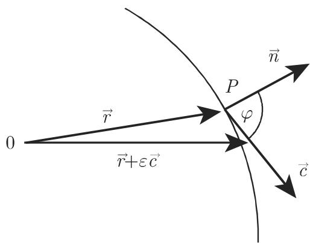
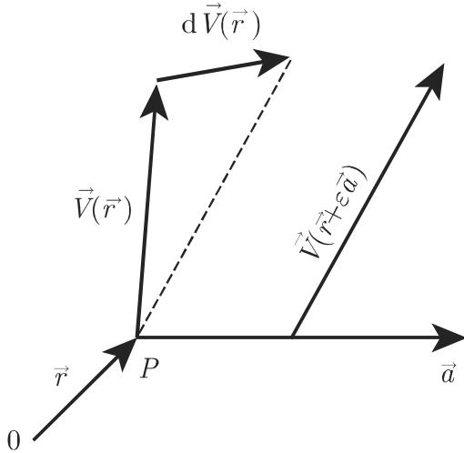

# 数学手册(原书第10版) 13.2.1 方向导数和空间导数

## 概述

本页对应《数学手册(原书第10版)》第 13 章（场论/向量分析）的 13.2.1 节“方向导数和空间导数”，是第 13 章首个入库小节，也是本 wiki 向量分析主题集群的开端（此前入库内容集中于第 12 章泛函分析集群）。全节含三个子节、7 组编号公式 (13.27)–(13.33c)：

- **13.2.1.1 一个标量场的方向导数**（式 13.27–13.29）→ [[concepts/标量场的方向导数]]
- **13.2.1.2 一个向量场的方向导数**（式 13.30–13.32b）→ [[concepts/向量场的方向导数]]
- **13.2.1.3 体积导数**（式 13.33a–13.33c）→ [[concepts/体积导数]]

本节的核心地位是**构造性前导**：体积导数的三步构造（见 [[methodology/体积导数三步构造流程]]）将在 13.2.2 中导出——源文甚至称将“重新定义”——梯度、散度、旋度三大算子；方向导数则为梯度投影公式 (13.29) 提供入口。

## 逐字公式转录

以下照录全节公式（含参数曲面表示式），保留转写疑误原样并加注；逐项复算见 [[findings/式13-27至13-33c方向导数与体积导数转录复算]]：

```latex
r⃗(u,v) = x(u,v) e⃗_x + y(u,v) e⃗_y + z(u,v) e⃗_z

(13.27)  ∂U/∂c⃗ = lim_{ε→0} [U(r⃗ + εc⃗) − U(r⃗)] / ε
(13.28)  ∂U/∂c⃗ = |c⃗| · ∂U/∂c⃗⁰
(13.29)  ∂U/∂c⃗⁰ = ∂U/∂n⃗ cos(c⃗⁰, n⃗) = ∂U/∂n⃗ cos φ = c⃗⁰ · grad U   （见第 926 页的 (13.34)）
(13.30)  ∂V⃗/∂a⃗ = lim_{ε→0} [V⃗(r⃗ + εa⃗) − V⃗(r⃗)] / ε
(13.31)  ∂V⃗/∂a⃗ = |a⃗| · ∂V⃗/∂a⃗⁰
(13.32a) (a⃗·grad) V⃗ = (a⃗·grad V_x) e⃗_x + (a⃗·grad V_y) e⃗_y + (a⃗·grad V_z) e⃗_z
(13.32b) (a⃗·grad) V⃗ = ½( rot(V⃗×a⃗) + grad(a⃗·V⃗) + + a⃗ div V⃗ − V⃗ div a⃗
                        − a⃗ × rot V⃗ − V⃗ × rot a⃗ )      【"+ +" 为转写重复符号，公式本身正确】
(13.33a) dS⃗ = (∂r⃗/∂u × ∂r⃗/∂v) du dv
(13.33b) ∯_Σ U dS⃗ ,  ∯_Σ V⃗·dS⃗ ,  ∯_Σ V⃗×dS⃗
(13.33c) lim_{V→0} (1/V) ∯_Σ U dS⃗ ,  lim_{V→0} (1/V) ∯_Σ V⃗·dS⃗ ,  lim_{V→0} (1/V) ∯_Σ V⃗×dS⃗
```

## 核心主张与复算结论

各项主张仅归属于其对应主体：

- **标量场方向导数**（[[concepts/标量场的方向导数]]）：(13.27) 差商极限定义成立；(13.28) 关于向量与关于其单位向量的方向导数满足齐性关系，经代换 δ = ε|c⃗| 复算通过。证据强度：强（定义与恒等式）。
- **∂U/∂n⃗ 的最大性（式 13.29）**：由 c⃗⁰·grad U = |grad U| cos φ，φ = 0 时取最大，故沿等值面单位法向量 n⃗（指向 U 增加方向）的方向导数在所有方向中最大。复算通过；但该断言隐含 U 在该点可微——仅方向导数存在不足以保证 (13.29)，此注意事项仅适用于标量场情形。
- **向量场方向导数**（[[concepts/向量场的方向导数]]）：(13.32a) 笛卡尔坐标系分量式正确（基向量为常值）；(13.32b) 一般坐标系不变式经独立推导复算证实（"+ +"应为单个加号），并用算例 V⃗ = (xy, 0, 0)、a⃗ = e⃗_x 验证两侧均为 (y, 0, 0)。证据强度：强，已复算证实。
- **体积导数**（[[concepts/体积导数]]）：三步构造成立；三类极限按给定次序分别导出标量场的梯度（第一类）与向量场的散度（第二类）、旋度（第三类）。前两类经 Gauß 定理复算通过；**第三类在外向定向与标准 rot 约定下等于 −rot V⃗**（分量恒等式 ∯V⃗×dS⃗ = −∫rot V⃗ dV，并经单位立方体算例 V⃗ = (0, x, 0) 验证），而源文本只说“可以导出……旋度”而未标注符号，且全节未规定 dS⃗ 的定向约定。构造性陈述本身证据强，符号细节存疑，待 13.2.2 入库核对（见 [[queries/式13-33c第三类极限与旋度符号关系]]）。该符号疑点仅涉及第三类极限，第一、二类不受影响。

## 单位向量约定

源文本明确约定：“此后，方向导数总是指关于一个单位向量的方向导数。”该约定同时覆盖 13.2.1.1 与 13.2.1.2，是解读后续章节方向导数记号的基准。

## 前向引用与回指

- 式 (13.29) 前向引用第 926 页的 (13.34)（grad U 的定义，属 13.2.2），本节未定义梯度。
- 节末前向提及散度 div V⃗ 与旋度 rot V⃗，称下一节将“详细地讨论这些概念（甚至重新定义它们）”。
- 回指 13.1 的等值面单位法向量 n⃗ 概念。
- 向量曲面元 dS⃗（式 13.33a，见 [[concepts/向量曲面元]]）推断将在 13.3 积分定理中复用。

以上缺口详见 [[queries/13-2-1未入库回指缺口]]。

## 转写质量

本节存在与第 12 章各节同模式的系统性 OCR 讹误（“关千→关于”、向量记号讹为汉字“尸/冗/开”、杂字“门”、“闭曲面江→闭曲面Σ”、多处缺字与“则函”句截断），另有两处语义级疑误：13.2.1.1 第二段“向量场 U”疑应为“标量场 U”；节标题“空间导数”与正文“体积导数”术语不一致。完整清单见 [[queries/13-2-1全节系统性转写讹误清单]]、[[queries/13-2-1-1向量场疑为标量场]]、[[queries/13-2-1节标题空间导数与体积导数术语不一致]]。

## 与现有 Wiki 的联系

- 本源为第 13 章（场论）首个入库来源，现有索引中的 12.4–12.9 泛函分析集群与向量分析无交集，属全新主题集群的开端，不与任何现有页面矛盾（关系性质：扩展）。
- 推断性跨章连接（源内无此表述）：式 (13.27)/(13.30) 的差商极限正是有限维 Gâteaux 型方向导数，与 [[concepts/弗雷歇可微性与弗雷歇导数]]（12.8）构成有限维/无穷维推广关系，详见 [[comparisons/方向导数与弗雷歇导数比较]]。
- [[concepts/勒贝格积分]] 与 [[methodology/勒贝格积分五步构造流程]]（12.9）：体积导数三步构造在方法论上与“极限式构造”平行；(13.33b) 的曲面积分以积分论为前提。

## 插图

本节含两幅示意图，随本页归档：

- 图 13.10（标量场方向导数示意）：`media/10-数学手册原书第10版--14-1321-方向导数和空间导数--1eb9exe/001-f6e81d64bdb6ea367ad4c5df5ca6001be0b6eda1a33d2a26387850a180755489.jpg`
- 图 13.11（向量场方向导数示意）：`media/10-数学手册原书第10版--14-1321-方向导数和空间导数--1eb9exe/002-b29247818c1542f06e6769202dcc4185df7d5410ea62275cf6dc7d58ba1c6725.jpg`

<!-- llm-wiki:embedded-images -->
## Embedded Images

### Document



<!-- llm-wiki:embedded-images -->
