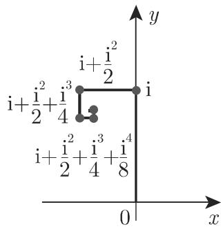
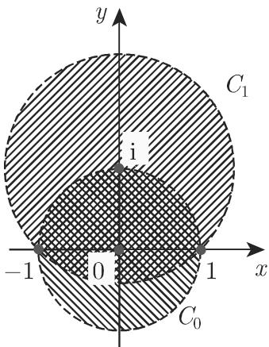
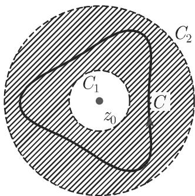
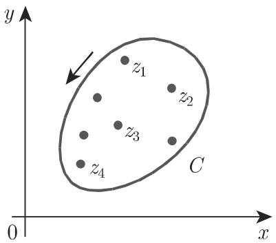

# 数学手册(原书第10版) 14.3 解析函数的幂级数展开

本来源是《数学手册(原书第10版)》第 14 章（复变函数）的 14.3 节，主题为解析函数的幂级数展开。全节自下而上铺开级数理论：复数序列与复项级数的收敛性（14.3.1）→ [[concepts/复项幂级数]] 与 [[concepts/收敛圆与收敛半径]]（14.3.1.3）→ [[concepts/泰勒级数]]（14.3.2）→ [[concepts/解析延拓]]（14.3.3）→ [[concepts/洛朗级数]]（14.3.4）→ 孤立奇点三分类、[[concepts/亚纯函数]]、[[concepts/椭圆函数]]、[[concepts/留数]] 与 [[concepts/留数定理]]（14.3.5）。本节为 14.1.2 建立的 [[concepts/解析函数]] 概念补上幂级数刻画：区域 G 内解析 ⟺ 对任意 z₀ ∈ G 可唯一展开为泰勒级数。

## 小节结构

- **14.3.1 复项级数的收敛性**：14.3.1.1 复数序列的收敛性（ε–n₀ 定义；$\lim_{n\to\infty}\{\sqrt[n]{a}\}=1$，取最小非负辐角的根）；14.3.1.2 复项无穷级数（部分和、绝对/条件收敛、函数项级数）；14.3.1.3 复项幂级数（收敛性、收敛圆、逐项求导与逐项积分）。
- **14.3.2 泰勒级数**：(14.48a–c)。
- **14.3.3 解析延拓原理**：(14.49a/b) 及几何级数算例。
- **14.3.4 洛朗展开式**：(14.50a/b) 及圆环算例。
- **14.3.5 孤立奇点和留数定理**：14.3.5.1 孤立奇点三分类（洛朗负幂判据）；14.3.5.2 亚纯函数；14.3.5.3 椭圆函数；14.3.5.4 留数；14.3.5.5 留数定理。

## 公式转录（14.44–14.55，保留原编号）

```latex
(14.44)  s_n = a_1 + a_2 + ... + a_n                     (n = 1, 2, ...)
(14.45)  f_1(z) + f_2(z) + ... + f_n(z) + ...
(14.46a) P(z - z_0) = a_0 + a_1(z - z_0) + a_2(z - z_0)^2 + ... + a_n(z - z_0)^n + ...
(14.46b) P(z) = a_0 + a_1 z + a_2 z^2 + ... + a_n z^n + ...
(14.47)  r = 1 / lim_{n→∞} ⁿ√|a_n|    或    r = lim_{n→∞} |a_n / a_{n+1}|
(14.48a) f(z) = Σ_{n=0}^∞ a_n (z - z_0)^n                （泰勒级数）
(14.48b) a_n = f^{(n)}(z_0) / n!
(14.48c) f(z) = f(z_0) + f'(z_0)/1!·(z - z_0) + f''(z_0)/2!·(z - z_0)^2 + ...
               + f^{(n)}(z_0)/n!·(z - z_0)^n + ...
(14.49a) f_0(z) = Σ_{n=0}^∞ a_n (z - z_0)^n ,   f_1(z) = Σ_{n=0}^∞ b_n (z - z_1)^n
(14.49b) f_0(z) = f_1(z)        （在收敛圆 K_0 与 K_1 的公共区域内）
(14.50a) f(z) = Σ_{n=-∞}^∞ a_n (z - z_0)^n
          = ... + a_{-k}/(z - z_0)^k + ... + a_{-1}/(z - z_0) + a_0 + a_1(z - z_0) + a_2(z - z_0)^2 + ...
(14.50b) a_n = (1/2πi) ∮_C f(ζ)/(ζ - z_0)^{n+1} dζ       (n = 0, ±1, ±2, ...)
(14.51)  f(z) = Σ_{n=-∞}^∞ a_n (z - z_0)^n
(14.52)  a_n = (1/2πi) ∮_K (ζ - z_0)^{-n-1} f(ζ) dζ = f^{(n)}(z_0)/n!    (n = 0, 1, 2, ...)
(14.53)  f(z + mω_1 + nω_2) = f(z)    (m, n = 0, ±1, ±2, ...; Im(ω_1/ω_2) ≠ 0)
(14.54a) Res f(z)|_{z=z_0} = a_{-1} = (1/2πi) ∮_K f(ζ) dζ
(14.54b) Res f(z)|_{z=z_0} = lim_{z→z_0} [1/(m-1)!]·d^{m-1}/dz^{m-1} [f(z)(z - z_0)^m]
(14.54c) Res [φ(z)/ψ(z)]|_{z=z_0} = φ(z_0)/ψ'(z_0)      （ψ(z_0)=0, ψ'(z_0)≠0）
(14.55)  ∮_C f(z) dz = 2πi Σ_{k=0}^n Res f(z)|_{z=z_k}
```

两个完整算例的结构化转录：

```latex
【洛朗算例】在围绕 z_0 = 0 的圆环 1 < |z| < 2 中：
f(z) = 1/((z-1)(z-2)) = -1/(z(1-1/z)) - 1/(2(1-z/2))
     = -Σ_{n=1}^∞ 1/z^n  -  (1/2)Σ_{n=0}^∞ (z/2)^n
     = Σ_{n=-∞}^∞ a_n z^n,
其中 a_n = -1 (n = -1, -2, ...),  a_n = -1/2^{n+1} (n = 0, 1, 2, ...)

【留数定理算例】K 为以原点为心、半径 r > 1 的圆周，z_{1,2} = ±i：
∮_K e^z/(z^2+1) dz = 2πi (e^{z_1}/(2z_1) + e^{z_2}/(2z_2))
                   = 2πi (e^i/(2i) - e^{-i}/(2i)) = 2πi sin 1
```

## 算例复算结论（均经独立复算核验通过）

- 例 A $\sum \mathrm{i}^n/n$：绝对值级数为调和级数发散而级数本身收敛 ⟹ 条件收敛；例 B $\sum \mathrm{i}^n/2^{n-1}$ 绝对收敛。
- $\sum_{n\ge1} z^n/n$：$r=1$；$z=1$ 调和发散，$z=-1$ 由莱布尼茨准则（回指第 621 页 7.2.3.3）收敛，单位圆上除 $z=1$ 外均收敛。
- 解析延拓例：$f_0(z)=\sum z^n$（$z_0=0$，$r_0=1$）与 $f_1(z)=\frac{1}{1-\mathrm{i}}\sum\left(\frac{z-\mathrm{i}}{1-\mathrm{i}}\right)^n$（$z_1=\mathrm{i}$，$r_1=\sqrt2$）在各自收敛圆内都以 $f(z)=1/(1-z)$ 为和。
- $\frac{1}{2}(z+1/z)$ 在 $z=0$ 有一阶极点；$e^{1/z}=\sum\frac{1}{n!}z^{-n}$ 在 $z=0$ 有本质奇点。
- 留数定理例：$\oint_K \frac{e^z}{z^2+1}\,\mathrm{d}z = 2\pi\mathrm{i}\sin 1$。

逐式复算记录见 findings 页：
[[findings/式14-44至14-47复项级数幂级数与收敛半径转录复算]]、[[findings/式14-48a至14-48c泰勒级数转录复算]]、[[findings/式14-49a至14-49b解析延拓与几何级数例转录复算]]、[[findings/式14-50a至14-50b洛朗级数及圆环算例转录复算]]、[[findings/式14-51至14-53奇点分类亚纯与椭圆函数转录复算]]、[[findings/式14-54a至14-55留数公式与留数定理算例转录复算]]。

## 插图登记（内容未随文转写）

媒体根目录：`media/10-数学手册原书第10版--14-143-解析函数的幂级数展开--1bv2uud/`

- 图 14.39（14.3.1.1 复数序列收敛的 ε-圆盘图示）：`001-d1a1e93b5c7e8b36dc73d960ddba4b4147072237132ddc486410456a782805b1.jpg`
- 图 14.40（14.3.1.2 例 A、B 的部分和折线）：`002-3c641ac005da4ca65ebbbdade5917c849856f2ec75d99852f3b9226196c9443b.jpg`
- 图 14.41（14.3.2 泰勒级数在区域 G 中的收敛圆）：`003-f27b2ada3586c629e0ad7e9191a799cb08a71f03916e7d9fc497d9e274f59697.jpg`
- 图 14.42（14.3.3 两收敛圆 K₀、K₁ 及其公共区域，双重阴影）：`004-321ad7056de1e49d9596bcb4127d1e67fc6283e2202cf3da18de73bfc9f9af14.jpg`
- 图 14.43（14.3.4 洛朗展开的圆环与闭曲线 C）：`005-e2848dfc7c697aeed98acba057975c0e4dea53995301681b665429d21d9b2fe9.jpg`
- 图 14.44（14.3.5.5 留数定理的闭曲线 C 与内部奇点）：`006-5c0bd57540ed7531d8cd127059ba8c2904d4bae41d20f7947b82b311123dabbb.jpg`
- 图 14.45（转写文本中未见显式引用，随图 14.44 一并置于节末）：`007-324ed3f4430f85633dced8804d2efc36cdf079fa4c79716212769702b7011252.jpg`

## 转写讹误与实质存疑

本节转写讹误密度与既往各节相当，且成批脱落数学符号（$\varepsilon$、$z$、$G$、$C$、$K$、$m$、$2\pi\mathrm{i}$、数字 1 等），系统清单见 [[queries/14-3全节系统性转写讹误清单]]。三处实质性存疑单独立案：

- (14.50b) 圆环条件转写为 $r_1<|z|<r_2$，疑缺 $-z_0$：[[queries/式14-50b圆环条件疑缺z减z0]]
- (14.52) 称系数“由柯西积分定理给出”，疑应为柯西积分公式：[[queries/式14-52柯西积分定理与积分公式术语之辨]]
- 14.3.2 “收敛圆是完全属于 G 的最大圆”仅为半径下界：[[queries/14-3-2泰勒收敛圆与G内切圆仅为下界之辨]]

另：14.3.5.4 出现中译本译者注（$f=\varphi/\psi$ 为一阶极点需附加 $\varphi(z_0)\neq 0$），源流考据时应区分原文与译注。

## 与既有维基的联系

- 直接延伸 [[concepts/解析函数]] 与 [[concepts/柯西-黎曼微分方程]]（14.1.2）：解析性在此获得幂级数刻画。
- 深化 [[concepts/解析函数的奇点]] 与 [[comparisons/三类奇点比较]]：14.3.5.1 提供洛朗主部这一判据性分类，并补充趋近行为（极点处 $|f|\to\infty$，本质奇点处 $f$ 任意接近任一复数 $c$），亦为 [[queries/奇点术语双重用法之辨]] 提供新证据（本节“奇点”明确指孤立奇点）。
- 回指缺口：14.2（积分定理）、7.2.3.3（莱布尼茨准则）、14.5.2、14.6 均未入库，见 [[queries/14-3未入库回指缺口]]。

## 配套 methodology 与 comparisons

- [[methodology/圆环上洛朗展开的部分分式几何级数法]]、[[methodology/留数三公式选用流程]]
- [[comparisons/泰勒级数与洛朗级数比较]]、[[comparisons/留数三种计算公式比较]]

<!-- llm-wiki:embedded-images -->
## Embedded Images

### Document








<!-- llm-wiki:embedded-images -->
