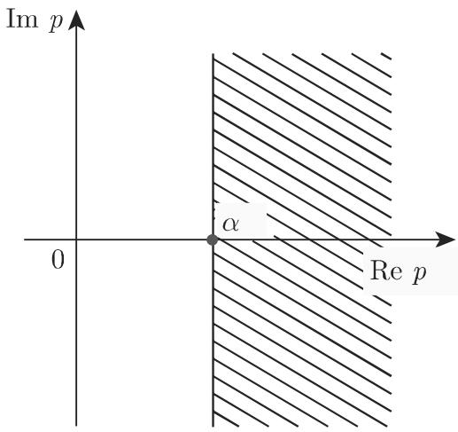
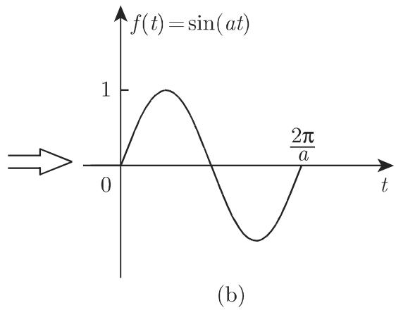
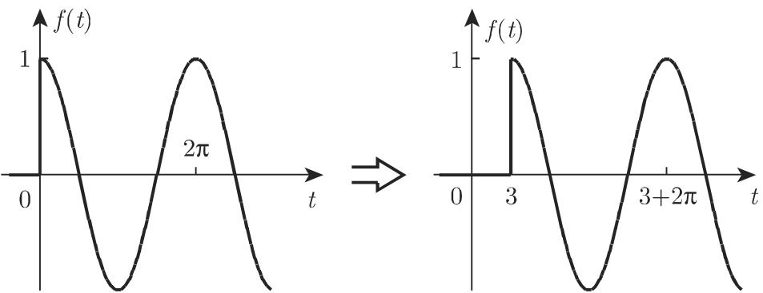
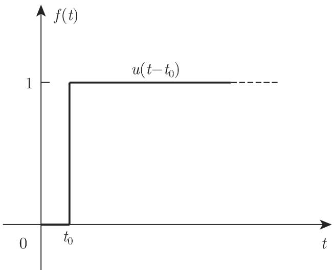
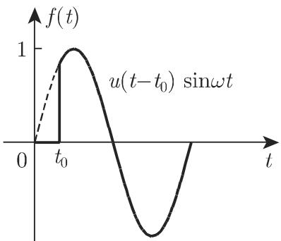
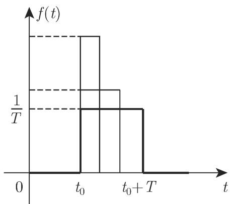
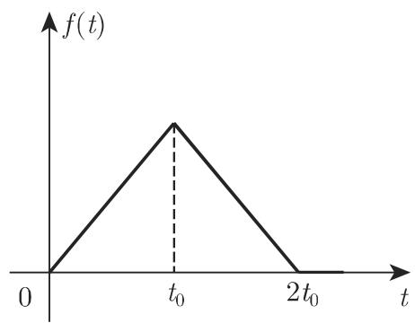
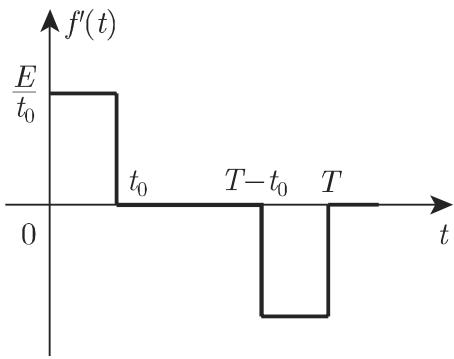
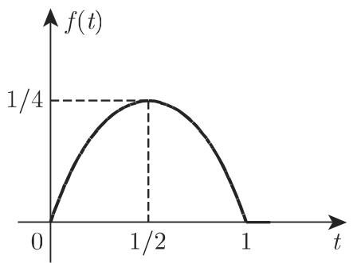

# 数学手册(原书第10版) 15.2.1 拉普拉斯变换的性质

## 文献与位置

本页对应《数学手册(原书第10版)》15.2.1 节，是该书第 15 章（积分变换）进入本 wiki 的首份来源；此前入库的仅有 13.x 与 14.x 各节。文档标识 `14-1521-拉普拉斯变换的性质--o3w7ds`；正文附图 15.2–15.18 共 20 幅插图（媒体目录 `media/10-数学手册原书第10版--14-1521-拉普拉斯变换的性质--o3w7ds/`），图内文字不可转录，本页以公式与正文为准。全节四个小节：15.2.1.1 定义与收敛、15.2.1.2 运算规则、15.2.1.3 特殊函数的变换、15.2.1.4 狄拉克 δ 函数及其分布。

## 15.2.1.1 定义、收敛性与逆变换（式 15.5–15.8）

设 $f(t)$ 为实变量 $t$ 的函数（转写中变量名缺损），若广义积分

$$
\mathcal{L}\{f(t)\}=\int_0^\infty e^{-pt}f(t)\,dt=F(p)\tag{15.5}
$$

存在，则定义了复变量 $p$ 的函数 $F(p)$。$f(t)$ 称为原函数，$F(p)$ 称为 $f(t)$ 的拉普拉斯变换；$F(p)$ 的定义域称为像空间。存在性条件：$f(t)$ 当 $t\geqslant0$ 时分段光滑，且对特定常数 $K>0,\alpha>0$，当 $t\to\infty$ 时 $|f(t)|\leqslant Ke^{\alpha t}$。

文献变体（瓦格纳或拉普拉斯–卡森变换）：

$$
\mathcal{L}_W\{f(t)\}=p\int_0^\infty e^{-pt}f(t)\,dt=pF(p)\tag{15.6}
$$

收敛性与像函数性质：拉普拉斯积分在半平面 $\operatorname{Re}p>\alpha$ 内收敛，$F(p)$ 在该半平面内解析，且

$$
\lim_{\operatorname{Re}p\to\infty}F(p)=0\quad(\text{必要条件})\tag{15.7a}
$$

$$
\lim_{\substack{t\to\infty\\(t\to0)}}f(t)=A\ \Longrightarrow\ \lim_{\substack{p\to0\\(p\to\infty)}}pF(p)=A\tag{15.7b}
$$

（(15.7b) 为初值与终值定理的压缩合写，源书未命名，见 [[concepts/初值与终值定理]]。）逆变换：

$$
\mathcal{L}^{-1}\{F(p)\}=\frac{1}{2\pi i}\int_{c-i\infty}^{c+i\infty}e^{pt}F(p)\,dp=
\begin{cases}f(t),&t>0\\ 0,&t<0\end{cases}\tag{15.8}
$$

积分路径为平行于虚轴的直线 $\operatorname{Re}p=c>\alpha$；若 $f(t)$ 在 $t=0$ 处有跳跃（$\lim_{t\to+0}f(t)\neq0$），积分在该点取值 $\tfrac12 f(+0)$。

## 15.2.1.2 运算规则（式 15.9–15.24，照录）

| 式号 | 规则（含转写编号缺损标注） | 公式 |
|---|---|---|
| (15.9) | 1. 加法或线性法则 | $\mathcal{L}\{\lambda_1 f_1(t)+\cdots+\lambda_n f_n(t)\}=\lambda_1F_1(p)+\cdots+\lambda_nF_n(p)$ |
| (15.10a) | 2. 相似法则 | $\mathcal{L}\{f(at)\}=\frac{1}{a}F\left(\frac{p}{a}\right)$ $(a>0)$ |
| (15.10b) | 2. 相似法则（逆形式） | $\mathcal{L}^{-1}\{F(ap)\}=\frac{1}{a}f\left(\frac{t}{a}\right)$ $(a>0)$ |
| (15.11a) | 3. 平移法则·向右 | $\mathcal{L}\{f(t-a)\}=e^{-ap}F(p)$ |
| (15.11b) | 3. 平移法则·向左 | $\mathcal{L}\{f(t+a)\}=e^{ap}\left[F(p)-\int_0^a e^{-pt}f(t)\,dt\right]$ |
| (15.12) | 4. 频移定理 | $\mathcal{L}\{e^{-bt}f(t)\}=F(p+b)$ |
| (15.13) | 5. 原始空间内的微分（编号转写丢失） | $\mathcal{L}\{f^{(n)}\}=p^nF(p)-f(+0)p^{n-1}-f'(+0)p^{n-2}-\cdots-f^{(n-2)}(+0)p-f^{(n-1)}(+0)$，其中 $f^{(v)}(+0)=\lim_{t\to+0}f^{(v)}(t)$ |
| (15.14) | 5 之推论（展开式） | $\mathcal{L}\{f\}=\frac{f(+0)}{p}+\frac{f'(+0)}{p^2}+\frac{f''(+0)}{p^3}+\cdots+\frac{f^{(n-1)}(+0)}{p^{\,n-1}}+\frac{1}{p^n}\mathcal{L}\{f^{(n)}\}$（倒数第二项分母疑讹，见 [[queries/式15-14倒数第二项分母p的n-1次疑为n次]]） |
| (15.15) | 6. 像空间内的微分（编号转写丢失） | $\mathcal{L}\{t^nf(t)\}=(-1)^nF^{(n)}(p)$ |
| (15.16) | 6. 像空间内的微分 | $\mathcal{L}\{(-1)^nt^nf(t)\}=F^{(n)}(p)$ $(n=1,2,\dots)$ |
| (15.17a) | 7. 原始空间内的积分 | $\mathcal{L}\{\int_0^t d\tau_1\int_0^{\tau_1}d\tau_2\cdots\int_0^{\tau_{n-1}}f(\tau_n)\,d\tau_n\}=\frac{1}{(n-1)!}\mathcal{L}\{\int_0^t(t-\tau)^{n-1}f(\tau)\,d\tau\}=\frac{1}{p^n}F(p)$ |
| (15.17b) | 7. 单积分情形 | $\mathcal{L}\{\int_0^t f(\tau)\,d\tau\}=\frac{1}{p}F(p)$（其后“若初始值为[缺]”条件句缺损） |
| (15.18) | 8. 像空间内的积分（编号转写丢失） | $\mathcal{L}\{f/t^n\}=\int_p^\infty dp_1\int_{p_1}^\infty dp_2\cdots\int_{p_{n-1}}^\infty F(p_n)\,dp_n=\frac{1}{(n-1)!}\int_p^\infty(z-p)^{n-1}F(z)\,dz$；积分路径为始于 $p$ 点、与实轴正半轴成锐角的任意射线 |
| (15.19) | 9. 除法法则 | $\mathcal{L}\{f/t\}=\int_p^\infty F(z)\,dz$；若该积分存在，$\lim_{t\to0}f(t)/t$ 也必须存在 |
| (15.20a) | 10. 对参数的微分 | $\mathcal{L}\{\partial f(t,\alpha)/\partial\alpha\}=\partial F(p,\alpha)/\partial\alpha$ |
| (15.20b) | 10. 对参数的积分 | $\mathcal{L}\{\int_{\alpha_1}^{\alpha_2}f(t,\alpha)\,d\alpha\}=\int_{\alpha_1}^{\alpha_2}F(p,\alpha)\,d\alpha$ |
| (15.21) | 11. 单侧卷积定义 | $f_1*f_2=\int_0^t f_1(\tau)f_2(t-\tau)\,d\tau$ |
| (15.22a–c) | 11. 卷积代数律 | 交换律 $f_1*f_2=f_2*f_1$；结合律 $(f_1*f_2)*f_3=f_1*(f_2*f_3)$；分配律 $(f_1+f_2)*f_3=f_1*f_3+f_2*f_3$ |
| (15.23) | 11. 卷积定理 | $\mathcal{L}\{f_1*f_2\}=F_1(p)\cdot F_2(p)$ |
| (15.24) | 11. 复卷积 | $\mathcal{L}\{f_1\cdot f_2\}=\frac{1}{2\pi i}\int_{x_1-i\infty}^{x_1+i\infty}F_1(z)F_2(p-z)\,dz=\frac{1}{2\pi i}\int_{x_2-i\infty}^{x_2+i\infty}F_1(p-z)F_2(z)\,dz$ |

正弦例（照录）：$\mathcal{L}\{\sin t\}=1/(p^2+1)$，由相似法则得 $\mathcal{L}\{\sin\omega t\}=\frac{1}{\omega}F(p/\omega)=\frac{\omega}{p^2+\omega^2}$。

## 15.2.1.3 特殊函数的变换（式 15.25–15.32）

**阶梯函数**（赫维赛德单位阶梯函数；自回指第 988 页 14.4.3.2,3.）：

$$
u(t-t_0)=\begin{cases}1,&t>t_0\\ 0,&t<t_0\end{cases}\quad(t_0>0)\tag{15.25}
$$

- ■ A: $f(t)=u(t-t_0)\sin\omega t,\ F(p)=e^{-t_0p}\dfrac{\omega\cos\omega t_0+p\sin\omega t_0}{p^2+\omega^2}$（图 15.8）
- ■ B: $f(t)=u(t-t_0)\sin\omega(t-t_0),\ F(p)=e^{-t_0p}\dfrac{\omega}{p^2+\omega^2}$（图 15.9）

**矩形脉冲**（“高度为[缺]、宽度为[缺]”数值转写缺损，按定义应为高度 1、宽度 $T$）：

$$
u_T(t-t_0)=u(t-t_0)-u(t-t_0-T),\qquad
\mathcal{L}\{u_T(t-t_0)\}=\frac{e^{-t_0p}(1-e^{-Tp})}{p}\tag{15.26, 15.27}
$$

**脉冲函数（狄拉克 δ 函数）**（回指第 912 页 12.9.5.4，未入库）：

$$
\delta(t-t_0)=\lim_{T\to0}\frac{1}{T}\left[u(t-t_0)-u(t-t_0-T)\right]\tag{15.28}
$$

$$
\int_a^b h(t)\delta(t-t_0)\,dt=\begin{cases}h(t_0),&t_0\in(a,b)\\ 0,&t_0\notin(a,b)\end{cases}\tag{15.29}
$$

$$
\delta(t-t_0)=\frac{du(t-t_0)}{dt},\qquad \mathcal{L}\{\delta(t-t_0)\}=e^{-t_0p}\quad(t_0\geqslant0)\tag{15.30}
$$

**分段可微函数**：若 $f(t)$ 分段可微且在点 $t_v$ $(v=1,\dots,n)$ 处有跳跃 $a_v$，则

$$
\frac{df}{dt}=f_s'(t)+a_1\delta(t-t_1)+\cdots+a_n\delta(t-t_n)\tag{15.31}
$$

其中 $f_s'(t)$ 是 $f(t)$ 的一般导数（转写“J(t)”为 f(t) 之讹）。源书随后指出：当正式应用 (15.13) 时，在跳跃情况下数值 $f(+0),f'(+0),\cdots$ 应该用[转写缺损；强推断为左极限 $f(-0),f'(-0),\cdots$]代替。

**例题 A–D（照录；例 B 正文整段损毁，仅存残迹）**：

| 例 | 函数 | 导数的 δ 表示（照录/复原） | 变换结果（照录） |
|---|---|---|---|
| A | $f=at+b$ 于 $(0,t_0)$，其余 0 | $f'=a\,u_{t_0}(t)+b\delta(t)-(at_0+b)\delta(t-t_0)$ | $\mathcal{L}\{f\}=\frac{1}{p}\left[\frac{a}{p}+b-e^{-t_0p}\left(\frac{a}{p}+at_0+b\right)\right]$ |
| B | 整段损毁（复原为三角形函数，见 [[queries/例B三角形函数段落损毁之复原]]） | $f''=\delta(t)-2\delta(t-t_0)+\delta(t-2t_0)$（复原） | 残迹 $\mathcal{L}\{f''\}=1-2e^{-t_0p}+e^{-2t_0p}$、$\mathcal{L}\{f\}\propto1/p^2$；复原 $\mathcal{L}\{f\}=(1-e^{-t_0p})^2/p^2$ |
| C | 梯形脉冲（$Et/t_0$、$E$、$-E(t-T)/t_0$ 三段） | $f''=\frac{E}{t_0}[\delta(t)-\delta(t-t_0)-\delta(t-T+t_0)+\delta(t-T)]$ | $\mathcal{L}\{f\}=\frac{E}{t_0}\frac{(1-e^{-t_0p})(1-e^{-(T-t_0)p})}{p^2}$ |
| D | $f=t-t^2$ 于 $(0,1)$，其余 0 | $f''=-2u_1(t)+\delta(t)+\delta(t-1)$ | $\mathcal{L}\{f\}=\frac{1+e^{-p}}{p^2}-\frac{2(1-e^{-p})}{p^3}$ |

**周期函数**：周期为 $T$ 的周期延拓 $f^*(t)$ 的变换等于单周期变换乘周期因子

$$
(1-e^{-Tp})^{-1}\tag{15.32}
$$

- 周期 A（“由例[缺 B]，以周期[缺 $T=2t_0$]”）：$\mathcal{L}\{f^*\}=\frac{(1-e^{-t_0p})^2}{p^2}\cdot\frac{1}{1-e^{-2t_0p}}=\frac{1-e^{-t_0p}}{p^2(1+e^{-t_0p})}$
- 周期 B（“由例[缺 C]”）：$\mathcal{L}\{f^*\}=\frac{E(1-e^{-t_0p})(1-e^{-(T-t_0)p})}{t_0p^2(1-e^{-Tp})}$

## 15.2.1.4 狄拉克 δ 函数及其分布（式 15.33–15.38）

动机（照录大意）：以线性微分方程描述技术系统时，$u(t)$ 与 $\delta(t)$ 常作为扰动/输入函数出现，但 15.2.1.1, 1. 的条件并不满足（$u$ 不连续、$\delta$ 不能在经典分析意义下定义）。解决途径是引入广义函数（分布），最著名的表述之一是施瓦兹引入的连续实线性泛函（回指第 911 页 12.9.5，未入库）。傅里叶系数与傅里叶级数可与周期分布唯一联系，类似于实函数（回指第 633 页 7.4，未入库）。

**1. δ 函数的近似**（小节标题“δ 函数”“的 n 阶导数”等字在转写中缺损）：

$$
f(t,\varepsilon)=\begin{cases}1/\varepsilon,&|t|<\varepsilon/2\\ 0,&|t|\geqslant\varepsilon/2\end{cases}\tag{15.33a}
$$

$$
f(t,\varepsilon)=\frac{1}{\varepsilon\sqrt{2\pi}}e^{-t^2/2\varepsilon^2}\quad(\varepsilon>0,\ \text{误差曲线，回指第 94 页 2.6.3})\tag{15.33b}
$$

$$
f(t,\varepsilon)=\frac{\varepsilon/\pi}{t^2+\varepsilon^2}\quad(\varepsilon>0,\ \text{洛伦兹函数，回指第 123 页 2.11.2})\tag{15.33c}
$$

三条共性：

$$
\int_{-\infty}^{\infty}f(t,\varepsilon)\,dt=1\tag{15.34a}
$$

$$
f(-t,\varepsilon)=f(t,\varepsilon)\ (\text{偶函数})\tag{15.34b}
$$

$$
\lim_{\varepsilon\to0}f(t,\varepsilon)=\begin{cases}\infty,&t=0\\ 0,&t\neq0\end{cases}\tag{15.34c}
$$

**2. δ 函数的性质**：

$$
\int_{x-a}^{x+a}f(t)\delta(x-t)\,dt=f(x)\quad(f\ \text{连续},\,a>0)\tag{15.35}
$$

$$
\delta(\alpha x)=\frac{1}{\alpha}\delta(x)\quad(\alpha>0)\tag{15.36}
$$

$$
\delta(g(x))=\sum_{i=1}^n\frac{1}{|g'(x_i)|}\delta(x-x_i),\quad g(x_i)=0,\ g'(x_i)\neq0\ (i=1,2,\dots,n)\tag{15.37}
$$

（须考虑 $g(x)$ 的所有根，且它们必须是单根。）

$$
f^{(n)}(x)=\int_{x-a}^{x+a}f^{(n)}(t)\delta(x-t)\,dt\tag{15.38a}
$$

$$
(-1)^n f^{(n)}(x)=\int_{x-a}^{x+a}f(t)\,\delta^{(n)}(x-t)\,dt\tag{15.38b}
$$

（(15.38b) 由 (15.38a) 重复 $n$ 次分部积分得到。）

## 转录质量与已知缺损

本节转写质量为全书已入库各节中最差之一，共识别 12 类缺损（详见 [[queries/15-2-1全节系统性转写讹误清单]]）：定义段变量名缺失、“于”字批量讹作“千”、(15.9) 前衍字“丛”、规则编号 5/6/8 丢失、(15.17b) 与 (15.18) 后条件句缺损、(15.26) 高度宽度数值缺失、(15.31) 后“J(t)”讹与初值代替句缺损、例 B 整段损毁（已复原）、周期例指代缺失、15.2.1.4 标题“8(t)”=δ(t) 之讹及“δ”“n”字缺失。数学内容层面仅 (15.14) 一处实质疑点（[[queries/式15-14倒数第二项分母p的n-1次疑为n次]]）。

## 与既有 wiki 的连接

- **直接扩写**：[[concepts/阶梯函数]]、[[concepts/矩形脉冲]]（源自 [[sources/10-数学手册原书第10版--13-144-用复积分计算实积分--sa2nfv]]）；本节 (15.25)–(15.27) 为同一对象补足变换域刻画，且书内自回指第 988 页 14.4.3.2,3.，回指可闭合。
- **第 14 章复分析工具的下游应用**：(15.8) 与 (15.24) 均为沿垂直线的复积分，可调用 [[concepts/复定积分]]、[[concepts/柯西积分定理]]、[[concepts/留数定理]]；“$F(p)$ 在半平面解析”扩展 [[concepts/解析函数]] 的应用场景。
- **范畴扩展**：本节是第 15 章（积分变换）首份入库来源；对 15.3.1.3（双侧卷积）的前向引用预示后续衔接，见 [[queries/15-2-1未入库回指缺口]]。
- **非连接警示**：13.5 节的 [[concepts/拉普拉斯微分方程]] 与本节仅共享“Laplace”人名，无数学关联，不应建立跨链。

## 相关页面

- 概念：[[concepts/拉普拉斯变换]]、[[concepts/拉普拉斯逆变换]]、[[concepts/初值与终值定理]]、[[concepts/拉普拉斯-卡森变换]]、[[concepts/拉普拉斯变换的运算规则]]、[[concepts/卷积与卷积定理]]、[[concepts/复卷积]]、[[concepts/狄拉克δ函数]]、[[concepts/分布（广义函数）]]、[[concepts/周期函数的拉普拉斯变换]]、[[concepts/阶梯函数]]、[[concepts/矩形脉冲]]
- 方法：[[methodology/分段函数拉普拉斯变换的δ导数法]]、[[methodology/卷积定理求逆变换流程]]
- 复算：[[findings/式15-5至15-8定义收敛与逆变换转录复算]]、[[findings/式15-9至15-24运算规则转录复算]]、[[findings/式15-25至15-32特殊函数与例题转录复算]]、[[findings/式15-33至15-38δ函数近似与性质转录复算]]
- 比较与问题：[[comparisons/阶梯函数矩形脉冲与δ函数构造关系比较]]、[[comparisons/δ函数三种近似比较]]、[[queries/15-2-1全节系统性转写讹误清单]]、[[queries/15-2-1未入库回指缺口]] 等 6 页 query

<!-- llm-wiki:embedded-images -->
## Embedded Images

### Document

<!-- llm-wiki:embedded-images -->
