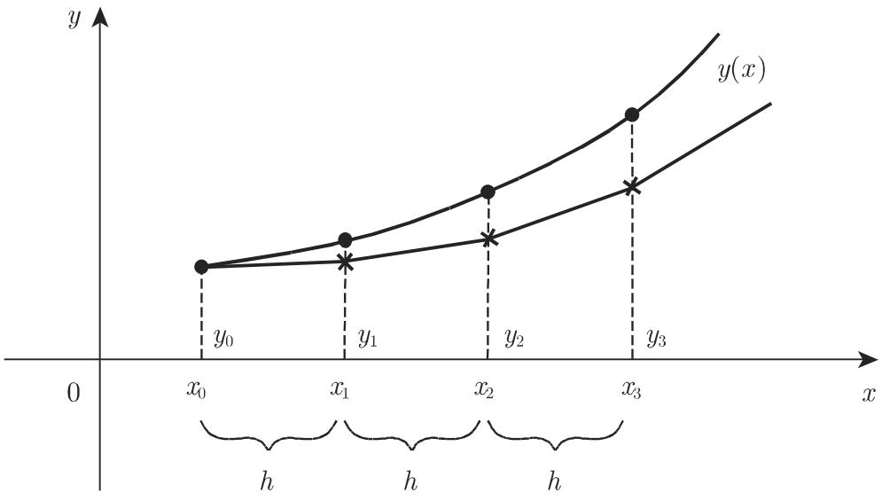

# 数学手册(原书第10版) 19.4 常微分方程的近似积分

本节论述常微分方程的数值解法。源文指出：在许多情况下，常微分方程的解不能表示成已知基本函数的表达式；解在更一般的情形下存在（参见 9.1.1.1，未入库），必须用数值方法确定，这些方法仅是特殊解法但可能达到高精度。由于高于一阶的微分方程可能是初值问题或边值问题，本节分别发展了两类方法：19.4.1 初值问题（欧拉多边形法、龙格—库塔法、多步法、预估—校正法，及收敛性/相容性/稳定性/刚性），19.4.2 边值问题（差分法、函数逼近、打靶法）。公式编号 (19.93)–(19.135)。

## 19.4.1 初值问题

公共框架（见 [[concepts/常微分方程初值问题]]）：

```latex
(19.93)  y' = f(x, y),   y(x_0) = y_0
(19.94)  x_i = x_0 + i h   (i = 0, 1, 2, \dots)   （预先给定步长的等距插值节点）
```

### 19.4.1.1 欧拉多边形法

由积分表达式 (19.95) 出发，单步以矩形近似 (19.96)，推广为欧拉折线法（见 [[concepts/欧拉多边形法]]、[[entities/欧拉]]）：

```latex
(19.95)  y(x) = y_0 + \int_{x_0}^{x} f(x, y(x))\, dx
(19.96)  y(x_1) = y_0 + \int_{x_0}^{x_0+h} f(x,y(x))\,dx \approx y_0 + h f(x_0, y_0) = y_1
(19.97)  y_{i+1} = y_i + h f(x_i, y_i)   (i = 0,1,2,\dots; y(x_0) = y_0)
(19.98)  y(x_1) = y(x_0+h) = y_0 + f(x_0,y_0)h + \frac{y''(\xi)}{2} h^2,  x_0 < \xi < x_0+h
```

对比 (19.96) 与泰勒展开 (19.98) 表明近似值 y₁ 具有 h² 阶误差；源文称实际计算表明步长减半可使误差减半。几何解释见图 19.5（折线沿解曲线切线方向推进）：



转录注：源文此处将初值问题误引为 "(19.33)"，应为 (19.93)，见 [[queries/式19-95前回指19-33疑为19-93之辨]]。

### 19.4.1.2 龙格—库塔法

源文思路：方程在每点 (x₀, y₀) 确定解曲线的切线方向；欧拉法沿该方向推进；龙格—库塔法在 (x₀, y₀) 与下一个可能的点 (x₀+h, y₁) 之间考虑更多“辅助点”，适当选取附加点以得到更准确的 y₁。依赖辅助点的数目与排列有不同阶的龙格—库塔法；本节给出四阶方法，并明言“欧拉法是一阶龙格—库塔法”。

四阶计算格式 (19.99)（逐字转录）：

| x | y | k = h·f(x, y) |
|---|---|---|
| x₀ | y₀ | k₁ |
| x₀ + h/2 | y₀ + k₁/2 | k₂ |
| x₀ + h/2 | y₀ + k₂/2 | k₃ |
| x₀ + h | y₀ + k₃ | k₄ |
| x₁ = x₀ + h | y₁ = y₀ + 1/6(k₁ + 2k₂ + 2k₃ + k₄) | |

源文断言：每一步的误差为 h⁵ 阶，适当选取步长可得到高精度。

算例（源文给出，本维基已独立复算通过）：y′ = ¼(x² + y²)，y(0) = 0，单步 h = 0.5 求 y(0.5)：

| x | y | k = (1/8)(x² + y²) |
|---|---|---|
| 0 | 0 | 0 |
| 0.25 | 0 | 0.00781250 |
| 0.25 | 0.00390625 | 0.00781441 |
| 0.5 | 0.00781441 | 0.03125763 |
| 0.5 | y₁ = 0.01041858（源文称准确值 0.01041860） | |

三条注记：(1) 对特殊方程 y′ = f(x)，龙格—库塔法化为辛普森公式（参见 19.3.2.3，未入库）；(2) 步长改变可由原步长重复加倍的精度检验决定，R₂(h) ≈ (1/15)[y₂(h) − y₂(2h)]（式 19.100，文献 [19.31]）；(3) 高阶常微分方程可写成一阶方程组，依据 (19.99) 尽管方程相互关联，计算可以并行进行（文献 [19.31]）。

详见 [[concepts/龙格—库塔法（四阶）]]、[[entities/龙格]]、[[entities/库塔]]。

### 19.4.1.3 多步法

欧拉法与龙格—库塔法仅从 y_i 计算 y_{i+1}，故均为单步法。一般线性多步法（见 [[concepts/多步法（线性多步法）]]）：

```latex
(19.101)  y_{i+k} + \alpha_{k-1} y_{i+k-1} + \dots + \alpha_1 y_{i+1} + \alpha_0 y_i
          = h(\beta_k f_{i+k} + \beta_{k-1} f_{i+k-1} + \dots + \beta_1 f_{i+1} + \beta_0 f_i),  \alpha_k = 1
```

β_k = 0 时右端仅含已知值，称为显式的；β_k ≠ 0 时两端都需求新值 y_{i+k}，称为隐式的。k 步法中 k 个初值 y₀,…,y_{k−1} 必须已知，可由单步法求得。推导路线：导数由差分公式代替（参见 9.1.1.5，未入库），或积分 (19.95) 由求积公式近似（参见 19.3.1，未入库）。三个特例：

```latex
(19.102)  y_{i+2} - y_i = 2h f_{i+1}                                    （中点法则，显式）
(19.103)  y_{i+2} - y_i = \frac{h}{3}(f_i + 4f_{i+1} + f_{i+2})          （米尔恩法则，隐式）
(19.104)  y_{i+k} - y_{i+k-1} = \sum_{j=0}^{k-1}\Big[\int_{x_{i+k-1}}^{x_{i+k}} L_j(x)\,dx\Big] f(x_{i+j}, y_{i+j})
          = h \sum_{j=0}^{k-1} \beta_j f(x_{i+j}, y_{i+j})                （亚当斯—巴什福思法则，显式）
```

其中 (19.102) 以割线斜率代替 y′(x_{i+1})；(19.103) 中积分由辛普森公式近似；(19.104) 基于插值节点 x_i,…,x_{i+k−1} 的拉格朗日插值多项式（参见 19.6.1.2，未入库），系数 β_j 的计算见 [19.4]。转录注：源文“若 α₀+β₀≠0 公式 (19.101)步法”一句脱文，见 [[queries/式19-101后k步法判据句脱文之辨]]。

### 19.4.1.4 预估—校正法

源文断言：隐式多步法相较于显式多步法有很大的优越性，因为相同精度下隐式法允许大得多的步长；但隐式法通常需要求解非线性方程。由 (19.101) 可得（见 [[concepts/预估—校正法]]）：

```latex
(19.105)  y_{i+k} = h \sum_{j=0}^{k} \beta_j f_{i+j} - \sum_{j=0}^{k-1} \alpha_j y_{i+j} = F(y_{i+k})
(19.106)  y_{i+k}^{(\mu+1)} = F(y_{i+k}^{(\mu)})   (\mu = 0,1,2,\dots)
(19.107a) y_{i+1}^{(0)} = y_i + \frac{h}{12}(5f_{i-2} - 16f_{i-1} + 23f_i)
(19.107b) y_{i+1}^{(\mu+1)} = y_i + \frac{h}{12}(-f_{i-1} + 8f_i + 5f_{i+1}^{(\mu)})   (\mu = 0,1,\dots)
(19.108a) y_{i+1}^{(0)} = y_{i-2} + 9y_{i-1} - 9y_i + 6h(f_{i-1} + f_i)
(19.108b) y_{i+1}^{(\mu+1)} = y_{i-1} + \frac{h}{3}(f_{i-1} + 4f_i + f_{i+1}^{(\mu)})   (\mu = 0,1,\dots)
(19.109)  y_{i+1}^{(\mu+1)} = 0.9 y_{i-1} + 0.1 y_i + \frac{h}{24}(0.1 f_{i-2} + 6.7 f_{i-1} + 30.7 f_i + 8.1 f_{i+1}^{(\mu)})
```

求解 (19.105) 需迭代：显式公式确定初值 y_{i+k}^{(0)}（预估子），再用迭代公式校正（校正子）。源文明言：辛普森公式作为 (19.108b) 中的校正在数值上是不稳定的，可被替换为 (19.109)。

### 19.4.1.5 收敛性、相容性、稳定性

```latex
(19.110)  y_{i+1} = y_i + h F(x_i, y_i, h)   (i = 0,1,2,\dots; y_0 给定)   （增长函数/顺向函数 F）
(19.111)  g(x,h) = y(x,h) - y(x) = O(h^p)                     （整体离散误差；p 阶收敛）
(19.112)  l(x,h) = \frac{y(x+h) - y(x)}{h} - F(x,y,h) = O(h^p)   （局部离散误差；p 阶相容）
(19.113)  \lim_{h\to 0} F(x,y,h) = f(x,y)
(19.114)  |\tilde y(x) - y(x)| \leqslant |\tilde y_0 - y_0|      （问题对初值扰动稳定）
(19.115)  y' = \lambda y,  y(x_0) = y_0  (\lambda \leqslant 0 为常数)   （线性试验问题）
(19.116)  |y_i| \leqslant |y_0|                     （方法绝对稳定）
(19.117)  y(x) = C_1 e^{\lambda_1 x} + C_2 e^{\lambda_2 x}  (\lambda_1, \lambda_2 < 0,\ |\lambda_1| \ll |\lambda_2|)
```

阶的归属：欧拉法 (19.97) 一阶收敛、一阶相容（p = 1）；龙格—库塔法 (19.99) 四阶收敛、四阶相容（p = 4）。h→0（h = (x−x₀)/n）时近似解收敛到准确解。实施权衡：舍入误差 O(1/h) 加到整体离散误差 O(h^p) 上，因此需要选择一个不太小的有限步长。欧拉法用于 (19.115) 得 y_{i+1} = (1+λh)y_i，|1+λh| ⩽ 1 ⟺ −2 ⩽ λh ⩽ 0。刚性方程：解由递减指数项组成（例 λ₁ = −1, λ₂ = −1000），含 λ₂ 的项对解无显著影响但制约步长 h 的选取，须选特殊方法（见 [19.29], [19.6]）。观察：本节未陈述“相容+稳定 ⟹ 收敛”型等价定理。

详见 [[concepts/整体离散误差与收敛性]]、[[concepts/局部离散误差与相容性]]、[[concepts/对初值扰动的稳定性与绝对稳定性]]、[[concepts/刚性微分方程]]。

## 19.4.2 边值问题

模型问题（19.118，见 [[concepts/常微分方程边值问题]]）：

```latex
(19.118)  y''(x) + p(x)y'(x) + q(x)y(x) = f(x)  (a \leqslant x \leqslant b),  y(\alpha)=\alpha,\ y(\beta)=\beta
```

边界条件记号疑为 y(a)=α、y(b)=β，见 [[queries/边界条件yα等于α之α疑为a之辨]]。源文称所给方法也适于求解高阶微分方程边值问题。

### 19.4.2.1 差分法

区间 [a,b] 以等距节点 x_ν = x₀ + νh（x₀ = a, x_n = b）等分，内部节点以有限差分代替导数（均为 O(h²) 误差）：

```latex
(19.119)  y''(x_\nu) + p(x_\nu)y'(x_\nu) + q(x_\nu)y(x_\nu) = f(x_\nu)   (\nu = 1,2,\dots,n-1)
(19.120a) y'(x_\nu) \approx y'_\nu = \frac{y_{\nu+1} - y_{\nu-1}}{2h}
(19.120b) y''(x_\nu) \approx y''_\nu = \frac{y_{\nu+1} - 2y_\nu + y_{\nu-1}}{h^2}
```

结合边界条件 y₀ = α、y_n = β 得关于 n−1 个内部未知量 y_ν 的线性方程组；边界条件含导数时亦须差分化。微分方程组的特征值问题（参见 9.1.3.2，未入库）可类似处理，化为矩阵特征值问题（参见 4.6，未入库）。

特征值算例（源文给出，复算通过）：y″ + λ²y = 0，y(0) = y(1) = 0，三内点 h = 1/4，差分方程 y_{ν+1} − 2y_ν + y_{ν−1} + h²λ²y_ν = 0 给出

```latex
(-2 + \lambda^2/16) y_1 + y_2 = 0
y_1 + (-2 + \lambda^2/16) y_2 + y_3 = 0
y_2 + (-2 + \lambda^2/16) y_3 = 0
```

系数行列式为零 ⟹ λ₁² = 9.37, λ₂² = 32, λ₃² = 54.63；源文告警：这些特征值中只有最小的一个接近相应的真值 9.87。精度改进三途径：减小 h；导数的高阶逼近；应用多步法。非线性边值问题 ⟹ 非线性方程组（参见 19.2.2，未入库）。详见 [[concepts/差分法（边值问题）]]。

### 19.4.2.2 用已知函数逼近

```latex
(19.121)  y(x) \approx g(x) = \sum_{i=1}^{n} a_i g_i(x)
(19.122)  \varepsilon(x; a_1,\dots,a_n) = g''(x) + p(x)g'(x) + q(x)g(x) - f(x)   （亏量）
(19.123)  \varepsilon(x_\nu; a_1,\dots,a_n) = 0  (\nu = 1,\dots,n),\ a < x_1 < \dots < x_n < b   （配置法）
(19.124)  F(a_1,\dots,a_n) = \int_a^b \varepsilon^2(x; a_1,\dots,a_n)\,dx         （最小二乘法）
(19.125)  \frac{\partial F}{\partial a_i} = 0   (i = 1,\dots,n)
(19.126)  \int_a^b \varepsilon(x; a_1,\dots,a_n)\, g_i(x)\,dx = 0   (i = 1,\dots,n)   （伽辽金法）
(19.127)  I[y] = \int_a^b H(x, y, y')\,dx   （里茨法，变分积分，见 (10.4)，未入库）
(19.128)  \frac{\partial I}{\partial a_i} = 0   (i = 1,\dots,n)
(19.129)  -[p(x)y'(x)]' + q(x)y(x) = f(x),  y(\alpha)=\alpha,\ y(\beta)=\beta
(19.130)  I[y] = \int_a^b [p(x)y'^2(x) + q(x)y^2(x) - 2f(x)y(x)]\,dx = \min
(19.131)  g(x) = g_0(x) + \sum_{i=1}^{n} a_i g_i(x)
(19.132)  g_i(a) = g_i(b) = 0   (i = 1,\dots,n)
(19.133)  g_0(x) = \alpha + \frac{\beta-\alpha}{b-a}(x-a)
```

四原则均得到未知系数的线性方程组。源文断言：在关于 p, q, f, y 的一定条件下，自伴边值问题 (19.129) 与变分问题 (19.130) 等价；对 (19.129) 由 (19.130) 立即得到 H(x,y,y′)。代替 (19.121) 常考虑 (19.131)：g₀ 满足边值、g_i 满足齐次边界条件 (19.132)；对 (19.118) 适当的选择是线性函数 (19.133)。非线性边值问题所得非线性方程组用 19.2.2（未入库）方法求解。

详见 [[concepts/亏量（残量）]]、[[concepts/配置法]]、[[concepts/最小二乘法（亏量极小化）]]、[[concepts/伽辽金法]]、[[concepts/里茨法]]、[[concepts/边值问题与变分问题等价性]]。

### 19.4.2.3 打靶法

单目标打靶法：以初始斜率参数 s 构造初值问题 (19.134)，其解 y = y(x,s) 满足第一个边界条件 y(a,s) = α；s 由第二个边界条件确定，即求 F(s) = 0（式 19.135）。源文明确指出：试位法（割线法）就是适当的求解方法；每个参数 s 的函数值计算都需求解初值问题 (19.134) 直到 x = b（即用 19.4.1 的方法）。多目标打靶法：积分区间 [a,b] 分为子区间，每个子区间上用单目标打靶法，须保证子区间端点连续过渡（要求更多条件）；大多用于非线性边值问题，见 [19.31]。详见 [[concepts/打靶法]]。

## 复算验证状态

- **RK4 算例**：复算通过。k₂ = 0.0078125、k₃ = 0.0078144074、k₄ = 0.0312576331，y₁ = 0.06251145/6 = 0.010418575 ≈ 0.01041858；“准确值”经幂级数独立验证（x³/12 + x⁷/4032 + ⋯ ≈ 0.010418605）。
- **(19.107a,b)**：复确认为标准 Adams 三阶预估—校正对（命名系本维基推断，源文未冠名）。
- **(19.108a)、(19.109)**：经对 y = 1, x, x², x³, x⁴ 的精确性检验均为四阶格式。
- **欧拉绝对稳定区间**：y_{i+1} = (1+λh)y_i ⟹ −2 ⩽ λh ⩽ 0，复算无误。
- **特征值算例**：64sin²(νπ/8) 给出 9.3726 / 32 / 54.627，与源文吻合；真值最小者 π² ≈ 9.8696 与源文“真值 9.87”一致。
- **(19.100) 系数**：1/15 = 1/(2⁴−1) 与四阶方法吻合，但 R₂ 定义式疑脱 "2"（见查询页）。

## 与现有维基的联系

- [[concepts/试位法]]：打靶法 (19.135) 显式调用试位法（割线法）求 F(s)=0，将其应用域从单变量方程扩展到边值问题参数方程。
- [[concepts/一般迭代法]]、[[concepts/零形式与不动点形式]]：校正子迭代 (19.106) 即不动点迭代；隐式多步法 (19.105) 将 y_{i+k} 的确定化为不动点形式方程——19.1 框架向微分方程数值解语境的延伸。
- [[concepts/收敛阶]]：19.4.1.5 以步长幂定义收敛阶（g = O(h^p)），与 19.1 的迭代收敛阶同名不同义，见 [[comparisons/迭代收敛阶与步长收敛阶辨析]]。
- 同书系列源：[[sources/10-数学手册原书第10版--16-191-数值求解单变量非线性方程--b6vd1p]]（共享“千/于”系统性转写讹误与回指缺口模式）。

## 转写疑误与回指缺口

见 [[queries/19-4全节系统性转写讹误清单]]、[[queries/19-4未入库回指缺口]]、[[queries/式19-95前回指19-33疑为19-93之辨]]、[[queries/式19-100之R2定义x0+h疑为x0+2h之辨]]、[[queries/边界条件yα等于α之α疑为a之辨]]、[[queries/式19-108a预估子与经典米尔恩预估子形式之辨]]、[[queries/式19-101后k步法判据句脱文之辨]]。

## 引用文献

- [19.4]：亚当斯—巴什福思系数 β_j 的计算。
- [19.6]、[19.29]：刚性微分方程的数值方法。
- [19.31]：步长改变、高阶方程的龙格—库塔法、多目标打靶法的数值实现。

<!-- llm-wiki:embedded-images -->
## Embedded Images

### Document


<!-- llm-wiki:embedded-images -->
