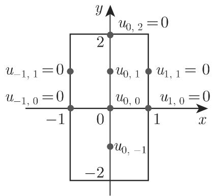
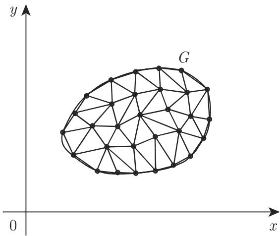
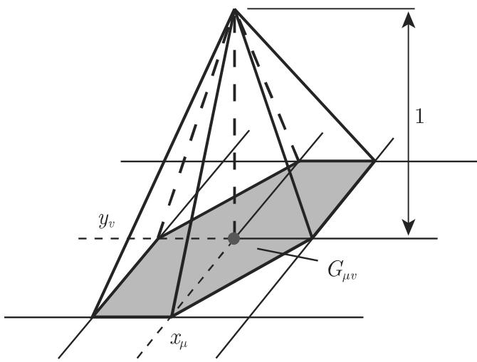

# 数学手册(原书第10版) 19.5 偏微分方程的近似求解

本节是《数学手册》(原书第10版) 第 19 章数值分析的一节，「仅以带有两个独立变量及相应的边值／初值条件的线性二阶偏微分方程为例讨论偏微分方程数值解的原理」，分三个小节：19.5.1 [[concepts/差分法（偏微分方程）]]、19.5.2 [[concepts/用已知函数逼近]]、19.5.3 [[concepts/有限元方法]]（FEM）。本节为 19.2 所论的 [[concepts/块三对角矩阵]] 型大型稀疏线性方程组提供了 PDE 离散化来源，节中明言所得方程组「通常用迭代法（参见 19.2.1.4）来求解」，直接衔接 [[sources/10-数学手册原书第10版--11-192-方程组的数值解--18zu6ac]]。

## 各小节要点

- **19.5.1 差分法**：正规网格上以差商代替偏导数，每个内点得一个差分方程，化为关于网格近似值 $u_{\mu\nu}$ 的线性方程组；系数矩阵呈块三对角且依赖节点排列。对椭圆、抛物、双曲等不同类型另有更有效的方法，收敛性与稳定性条件有大量研究（[19.28], [19.31], [19.20]）。
- **19.5.2 用已知函数逼近**：$u\approx v=v_{0}+\sum a_{i}v_{i}$（两种情形），代入边界条件或微分方程得 [[concepts/亏量（残量）]]，由 [[concepts/配置法]] 或 [[concepts/最小二乘法（已知函数逼近）]] 定参。
- **19.5.3 有限元方法**：源称「在现代计算机出现后，有限元方法成为求解偏微分方程的最重要的技术」；基本思想「类似于……里茨法（参见 19.4.2.2），也涉及样条插值（参见 19.7）」（两回指未入库，见 [[queries/19-5未入库回指缺口]]）。四步框架见 [[methodology/有限元线性元四步求解流程]]。

## 结构化数据转录

### 正规网格 (19.136)

$$x_{\mu}=x_{0}+\mu h,\qquad y_{\nu}=y_{0}+\nu l\qquad(\mu,\nu=1,2,\dots)$$

$l=h$ 时为正方形网格；$u_{\mu\nu}$ 记 $u(x_{\mu},y_{\nu})$ 的近似值。

### 差分近似表 (19.137)（转录，复算无误）

| 偏导数 | 有限差分 | 误差阶 |
|---|---|---|
| $\frac{\partial u}{\partial x}(x_{\mu},y_{\nu})$ | $\frac{1}{h}(u_{\mu+1,\nu}-u_{\mu,\nu})$ 或 $\frac{1}{2h}(u_{\mu+1,\nu}-u_{\mu-1,\nu})$ | $O(h)$ 或 $O(h^{2})$ |
| $\frac{\partial u}{\partial y}(x_{\mu},y_{\nu})$ | $\frac{1}{l}(u_{\mu,\nu+1}-u_{\mu,\nu})$ 或 $\frac{1}{2l}(u_{\mu,\nu+1}-u_{\mu,\nu-1})$ | $O(l)$ 或 $O(l^{2})$ |
| $\frac{\partial^{2}u}{\partial x\partial y}(x_{\mu},y_{\nu})$ | $\frac{1}{4hl}(u_{\mu+1,\nu+1}-u_{\mu+1,\nu-1}-u_{\mu-1,\nu+1}+u_{\mu-1,\nu-1})$ | $O(hl)$ |
| $\frac{\partial^{2}u}{\partial x^{2}}(x_{\mu},y_{\nu})$ | $\frac{1}{h^{2}}(u_{\mu+1,\nu}-2u_{\mu,\nu}+u_{\mu-1,\nu})$ | $O(h^{2})$ |
| $\frac{\partial^{2}u}{\partial y^{2}}(x_{\mu},y_{\nu})$ | $\frac{1}{l^{2}}(u_{\mu,\nu+1}-2u_{\mu,\nu}+u_{\mu,\nu-1})$ | $O(l^{2})$ |

误差阶由朗道符号给出（衔接 [[concepts/收敛阶]] 的记号语言）。

### 加权近似 (19.138)

$$\frac{\partial^{2}u}{\partial x^{2}}(x_{\mu},y_{\nu})\approx\sigma\,\frac{u_{\mu+1,\nu+1}-2u_{\mu,\nu+1}+u_{\mu-1,\nu+1}}{h^{2}}+(1-\sigma)\,\frac{u_{\mu+1,\nu}-2u_{\mu,\nu}+u_{\mu-1,\nu}}{h^{2}}$$

固定参数 $0\leqslant\sigma\leqslant1$；源文说明其为「由相应于 $y=y_{\nu},\ y=y_{\nu+1}$ 的公式 (19.137) 得到的两个表达式的凸线性组合」。

### 例 1：矩形上的粗网格泊松问题

$\Delta u=u_{xx}+u_{yy}=-1$ 于 $|x|<1,\ |y|<2$，边界 $|x|=1,|y|=2$ 上 $u=0$；步长 $h=1$ 的正方形网格仅含三个内点，差分方程（$4u_{\mu\nu}=$ 邻点和 $+h^{2}$）：

```text
4u_{0,1}  = 0 + 0 + 0 + u_{0,0} + 1
4u_{0,0}  = 0 + u_{0,1} + 0 + u_{0,-1} + 1
4u_{0,-1} = 0 + u_{0,0} + 0 + 0 + 1
解：u_{0,0} = 3/7 ≈ 0.429,  u_{0,1} = u_{0,-1} = 5/14 ≈ 0.357
```

复算完全一致，见 [[findings/泊松方程粗网格三内点算例复算]]。原文「…+ 1 2$4u_{0,0}…」中之「1 2」疑为「$1^{2}$」，见 [[queries/例1末项1与2疑为1平方之辨]]。



### 例 2：单位方形与块三对角矩阵 (19.139)

$G:0\leqslant x\leqslant1,\ 0\leqslant y\leqslant1$；$\Delta u=f$ 于 $G$ 内，边界上 $u=g$（$g$ 已知）；步长 $h=l=1/n$。差分方程：

$$u_{\mu+1,\nu}+u_{\mu,\nu+1}+u_{\mu-1,\nu}+u_{\mu,\nu-1}-4u_{\mu,\nu}=\frac{1}{n^{2}}f(x_{\mu},y_{\nu})\qquad(\mu,\nu=1,\dots,n-1)$$

$n=5$ 时按 $4\times4$ 个内点从左到右逐行排列（边界值已知），源印方程组左边（**显示不全**——仅前两个块行，无右端）：

```text
( -4  1  0  0 |              )
(  1 -4  1  0 |              )
(  0  1 -4  1 |    ...       )
(  0  0  1 -4 |              )
(--------------+-------------)
(  1  0  0  0  |              )
(  0  1  0  0  |    ...       )
(  0  0  1  0  |              )
(  0  0  0  1  |              )
```

未知量向量 $(u_{11},u_{21},u_{31},u_{41};\,u_{12},\dots,u_{42};\,u_{13},\dots;\,u_{14},\dots,u_{44})^{T}$ 完整。「系数矩阵是对称稀疏的。这个形式称为块三对角矩阵。显然矩阵的形式依赖于网格节点的选取。」完整矩阵重构见 [[findings/式19-139块三对角矩阵转录]]、[[queries/式19-139矩阵显示不全之辨]]。

### 边界配置算例（19.5.2）

$$v(x,y;a_{1},a_{2},a_{3})=-\tfrac{1}{4}(x^{2}+y^{2})+a_{1}+a_{2}(x^{2}-y^{2})+a_{3}(x^{4}-6x^{2}y^{2}+y^{4})$$

满足微分方程 $\Delta v=-1$，在配置点 $(1,0.5),(1,1.5),(0.5,2)$（边界配置）满足边界条件 $v=0$：

```text
-0.3125 + a1 + 0.75*a2  - 0.4375*a3  = 0
-0.8125 + a1 - 1.25*a2  - 7.4375*a3  = 0
-1.0625 + a1 - 3.75*a2  + 10.0625*a3 = 0
解：a1 = 0.4562,  a2 = -0.200,  a3 = -0.0143
    v(0,1) = 0.3919,  v(0,0) = 0.4562
```

复算完全一致（精确解 $a_{1}=73/160,\ a_{2}=-1/5,\ a_{3}=-1/70$），见 [[findings/边界配置法算例复算]]。与差分法结果（0.429 / 0.357）并列给出，源未评判优劣。

### FEM 推导链 (19.144)–(19.158)

模型问题 (19.144)：$G$ 的内部 $\Delta u=u_{xx}+u_{yy}=f$，$G$ 的边界上 $u=0$。

**第一步（变分问题）**：方程两边乘以在边界为零的适当光滑函数 $v$ 并积分 (19.145)；「应用高斯求积公式（参见第 945 页 13.2.2.1），将 $P(x,y)=-vu_{y},\ Q(x,y)=vu_{x}$ 代入 (13.121)」，得变分方程

$$a(u,v)=b(v)\qquad\text{(19.146a)}$$

$$a(u,v)=-\iint_{(G)}\Big(\frac{\partial u}{\partial x}\frac{\partial v}{\partial x}+\frac{\partial u}{\partial y}\frac{\partial v}{\partial y}\Big)\,dx\,dy,\qquad b(v)=\iint_{(G)}fv\,dx\,dy\qquad\text{(19.146b)}$$

本书 $a(\cdot,\cdot)$ 取**负号**约定（复算确认，见 [[findings/式19-144至19-146变分方程推导复算]]）；「高斯求积公式」按用法疑为高斯积分定理，见 [[queries/高斯求积公式疑为高斯积分定理之辨]]。

**第二步（三角形剖分）**：区域被三角形覆盖，相邻三角形共整边或共顶点；曲边区域可由三角形联合逼近；「应该不包含钝角三角形」。单位正方形网格剖分（$h=1/N$，$(N-1)^{2}$ 个内节点）常用以 $(x_{\mu},y_{\nu})$ 为公共顶点的六个三角形组成的面元 $G_{\mu\nu}$。

**第三步（假设解）**：每三角形上线性函数 (19.147)，由三顶点值唯一确定；全局假设解 $\tilde{u}=\sum\alpha_{\mu\nu}u_{\mu\nu}$ (19.148)，基函数为帽函数（(19.149a,b) 节点基 + 局部支撑），六三角形显式公式 (19.150)–(19.153)——其中三角形 5 有符号勘误（[[queries/式19-153三角形5加号疑为减号之辨]]），(19.150) 脱 $y$。

**第四步（解系数）**：变分方程对每个 $u_{kl}$ 成立 → 系数方程组 (19.154)，其中 (19.155) 定义 $a(u_{\mu\nu},u_{kl})=\iint_{G_{kl}}(\partial_{x}u_{\mu\nu}\,\partial_{x}u_{kl}+\partial_{y}u_{\mu\nu}\,\partial_{y}u_{kl})\,dx\,dy$（**与 (19.146b) 差一负号**，见 [[queries/式19-155双线性形式脱负号之辨]]）。仅需计算 $G_{\mu\nu}\cap G_{kl}\neq\emptyset$ 的积分（表 19.1 七种情形）。x 向与 y 向合并得 (19.156a,b)：

$$\frac{1}{h^{2}}\big(4\alpha_{kl}-2\alpha_{k+1,l}-2\alpha_{k-1,l}\big)\frac{h^{2}}{2},\qquad \frac{1}{h^{2}}\big(4\alpha_{kl}-2\alpha_{k,l+1}-2\alpha_{k,l-1}\big)\frac{h^{2}}{2}$$

右端 $b(u_{kl})\approx f_{kl}V_{P}$，$V_{P}=\frac{1}{3}\cdot6\cdot\frac{1}{2}h^{2}=h^{2}$（高为 1 的棱锥体积）(19.157)。最终方程组 (19.158) 源印：

$$4\alpha_{kl}-\alpha_{k+1,l}-\alpha_{k-1,l}-\alpha_{k,l+1}-\alpha_{k,l-1}=h^{2}f_{kl}\qquad(k,l=1,\dots,N-1)$$

按 (19.146b) 符号链条，正确形式应为 $\alpha_{k+1,l}+\alpha_{k,l+1}+\alpha_{k-1,l}+\alpha_{k,l-1}-4\alpha_{kl}=h^{2}f_{kl}$——**恰与差分法例 2 的五点格式完全一致**，见 [[queries/式19-158右端符号与式19-146b不一致之辨]]、[[synthesis/差分法与有限元殊途同归于五点格式]]。

### 表 19.1（七种面元交叠；配对按几何复算重构）

原文各行三角形编号为无分隔符数字串（如「1 12 23 34 45 56 6」「2 63 5」），下表配对为重构结果，经几何验证与各行和一致（详见 [[findings/表19-1七种面元交叠配对复算]]）：

| 面域 | 三角形配对 $(G_{kl}\mid G_{\mu\nu})$ | $\partial_{x}u_{kl}$ | $\partial_{x}u_{\mu\nu}$ | $\sum\partial_{x}u_{kl}\,\partial_{x}u_{\mu\nu}$ |
|---|---|---|---|---|
| (1) $\mu=k,\ \nu=l$ | (1\|1)(2\|2)(3\|3)(4\|4)(5\|5)(6\|6) | $0,-\frac{1}{h},-\frac{1}{h},0,\frac{1}{h},\frac{1}{h}$ | 同左 | $\frac{4}{h^{2}}$ |
| (2) $\mu=k,\ \nu=l-1$ | (1\|5)(2\|4) | $0,-\frac{1}{h}$ | $\frac{1}{h},0$ | $0$ |
| (3) $\mu=k+1,\ \nu=l$ | (2\|6)(3\|5) | $-\frac{1}{h},-\frac{1}{h}$ | $\frac{1}{h},\frac{1}{h}$ | $-\frac{2}{h^{2}}$ |
| (4) $\mu=k+1,\ \nu=l+1$ | (3\|1)(4\|6) | $-\frac{1}{h},0$ | $0,\frac{1}{h}$ | $0$ |
| (5) $\mu=k,\ \nu=l+1$ | (4\|2)(5\|1) | $0,\frac{1}{h}$ | $-\frac{1}{h},0$ | $0$ |
| (6) $\mu=k-1,\ \nu=l$ | (5\|3)(6\|2) | $\frac{1}{h},\frac{1}{h}$ | $-\frac{1}{h},-\frac{1}{h}$ | $-\frac{2}{h^{2}}$ |
| (7) $\mu=k-1,\ \nu=l-1$ | (6\|4)(1\|3) | $\frac{1}{h},0$ | $0,-\frac{1}{h}$ | $0$ |

## 复算结论一览

| 复算对象 | 状态 | 页面 |
|---|---|---|
| (19.136)–(19.138) 差分近似 | 复现 | [[findings/式19-136至19-138差分近似与加权格式转录复算]] |
| 例 1 三内点算例 | 完全复现 | [[findings/泊松方程粗网格三内点算例复算]] |
| (19.139) 矩阵 | 差分方程自洽；矩阵显示不全不可全验 | [[findings/式19-139块三对角矩阵转录]] |
| 边界配置算例 | 完全复现 | [[findings/边界配置法算例复算]] |
| (19.144)–(19.146) 变分方程 | 复现（含负号约定） | [[findings/式19-144至19-146变分方程推导复算]] |
| (19.147)–(19.153) 帽函数 | 三角形 1–4、6 复现；三角形 5 符号错误 | [[findings/式19-147至19-153线性元帽函数转录复算]] |
| 表 19.1 | 行和复现；配对为重构 | [[findings/表19-1七种面元交叠配对复算]] |
| (19.154)–(19.158) | (19.158) 右端符号错误；修正后与差分法五点格式一致 | [[findings/式19-154至19-158刚度方程与五点格式复算]] |

## 三项数学勘误（本源最重要发现）

1. **(19.153) 三角形 5 符号错误（高置信）**：应为 $1+(x/h-\mu)-(y/h-\nu)$（[[queries/式19-153三角形5加号疑为减号之辨]]）。
2. **(19.155) 与 (19.146b) 差一负号**（[[queries/式19-155双线性形式脱负号之辨]]）。
3. **(19.158) 右端符号错误（高置信）**：修正后与差分法例 2 五点格式完全一致（[[queries/式19-158右端符号与式19-146b不一致之辨]]、[[synthesis/差分法与有限元殊途同归于五点格式]]）。

## 系统性转写讹误

「千」→「于」、「巾」→「由」、「从有」→「所有」、$v\leftrightarrow\nu$ 混用、多处脱字（$G$、$(C)$、$h$、$n$、「六」、「1」、$x$/$y$、「1」、步骤编号、例题标签）、(19.150) 脱 $y$、「[19.31 l,」乱码、「互不排斥」疑有讹等，全清单见 [[queries/19-5全节系统性转写讹误清单]]。

## 与既有 wiki 的关联

- **19.2 方程组的数值解**：本节大方程组「用迭代法（参见 19.2.1.4）求解」，块三对角矩阵正是 [[methodology/雅可比与高斯—塞德尔迭代流程]]、[[methodology/SOR松弛迭代流程]] 的应用对象——本节为 19.2 补上「方程组从何而来」的 PDE 离散化来源。
- **[[entities/高斯]]**：新增高斯积分定理（(13.121) 代入）这一用法维度与「求积公式」译名疑点。
- **[[concepts/线性最小二乘问题]]、[[concepts/正规方程与高斯变换]]**：19.5.2 的最小二乘法定参与正规方程思想同源但对象不同，同名异实，见 [[comparisons/最小二乘法（已知函数逼近）与线性最小二乘问题辨析]]。
- **[[concepts/收敛阶]]（19.1）**：差分近似的 $O(h)/O(h^{2})$ 误差阶沿用朗道符号。

## 文献指引

源中引用 [19.13]、[19.20]、[19.21]、[19.28]、[19.31]（差分法收敛性与稳定性、有限元方法详细介绍、分片高次元），均未给出题名与作者。

<!-- llm-wiki:embedded-images -->
## Embedded Images

### Document





<!-- llm-wiki:embedded-images -->
