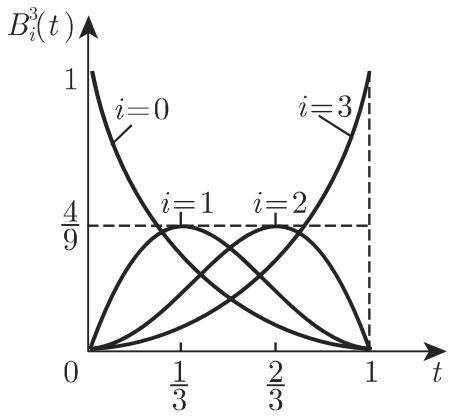

# 数学手册(原书第10版) 19.7 曲线和曲面用样条表示

本页对应《数学手册(原书第10版)》第 19 章（数值分析）末节 19.7（公式编号 (19.235)–(19.258)，插图 19.12–19.14）。全节以「高次插值逼近多项式通常有并不想要的振荡」为动机：将近似区间用节点分为子区间，在每个子区间上用相对简单（特别是三次）的近似函数作分片逼近，并要求在节点处光滑过渡——这是 [[concepts/多项式插值]]（19.6.1）缺陷的直接补救方案。全节分三小节：19.7.1 三次样条、19.7.2 双三次样条、19.7.3 曲线和曲面的伯恩斯坦-贝济埃表示（B-B 表示）。

## 小节结构与要点

| 小节 | 主题 | 关键公式 |
|---|---|---|
| 19.7.1.1 | [[concepts/三次插值样条]]：定义四性质、[[concepts/霍拉迪定理]]、系数确定 | (19.235)–(19.241) |
| 19.7.1.2 | [[concepts/光滑样条]] 与自由节点 [[concepts/B样条（基样条）]] 表示 | (19.242)(19.243) |
| 19.7.2.1–19.7.2.2 | [[concepts/双三次样条]] 与 [[concepts/张量积方法]] | (19.244)–(19.251) |
| 19.7.2.3 | 双三次光滑样条（caveat：仅很少特殊情况存在唯一解） | — |
| 19.7.3 | [[concepts/伯恩斯坦多项式]] 与 [[concepts/伯恩斯坦-贝济埃表示]] | (19.252)–(19.258) |

## 公式逐字转录

### 三次插值样条的定义四性质

```latex
(1) S(x_i) = f_i   (i = 1, 2, …, N)
(2) S(x) 在任一子区间 [x_i, x_{i+1}] (i = 1, 2, …, N−1) 内为次数不高于 3 的多项式
(3) S(x) 在整个插值区间 [x_1, x_N] 上是二次连续可微的
(4) 特殊边界条件：
    a) S''(x_1) = S''(x_N) = 0                 （自然样条）
    b) S'(x_1) = f'_1,  S'(x_N) = f'_N         （f'_1, f'_N 为已知值）
    c) f_1 = f_N；S(x_1) = S(x_N), S'(x_1) = S'(x_N), S''(x_1) = S''(x_N)   （周期样条）
```

### 19.7.1.1 霍拉迪定理与系数确定（h_i = x_{i+1} − x_i）

```latex
(19.235)  ∫_{x_1}^{x_N} [S''(x)]² dx ⩽ ∫_{x_1}^{x_N} [g''(x)]² dx
          （对一切满足插值条件 g(x_i) = f_i 的二次连续可微函数 g；霍拉迪定理；最小全曲率）

(19.236)  S(x) = S_i(x) = a_i + b_i(x−x_i) + c_i(x−x_i)² + d_i(x−x_i)³   (i = 1,…,N−1)

(19.237)  a_i = f_i   (i = 1,…,N−1)；引入不出现在多项式里的附加系数 a_N = f_N

(19.238)  d_{i−1} = (c_i − c_{i−1}) / (3h_{i−1})   (i = 2,…,N−1)
          由自然条件得 c_1 = 0；若引入 c_N = 0，则 (19.238) 对 i = N 依旧成立

(19.239)  b_{i−1} = (a_i − a_{i−1})/h_{i−1} − (2c_{i−1} + c_i)·h_{i−1}/3   (i = 2,…,N)

(19.240)  c_{i−1}h_{i−1} + 2(h_{i−1}+h_i)c_i + c_{i+1}h_i
                = 3[ (a_{i+1}−a_i)/h_i − (a_i−a_{i−1})/h_{i−1} ]   (i = 2,…,N−1)

(19.241)  三对角系数矩阵 × 未知向量 (c_2, …, c_{N−1})ᵀ：
          [ 2(h_1+h_2)    h_2                                      ]
          [    h_2      2(h_2+h_3)    h_3                          ]
          [                h_3     2(h_3+h_4)   h_4                ]
          [                        ⋱          ⋱        ⋱           ]
          [                                h_{N−2}                ]
          [                                h_{N−2}  2(h_{N−2}+h_{N−1}) ]
          ——系数矩阵三对角，由 LR 分解（回指第 1243 页 19.2.1.1,2.）非常容易数值求解
```

### 19.7.1.2 光滑样条与 B 样条基

```latex
(19.242)  Σ_{i=1}^{N} [ (f_i − S(x_i)) / σ_i ]² + λ ∫_{x_1}^{x_N} [S''(x)]² dx = min!
          λ > 0 光滑参数；λ = 0 → 三次插值样条；λ 很大 → 光滑的近似曲线但回到测量值不准确；
          λ = ∞ → 逼近回归线；σ_i > 0 为 f_i 测量误差的标准差（回指第 1109 页 16.4.1.3,2.）

(19.243)  S(x) = Σ_{i=1}^{r+2} a_i N_{i,4}(x)
          r = 自由选取节点的个数；N_{i,4} 为 4 阶正规化 B 样条（基样条），
          即关于第 i 个节点的三次多项式；细节见 [19.8], [19.6]
```

### 19.7.2 双三次样条与张量积

```latex
(19.244)  a = x_0 < x_1 < ⋯ < x_n = b,   c = y_0 < y_1 < ⋯ < y_m = d
(19.245)  f(x_i, y_j) = f_ij   (i = 0,…,n; j = 0,…,m)
(19.246)  S(x_i, y_j) = f_ij
(19.247)  S(x,y) = S_ij(x,y) = Σ_{k=0}^{3} Σ_{l=0}^{3} a_ijkl (x−x_i)^k (y−y_j)^l
          ——每个 S_ij 由 16 个系数确定；S(x,y) 共需 16mn 个系数（原文「l6mn」为 OCR 讹误）
(19.248)  ∂S/∂x、∂S/∂y、∂²S/∂x∂y 在区域上连续
(19.249)  边界条件（p_ij、q_ij、r_ij 预先给定；原文三处 (x_i, y_i) 应为 (x_i, y_j)）：
          ∂S/∂x(x_i, y_j) = p_ij,     i = 0,n;  j = 0,…,m
          ∂S/∂y(x_i, y_j) = q_ij,     i = 0,…,n;  j = 0,m
          ∂²S/∂x∂y(x_i, y_j) = r_ij,  i = 0,n;  j = 0,m
          ——系数确定：线性方程组个数 2n+m+3，系数矩阵三对角，各方程组仅右端项不同
(19.250)  S(x,y) = Σ_{i=0}^{n} Σ_{j=0}^{m} a_ij g_i(x) h_j(y)    （张量积方法）
(19.251)  S(x,y) = Σ_{i=1}^{r+2} Σ_{j=1}^{p+2} a_ij N_{i,4}(x) N_{j,4}(y)
          ——r、p 分别为关于 x、y 的节点个数；节点可自由选取，但位置须满足插值问题的
          某种可解性条件；样条方法得到有带状结构系数矩阵的线性方程组
```

### 19.7.3 伯恩斯坦-贝济埃表示

```latex
(19.252)  B_{i,n}(t) = C(n,i) t^i (1−t)^{n−i}   (i = 0,…,n)
(19.253)  0 ⩽ B_{i,n}(t) ⩽ 1,   0 ⩽ t ⩽ 1
(19.254)  Σ_{i=0}^{n} B_{i,n}(t) = 1    （由二项式定理，回指第 14 页 1.1.6.4）
例 A:  B_{0,1}(t) = 1−t,  B_{1,1}(t) = t                            （图 19.12）
例 B:  B_{0,3} = (1−t)³,  B_{1,3} = 3t(1−t)²,  B_{2,3} = 3t²(1−t),  B_{3,3} = t³  （图 19.13）
(19.255)  r(t) = x(t)e_x + y(t)e_y + z(t)e_z           （t 为曲线参数）
(19.256)  r(u,v) = x(u,v)e_x + y(u,v)e_y + z(u,v)e_z   （u、v 为曲面参数）
(19.257)  r(t) = Σ_{i=0}^{n} B_{i,n}(t) P_i   （B-B 曲线；P_0、P_n 为插值点，
                                                 P_0P_1、P_{n−1}P_n 为端点切线；图 19.14）
(19.258)  r(u,v) = Σ_{i=0}^{n} Σ_{j=0}^{m} B_{i,n}(u) B_{j,m}(v) P_ij   （B-B 曲面；每格点影响全局）
```

## 核心主张与证据强度

1. **三次插值样条唯一性**（归属：[[concepts/三次插值样条]]）：四条性质唯一确定 S(x)；定义性陈述，强度高。
2. **霍拉迪定理**（归属：自然样条，边界条件 a）：∀ C² 插值函数 g，∫[S″]²dx ⩽ ∫[g″]²dx；κ ≈ S″ 为一次近似，弹性细尺类比是启发性论证。文本在并列三类边界条件之后陈述定理，归属表述略含糊。
3. **系数确定流程**（归属：自然样条的系数方程组）：a→d→b→c 四步归结为三对角方程组 (19.240)/(19.241)，用 LR 分解求解；推导复算通过（[[findings/式19-235至19-241插值样条与系数确定转录复算]]），强度高。
4. **光滑样条**（归属：三次光滑样条）：(19.242) 罚化最小二乘及 λ 谱系（λ=0 → 插值样条；λ→∞ → 回归线）；解法（约束优化、拉格朗日函数）细节完全外推至文献 [19.34][19.35]，本源自含证据弱。
5. **自由节点 B 样条表示**（归属：B 样条基）：(19.243) 以 r+2 个 N_{i,4} 代替分段表示；r+2 计数存疑（[[queries/式19-243之r加2与三次B样条基个数之辨]]），细节外推至 [19.8][19.6]。
6. **双三次插值样条**：每子区域 16 系数、共 16mn 个；系数由 2n+m+3 个三对角方程组确定（仅右端不同），计数未给推导（[[findings/式19-244至19-251双三次样条与张量积转录复算]]）。
7. **张量积方法**：二维插值降为一维；一维唯一可解 ⇒ 二维唯一可解；样条实例得带状系数矩阵（[[concepts/张量积方法]]）。
8. **二维光滑样条 caveat**：可能的最优条件一整列，但仅有很少特殊情况可能存在唯一解——原书自设的重要限定。
9. **B-B 曲线性质**：端点插值、端点切线、变量凸组合；可由 B_{i,n}(0)=δ_{i0} 等直接验证，强度高。
10. **B 样条曲线三优点**（定性陈述，归属：B 样条曲线）：更好逼近多边形、顶点改动仅局部影响、可影响可微性（可能产生间断的点和线段）。
11. **B-B 曲面 caveat**：每格点影响全局（伯恩斯坦基全局支撑的直接推论），故应换用 B 样条。

## 与既有维基的关联

- 动机承接 19.6.1：[[concepts/多项式插值]]、[[concepts/拉格朗日插值公式]]、[[concepts/牛顿插值公式]]、[[concepts/艾特肯－内维尔插值]]；对照见 [[comparisons/高次多项式插值与分段三次样条比较]]。
- LR 分解的落地应用：三对角方程组 (19.240)/(19.241) 明示用 LR 分解求解，回指 [[concepts/三角分解与LU因子分解]]（19.2）。
- 最小二乘族（19.6.2）：[[concepts/线性最小二乘问题]]、[[concepts/权函数与加权内积]]、[[concepts/非线性最小二乘问题]]——光滑样条是加权最小二乘加粗糙罚项的组合，属扩展而非冲突。
- 带状结构主题：[[concepts/块三对角矩阵]]（19.5）的「带状/块带状利于数值求解」在样条方程组中重现，形成跨节呼应。
- 相邻小节互链：[[sources/10-数学手册原书第10版--14-196-插值调整计算调和分析--3evq7v]]。
- [[entities/拉格朗日]]：本节「拉格朗日函数」（回指第 611 页 6.2.5.6，约束优化语境）与既有插值公式语境属同一人物的不同概念。

## 阅读注意：系统性转写讹误

本节延续 19.2–19.6 各节已记录的 OCR 讹误模式，全表见 [[queries/19-7全节系统性转写讹误清单]]。要点：「千」系统性讹「于」；「入」讹「λ」；多处脱字符脱变量（N、3、t、u、v、i、r、p、B、R）；「l6mn」应为「16mn」；(19.249) 三处 (x_i, y_i) 应为 (x_i, y_j)；例 B 中 B_{2,3} 与 B_{3,3} 间脱分隔符；三处「见文献」缺引文编号。

## 引用与回指缺口

- 未具名引文：[19.34]、[19.35]（光滑样条）、[19.8]、[19.6]（B 样条），另有三处「见文献」连编号亦缺，需原书参考文献表补齐。
- 未入库回指：第 331 页 3.6.1.2,4.（曲率）、第 611 页 6.2.5.6（拉格朗日函数）、第 1109 页 16.4.1.3,2.（标准差）、第 14 页 1.1.6.4（二项式定理）；第 1243 页 19.2.1.1,2.（LR 分解）已闭环于 [[concepts/三角分解与LU因子分解]]。见 [[queries/19-7未入库回指缺口]]。

## 插图





<!-- llm-wiki:embedded-images -->
## Embedded Images

### Document


<!-- llm-wiki:embedded-images -->
