# 数学手册(原书第10版) 3.4.1 球面几何学的基本概念

本节是《数学手册(原书第10版)》第 3 章球面几何部分（3.4）的开篇，为 3.4.2 球面三角学建立公理化基础：[[大圆]]的唯一性与最短性、[[球面距离]]的角度/长度双轨表示、两类测量坐标系（等距的[[佐德纳坐标]]与保角的[[高斯-克吕格坐标]]）、[[球面二角形]]与[[球面三角形]]的基本量、[[极三角形]]对偶、[[欧拉三角形与非欧拉三角形]]的选取约定，以及[[三面角]]与球面三角形之间的定理转移原理。母书条目见 [[数学手册原书第10版]]。

## 小节结构

- **3.4.1.1 球面上的曲线、弧和角**：球面曲线；大圆与小圆（式 3.174）；球面距离；测地线；球面距离的度量（式 3.175）；交叉角、航向角、方位角
- **3.4.1.2 特殊坐标系**：地理坐标；佐德纳坐标（式 3.176）；高斯—克吕格坐标（式 3.177）
- **3.4.1.3 球面新月形或二角形**（式 3.178）
- **3.4.1.4 球面三角形**（含直边三角形与球面直角三角形）
- **3.4.1.5 极三角形**（极点、极平面；式 3.179）
- **3.4.1.6 欧拉三角形与非欧拉三角形**
- **3.4.1.7 三面角**（定理转移原理）

## 核心公式（逐字转写）

截割平面交圆半径（大圆/小圆/切平面判据）：

$$
r = \sqrt{R^{2} - h^{2}}, \quad 0 \leqslant h \leqslant R \tag{3.174}
$$

球面距离的角度—长度换算：

$$
\widehat{AB} = R \operatorname{arc} e = R \frac{e}{\varrho} \tag{3.175a}
$$

$$
e = \widehat{AB} \frac{\varrho}{R} \tag{3.175b}
$$

$$
\varrho = 1\,\mathrm{rad} = \frac{180^\circ}{\pi} = 57.2958^\circ = 3438' = 206265'' \tag{3.175c}
$$

横坐标方向伸长系数（佐德纳与高斯—克吕格共享）：

$$
a = \frac{\Delta x}{\Delta x'} = 1 + \frac{y^{2}}{2R^{2}}, \quad R = 6371\,\mathrm{km} \tag{3.176}
$$

高斯—克吕格保角纵坐标校正：

$$
b = \frac{y^{3}}{6R^{2}} \tag{3.177}
$$

球面二角形面积：

$$
A_b = \frac{4\pi R^{2}\alpha}{360^\circ} = \frac{2R^{2}\alpha}{\varrho} = 2R^{2} \operatorname{arc} \alpha \tag{3.178}
$$

极三角形互补对偶：

$$
a' = 180^\circ - \alpha, \quad b' = 180^\circ - \beta, \quad c' = 180^\circ - \gamma \tag{3.179a}
$$

$$
\alpha' = 180^\circ - a, \quad \beta' = 180^\circ - b, \quad \gamma' = 180^\circ - c \tag{3.179b}
$$

## 地球常数与算例

**算例 A（等体积球）**：对地球表面的球面计算通常考虑和克拉索夫斯基 (Krassowski) 双轴参考椭球同样体积的一个球，该地球半径为 R = 6371.110 km；因此 1° ≙ 111.2 km；1′ = 1853.3 m = 1 旧海里；今天 1 n mile = 1852 m。（原文「111.2 km 7 1′」中的「7」疑为杂字符。）方法论依据见 [[等体积球近似]]。

**算例 B（德累斯顿—圣彼得堡）**：两城之间的球面距离为 $\widehat{AB} = 1433$ km，或

$$
e = \frac{1433\,\mathrm{km}}{6371\,\mathrm{km}} \times 57.3^\circ = 12.89^\circ = 12^\circ 53'.
$$

## 区间与参数约定（各归属其命名主体）

| 量 | 所属主体 | 区间/数值 |
|---|---|---|
| 航向角 α | 球面导航（3.4.1.1,5） | −90° < α ⩽ 90°，带符号，与曲线定向无关 |
| 方位角 δ | 球面导航（3.4.1.1,5） | 0° ⩽ δ < 360° |
| 经度 λ | 地理坐标 | −180° ⩽ λ ⩽ 180°，东经为正、西经为负 |
| 纬度 φ | 地理坐标 | −90° ⩽ φ ⩽ 90°，北纬为正、南纬为负 |
| 纵坐标方向保距、伸长系数（式 3.176）、两侧 64 km 限制 | 佐德纳坐标 | y = 64 km 处相对伸长约 5×10⁻⁵（「0.05 的伸长量」疑缺单位 m） |
| 保角性、分带中央子午线东经 6°/9°/12°/15°、带宽两侧 1°40′（≈±100 km）、重叠 20′（≈20 km）、纵坐标校正 b = y³/(6R²) | 高斯—克吕格坐标 | 伸长系数与佐德纳系相同（原文明言共享式 3.176） |
| 两边均为 180°、角 = 平面二面角 α | 球面二角形 | 面积随 α → 360° 与球表面积成正比 |
| 边、角均 < 180° | 欧拉三角形（否则为非欧拉三角形） | 边总取小于 180° 的弧（= 顶点间球面距离） |

## 数值自洽性（独立复算）

- 式 3.175c：180/π = 57.29578°；×60 = 3437.75′ ≈ 3438′；×3600 = 206265″ ✓
- 算例 A：6371.110 × π/180 = 111.195 km ≈ 111.2 km；÷60 = 1853.25 m ≈ 1853.3 m ✓
- 算例 B：1433/6371 × 57.2958 = 12.888° ≈ 12°53′，与两城实际大圆距（≈12.85°）相符 ✓
- 式 3.176：可由 a = 1/cos(y/R) ≈ 1 + y²/(2R²) 导出；y = 64 km 时相对伸长 5.05×10⁻⁵，即每 1 km 线段伸长约 0.05 m——印证「0.05 的伸长量」脱落单位「m」的复原读法 ✓
- 式 3.178：两种形式代数等价；α = 360° 时 A_b = 4πR²（全球面）✓
- 高斯—克吕格分带链条：中央子午线间隔 3° + 带半宽 1°40′ ⇒ 邻带重叠 20′；德国纬度（cos 51° ≈ 0.63）下 20′ ≈ 23 km ≈「20 km」、±1°40′ ≈ ±117 km ≈「±100 km」✓
- 式 3.177：量纲为长度，y = 64 km 时 b ≈ 1.08 m，量级合理；但该式无法从本节独立推导验证

## 转写损坏与疑点

本节存在与 [[梯形段行内变量符号是否缺失]] 同源的系统性转写损坏：

- 行内数学符号大面积脱落：「半径为 的球被与球心 距离为 的平面 所截」（R、M、h、Γ 缺失）、「地理经度入」（λ 误作「入」）、「记作a,(3 'Y」（应为 α, β, γ）、「随着记变到 360°」（「记」= α）、「需要将 的量加到纵坐标」（缺 b）等——详见 [[球面几何节行内符号系统性脱落是否为转写丢字]]
- 「y = 64 km km 长的线段具有 0.05 的伸长量」疑应为「1 km 长的线段具有 0.05 m 的伸长量」；算例 A 的「7」为杂字符——见 [[伸长量0-05缺单位与算例A的7残留是否为讹误]]
- 式 3.176 中 Δx 与 Δx′ 何者为球面原长、何者为平面拉伸量表述含糊；佐德纳定义句端点符号脱落——见 [[佐德纳与高斯-克吕格定义段语义是否脱落错乱]]
- 「三角形ABO」「球面三角AB＠邵」疑为 ABC 之讹——见 [[极三角形段ABO与AB邵是否为ABC之讹]]
- 换算因子 ϱ 上方加点疑为转写噪声——见 [[换算因子ϱ加点是否为转写噪声]]
- 交叉引用「第 215 3.4.1.2,1.」「第 359 3.6.3.6」「第 170 3.1.1.5度」延续「页码+节号粘连、缺『页』字」模式，与 [[平面三角学节交叉引用页码节号是否粘连]] 同源
- 直边三角形（边 = 90°）与球面直角三角形（角 = 90°）一句内并列，转写后界线不清

## 与既有 wiki 的联系

- [[数学手册原书第10版]]：母书实体，3.4.1 应纳入其覆盖清单
- 3.2 平面三角学（[[10-数学手册原书第10版--8-32-平面三角学--j56osm]]）的 [[测地坐标]]、[[方位角]]、[[比例尺]]、[[交会法]] 在此延伸到球面与投影坐标系——本源为**扩展**而非挑战
- [[方位角]]：3.2 平面测量定义与这里的球面导航定义区间一致（0° ⩽ δ < 360°），强化该页；与航向角的对照见 [[航向角与方位角比较]]
- [[弧度]]、[[度分秒]] 与 [[度与弧度互化的逐级除法]]：ϱ 常数（式 3.175c）充实换算因子；本节另补充导航进位惯例（位置坐标用六十进、距离/航向角/方位角用十进）
- [[比例尺换算公式]]、[[坐标互化与比例因子校正]]：伸长系数 a = 1 + y²/(2R²) 是「比例因子」思想在球面→平面投影中的再现（此处刻画固有拉伸）——见 [[伸长系数]]
- [[测地左手坐标系定则]]：佐德纳「纵坐标沿中央子午线、横坐标横向」的布置与 3.2 测地坐标定向约定相衔接
- [[平面三角形]]、[[外接圆]]：球面三角形的记号「遵从与平面三角形一样的模式」（原文明言），构成天然对照——见 [[球面三角形]]

## 开放问题

- 原书 3.3（介于 3.2 与 3.4 之间）尚未入库；3.4.2 球面三角学入库后应在 [[球面三角形]]、[[极三角形]]、[[三面角]] 上回链
- [[测地线]] 的前向引用 3.6.3.6（微分几何）待原文核对

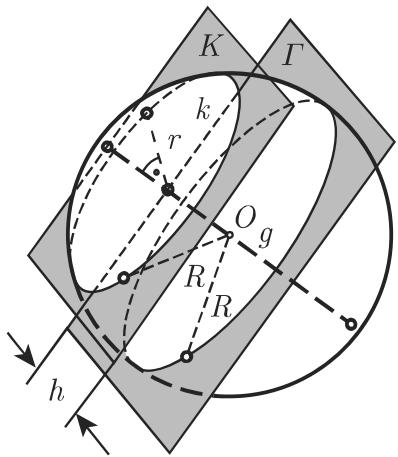

<!-- llm-wiki:embedded-images -->
## Embedded Images

### Document

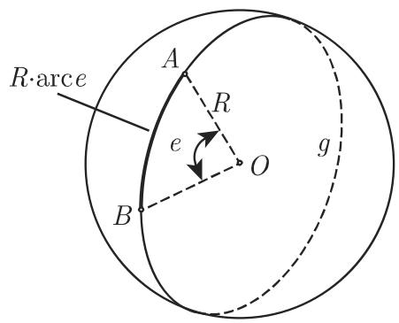
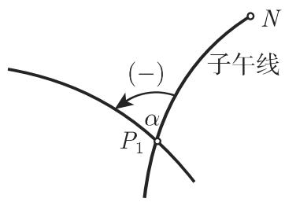
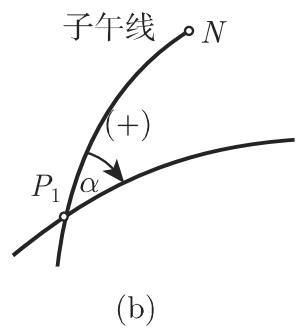
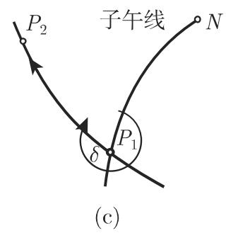
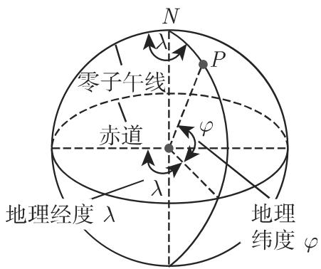

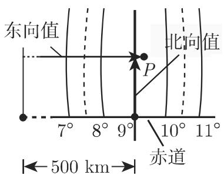
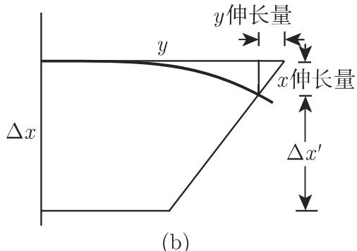

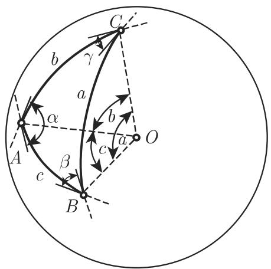

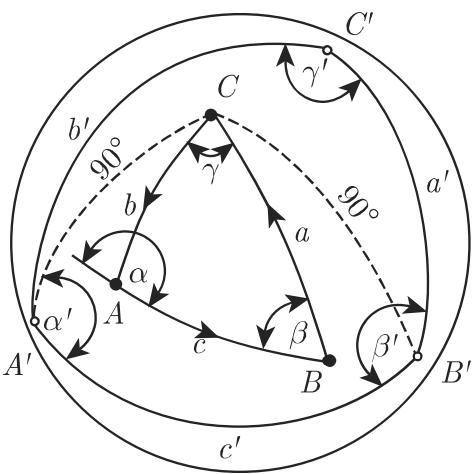

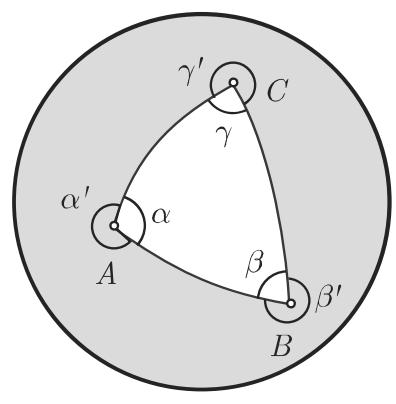

<!-- llm-wiki:embedded-images -->
