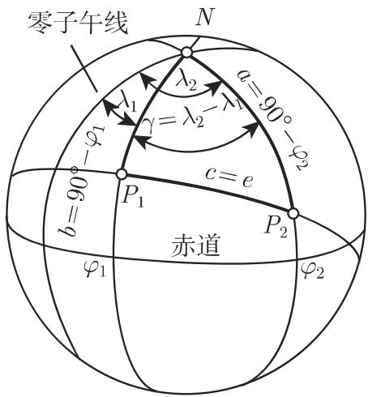
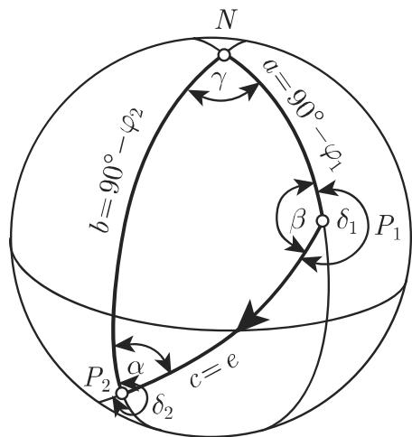

# 数学手册(原书第10版) 3.4.2 球面三角形的基本性质

本来源是 [[entities/数学手册原书第10版]] 3.4 章「球面三角学」的核心公式节，系统给出球面三角形的边角命题、基本定律、半角/半边公式、类比公式与两个导航算例。全节分三小节：3.4.2.1 一般命题（式 3.180–3.186）、3.4.2.2 基本公式与应用（式 3.187–3.197）、3.4.2.3 更多的公式（式 3.198–3.201）。本节以「球面定律 ↔ 平面定律」的对应关系为组织主线，可视为 [[sources/10-数学手册原书第10版--8-32-平面三角学--j56osm]]（3.2 平面三角学）的球面对偶篇，对应总表见 [[comparisons/平面与球面三角学公式对应比较]]。

## 3.4.2.1 一般命题（式 3.180–3.186）

球面三角形的八条基本命题（边 a、b、c 与角 α、β、γ 均以角度量）：

```
(1) 三边之和    0° < a + b + c < 360°                  (3.180)
(2) 两边之和    a + b > c                              (3.181)
(3) 两边之差    |a − b| < c                            (3.182)
(4) 三角之和    180° < α + β + γ < 540°                (3.183)
(5) 球面角盈    ε = α + β + γ − 180°                   (3.184)
(6) 两角之和    α + β < γ + 180°                       (3.185)
(7) 对边和角    较大的边所对的角也较大，反之亦然
(8) 面积        A_T = εR²·π/180° = R²ε/ρ = R² arc ε    (3.186a)
                A_T = (A_S/720°)·ε    （吉拉尔定理）    (3.186b)
```

ρ 为 3.4.1 节的换算因子（式 3.175c，尚未入库），A_S 为球表面积。详见 [[findings/球面三角形一般命题组]]、[[concepts/球面角盈]]、[[concepts/吉拉尔定理]]。注意命题 (1) 的正文与公式存在上限矛盾（180° vs 360°），见 [[queries/式3-180三边之和上限是否为360度]]。

## 3.4.2.2 基本公式（式 3.187–3.196）

五大定律族（代表式如下，轮换形式见各概念页）：

```
正弦定律            sin a/sin α = sin b/sin β = sin c/sin γ        (3.187d)
边的余弦定律        cos a = cos b cos c + sin b sin c cos α        (3.188a)
正弦—余弦定律       sin a cos β = cos b sin c − sin b cos c cos α  (3.189a)
角的余弦定律        cos α = −cos β cos γ + sin β sin γ cos a       (3.190a)
对偶正弦—余弦定律   sin α cos b = cos β sin γ + sin β cos γ cos a  (3.191a)
```

半角公式（两形式，式 3.192–3.193）、半边公式（两形式，式 3.194–3.195）与 σ 范围命题：

```
tan(α/2) = √[sin(s−b)sin(s−c)/(sin s·sin(s−a))],   s = (a+b+c)/2    (3.192a)
cot(a/2) = √[cos(σ−β)cos(σ−γ)/(−cos σ·cos(σ−α))],  σ = (α+β+γ)/2    (3.194a)
90° < σ < 270°  ⟹  cos σ < 0 恒真                                   (3.196)
```

关键论断：由角的余弦定律「**每条边都可以用角来表示**」，而平面三角形的任何一条边都不可能由角确定（无穷多相似三角形）。详见 [[findings/球面三角学基本定律组]]、[[concepts/关于角的余弦定律]]；半角/半边组见 [[findings/球面半角与半边公式组]]、[[concepts/球面半角与半边公式]]。

## 应用：大圆航程与航向角（式 3.197 与两算例）

对地理坐标 (λ₁, φ₁)、(λ₂, φ₂) 与北极 N 构成的球面三角形 P₁P₂N，由边的余弦定律 (3.188c) 得大圆距离公式：

```
cos e = sin φ₁ sin φ₂ + cos φ₁ cos φ₂ cos(λ₂ − λ₁)    (3.197)
```

例 1（德累斯顿—阿拉木图）：λ₁=13°46′, φ₁=51°16′；λ₂=76°55′, φ₂=43°18′。cos e = 0.53498 + 0.20567 = 0.74065，e = 42.213°；应用 (3.175a) 得大圆弧长 **4694 km**。

例 2（孟买—达累斯萨拉姆）：λ₁=72°48′, φ₁=19°00′；λ₂=39°28′, φ₂=−6°49′。a = 90°−φ₁ = 71°00′, b = 90°−φ₂ = 96°49′, γ = λ₁−λ₂ = 33°20′；由 (3.188c) 得 e = 41.777°，按 1′≈1 n mile 得 **≈2507 n mile**；再由 (3.188a/b) 得 α = 51.248°、β = 125.018°，航向角 **δ₁ = 360°−β = 234.982°，δ₂ = 180°+α = 231.248°**。





两例数值经独立复算全部吻合，详见 [[findings/大圆航程与航向角算例]]；计算流程的抽象见 [[methodology/大圆航程与航向角计算流程]]。手册评注：只有当问题中的角明显是锐角或钝角时，应用正弦定律确定边和角才有意义。

## 3.4.2.3 更多的公式（式 3.198–3.201）

```
德朗布尔等式    cos((α−β)/2)/sin(γ/2) = sin((a+b)/2)/sin(c/2)          (3.198a)
                （4 式，轮换共 12 式；对应平面莫尔韦德公式）
纳皮尔等式      tan((α−β)/2) = [sin((a−b)/2)/sin((a+b)/2)]·cot(γ/2)    (3.199a)
                （4 式，也称纳皮尔类比）
球面正切定律    tan((a−b)/2)/tan((a+b)/2) = tan((α−β)/2)/tan((α+β)/2)  (3.200a)
                （及轮换共 3 式；对应平面正切定律）
吕利耶等式      tan(ε/4) = √[tan(s/2)·tan((s−a)/2)·tan((s−b)/2)·tan((s−c)/2)]  (3.201)
                （由边直算球面角盈；对应平面海伦公式）
```

详见 [[findings/德朗布尔纳皮尔与吕利耶公式组]] 及 [[concepts/德朗布尔等式]]、[[concepts/纳皮尔类比]]、[[concepts/球面正切定律]]、[[concepts/吕利耶公式]]。

## 与平面三角学的对应主线

本节逐条声明球面定律的平面对应物（正弦↔正弦、余弦↔余弦、正弦—余弦定律↔投影法则、半角↔半角、纳皮尔/正切↔正切、德朗布尔↔莫尔韦德、吕利耶↔海伦），并点出本质差异：球面三角形的边可由角唯一确定，平面三角形则不能。汇总见 [[comparisons/平面与球面三角学公式对应比较]]；平面侧对应页如 [[concepts/正弦定律]]、[[concepts/余弦定律]]、[[concepts/正切定律]]、[[concepts/海伦公式]]、[[findings/半角公式与附加关系]]、[[findings/平面三角形边不可仅由角得到]]。

## 转写讹误与内部矛盾

本节存在成片系统性转写讹误：「千」代「于」（介千、大千、对应千等遍布全节）、「球面儿何」、γ 误作「社」、「球面角盈丿」衍字、「算€」残损、夹角后衍「？」、「和球半径 [R] 表示」符号脱落，以及两处「图 3.34」疑为「图 3.89」之误引；另有式 3.180 正文与公式的上限矛盾、两算例 a/b 指派互换、吕利耶段角盈符号作 E（全节其余作 ε）。逐一记录于：

- [[queries/式3-180三边之和上限是否为360度]]
- [[queries/342节转写讹误与图3-34误引]]
- [[queries/两算例ab指派与角盈符号E是否原书如此]]

## 引用缺口（属未入库的 3.4.1）

本节引用 3.4.1 的如下内容，目前在本 wiki 中悬空：球面三角形与欧拉三角形的定义、大圆（弧）记号、弧长换算式 3.175a 与换算因子 ρ（3.175c）、图 3.89 的记号约定。待 3.4.1 入库后回填。

<!-- llm-wiki:embedded-images -->
## Embedded Images

### Document


<!-- llm-wiki:embedded-images -->
