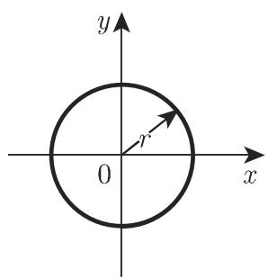
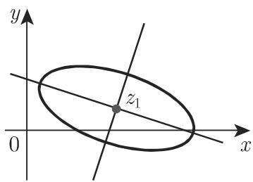
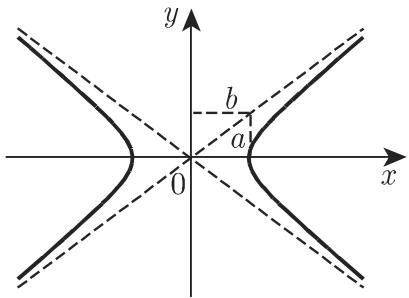
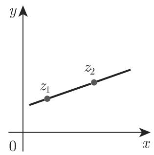
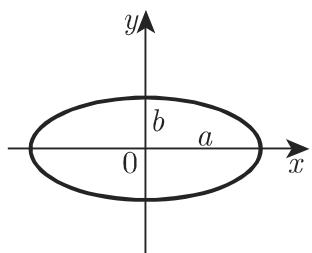

# 数学手册(原书第10版) 14.5 代数函数和初等超越函数

## 概述

本源为《数学手册(原书第10版)》第 14 章（复变函数）第 5 节的转录，分三小节：

- **14.5.1 代数函数**：隐式定义（式 14.63）与五个典型例子（式 14.64–14.68）；
- **14.5.2 初等超越函数**：自然指数函数（14.69–14.73b）、自然对数（14.74a–d）、一般指数函数（14.75a/b）、三角函数和双曲函数（14.76a–14.82b）、反三角函数和反双曲函数（14.83a–14.90b），附表 14.1（实部和虚部）与表 14.2（绝对值和辐角）；
- **14.5.3 曲线用复形式的描述**：一般参数式（14.91）与直线、圆周、椭圆、双曲线、对数螺线五类曲线（14.92a–14.99），附图 14.49–14.53。

全节组织主线：以全平面绝对收敛的级数定义 $e^z$（式 14.69），其余初等超越函数（对数、一般指数、三角、双曲及其反函数）均由 $e^z$ 导出；多值性与主值以"大写多值 / 小写主值"的记法约定贯穿始终（详见 [[concepts/多值函数与主值]]）。

## 逐式转录

### 14.5.1 代数函数（式 14.63–14.68）

```latex
a_1 z^{m_1} w^{n_1} + a_2 z^{m_2} w^{n_2} + \dots + a_k z^{m_k} w^{n_k} = 0      (14.63)
线性函数:     w = az + b                            (14.64)
反函数:       w = 1/z                               (14.65)
二次函数:     w = z^2                               (14.66)
平方根函数:   w = \sqrt{z^2 - a^2}                  (14.67)
分式线性函数: w = (z + \mathrm{i})/(z - \mathrm{i})  (14.68)
```

源文注：$w$ 不能被显式地表示时有发生。

### 14.5.2 初等超越函数

**自然指数函数（式 14.69–14.73b）**

```latex
e^z = 1 + z/1! + z^2/2! + z^3/3! + \dots                                     (14.69)  整个 z 平面绝对收敛
e^{iy} = \cos y + \mathrm{i}\sin y,   e^{\pi\mathrm{i}} = -1                 (14.70)  欧拉关系式（回指 1.5.2.4）
e^z = e^x e^{iy} = e^x(\cos y + \mathrm{i}\sin y)                            (14.71a)
Re(e^z) = e^x\cos y,  Im(e^z) = e^x\sin y,  |e^z| = e^x,  arg(e^z) = y      (14.71b)
e^z = e^{z + 2k\pi\mathrm{i}}   (k = 0, \pm1, \pm2, \dots)                   (14.71c)  周期；正文"忒"为 2πi 之转写讹误
e^0 = e^{2k\pi\mathrm{i}} = 1,   e^{(2k+1)\pi\mathrm{i}} = -1                (14.71d)
a + \mathrm{i}b = \rho e^{\mathrm{i}\varphi}                                 (14.72)  复数的指数形式
e^{\mathrm{i}z} = \cos z + \mathrm{i}\sin z                                  (14.73a) 复数的欧拉关系
e^{-\mathrm{i}z} = \cos z - \mathrm{i}\sin z                                 (14.73b)
```

**自然对数（式 14.74a–d）**

```latex
w = Ln z   当且仅当   z = e^w                                                 (14.74a)
Ln z = \ln\rho + \mathrm{i}(\varphi + 2k\pi)                                 (14.74b)
Re(\ln z) = \ln\rho,   Im(\ln z) = \varphi + 2k\pi   (k = 0,\pm1,\pm2,\dots) (14.74c)  ⚠ 转写作 ln，疑应为 Ln
\ln z = \ln\rho + \mathrm{i}\varphi   (-\pi < \varphi \leqslant \pi)          (14.74d)  主值
```

源文注：Ln z 对于除了 $z = 0$ 以外的所有复数都有定义。

**一般指数函数（式 14.75a/b）**

```latex
a^z = e^{z\,Ln a}    (a \neq 0，多值)                                         (14.75a)
a^z = e^{z\,\ln a}   (主值)                                                   (14.75b)
```

**三角函数和双曲函数（式 14.76a–14.82b）**

```latex
\sin z = \frac{e^{\mathrm{i}z} - e^{-\mathrm{i}z}}{2\mathrm{i}} = z - \frac{z^3}{3!} + \frac{z^5}{5!} - \dots      (14.76a)
\cos z = \frac{e^{\mathrm{i}z} + e^{-\mathrm{i}z}}{2\mathrm{i}} = 1 - \frac{z^2}{2!} + \frac{z^4}{4!} - \dots      (14.76b)  ⚠ 分母 2i 疑为 2
\sinh z = \frac{e^z - e^{-z}}{2} = z + \frac{z^3}{3!} + \frac{z^5}{5!} + \dots                                      (14.77a)
\cosh z = \frac{e^z + e^{-z}}{2} = 1 + \frac{z^2}{2!} + \frac{z^4}{4!} + \dots                                      (14.77b)
\sin \mathrm{i}z = \mathrm{i}\sinh z      (14.78a)      \cos \mathrm{i}z = \cosh z       (14.78b)
\sinh \mathrm{i}z = \mathrm{i}\sin z      (14.79a)      \cosh \mathrm{i}z = \cos z       (14.79b)
\cos(x + \mathrm{i}y) = \cos x\cos\mathrm{i}y - \sin x\sin\mathrm{i}y = \cos x\cosh y - \mathrm{i}\sin x\sinh y     (14.80)  转写原为下标乱码，此为复原
Re(\cos z) = \cos Re(z)\cosh Im(z)        (14.81a)
Im(\cos z) = -\sin Re(z)\sinh Im(z)       (14.81b)
\tan z = \frac{\sin z}{\cos z},   \cot z = \frac{\cos z}{\sin z}              (14.82a)
\tanh z = \frac{\sinh z}{\cosh z},   \coth z = \frac{\cosh z}{\sinh z}        (14.82b)
```

⚠ 周期句（转写原文）：“所有这 个级数在整个 平面上是收敛的，并且它们都是周期函数．函数 (14.76a),(14.76b) 的周期是 兀，函数 (14.76c), (14.76d) 的周期是”——存在数值错误（π 应为 2π）、数值缺失（sinh/cosh 的周期 2πi 整个丢失）与编号引用错误（(14.76c/d) 不存在，实际为 14.77a/b）三重问题，见 [[queries/式14-76周期句数值与编号引用讹误]]。

**反三角函数和反双曲函数（式 14.83a–14.90b，多值式用 Ln，主值式用 ln）**

```latex
Arcsin z = -\mathrm{i}\,ln(\mathrm{i}z + \sqrt{1 - z^2})          (14.83a)  ⚠ 转写作 ln，疑应为 Ln
Arsinh z = Ln(z + \sqrt{z^2 + 1})                                 (14.83b)
Arccos z = -\mathrm{i}\,ln(z + \sqrt{z^2 - 1})                    (14.84a)  ⚠ 转写作 ln，疑应为 Ln
Arcosh z = Ln(z + \sqrt{z^2 - 1})                                 (14.84b)
Arctan z = \frac{1}{2\mathrm{i}}Ln\frac{1 + \mathrm{i}z}{1 - \mathrm{i}z}     (14.85a)
Artanh z = \frac{1}{2}Ln\frac{1 + z}{1 - z}                                   (14.85b)
Arccot z = -\frac{1}{2\mathrm{i}}Ln\frac{\mathrm{i}z + 1}{\mathrm{i}z - 1}    (14.86a)
Arcoth z = \frac{1}{2}Ln\frac{z + 1}{z - 1}                                   (14.86b)
arcsin z = -\mathrm{i}\ln(\mathrm{i}z + \sqrt{1 - z^2})           (14.87a)
arsinh z = \ln(z + \sqrt{z^2 + 1})                                (14.87b)
arccos z = -\mathrm{i}\ln(z + \sqrt{z^2 - 1})                     (14.88a)
arcosh z = \ln(z + \sqrt{z^2 - 1})                                (14.88b)
arctan z = \frac{1}{2\mathrm{i}}\ln\frac{1 + \mathrm{i}z}{1 - \mathrm{i}z}    (14.89a)
artanh z = \frac{1}{2}\ln\frac{1 + z}{1 - z}                                  (14.89b)
arccot z = -\frac{1}{2\mathrm{i}}\ln\frac{\mathrm{i}z + 1}{\mathrm{i}z - 1}   (14.90a)
arcoth z = \frac{1}{2}\ln\frac{z + 1}{z - 1}                                  (14.90b)
```

### 表 14.1 三角函数和双曲函数的实部和虚部

| 函数 $w = f(x + \mathrm{i}y)$ | 实部 $\mathrm{Re}(w)$ | 虚部 $\mathrm{Im}(w)$ |
|---|---|---|
| $\sin(x \pm \mathrm{i}y)$ | $\sin x \cosh y$ | $\pm \cos x \sinh y$ |
| $\cos(x \pm \mathrm{i}y)$ | $\cos x \cosh y$ | $\mp \sin x \sinh y$ |
| $\tan(x \pm \mathrm{i}y)$ | $\frac{\sin 2x}{\cos 2x + \cosh 2y}$ | $\pm \frac{\sinh 2y}{\cos 2x + \cosh 2y}$ |
| $\sinh(x \pm \mathrm{i}y)$ | $\sinh x \cos y$ | $\pm \cosh x \sin y$ |
| $\cosh(x \pm \mathrm{i}y)$ | $\cosh x \cos y$ | $\pm \sinh x \sin y$ |
| $\tanh(x \pm \mathrm{i}y)$ | $\frac{\sinh 2x}{\cosh 2x + \cos 2y}$ | $\pm \frac{\sin 2y}{\cosh 2x + \cos 2y}$ |

### 表 14.2 三角函数和双曲函数的绝对值和辐角

| 函数 $w = f(x + \mathrm{i}y)$ | 绝对值 $\lvert w \rvert$ | 辐角 $\arg w$ |
|---|---|---|
| $\sin(x \pm \mathrm{i}y)$ | $\sqrt{\sin^2 x + \sinh^2 y}$ | $\pm \arctan(\cot x \tanh y)$ |
| $\cos(x \pm \mathrm{i}y)$ | $\sqrt{\cos^2 x + \sinh^2 y}$ | $\mp \arctan(\tan x \tanh y)$ |
| $\sinh(x \pm \mathrm{i}y)$ | $\sqrt{\sinh^2 x + \sin^2 y}$ | $\pm \arctan(\coth x \tan y)$ |
| $\cosh(x \pm \mathrm{i}y)$ | $\sqrt{\sinh^2 x + \cos^2 y}$ | $\pm \arctan(\tanh x \tan y)$ |

### 14.5.3 曲线用复形式的描述（式 14.91–14.99）

```latex
z = x(t) + \mathrm{i}y(t) = f(t)                                              (14.91)
直线（过 z_1，与实轴夹角 \varphi）:  z = z_1 + t\,e^{\mathrm{i}\varphi}          (14.92a)
直线（过 z_1, z_2）:                  z = z_1 + t(z_2 - z_1)                    (14.92b)
圆周（半径 r，圆心 z_0 = 0）:         z = r\,e^{\mathrm{i}t}   (|z| = r)         (14.93a)  ⚠ 转写缺"0"
圆周（半径 r，圆心 z_0）:             z = z_0 + r\,e^{\mathrm{i}t}  (|z - z_0| = r)  (14.93b)
椭圆（范式 x^2/a^2 + y^2/b^2 = 1）:   z = a\cos t + \mathrm{i}b\sin t            (14.94a)
                                     z = c\,e^{\mathrm{i}t} + d\,e^{-\mathrm{i}t}  (14.94b)
                                     c = (a+b)/2,  d = (a-b)/2                   (14.94c)  ⚠ 其后"即 c 是任意实数"疑损
椭圆（一般形式，中心 z_1）:           z = z_1 + c\,e^{\mathrm{i}t} + d\,e^{-\mathrm{i}t}  (14.95)  ⚠ 说明文字丢 d
双曲线（范式 x^2/a^2 - y^2/b^2 = 1）: z = a\cosh t + \mathrm{i}b\sinh t          (14.96)
                                     z = c\,e^{t} + \bar{c}\,e^{-t}              (14.97)
                                     c = (a + \mathrm{i}b)/2,  \bar{c} = (a - \mathrm{i}b)/2  (14.98)  ⚠ "共辄"应为"共轭"
对数螺线:                             z = a\,e^{\mathrm{i}bt}                    (14.99)  ⚠ 参数限定语缺失
```

### 插图（图 14.49–14.53）










## 转写讹误与存疑点（摘要）

本源转写讹误较多，系统性噪声（于→千、忒、兀、乱码、缺符号等）集中清单见 [[queries/14-5全节系统性转写讹误清单]]；数学性存疑点单列如下：

- **(14.76b) 余弦分母 2i 疑为 2**（高置信数学性讹误）——见 [[queries/式14-76b余弦分母2i疑为2]]；
- **周期句数值与编号引用讹误**（三重问题）——见 [[queries/式14-76周期句数值与编号引用讹误]]；
- **(14.74c)/(14.83a)/(14.84a) 多值式 ln 疑为 Ln**——见 [[queries/式14-83a与14-84a多值式ln疑为Ln]]；
- **(14.99) 对数螺线参数限定语缺失**（名实矛盾：b 为实数时轨迹是圆周）——见 [[queries/式14-99对数螺线参数限定语缺失之辨]]；
- **(14.94c)/(14.95)/(14.98) 椭圆与双曲线参数说明文字疑损**——见 [[queries/式14-94c与14-95椭圆参数说明文字疑损]]。

未入库回指（1.5.2.4、2.7.2、2.8.2、2.9.3 与文献 [21.1][21.11]）集中记录于 [[queries/14-5未入库回指缺口]]。

## 复算结论

全部公式（14.63–14.99）与两张表经逐项复算：除上述已标注存疑点外**全部通过**，详见六个复算 finding：

- [[findings/式14-63至14-68代数函数定义与例转录复算]]
- [[findings/式14-69至14-75指数对数与一般指数函数转录复算]]
- [[findings/式14-76a至14-82b复三角双曲函数级数与关系转录复算]]
- [[findings/式14-83a至14-90b反三角反双曲函数对数表示转录复算]]
- [[findings/表14-1与表14-2实虚部与模辐角转录复算]]
- [[findings/式14-91至14-99五类曲线复参数方程转录复算]]

## 主张归属边界

- “全平面绝对收敛”与“周期函数”断言仅由源文明确赋予 $e^z$ 级数（14.69）与三角/双曲四个级数（14.76a/b、14.77a/b），未及 tan、cot、tanh、coth；
- $Ln z$ 的奇性源文仅称 $z = 0$ 处“无定义”，未作分支点/孤立奇点分类；“z = 0 是分支点”属推断而非源文主张；
- 双曲线在源文中只有范式表示，无一般位置形式（与椭圆的 14.95 相对照）。

## 与既有维基内容的关联

- **扩展**：本节 $e^z$、sin、cos、sinh、cosh 的级数是 [[concepts/泰勒级数]]、[[concepts/复项幂级数]] 的具体实例，且全部为收敛半径 $\infty$ 的情形，充实 [[concepts/收敛圆与收敛半径]]（对照 [[sources/10-数学手册原书第10版--14-143-解析函数的幂级数展开--1bv2uud]]）。
- **互证**：(14.93a/b) 圆周参数式正是 [[methodology/复积分圆周参数化计算流程]]（源自 14.2 节）所用形式。
- **强化**：表 14.2 的 $|\sin(x \pm \mathrm{i}y)| = \sqrt{\sin^2 x + \sinh^2 y}$ 系统化了 14.1.2 节 sin z 的模公式（[[concepts/模曲面]]、[[findings/式14-7模与模曲面及sinz模公式转录复算]]；建议回查两处表述一致性）。
- **轻度呼应**：$1/z$（14.65）在 14.2/14.3 已作为被积与被展开函数出现（[[concepts/柯西积分公式]]、[[concepts/洛朗级数]]、[[concepts/亚纯函数]]），本节将其归入代数函数例。

<!-- llm-wiki:embedded-images -->
## Embedded Images

### Document








<!-- llm-wiki:embedded-images -->
