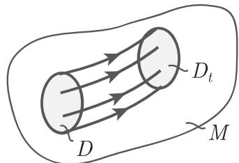
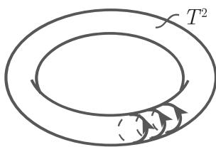
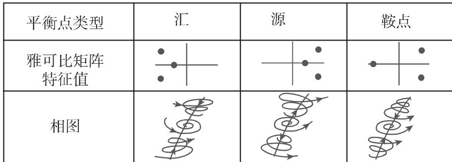
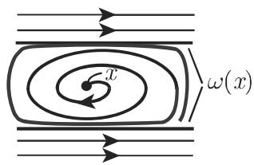
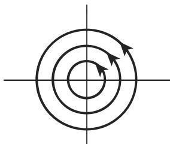
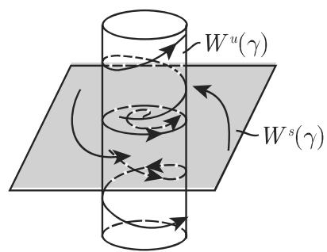
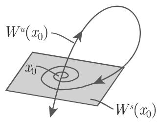
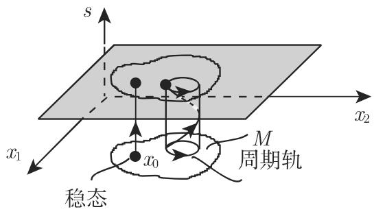
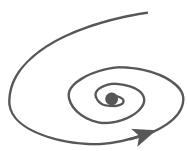

# 数学手册(原书第10版) 17.1.2 常微分方程的定性理论

本页是《数学手册（原书第10版）》第 17 章（常微分方程）17.1.2 节的入库摘要。该节系统给出常微分方程定性理论（动力系统理论）的骨架：流的存在性与相空间结构、线性方程、稳定性理论、不变流形、庞加莱映射与拓扑等价。这是本 wiki 首个第 17 章来源，与既有 16.x（概率论与数理统计）系列无内容重叠，但沿用同一入库方法（按式段转录复算，见各 finding 页）。正文残留德文 "oder"，与 16.x 系列一致，提示转写自德文原书。

## 章节结构

- 17.1.2.1 流的存在性、相空间结构：自治/非自治、解的延拓（温特纳—康蒂法则）、相图、刘维尔定理
- 17.1.2.2 线性微分方程：解空间结构、常数变易法、矩阵指数函数、弗洛凯定理
- 17.1.2.3 稳定性理论：李雅普诺夫稳定性/轨道稳定性、李雅普诺夫函数、双曲平衡点分类、周期轨乘子、极限集与极限环、庞加莱—本迪克松定理、不变环面
- 17.1.2.4 不变流形：稳定/不稳定流形（分界面）、阿达马—佩龙定理、三维分类（表 17.1）、同宿/异宿轨
- 17.1.2.5 庞加莱映射：自治系统与时间周期系统两种构造
- 17.1.2.6 拓扑等价：拓扑等价/拓扑共轭、格罗布曼—哈特曼定理

## 关键公式（按源转录）

```latex
(17.11)  ẋ = f(t, x)                                        % 非自治方程；经 x_{n+1}:=t 自治化
(17.12)  dV_t/dt = ∬_{D_t} div f(x₁,x₂,x₃) dx₁dx₂dx₃       % n=3 形式；∬ 疑为 ∭
(17.13a) ẋ = A(t)x + b(t)        (17.13b) ẋ = A(t)x
(17.13c) Ẇ(t) = rank A(t)·W(t)   % rank 疑为 tr（刘维尔公式，本节最重要数学疑误）
(17.13d) φ = Φ(t)Φ(τ)⁻¹p + ∫_τ^t Φ(t)Φ(s)⁻¹b(s) ds          % 常数变易法
(17.15)  e^{At} = E_n + At/1! + A²t²/2! + … = Σ_{i≥0} (At)^i/i!
(17.16a/b) 李雅普诺夫稳定 / 渐近稳定的量词定义
(17.17)  Σρ_j = Tr Φ_{x₀}(T)；Πρ_j = det Φ_{x₀}(T) = exp(∫₀^T div f(φ(t,x₀)) dt)
(17.18)  Wˢ(γ) = {x : ω(x)=γ}，Wᵘ(γ) = {x : α(x)=γ}
(17.19a) ẋ = −x，ẏ = y + x²
(17.19b) φ(t,x₀,y₀) = (e⁻ᵗx₀， eᵗy₀ + (x₀²/3)(eᵗ − e⁻²ᵗ))
(17.20a) Eˢ = {y : e^{Df(x₀)t}y → 0 (t→+∞)}   (17.20b) Eᵘ = {y : e^{Df(x₀)t}y → 0 (t→−∞)}
(17.21)  ẋ = −y + x(1−x²−y²)，ẏ = x + y(1−x²−y²)，ż = αz   (α>0)
(17.22)  ẋ = g(x)
```

方程 (17.9a) 的周期轨算例（本节反复回指，原式在未入库前文 17.1.1）：

```latex
A(t) = Df(φ(t,(1,0))) = [[−2cos²t, −1−sin2t], [1−sin2t, −2sin²t]]
Φ₍₁,₀₎(t) = [[e⁻²ᵗcos t, −sin t], [e⁻²ᵗsin t, cos t]]
          = [[cos t, −sin t], [sin t, cos t]]·[[e⁻²ᵗ, 0], [0, 1]]   % 弗洛凯表示
div f(x,y) = 2 − 4x² − 4y²，div f(cos t, sin t) ≡ −2
ρ₁ = e⁻⁴π，ρ₂ = 1；P(r) = [1 + (r⁻² − 1)e⁻⁴π]^{−1/2}，P(1)=1，P′(1)=e⁻⁴π < 1
```

## 表 17.1 三维相空间中的稳态类型（按源转录）

特征多项式 $\det(\lambda E-A)=\lambda^3+p\lambda^2+q\lambda+r$，$\delta=pq-r$，$\varDelta=-p^2q^2+4p^3r+4q^3-18pqr+27r^2$：

| 参数域 | Δ | 平衡点类型（按源） | 特征多项式根 | Wˢ/Wᵘ 维数 |
|---|---|---|---|---|
| δ>0; q>0, r>0 | Δ<0 | 稳定结点 | Im λⱼ=0, λⱼ<0 | dim Wˢ=3, dim Wᵘ=0 |
| δ>0; q>0, r>0 | Δ>0 | 稳定焦点 | Re λ₁,₂<0, λ₃<0 | dim Wˢ=3, dim Wᵘ=0 |
| δ<0; r<0, q>0 | Δ<0 | 不稳定结点 | Im λⱼ=0, λⱼ>0 | dim Wˢ=0, dim Wᵘ=3 |
| δ<0; r<0, q>0 | Δ>0 | 不稳定焦点 | Re λ₁,₂>0, λ₃>0 | dim Wˢ=0, dim Wᵘ=3 |
| δ>0; r<0, q≤0 oder r<0, q>0 | Δ<0 | “稳定结点”〔疑为鞍结点〕 | Im λⱼ=0, λ₁,₂<0, λ₃>0 | dim Wˢ=2, dim Wᵘ=1 |
| δ>0; r<0, q≤0 oder r<0, q>0 | Δ>0 | “稳定焦点”〔疑为鞍焦点〕 | Re λ₁,₂<0, λ₃>0 | dim Wˢ=2, dim Wᵘ=1 |
| δ<0; r>0, q≤0 oder r>0, q>0 | Δ<0 | “稳定节点”〔疑为鞍结点〕 | Im λⱼ=0, λ₁,₂>0, λ₃<0 | dim Wˢ=1, dim Wᵘ=2 |
| δ<0; r>0, q≤0 oder r>0, q>0 | Δ>0 | “稳定焦点”〔疑为鞍焦点〕 | Re λ₁,₂>0, λ₃<0 | dim Wˢ=1, dim Wᵘ=2 |

注："oder" 为德文“或”的翻译残留；类型栏的〔疑为…〕为本 wiki 复算后加注（见 [[表17-1鞍点行类型标注之辨]]）。

## 经复算验证的主要结果

- ρ₁ = e⁻⁴π 经弗洛凯表示与散度积分两法一致；P(r) 公式与 P′(1)=e⁻⁴π 复算成立（属方程 (17.9a) 的周期轨）。
- (17.19a) 的解式 (17.19b)、Wˢ={y₀+x₀²/3=0}、Wᵘ={x₀=0} 复算成立；幂级数法得 h(x)=−x²/3（a₂=−2/3，aₖ=0，k≥3），与精确流形一致。
- (17.21)：乘子 ρ₁=e⁻⁴π、ρ₂=e^{2πα}、ρ₃=1 及 Wˢ={z=0}∖{0}、Wᵘ={x²+y²=1} 复算成立。
- 洛伦茨系统 (17.2)：div ≡ −(σ+1+b)，V_t = V₀e^{−(σ+1+b)t} 复算成立；r≈13.926 的同宿分界线环与文献值一致。
- 哈密顿系统 div≡0（Schwarz 定理）成立；例 C（ρ₁=ρ₂=1 仍渐近稳定）自洽：沿轨 div = 2f(1)+2f′(1)=0 ⟹ ρ₁=1。
- 线性拓扑等价例（A=[[−1,−3],[−3,−1]]，B=[[4,0],[0,−8]]）：复算得 RA=(B/2)R，故 Re^{At}=e^{Bt/2}R，τ(t,x)=t/2 精确成立。
- 表 17.1 参数域与 Routh–Hurwitz 判据一致，但 Δ 公式是标准三次判别式的相反符号约定。

## 两处实质性数学疑误（置顶标注）

1. 式 (17.13c) 的 "rank A(t)" 疑为 "tr A(t)"（德文 Spur 记号转写讹误），见 [[式17-13c中rank疑为tr之辨]]。
2. 平衡点 (m,k) 分类的 "k=n−1−m" 与 "m=n 时为汇” 自相矛盾（应为 k=n−m），见 [[平衡点k为n-1-m与m为n矛盾之辨]]。

各定量断言的归属：div≡−(σ+1+b) 属洛伦茨系统 (17.2)；ρ₁=e⁻⁴π 与 P(r) 属 (17.9a)；Wˢ/Wᵘ 显式式属 (17.19a) 与 (17.21)；h(x)=−x²/3 属 (17.19a)；RA=(B/2)R 属上述 A/B 线性系统对；dV/dt=−2x²y² 属（重构后的）李雅普诺夫算例。断言不可跨系统转移。

## 回指缺口

本节依赖 (17.1)（自治方程与流）、(17.2)（洛伦茨系统）、(17.3)（离散系统）、(17.9a)（极限环方程）的原始定义，它们位于尚未入库的前文，见 [[17-1-2未入库回指缺口]]。

## 与既有 wiki 的联系

既有 wiki 全部属第 16 章（概率论与数理统计），本源开启第 17 章，无跨源矛盾。弱关联：16.2.6 的泊松过程、生灭过程均以微分方程定义，可与本节的流、轨道、平衡点语言互见；16.4 的 [[高斯误差传播定律]] 与刘维尔公式同属“线性化传播”思想。

## 图版

本节含图 17.2–17.10 共 19 幅插图（`media/10-数学手册原书第10版--15-1712-常微分方程的定性理论--1ga824h/`），为相图与流形示意图，内容未转录，相关疑误记录于 [[17-1-2全节系统性转写讹误清单]]。

<!-- llm-wiki:embedded-images -->
## Embedded Images

### Document

















<!-- llm-wiki:embedded-images -->
