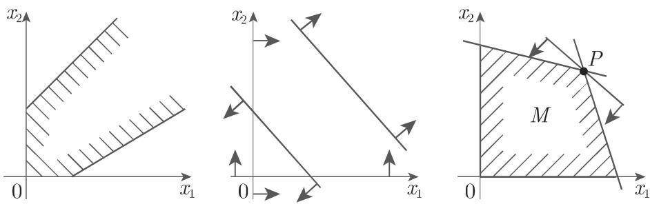
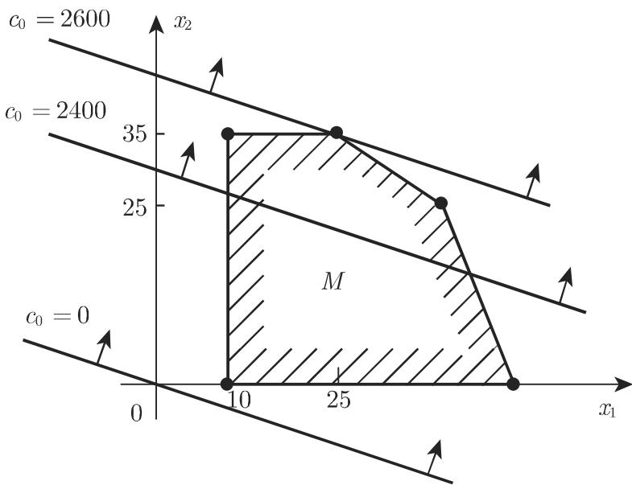

# 数学手册(原书第10版) 18.1.1 问题的提法和几何表达

本节是《数学手册(原书第10版)》第 18 章（最优化）的首节，主题为线性规划问题的提法与几何表达：线性目标函数（OF）在有限个线性方程或不等式约束（CT）下求极大或极小。18.1.1.1 依次给出目的、一般形式（式 18.1、18.2）、约束的符号统一、极小问题的转化（式 18.3）、整数规划的排除声明、仅含非负变量与松弛变量的表达（式 18.4、18.5）与可行集定义（式 18.6）；18.1.1.2 以生产两种产品（E₁、E₂）、消耗三种原材料（R₁、R₂、R₃）的利润最大化算例演示二维图解法。本节不含人名实体，是本维基收录的首个数学规划章节（此前各源均属第 17 章动力系统）。

## 一、结构性数据（verbatim 转录）

### 一般形式（式 18.1a/b）

```text
OF:  f(x) = c₁x₁ + ⋯ + cᵣxᵣ + c_{r+1}x_{r+1} + ⋯ + cₙxₙ = max!
CT:  a_{1,1}x₁ + ⋯ + a_{1,n}xₙ ⩽ b₁
     ⋮
     a_{s,1}x₁ + ⋯ + a_{s,n}xₙ ⩽ b_s
     a_{s+1,1}x₁ + ⋯ + a_{s+1,n}xₙ = b_{s+1}
     ⋮
     a_{m,1}x₁ + ⋯ + a_{m,n}xₙ = b_m
     x₁ ⩾ 0, ⋯, xᵣ ⩾ 0;  x_{r+1}, ⋯, xₙ 自由
```

（CT 部分编号 (18.1b)，原文两处误作 "(18.lb)"。）

### 分块向量形式（式 18.2a–e）

```text
OF:  f(x) = (c¹)ᵀx¹ + (c²)ᵀx² = max!
CT:  A₁₁x¹ + A₁₂x² ⩽ b¹
     A₂₁x¹ + A₂₂x² = b²
     x¹ ⩾ 0,  x² 自由
```

分块向量 c¹, c², x¹, x² 与分块矩阵 A₁₁, A₁₂, A₂₁, A₂₂ 按非负变量（前 r 个）与自由变量（后 n−r 个）的分界切分（式 18.2c–e），与式 18.1a 逐项对应。

### 极小问题的转化（式 18.3）

```text
−f(x) = max!
```

### 等式约束、全非负变量的形式（式 18.4a/b）

```text
OF:  f(x) = c₁x₁ + ⋯ + cₙxₙ = max!
CT:  a_{1,1}x₁ + ⋯ + a_{1,n}xₙ = b₁
     ⋮
     a_{m,1}x₁ + ⋯ + a_{m,n}xₙ = b_m
     x₁ ⩾ 0, ⋯, xₙ ⩾ 0
```

### 标准形式（式 18.5a/b）

```text
OF:  f(x) = cᵀx = max!
CT:  Ax = b,  x ⩾ 0
```

一般可假定 m ⩽ n，否则方程组会包含线性相关或相互矛盾的方程。（原文此处「这里□是增加了的变量数」脱一主字，疑为 n，见 [[queries/标准化叙述脱字疑为n之辨]]。）

### 可行集与解点（式 18.6a/b）

```text
M = {x ∈ ℝⁿ : x ⩾ 0, Ax = b}
f(x*) ⩾ f(x),  ∀x ∈ M  ⟹  x* 为线性规划问题的极大点（解点）
```

解点 x* 的非松弛变量分量构成原问题的解。

### 生产计划算例（18.1.1.2 第 1 条）

表 18.1（每单位产品的原材料消耗，末行为可利用总数）：

| | R₁/Eᵢ | R₂/Eᵢ | R₃/Eᵢ |
|---|---|---|---|
| E₁ | 12 | 8 | 0 |
| E₂ | 6 | 12 | 10 |
| 总数 | 630 | 620 | 350 |

每单位 E₁、E₂ 的利润（PR）分别为 20 与 60；要求至少生产 10 个单位 E₁。设 x₁、x₂ 为两种产品的产量：

```text
OF:  f(x) = 20x₁ + 60x₂ = max!
CT:  12x₁ +  6x₂ ⩽ 630
      8x₁ + 12x₂ ⩽ 620
     10x₂        ⩽ 350
      x₁         ⩾ 10
```

引入松弛变量 x₃, x₄, x₅, x₆：

```text
max  20x₁ + 60x₂ + 0·x₃ + 0·x₄ + 0·x₅ + 0·x₆
s.t. 12x₁ +  6x₂ + x₃                    = 630
      8x₁ + 12x₂      + x₄               = 620
     10x₂                 + x₅           = 350
     −x₁                      + x₆       = −10
```

## 二、核心主张

1. **形式归约链**：任何线性规划问题（一般形式 18.1/18.2）可经四步化为标准形式（18.5）——「⩾」约束乘 (−1)；极小问题化为 −f = max!（18.3）；自由变量分解 xₖ = xₖ¹ − xₖ²；不等式加松弛变量化为等式。详见 [[concepts/线性规划标准形式]]、[[concepts/松弛变量]]、[[methodology/线性规划标准化流程]]、[[comparisons/线性规划一般形式与标准形式比较]]。
2. **算例与图解**：可行集 M 为诸半平面之交（本例为多边形区域）；目标等值线（水平线）族 20x₁ + 60x₂ = c₀ 平行移动，解点为 (x₁, x₂) = (25, 35)，位于水平线 20x₁ + 60x₂ = 2600 上。复算核验见 [[findings/生产计划算例解点25-35复算]]；流程见 [[methodology/二维线性规划图解法流程]]。
3. **几何性质**：M 可无界或为空；多于两条边界直线穿过的顶点称退化的；M 有界时至少一个顶点使目标函数取最大值（以「显然」带过、未证明），M 无界时目标函数可能无界。相关概念页：[[concepts/可行集]]。

## 三、复算核验摘要

详见 [[findings/式18-1至18-6一般形式标准形式与可行集转录复算]] 与 [[findings/生产计划算例解点25-35复算]]：公式体系自洽，未发现推导或数值错误；f(25, 35) = 2600 与原文水平线一致；(25, 35) 处 8x₁ + 12x₂ = 620 与 10x₂ = 350 为紧约束，12x₁ + 6x₂ = 510 ⩽ 630，x₁ = 25 ⩾ 10；候选顶点 (40, 25) 与 (10, 35) 的目标值均为 2300 < 2600，故 (25, 35) 确为最优。

## 四、表述弱点

- 「有界可行集上至少一个顶点使目标函数取最大值」未证明即称「显然」，且未声明 M 非空的必要性（此即线性规划基本定理的内容，本节未给出）；
- m ⩽ n 的论述把「线性相关」与「相互矛盾」并列为仅有的两种可能，表述略粗（相关方程仍可能相容）。

## 五、配图






（原文表题、图题均脱「表」「图」字，仅有编号。）

## 六、转写讹误与开放问题

本节存在与已入库各节一致的系统性 OCR 转写讹误（「于」讹作「千」共 9 处，另有编号、符号、脱字、衍字等），逐条清单见 [[queries/18-1-1全节系统性转写讹误清单]]；未入库概念与跨节比对缺口见 [[queries/18-1-1未入库回指缺口]]；重点疑辨：[[queries/标准化叙述脱字疑为n之辨]]、[[queries/利润表述20-60疑脱或字之辨]]、[[queries/多边形区域主语M脱落之辨]]。

## 七、与现有维基的关系

现有索引全部集中于第 17 章（动力系统、混沌、分岔，如 [[sources/10-数学手册原书第10版--10-1732-过渡到混沌--6qzk4d]]），本源为第 18 章首节，主题（最优化）与现有内容零重叠，不构成对任何现有页的加强或挑战。但作业范式完全延续既有模式：分节建 source 页、公式逐条「转录复算」findings、流程化 methodology、系统性「转写讹误清单」与「未入库回指缺口」queries（对照 [[queries/17-3-2全节系统性转写讹误清单]]）。

<!-- llm-wiki:embedded-images -->
## Embedded Images

### Document


<!-- llm-wiki:embedded-images -->
