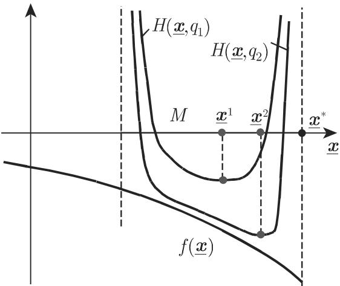

# 数学手册(原书第10版) 18.2.8 罚函数法和障碍函数法

## 概述

本节阐述把约束[[concepts/非线性优化问题|非线性优化]]问题转化为一列[[concepts/无约束优化问题|无约束问题]]的两类经典方法：[[concepts/罚函数法]]（18.2.8.1，以补偿项惩罚可行集外的偏离，通称外点法）与[[concepts/障碍函数法]]（18.2.8.2，以障碍项把迭代点限制在可行集内部，通称内点障碍法）。方法的基本原理是修正目标函数：修正后的子问题"例如可以通过 18.2.5 给出的方法求解"（见 [[sources/10-数学手册原书第10版--13-1825-无约束问题的解法--7al1tk]]）；通过适当构造修正的目标函数，"这一修正问题解点列的每个聚点都是原问题的一个解"。本节含两个完整解析算例（同一问题 $\min x_1^2+x_2^2,\ x_1+x_2\geqslant 1$）与两张示意图（图 18.11、图 18.12）。本节未出现人名。

## 18.2.8.1 罚函数法

原问题与替代问题列（原文式转录）：

$$
f(\underline{\boldsymbol{x}})=\min!,\quad \text{约束条件为 } g_i(\underline{\boldsymbol{x}})\leqslant 0\ (i=1,\dots,m)\tag{18.107}
$$

$$
H(\underline{\boldsymbol{x}},p_k)=f(\underline{\boldsymbol{x}})+p_k S(\underline{\boldsymbol{x}})=\min!,\quad \underline{\boldsymbol{x}}\in\mathbb{R}^n,\ p_k>0\ (k=1,2,\dots)\tag{18.108}
$$

$$
S(\underline{\boldsymbol{x}})=\begin{cases}=0,&\underline{\boldsymbol{x}}\in M\\ >0,&\underline{\boldsymbol{x}}\notin M\end{cases}\tag{18.109}
$$

即让[[concepts/可行集]] $M$ 用一"补偿"项 $p_k S(\underline{\boldsymbol{x}})$ 进行惩罚；问题 (18.108) 通过一列趋于无穷的罚参数 $p_k$ 来求解，于是

$$
\lim_{k\to\infty}H(\underline{\boldsymbol{x}},p_k)=f(\underline{\boldsymbol{x}}),\quad \underline{\boldsymbol{x}}\in M.\tag{18.110}
$$

（库注：$x\in M$ 时 $S=0$，故 $H(x,p_k)=f(x)$ 对一切 $k$ 成立，该极限陈述退化为恒等式，原意是否另有所指待核，见 [[queries/18-2-8全节系统性转写讹误清单]]。）若 $\underline{\boldsymbol{x}}^k$ 是第 $k$ 个罚问题的解，则

$$
H(\underline{\boldsymbol{x}},p_k)\geqslant H(\underline{\boldsymbol{x}}^{k-1},p_{k-1}),\quad f(\underline{\boldsymbol{x}}^k)\geqslant f(\underline{\boldsymbol{x}}^{k-1}),\tag{18.111}
$$

并且序列 $\{\underline{\boldsymbol{x}}^k\}$ 的每个聚点 $\underline{\boldsymbol{x}}^*$ 都是 (18.107) 的解；**若 $\underline{\boldsymbol{x}}^k\in M$，则 $\underline{\boldsymbol{x}}^k$ 是原问题的解**（罚函数法独有结论）。罚项的合适选择：

$$
S(\underline{\boldsymbol{x}})=\max^r\{0,g_1(\underline{\boldsymbol{x}}),\dots,g_m(\underline{\boldsymbol{x}})\}\quad(r=1,2,\dots)\tag{18.112a}
$$

$$
S(\underline{\boldsymbol{x}})=\sum_{i=1}^m \max^r\{0,g_i(\underline{\boldsymbol{x}})\}\quad(r=1,2,\dots)\tag{18.112b}
$$

若 $f$ 与 $g_i$ 可微，则当 $r>1$ 时罚函数 $H(\underline{\boldsymbol{x}},p_k)$ 在 $M$ 的边界上也可微，从而可以使用解析方法求解辅助问题 (18.108)。

**算例**：$f=x_1^2+x_2^2=\min!$，$x_1+x_2\geqslant 1$；$H=x_1^2+x_2^2+p_k\max^2\{0,1-x_1-x_2\}$（原文此处表达式有转写残乱，据梯度式反推正字）。最优性必要条件为

$$
\nabla H(\underline{\boldsymbol{x}},p_k)=\binom{2x_1-2p_k\max\{0,1-x_1-x_2\}}{2x_2-2p_k\max\{0,1-x_1-x_2\}}=\binom{0}{0}.
$$

两方程相减得到 $x_1=x_2$；方程 $2x_1-2p_k\max\{0,1-2x_1\}=0$ 有唯一解

$$
x_1^k=x_2^k=\frac{p_k}{1+2p_k}\ \xrightarrow{\,k\to\infty\,}\ x_1^*=x_2^*=\lim_{k\to\infty}\frac{p_k}{1+2p_k}=\frac{1}{2}.
$$

复算验证见 [[findings/式18-107至18-112罚函数法框架与算例复算]]。

## 18.2.8.2 障碍函数法

考虑如下一列修正问题：

$$
H(\underline{\boldsymbol{x}},q_k)=f(\underline{\boldsymbol{x}})+q_k B(\underline{\boldsymbol{x}})=\min!,\quad q_k>0.\tag{18.113}
$$

项 $q_kB(\underline{\boldsymbol{x}})$ 用于避免解偏离可行集 $M$——目标函数在接近 $M$ 的边界时会无限增长。正则性条件

$$
M^0=\{\underline{\boldsymbol{x}}\in M: g_i(\underline{\boldsymbol{x}})<0,\ i=1,\dots,m\}\neq\varnothing,\quad \overline{M^0}=M\tag{18.114}
$$

必须满足：$M$ 的内点集非空，且从内部可以逼近到任意边界点（即 $M^0$ 的闭包是 $M$）。函数 $B$ 要求在 $M^0$ 上连续、在边界上增加到无穷大。修正问题 (18.113) 通过一列趋于零的障碍参数 $q_k$ 求解。设 $\underline{\boldsymbol{x}}^k$ 是第 $k$ 个问题 (18.113) 的解，则

$$
f(\underline{\boldsymbol{x}}^k)\leqslant f(\underline{\boldsymbol{x}}^{k-1}),\tag{18.115}
$$

且 $\{\underline{\boldsymbol{x}}^k\}$ 的每个聚点都是 (18.107) 的解。障碍函数的合适选择（**原文两式前置符号均有转写疑讹**，下方按原文转录）：

$$
B(\underline{\boldsymbol{x}})=-\sum_{i=1}^m -\ln(-g_i(\underline{\boldsymbol{x}})),\quad \underline{\boldsymbol{x}}\in M^0\tag{18.116a}
$$

$$
B(\underline{\boldsymbol{x}})=-\sum_{i=1}^m \frac{1}{[-g_i(\underline{\boldsymbol{x}})]^r}\quad(r=1,2,\dots),\quad \underline{\boldsymbol{x}}\in M^0\tag{18.116b}
$$

按字面符号，$B$ 在边界处趋于 $-\infty$，与"在边界上增加到无穷大"的要求及算例所用 $B=-\ln(x_1+x_2-1)$ 冲突；通行形式应为 $B=-\sum_i\ln(-g_i)$ 与 $B=\sum_i[-g_i]^{-r}$，详见 [[queries/式18-116a-b符号双讹之辨]]。

**算例**（同一问题）：$H=x_1^2+x_2^2+q_k(-\ln(x_1+x_2-1))$，$x_1+x_2>1$。梯度条件（原文首分量分母作 $x_1-x_2-1$ 且排成三行，疑讹，见 [[queries/障碍算例梯度首分量分母x1减x2减1疑为x1加x2减1之辨]]）：

$$
\nabla H=\binom{2x_1-q_k\dfrac{1}{x_1+x_2-1}}{2x_2-q_k\dfrac{1}{x_1+x_2-1}}=\binom{0}{0}.
$$

两方程相减得 $x_1=x_2$；$2x_1-q_k\dfrac{1}{2x_1-1}=0$（$x_1>\frac{1}{2}$）蕴含 $x_1^2-\dfrac{x_1}{2}-\dfrac{q_k}{4}=0$，故

$$
x_1^k=x_2^k=\frac{1}{4}+\sqrt{\frac{1}{16}+\frac{q_k}{4}}\ \xrightarrow{\,k\to\infty,\ q_k\to 0\,}\ x_1^*=x_2^*=\frac{1}{2}.
$$

复算验证见 [[findings/式18-113至18-116障碍函数法框架与算例复算]]。

## 数值性态（两法共同的说明）

原文末段：问题 (18.108)、(18.113) 每一步的解并不依赖于前几步的解；应用高阶罚函数和较小的障碍参数往往会引起 (18.108)、(18.113) 的数值解的收敛性问题，"例如，特别是在 (18.2.4) 的方法中"（回指层级待辨，见 [[queries/末段回指18-2-4与18-2-5层级之辨]]）；如果没有好的初始近似的话，使用第 $k$ 个问题的解作为第 $k+1$ 个问题的初始解，收敛行为有可能得到改善（原句语序疑有脱乱）。库注：'每步解不依赖前几步'（数学独立性）与'热启动改善收敛'（数值初值策略）并不矛盾——前者关乎解由子问题唯一确定，后者关乎迭代求解器的初值质量。

## 与本库其他页面的联系

- 问题形式 (18.107) 承接 [[concepts/非线性优化问题]]（18.2.1 式 18.32–18.34 的问题提法）；本节把 18.2.1/18.2.2 的最优性条件路线（[[concepts/库恩—塔克条件]]）推进到构造性求解算法路线。
- 子问题求解工具：[[concepts/下降法]]、[[concepts/线搜索]]（经 [[sources/10-数学手册原书第10版--11-1824-数值搜索程序--nrqoi6]] 的 18.2.4）。
- 式 (18.114) 的内点正则性条件与 [[concepts/斯莱特条件]]、[[concepts/正则性条件]] 同族。
- 两法系统对照见 [[comparisons/罚函数法与障碍函数法比较]]；实施流程见 [[methodology/罚函数法序列无约束化求解流程]]、[[methodology/障碍函数法序列无约束化求解流程]]。
- 转写疑点汇总见 [[queries/18-2-8全节系统性转写讹误清单]] 与 [[queries/18-2-8未入库回指缺口]]。

<!-- llm-wiki:embedded-images -->
## Embedded Images

### Document

<!-- llm-wiki:embedded-images -->
