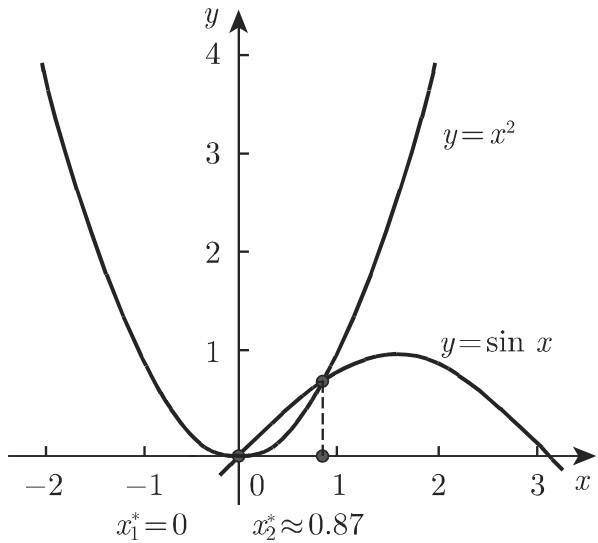
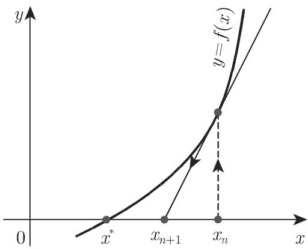
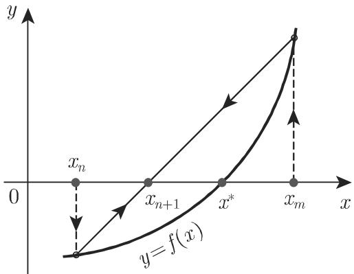

# 数学手册(原书第10版) 19.1 数值求解单变量非线性方程

## 文献定位

本页为《数学手册（原书第10版）》第 19 章首个人库分节；此前本 wiki 仅覆盖第 18 章（18.1 线性规划、18.2 非线性优化），本节无覆盖冲突。全节是单变量非线性方程数值求根的方法总览，含 22 个编号公式（19.1–19.22）、9 个数值算例（本 wiki 编号 A–I）、4 幅插图，分两大块：

- **19.1.1 迭代法**：19.1.1.1 一般迭代法；19.1.1.2 牛顿法（含收敛条件、几何插值、修正牛顿法、复变量适用性）；19.1.1.3 试位法（含收敛性、19.1.1.3.4 斯特芬森方法）。
- **19.1.2 多项式方程的解**：19.1.2.1 霍纳格式（实数与复数情形）；19.1.2.2 根的位置（笛卡儿符号法则、斯图姆序列回指、均匀扫描、根模上界、根轨迹理论指称）；19.1.2.3 数值方法（牛顿法适用性、(19.22) 修正项不动点方程、贝尔斯托法/伯努利方法/格雷费法指称）。

## 公式链 19.1–19.22（逐式转录，[ ] 内为存疑标注）

```text
(19.1)   零形式        f(x) = 0
(19.2)   不动点形式    x = φ(x)
(19.3)   一般迭代法    x_{n+1} = φ(x_n)                    (n = 0,1,…; x_0 给定)
(19.4)   |(φ(x) − φ(x*)) / (x − x*)| ≤ K < 1              (x* 邻域内 ⇒ 收敛)
(19.5)   φ′(x) ≤ K < 1                                    (φ 可导时；[疑脱绝对值 |·|])
(19.6)   牛顿法        x_{n+1} = x_n − f(x_n)/f′(x_n)
(19.7a)  f′(x) ≠ 0                                          (收敛必要条件)
(19.7b)  |f(x)·f″(x)/f′(x)²| ≤ K < 1                        (收敛充分条件)
(19.8)   平方根迭代    x_{n+1} = ½(x_n + a/x_n)            (解 f(x) = x² − a = 0)
(19.9)   修正牛顿法    x_{n+1} = x_n − f(x_n)/f′(x_m)      (m 给定, m < n)
(19.10)  试位法        x_{n+1} = x_n − [(x_n − x_m)/(f(x_n) − f(x_m))]·f(x_n)
(19.11)  p_n(x) = a_n xⁿ + a_{n−1}xⁿ⁻¹ + … + a₁x + a₀ = 0
(19.12)  p_n(x) = (x − x₀)p_{n−1}(x) + p_n(x₀)
(19.13)  p_{n−1}(x) = a′_{n−1}xⁿ⁻¹ + a′_{n−2}xⁿ⁻² + … + a′₁x + a′₀
(19.14)  a′_{k−1} = x₀·a′_k + a_k   (k = n,…,0; a′_n = 0; a′_{−1} = p_n(x₀); a′_{n−1} = a_n)
(19.15)  p_{n−1}(x) = (x − x₀)p_{n−2}(x) + p_{n−1}(x₀)
(19.16)  完整霍纳格式通式表 [撇号与下标系统性乱码，结构由算例 F 的干净表唯一确定]
(19.17)  p_n′(x₀) = 1!·p_{n−1}(x₀),  p_n″(x₀) = 2!·p_{n−2}(x₀),  …,  p_n⁽ⁿ⁾(x₀) = n!·p₀(x₀)
(19.18a) p_n(x) = (x² − px − q)(a′_{n−2}xⁿ⁻² + … + a′₀) + r₁x + r₀
(19.18b) x² − px − q = (x − x₀)(x − x̄₀)，即 p = 2u₀, q = −(u₀² + v₀²)
(19.18c) p_n(x₀) = r₁x₀ + r₀ = (r₁u₀ + r₀) + i·r₁v₀      [源文作 "r₁x"，疑脱下标 0]
(19.18d) 双列霍纳格式表（q 行、p 行交替累加，见下；源文标签讹作 "l9.18d"）
(19.19a) 正实根数 = 系数序列 (a_n, a_{n−1}, …, a₀) 符号变化数，或少一偶数
(19.19b) 负实根数 = 系数序列 (a₀, −a₁, a₂, …, (−1)ⁿa_n) 符号变化数，或少一偶数
(19.20)  f*(r) = |a_{n−1}|rⁿ⁻¹ + |a_{n−2}|rⁿ⁻² + … + |a₁|r + |a₀| = |a_n|rⁿ
(19.21)  |x*ₖ| ≤ r₀   (k = 1, 2, …, n)
(19.22)  δ = (1/f′(x_n))·[f(x_n) + ½f″(x_n) + …] = φ(δ)   [疑脱括号内 δ 因子及前置负号]
```

(19.18d) 双列霍纳格式通式表（转录自源文）：

```text
         a_n      a_{n−1}      a_{n−2}    …    a_3      a_2      a_1      a_0
q  |                   q·a′_{n−2}   …   q·a′_3   q·a′_2   q·a′_1   q·a′_0
p  |        p·a′_{n−2}   p·a′_{n−3}   …            p·a′_2   p·a′_1   p·a′_0
────────────────────────────────────────────────────────────────────
         a′_{n−2}   a′_{n−3}     a′_{n−4}   …   a′_1     a′_0     r_1      r_0
        （其中 a′_{n−2} = a_n）
```

## 数值算例（源文原数据）

**算例 A（图解分离，图 19.1）**：x² − sin x = 0 ⇒ x₁* = 0，x₂* ≈ 0.87。

**算例 B（一般迭代法，x² = sin x ⇒ x_{n+1} = √(sin x_n)，x₀ = 0.87）**：

| n | 0 | 1 | 2 | 3 | 4 | 5 |
|---|---|---|---|---|---|---|
| xₙ | 0.87 | 0.8742 | 0.8758 | 0.8764 | 0.8766 | 0.8767 |
| sin xₙ | 0.7643 | 0.7670 | 0.7681 | 0.7684 | 0.7686 | 0.7686 |

**算例 C（牛顿法/平方根迭代，a = 2，x₀ = 1.5）**：

| n | 0 | 1 | 2 | 3 |
|---|---|---|---|---|
| xₙ | 1.5 | 1.4166666 | 1.4142157 | 1.4142136 |

**算例 D（试位法，f(x) = x² − sin x）**：

| n | Δxₙ = xₙ − xₙ₋₁ | xₙ | f(xₙ) | Δyₙ = f(xₙ) − f(xₙ₋₁) | Δxₙ/Δyₙ |
|---|---|---|---|---|---|
| 0 | — | 0.9 | 0.0267 | — | — |
| 1 | −0.3 | 0.87 | −0.0074 | −0.0341 | 0.8798 |
| 2 | 0.0065 | 0.8765 | −0.000252 | 0.007148 | 0.9093 |
| 3 | 0.000229 | 0.876729 | 0.000003 | 0.000255 | 0.8980 |
| 4 | −0.000003 | 0.876726 | | | |

**算例 E（斯特芬森方法，f(x) = x − √(sin x)）**：

| n | Δxₙ | xₙ | f(xₙ) | Δyₙ | Δxₙ/Δyₙ |
|---|---|---|---|---|---|
| 0 | — | 0.9 | 0.014942 | — | — |
| 1 | −0.03 | 0.87 | −0.004259 | −0.019201 | 1.562419 |
| 2 | 0.006654 | 0.876654 | −0.000046 | 0.004213 | 1.579397 |
| 3 | — | 0.876727 | 0.000001 | | |

**算例 F（霍纳格式，p₄(x) = x⁴ + 2x³ − 3x² − 7，x₀ = 2）**：

```text
          1    2   −3    0   −7
   2 |         2    8   10   20          ⇒ p₄(2)   = 13
          1    4    5   10  |13
   2 |         2   12   34                ⇒ p₄′(2)  = 44
          1    6   17  |44
   2 |         2   16                     ⇒ p₄″(2)  = 2!·33 = 66
          1    8  |33
   2 |         2                           ⇒ p₄‴(2)  = 3!·10 = 60
          1  |10                           ⇒ p₄⁽⁴⁾(2) = 4!·1  = 24
          1

Taylor 展开：p₄(x) = (x−2)⁴ + 10(x−2)³ + 33(x−2)² + 44(x−2) + 13
```

**算例 G（双列霍纳格式，p₄ 在 x₀ = 2 − i，即 p = 4, q = −5）**：

```text
         1     2    −3     0    −7
 −5 |               −5   −30   −80
  4 |           4    24    64
        ————————————————————————
         1     6    16   [34]   −87     ⇒ p₄(x₀) = 34·x₀ − 87 = −19 − 34i
```

**算例 H（笛卡儿符号法则）**：p₅(x) = x⁵ − 6x⁴ + 10x³ + 13x² − 15x − 16；源文正/负根个数数字脱落，按 (19.19a,b) 重构为 3 或 1 个正根、2 或 0 个负根（见 [[queries/笛卡儿算例正负根个数数字脱落之辨]]）。

**算例 I（根模上界，p₄(x) = x⁴ + 4.4x³ − 20.01x² − 50.12x + 29.45）**：

| r | f*(r) | r⁴ | 判定 |
|---|---|---|---|
| 6 | 2000.93 | 1296 | f* > r⁴ |
| 7 | 2869.98 | 2401 | f* > r⁴ |
| 8 | 3963.85 | 4096 | f* < r⁴ |

结论：|x*ₖ| < 8 (k = 1,…,4)；源文并断言最大模根实际满足 −7 < x₁* < −6。

## 主要论断与证据强度（本 wiki 已逐项独立复算）

- [[concepts/一般迭代法]]（19.3–19.5）：压缩条件保证 x* 邻域局部收敛，K 越小越快；算例 B 复算通过（φ′(x*) ≈ 0.365 < 1，6 步收敛至 0.8767）。**强度：高**；(19.5) 转写疑脱绝对值。
- [[concepts/牛顿法（非线性方程求根）]]（19.6–19.8）：(19.7a) 必要、(19.7b) 充分，平方阶收敛；算例 C 复算通过，正确位数约 1→3→6→8。**强度：高**；(19.7a) “必要条件”措辞较松（原书层面表述，非转写讹误）。
- [[concepts/修正牛顿法]]（19.9）：冻结导数、“收敛阶几乎没有任何改变”——无算例。**强度：低**，与标准理论存在张力。
- [[concepts/试位法]]（19.10）：仅需函数值；异号夹逼收敛，m = n−1 加速；算例 D 全表复算一致（4 步至 0.876726）。**强度：高**；几何描述与牛顿法文字雷同存疑。
- [[concepts/斯特芬森方法]]：算例 E 复算一致（3 步至 0.876727）。**算例强度高，方法界定存疑**。
- [[concepts/霍纳格式]]（19.12–19.17）：算例 F 全部结果（13/44/66/60/24）与 Taylor 系数（1,10,33,44,13）独立验证通过。**强度：高**。
- [[concepts/双列霍纳格式]]（19.18a–d，科拉茨）：算例 G 双列表复算通过，且经直接复数代入独立验证 p₄(2−i) = −19 − 34i。**强度：高**。
- [[concepts/笛卡儿符号法则]]（19.19）：定理标准；算例 H 转写脱数。**定理强度高，算例转写有缺**。
- [[concepts/多项式根模上界]]（19.20–19.21）：算例 I 三次试算数值精确复现。**强度：高**（分析师注记：即经典 Cauchy 根模界，源文未命名）。
- 多项式特殊方法（[[concepts/贝尔斯托法]]、[[concepts/伯努利方法]]、[[concepts/格雷费法]]）与根轨迹理论：仅定位性指称，细节在外部文献 [19.38][19.14][19.40]。**强度：低**（本源内不可核验）。
- (19.22) 修正项不动点方程：**转写存疑**（疑脱 δ 因子与负号）。

**总体证据评价**：9 个算例中 8 个（A–G、I）经独立复算全部通过，构成对公式链 19.1–19.21 的强验证；唯算例 H 因转写脱数仅可部分重构。理论断言多为标准数值分析结果，唯修正牛顿法“阶不变”与斯特芬森界定两处存疑。

## 与既有 wiki 的联系

- [[concepts/牛顿法（无约束优化）]]（18.2.5）：本章 (19.6) 是其姊妹变体——优化牛顿法本质上是对梯度函数 ∇f = 0 施加求根牛顿法。见 [[comparisons/牛顿法求根与牛顿法无约束优化比较]]；**不可**把 18.2.5 页的阻尼/线搜索表述移植到 (19.6)（主体不同）。
- [[concepts/阻尼牛顿法]] vs 本章 [[concepts/修正牛顿法]]：名称近似而机制迥异（线搜索步长 vs 冻结导数分母），见 [[comparisons/修正牛顿法与阻尼牛顿法辨析]]。
- 18.2.4 数值搜索程序（[[methodology/黄金分割搜索迭代流程]]、[[concepts/坐标下降法]] 等）：一维极小搜索与本章一维求根同属一维数值问题族；试位法的异号夹逼与黄金分割的区间套缩可作思想层面对照（方法主体不同）。
- 收敛性主题：[[concepts/共轭条件（二次问题有限步终止）]]、[[concepts/选择压力]] 等收敛/终止性刻画可由新概念 [[concepts/收敛阶]] 获得统一语言。

## 转写讹误与存疑点

全节存在系统性 OCR 讹误（儿↔几、千↔于、共辄↔共轭、符号与下标脱落、页码回指格式残缺等），逐项清单见 [[queries/19-1全节系统性转写讹误清单]]；未入库回指（第 1249 页 19.2.2、第 57 页 1.6.3.2、文献 [19.14][19.38][19.40]）见 [[queries/19-1未入库回指缺口]]。

## 插图

- 图 19.1（x² 与 sin x 交点）：
- 图 19.2（一般迭代法几何）：
- 图 19.3（牛顿法切线几何）：
- 图 19.4（试位法几何）：

## 派生页面

- 实体：[[entities/霍纳]]、[[entities/斯特芬森]]、[[entities/科拉茨]]、[[entities/贝尔斯托]]、[[entities/格雷费]]
- 概念：[[concepts/零形式与不动点形式]]、[[concepts/一般迭代法]]、[[concepts/牛顿法（非线性方程求根）]]、[[concepts/修正牛顿法]]、[[concepts/试位法]]、[[concepts/斯特芬森方法]]、[[concepts/收敛阶]]、[[concepts/霍纳格式]]、[[concepts/双列霍纳格式]]、[[concepts/笛卡儿符号法则]]、[[concepts/斯图姆序列]]、[[concepts/多项式根模上界]]、[[concepts/贝尔斯托法]]、[[concepts/伯努利方法]]、[[concepts/格雷费法]]
- 方法论：[[methodology/一般迭代法迭代流程]]、[[methodology/牛顿法与修正牛顿法迭代流程]]、[[methodology/试位法与斯特芬森方法迭代流程]]、[[methodology/霍纳格式求值与求导流程]]、[[methodology/双列霍纳格式复数求值流程]]、[[methodology/多项式根定位流程]]
- 发现：[[findings/式19-1至19-5零形式不动点形式与一般迭代法转录复算]]、[[findings/式19-6至19-9牛顿法与修正牛顿法转录复算]]、[[findings/式19-10试位法公式与算例复算]]、[[findings/斯特芬森方法算例复算]]、[[findings/式19-11至19-17霍纳格式递推与导数公式转录复算]]、[[findings/式19-18a至d双列霍纳格式与复数算例复算]]、[[findings/式19-19至19-21笛卡儿符号法则与根模上界转录复算]]
- 比较：[[comparisons/一般迭代法牛顿法与试位法比较]]、[[comparisons/牛顿法求根与牛顿法无约束优化比较]]、[[comparisons/修正牛顿法与阻尼牛顿法辨析]]、[[comparisons/多项式根定位与特殊求根方法比较]]
- 查询：[[queries/19-1全节系统性转写讹误清单]]、[[queries/19-1未入库回指缺口]]、[[queries/式19-5脱绝对值之辨]]、[[queries/试位法几何插值切线疑为割线之辨]]、[[queries/式19-22括号内脱δ且疑脱负号之辨]]、[[queries/式19-18c之r1x疑为r1x0之辨]]、[[queries/笛卡儿算例正负根个数数字脱落之辨]]、[[queries/修正牛顿法收敛阶几乎不变之说之辨]]、[[queries/斯特芬森方法取点方式与经典定义之辨]]

<!-- llm-wiki:embedded-images -->
## Embedded Images

### Document


<!-- llm-wiki:embedded-images -->
