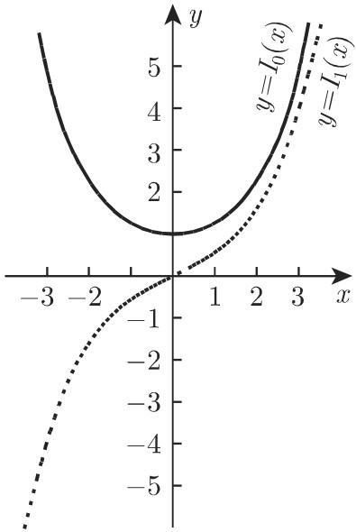
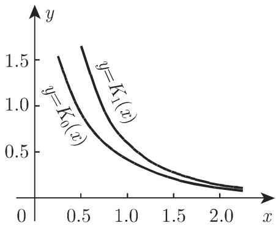

# 数学手册(原书第10版) 9.1.2 高阶微分方程和微分方程组

本源是《数学手册（原书第10版）》第 9 章（常微分方程）小节 9.1.2 的全文，也是本 wiki 首份进入微分方程领域的材料——此前入库内容集中于第 8 章（积分学）。全节自式 9.22a 起至式 9.66h 止，系统覆盖：高阶方程与方程组的基本理论（存在唯一性、通解结构、首次积分）、降阶法四情形、n 阶线性方程理论（朗斯基行列式、刘维尔公式、常数变异法、柯西方法）、常系数方程与方程组（特征方程、赫尔维茨定理、特殊右端、欧拉方程）、二阶变系数方程与幂级数解法，以及贝塞尔、勒让德、超几何、拉盖尔、埃尔米特五大特殊函数族。含十余个完整算例。

## 小节结构

1. **9.1.2.1 基本结果**（式 9.22–9.26）：化组、存在唯一性、利普希茨条件、通解与首次积分。
2. **9.1.2.2 降阶**（式 9.27–9.31）：四情形代换，附三算例（含克莱罗方程奇解）。
3. **9.1.2.3 n 阶线性微分方程**（式 9.32–9.38）：分类、基本解组、朗斯基、刘维尔公式、叠加原理、分解定理、常数变异法与柯西方法（同一算例 9.37d 双解）。
4. **9.1.2.4 常系数线性微分方程的解**（式 9.39–9.44）：算子记号、特征方程、赫尔维茨定理、特殊右端待定系数法、欧拉微分方程。
5. **9.1.2.5 常系数线性微分方程组**（式 9.45–9.48）：正规组、一般组、非齐次组与二阶组。
6. **9.1.2.6 二阶线性微分方程**（式 9.49–9.66）：一般方法与幂级数解法、贝塞尔族、勒让德方程、超几何方程、拉盖尔方程、埃尔米特方程。

## 核心理论结构（关键公式逐字转录）

### 存在唯一性与首次积分

显式 n 阶方程 $y^{(n)}=f(x,y,y',\dots,y^{(n-1)})$ 经 $y_i=y^{(i)}$ 化为 n 元一阶组（9.22a–c）。右端连续且满足利普希茨条件（式 9.24a，公共常数 K）⟹ 初值问题唯一可解且解 n 次连续可微。组的通解有两种表示：诸函数解出（9.26a）或诸常数解出（9.26b）；后者每个关系式 $\varphi_i(x,y_1,\dots,y_n)=C_i$ 是一个**首次积分**，等价于线性偏微分方程

$$
\frac{\partial \varphi_i}{\partial x} + f_1\frac{\partial \varphi_i}{\partial y_1} + \dots + f_n\frac{\partial \varphi_i}{\partial y_n} = 0 \tag{9.26d}
$$

的解。相关概念见 [[利普希茨条件与解的存在唯一性]]、[[首次积分]]。

### 线性理论（式 9.32–9.38）

$$
W = \begin{vmatrix} y_1 & y_2 & \dots & y_n \\ y_1' & y_2' & \dots & y_n' \\ \vdots & \vdots & & \vdots \\ y_1^{(n-1)} & y_2^{(n-1)} & \dots & y_n^{(n-1)} \end{vmatrix}\tag{9.33}
$$

$$
W(x) = W(x_0)\exp\Big(-\int_{x_0}^{x} a_{n-1}(x)\,\mathrm{d}x\Big)\tag{9.34}
$$

由刘维尔公式：W 在一点为零则恒为零 ⟹ 该 n 个解线性相关。已知一解时 $y=y_1u$ 降阶（9.36）；非齐次通解 = 任一特解 + 齐次通解（[[叠加原理与分解定理]]）。求特解两法：[[常数变异法]]（9.37a–c）与 [[柯西方法]]（9.38b），同一算例 $y''+\frac{x}{1-x}y'-\frac{1}{1-x}y=x-1$（9.37d）双法复算均得 $y=C_1^*e^x+C_2^*x-(x^2+1)$。

### 常系数方法（式 9.39–9.44）

特征方程 $P_n(r)=0$（[[特征方程法]]）；重根配 $x^{k-1}e^{r_ix}$ 因子；复根成对取实形式 $A\cos(\beta x+\varphi)$。[[赫尔维茨定理]]（式 9.41a–b）判定全根负实部：

$$
D_1 = a_1,\quad D_2 = \begin{vmatrix} a_1 & a_0 \\ a_3 & a_2 \end{vmatrix},\quad D_3 = \begin{vmatrix} a_1 & a_0 & 0 \\ a_3 & a_2 & a_1 \\ a_5 & a_4 & a_3 \end{vmatrix},\ \dots\tag{9.41b}
$$

注意：手册将多项式按 9.41a 写作 $a_nx^n+\dots+a_1x+a_0=0$（降幂），而 9.41b 的行列式按升幂下标排列——这等价于对倒序系数多项式用标准 Hurwitz 判据，数学上自洽，但与通行下标约定相反，且节内未明示 $a_0\neq0$/同号前提（或在未入库的 9.14b 处给出）。

特殊右端结论（各有归属，不得互换）：
- $F=Ae^{\alpha x},\ P_n(\alpha)\neq0 \Rightarrow y=Ae^{\alpha x}/P_n(\alpha)$（9.42b）
- $\alpha$ 为 m 重根时 $y=Ax^me^{\alpha x}/P_n^{(m)}(\alpha)$（9.42c）
- $F=Ae^{\alpha x}\cos\omega x$ 或 $\sin$：化为 $Ae^{(\alpha+\mathrm{i}\omega)x}$ 取实/虚部（9.42d–e，分解定理）
- $F=Q_n(x)e^{\alpha x}$：$y=x^mR(x)e^{\alpha x}$，系数由唯一可解线性方程组确定（9.43）

[[欧拉微分方程]]（9.44a–b）：$\sum a_k(cx+d)^ky^{(k)}=F$，代换 $cx+d=e^t$ 化常系数。

### 常系数组（式 9.45–9.48）

正规组特征方程为系数矩阵行列式（9.45b）；单根给 $A_ke^{r_ix}$，m 重根给至多 m−1 次多项式系数（次数可以更低）；**对称阵（$a_{ik}=a_{ki}$）只需常数**。本源 3×3 算例矩阵非对称且特征值 1 的几何重数为 1（亏缺），恰需多项式系数，内部自洽。$\det(a_{ik})\neq0$ 时一般组化正规组（9.46）；二阶组用 $\det(a_{ik}r^2+b_{ik}r+c_{ik})=0$（9.48）。详见 [[常系数线性微分方程组]]。

### 二阶变系数与幂级数（式 9.49–9.51）

已知一解时由刘维尔公式得第二解 $y_2=Ay_1\int e^{-\int p}/y_1^2\,dx$（9.49d）与特解积分式 9.49e；解析系数 ⟹ 幂级数（9.50b）；正则奇点 ⟹ 定义方程（指标方程）$r(r-1)+p(0)r+q(0)=0$（9.51c）。见 [[幂级数解法与定义方程]]。

### 贝塞尔族（式 9.52–9.57）

$$
J_n(x) = \frac{x^n}{2^n\Gamma(n+1)}\Big(1-\frac{x^2}{2(2n+2)}+\frac{x^4}{2\cdot4(2n+2)(2n+4)}-\dots\Big)=\sum_{k=0}^{\infty}\frac{(-1)^k(\frac{x}{2})^{n+2k}}{k!\,\Gamma(n+k+1)}\tag{9.53a}
$$

其余：[[韦伯函数]] $Y_n$ 极限定义（9.53c）、[[变形贝塞尔函数与麦克唐纳函数]] $I_n$（全正号级数，9.54a）与 $K_n$（9.54c）、递推（9.55a 对 J **与 Y** 成立；9.55b **仅对 I**）、半奇数阶初等表示（9.56）、渐近式（9.57a 属 J、b 属 I、c 属 Y、d 属 K，互不通用）、积分表示（9.55d–f）。数值表见表 [[表21-11贝塞尔函数值表]]。

⚠️ 式 9.55f 印作 $-\frac{(\mathrm{i})^n}{\pi}\int_0^\pi e^{ix\cos\varphi}\cos n\varphi\,d\varphi$，取 $n=0$ 得 $-J_0$，自相矛盾；独立复算支持应为 $\frac{(-\mathrm{i})^n}{\pi}$。

### 球面贝塞尔与平面波展开（式 9.58–9.59）

见 [[球面贝塞尔函数]]：瑞利公式（9.58b）、$j_0,j_1,n_0,n_1$ 显式（9.58c–d）、Kasterin 公式（9.59b，源文印作"Kasterining"，疑为转写讹误）、平面波展开（9.59c）、加法定理（9.59d–e）与 [[克莱布希—戈丹系数]] 的三球谐积分定义（9.59f）。

### 勒让德 / 超几何 / 拉盖尔 / 埃尔米特（式 9.60–9.66）

见 [[勒让德多项式]]（Rodrigues 公式 9.60c、$P_0$–$P_7$ 显式表 9.60d–k、五条性质 9.61）、[[第二类勒让德函数Q-n]]（两区域表达式 9.62）、[[超几何级数]]（9.63–9.64，含五个初等特值）、[[拉盖尔多项式]]（9.65，正交范数 $\binom{n+\alpha}{n}\Gamma(1+\alpha)$）、[[埃尔米特多项式]]（9.66，两型 $He_n$/$H_n$ 及关系 $He_n=2^{-n/2}H_n(x/\sqrt2)$）。

⚠️ 称谓张力：书称 $P_n,Q_n$ 为"相伴勒让德函数"，通行术语中 associated Legendre functions 指 $P_n^m$（$m=0$ 方为 $P_n$）；需对照 9.2.4.6 (9.138c) 确认原意。

## 算例独立复算总览

对本源全部算例做了独立复算，结果：

| 算例 | 位置 | 复算结论 |
|---|---|---|
| $yy''-y'^2=0$（p 代换 / $z=y'/y$ 两解法） | 9.1.2.2 情形 1、3 | ✅ 均得 $y=Ce^{C_1x}$，$p=0$ 不丢解 |
| $y''-xy'''+(y''')^3=0$ | 9.1.2.2 情形 2 | ✅ 奇解复算通过；⚠️ 克莱罗通解印作 $p=C_1x+C_1^3$，代入不满足，应为减号 |
| $y''+\frac{x}{1-x}y'-\frac{1}{1-x}y=x-1$ | 9.37d 常数变异 | ✅ 全程复算通过 |
| 同一方程 | 9.38 柯西方法 | ✅ 复算通过；⚠️ 积分上限印作 $\int_{x_0}^{\infty}$，与式 9.38b 的 $\int_{x_0}^x$ 矛盾 |
| $y^{(6)}+y^{(4)}-y''-y=0$ | 9.40 | ✅ $(r^2+1)^2(r^2-1)$，两种实形式通解 |
| $y''-6y'+8y=e^{2x}$ | 9.42 | ✅ $P(2)=0$，$P'(2)=-2$，特解 $-\frac{xe^{2x}}{2}$ |
| $y''+y'+y=e^x\sin x$ | 9.42 | ✅ 分母 $2+3i$，虚部 $\frac{e^x}{13}(2\sin x-3\cos x)$ |
| $y^{(4)}+2y'''+y''=6x+2x\sin x$ | 9.43 | ✅ 全部系数与通解复算通过 |
| $x^2y''-5xy'+8y=x^2$ | 9.44 | ✅ 化为 $\ddot y-6\dot y+8y=e^{2t}$，$y=C_1x^2+C_2x^4-\frac{x^2}{2}\ln|x|$ |
| 3×3 正规组 | 9.45 | ✅ $-(r-6)(r-1)^2$；通解全部验证 |
| 2×2 齐次/非齐次组 | 9.46–9.47 | ✅ $2r^2+2r-4=0$；特解代回验证通过 |
| $y''+xy=0$ 幂级数 | 9.50 | ✅ 系数与级数全部吻合 |
| 贝塞尔递推、$J$/$I$ 级数 | 9.52d、9.53a、9.54a | ✅ |
| $J_{2n},J_{2n+1}$ 积分表示 | 9.55d–e | ✅ |
| $J_n$ 复积分表示 | 9.55f | ❌ $-(\mathrm{i})^n$ 在 $n=0$ 给出 $-J_0$，自败；应为 $(-\mathrm{i})^n$ |
| 半奇数阶、渐近式、瑞利公式 | 9.56–9.58 | ✅ |
| $P_0$–$P_7$、递推/正交/母函数、$Q_0$ | 9.60–9.62 | ✅ |
| 超几何特值 9.64a–e | 9.64 | ✅ 五式全部标准且验证 |
| 拉盖尔范数、$L_1^{(\alpha)}$、递推 | 9.65 | ✅ |
| 埃尔米特 $He_2,He_3,He_4$、$He$–$H$ 关系 | 9.66 | ✅ |

**证据强度**：手册内容为标准数学结果；除注明条目外全部复算通过。发现的异常集中在转写层面（符号、积分上限、下标、图号），支持"原书正确、OCR 转写致误"的假设。

## 与既有 wiki 的连接

- **开启第 9 章**：本源是 wiki 首份微分方程内容，将知识版图从积分学扩展到常微分方程。
- **强化既有页**：[[伽马函数]] —— 式 9.53a、9.54a、9.65e 使用 $\Gamma$ 并显式回指 8.2.5, 6（第 682 页），对应已入库源 [[sources/10-数学手册原书第10版--21-825-由级数展开式进行积分特殊非初等函数--1m15n]]。
- **概念衔接**：式 9.31c 的 n 重积分 Cauchy 公式 $\psi(x)=\frac{1}{(n-1)!}\int_{x_0}^x f(t)(x-t)^{n-1}dt$ 与 [[累次积分]] 相连。
- **为 9.2 预置对象**：$j_l$、$n_l$、$Y_L$、$C_{LL_1L_2}$ 等将在 9.2（数学物理）高复用。

## 已识别的转写讹误与存疑点

1. 克莱罗通解符号：$p=C_1x+C_1^3$ 代入不满足方程，应为 $p=C_1x-C_1^3$（后续 y 式恰与减号版本一致）。
2. 柯西方法算例积分上限 $\int_{x_0}^{\infty}$ 与式 9.38b 的 $\int_{x_0}^x$ 矛盾，且被积函数在 $\infty$ 发散。
3. 式 9.55f 的 $-(\mathrm{i})^n$ 应为 $(-\mathrm{i})^n$。
4. 式 9.63b 收敛性自相矛盾："$x=-1$ 时如果 $\delta<0$ 绝对收敛"与紧随的"$-1<\delta\leq0$ 条件收敛、$\delta\leq-1$ 发散"不能并存；标准定理为 $\delta>0$ 绝对收敛。
5. 图号冲突：正文称勒让德图像在"图 9.15"，而图题为 9.16（9.15 为 $K_0,K_1$）；"从 n=l $n=7$"为"从 $n=1$ 到 $n=7$"之讹。
6. 人名讹误："Kasterining 公式"疑为 "Kasterin 公式"。
7. 系统性 OCR 讹误：千↔于、幕→幂、儿何→几何、共辄→共轭、儿个→几个；孤立变量脱漏（$n$、$m$、$x$、$K$、$\Gamma$、$F$、$D$、$A$、第一/第二等约三十处）；杂散字符（巴、九、凡、门、曰－、stray ？）；式 9.53a 的 `\tag{（}`、式 9.66c 的 `\tag{(n∈ℕ)}`、空标签 (9.55c)；$\cos\beta$/$\sin\beta$ 脱漏自变量 x；"$y_1'+8y_1+-3y_2$" 连写。
8. 回指缺口：9.1.1.1、9.14b、9.2.2.3、9.2.4.6、2.18.2.5、4.5.2.1、5.3.4.7、13.2.6.1、2.1.4.9、表 21.11/21.12、文献 [9.26]–[9.31]、[21.1] 均未入库。

## 配图

- 图 9.12：$J_0, J_1$ 图像
- 图 9.13：$Y_0, Y_1$ 图像
- 图 9.14：$I_0, I_1$ 图像
- 图 9.15：$K_0, K_1$ 图像
- 图 9.16：$P_n$ 图像

<!-- llm-wiki:embedded-images -->
## Embedded Images

### Document

<!-- llm-wiki:embedded-images -->
