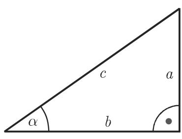
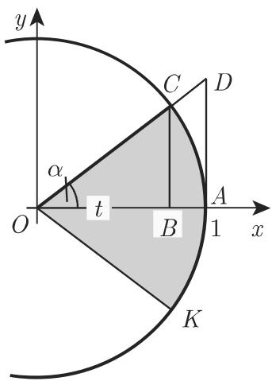
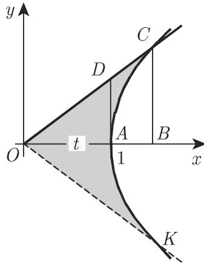

# Source: 数学手册(原书第10版)/3.1.2 圆函数与双曲函数的几何定义.md

# 源文档分析：数学手册(原书第10版) 3.1.2 圆函数与双曲函数的几何定义

## 关键实体

| 候选 | 类型 | 角色与意义 | 是否已在 wiki | 判定 |
|---|---|---|---|---|
| 数学手册(原书第10版) 3.1.2 节 | 源文献（手册分节） | 本分析对象：以单位圆与等轴双曲线给出圆函数与双曲函数的几何定义 | 否（项目惯例为每节建一个 source 页） | Page-worthy: yes |
| 图 3.5(a)(b)、图 3.6、图 3.7 | 插图 | 承载全部定义的几何构造：单位圆六条三角线段、扇形 COK、双曲线弧三角形；K 的位置仅见于图 | 否 | Page-worthy: no（章节内部工件，随 source 页归档；但图 3.6/3.7 是核验「面积 = 自变量」的关键证据） |
| 表 2.2（第 101 页） | 被引用表格 | 三角函数象限符号表，本节悬空引用 | 否（属手册前部尚未入库的章节） | Page-worthy: no（不在本源内，仅登记交叉引用） |
| 记号 O, A, B, C, D, E, F, K | 几何标号 | 构造元素（A 固定半径端点、C 动径端点、B 垂足、D/E 切线上交点、F 余切线交点、K 面积区域另一端） | 否 | Page-worthy: no（通用记号） |

本节无人物、组织、数据集或工具类实体。

## 关键概念

1. **三角函数（圆函数）的单位圆定义** — 在半径 R=1 的单位圆中，以动径 OC 与固定半径 OA 张成角 α，六个函数同时定义为圆中线段（$\overline{BC}, \overline{OB}, \overline{AD}, \overline{EF}, \overline{OD}, \overline{OF}$）与直角三角形边比（a/c 等）。本节第一核心，wiki 尚无此页。
2. **三角函数的象限符号规则** — 依动径 OC 所在象限唯一确定符号，引表 2.2（第 101 页）。次要内容，宜并入三角函数页。
3. **扇形面积定义（面积参数 t）** — 自变量可重述为扇形 COK 的面积：R=1 时 t = ½R²·2α = α，从而 sin t、cos t、tan t 取与 3.3–3.5 相同的线段。这是从圆函数通往双曲函数的桥梁，wiki 尚无。
4. **双曲函数** — 把单位圆 x²+y²=1 的扇形面积换成等轴双曲线 x²−y²=1 右支的弧三角形面积，定义 sinh t = $\overline{BC}$、cosh t = $\overline{OB}$、tanh t = $\overline{AD}$（式 3.9–3.11），并导出指数定义（式 3.13）。本节第二核心，wiki 尚无；与 [[concepts/面积函数]] 及悬链线强关联。
5. **弧三角形（双曲扇形）** — 以 OC、OK 与双曲线弧围成、面积恰为 t 的阴影区域，是「面积函数」得名的几何来源。wiki 尚无。
6. **单位圆与等轴双曲线 x²−y²=1** — 两种定义的载体曲线，互为类比对象。宜并入相应概念页，独立成页价值弱。

## 主要论证与发现

**核心主张一：三角函数的六重「线段–边比」双重定义（式 3.3–3.8，归三角函数）**

| 函数 | 单位圆线段 | 直角三角形边比 | 式号 |
|---|---|---|---|
| sin α | $\overline{BC}$ | a/c | (3.3) |
| cos α | $\overline{OB}$ | b/c | (3.4) |
| tan α | $\overline{AD}$ | a/b | (3.5) |
| cot α | $\overline{EF}$ | b/a | (3.6) |
| sec α | $\overline{OD}$ | c/b | (3.7) |
| csc α | $\overline{OF}$ | c/a | (3.8) |

**核心主张二：三角函数自变量的面积化重述（3.1.2.1.3，归三角函数）** — 以弧度计的圆心角 2α、R=1 时扇形面积

$$t = \tfrac{1}{2}R^{2}\cdot 2\alpha = \alpha,\qquad \sin t = \overline{BC},\ \cos t = \overline{OB},\ \tan t = \overline{AD}$$

**核心主张三：双曲函数的类比定义（式 3.9–3.11，归双曲函数）**

$$\sinh t = \overline{BC}\ \text{(3.9)},\qquad \cosh t = \overline{OB}\ \text{(3.10)},\qquad \tanh t = \overline{AD}\ \text{(3.11)}$$

**核心主张四：面积积分 → 对数式 → 指数式（式 3.12–3.13，连接三角与双曲两套定义）**

$$t = \ln\!\left(\overline{BC} + \sqrt{\overline{BC}^{2} + 1}\right) = \ln\!\left(\overline{OB} + \sqrt{\overline{OB}^{2} - 1}\right) = \tfrac{1}{2}\ln\frac{1 + \overline{AD}}{1 - \overline{AD}}\tag{3.12}$$

$$\overline{BC} = \frac{e^{t} - e^{-t}}{2} = \sinh t\ \text{(3.13a)},\qquad \overline{OB} = \frac{e^{t} + e^{-t}}{2} = \cosh t\ \text{(3.13b)},\qquad \overline{AD} = \frac{e^{t} - e^{-t}}{e^{t} + e^{-t}} = \tanh t\ \text{(3.13c)}$$

原文明确称 3.13 为「双曲函数最广为人知的定义」。

**证据与强度**：证据为图示构造（图 3.5–3.7）、初等扇形面积公式与「利用积分计算面积」的断言（推导未展开）。内容属经典定义性数学，可独立验证：弧三角形面积可由 ½∮(x dy − y dx) 算出为 t（对称倍区域），式 3.12 三式分别即 Arsinh($\overline{BC}$)、Arcosh($\overline{OB}$)、Artanh($\overline{AD}$)。强度：高（标准且自洽），唯积分一步为断言而非证明。

**主张归属提示**：3.3–3.8 及象限符号仅属三角函数；3.9–3.13 仅属双曲函数。不可将三角函数的象限符号规则外推到双曲函数（本节未讨论其符号）；式 3.12 的中间式要求 $\overline{OB} \ge 1$（这正是「仅用右支」的原因），第三式要求 $|\overline{AD}| < 1$（tanh 的值域）。

## 与现有 Wiki 的联系

- **[[concepts/面积函数]] / [[sources/10-数学手册原书第10版--8-210-面积函数--1cebibi]]（2.10 节）**：本节最重要的交叉点。式 3.12 就是 2.10 中 Arsinh/Arcosh/Artanh 定义式（式 2.207–2.210 一带）的线段版本，且本节解释了「面积」二字的几何来源——双曲函数的自变量本来就是弧三角形面积。属**强化与延伸**现有知识。
- **[[queries/正文Artanh定义域绝对值小于等于1是否应为小于1]]**：$\overline{AD} = \tanh t \in (-1,1)$ 且式 3.12 第三式仅在 $|\overline{AD}|<1$ 时有意义，为「|x| < 1」的严格读法提供新证据。
- **[[findings/悬链线的方程与几何量]]（2.15 节）**：悬链线方程以 cosh 表出，未来 [[concepts/双曲函数]] 页应回链。
- **[[concepts/双曲螺线]]**：仅共享「双曲」词头，无实质数学联系，避免误连。
- 表 2.2（第 101 页）为悬空引用，指向手册前部未入库章节。

## 矛盾与张力

- 与现有 wiki 内容无冲突；反而与 2.10 高度互补。
- **转写讹误（OCR 层面）**：「依赖千」「对千」「们得到」应为「于」「我们得到」；「主 AOC」应为「∠AOC」；「0C」应为「OC」；「sina, cosa, tana」应为 sin α、cos α、tan α；「R=l」应为 R=1；「圆心角 2a」应为 2α；3.1.2.2 两处漏字——「用□表示 COK 的面积」「利用积分计算面积□」均应补 t。
- **数学上的未言明处（内部张力）**：正文称扇形 COK 的圆心角为 2α 而自变量为 ∠AOC = α，隐含 K 是 C 关于横轴的对称点（即「倍扇形」/对称弧三角形），否则面积不等于自变量；正文从未定义 K，完全依赖图 3.6/3.7。
- 边比定义仅对锐角直角三角形有意义，线段定义才推广到全象限——象限符号一节正是为此而设，但文中未点破这层递进。
- 结构不对称：圆函数定义了六个而双曲函数仅三个（无 coth、sech、csch）；且仅圆函数有符号讨论。

## 建议

**新建页面**（沿用项目分节建页与中文 slug 惯例）：
- source：`sources/10-数学手册原书第10版--17-312-圆函数与双曲函数的几何定义--1f6uzif`（slug 与媒体目录一致）
- concepts：`concepts/三角函数`（含六线段定义、象限符号、圆函数别名）、`concepts/双曲函数`（含面积定义与指数定义，链接 [[concepts/面积函数]] 与悬链线）、`concepts/弧三角形`（含面积参数 t；单位圆与等轴双曲线并入相关页）
- findings：`单位圆上三角函数的六线段与边比定义`（式 3.3–3.8）、`三角函数的扇形面积定义`（t = ½R²·2α = α）、`双曲函数的弧三角形面积定义`（式 3.9–3.11）、`面积参数的对数表示`（式 3.12，注明与 2.10 面积函数互逆）、`双曲函数的指数定义`（式 3.13a–c）——均以 `source:` 指回本 source 页
- comparison：`comparisons/圆函数与双曲函数几何定义比较`（x²+y²=1 ↔ x²−y²=1 右支、扇形 ↔ 弧三角形、边比 ↔ 指数式、六个 ↔ 三个、符号规则的有无）
- methodology：`methodology/圆与双曲线的面积类比定义法`（保持每节一方法页的项目惯例）
- queries：①「3.1.2.1.3 的『圆心角 2a』『R=l』『sina, cosa, tana』是否为 α 与 1 的转写讹误？」②「3.1.2.2 两处是否漏写面积参数 t？」③「图 3.6/3.7 中 K 是否为 C 关于横轴的对称点？」

**更新页面**：
- [[concepts/面积函数]]：补记「3.1.2.2 给出面积函数的几何来源（双曲角 = 弧三角形面积）」并回链
- [[findings/面积函数的定义与定义域值域表]]：related 加入本 source
- [[queries/正文Artanh定义域绝对值小于等于1是否应为小于1]]：登记式 3.12 第三式与 3.13c 作为支持证据
- [[findings/悬链线的方程与几何量]]：related 加 [[concepts/双曲函数]]

**强调**：面积参数 t 作为统一自变量的构造（圆：扇形面积 = α；双曲：弧三角形面积 = t），以及式 3.12 与 2.10 的互逆关系——这是本节对 wiki 的最大增值点。**弱化**：零散 OCR 错字（合并为一条 query）；表 2.2 悬空引用（仅登记）。

**开放问题**：① 图 3.6/3.7 中 K 的确切位置（对称点假设需据图核验）；② 表 2.2 的内容（待手册前部章节入库）；③ 双曲函数仅定义三个而 2.10 面积函数有四个（含 Arcoth），不对称是否有意；④ 弧三角形（原文构造对应德文 Bogendreieck 一类术语）的译名是否通行。

<!-- llm-wiki:embedded-images -->
## Embedded Images

### Document

<!-- llm-wiki:embedded-images -->
