# 数学手册(原书第10版) 17.3.1 莫尔斯-斯梅尔系统中的分岔

本页对应《数学手册(原书第10版)》第 17 章第 17.3.1 节，下设 **17.3.1.1 定常状态邻域中的局部分岔**、**17.3.1.2 周期轨邻域中的局部分岔**、**17.3.1.3 全局分岔**三个小节，公式编号 (17.67)–(17.88)。这是维基首次入库 17.3.x（分岔）主题；此前已覆盖 17.1.3–17.2.6（参见 [[10-数学手册原书第10版--11-1713-离散动力系统--mieej8]]、[[10-数学手册原书第10版--10-1714-结构稳定性--qrmz5]] 及 17.2 各源页）。本节也是已入库各节中**转写损坏最严重**的一节：符号系统性脱落（巾→由、千→于、共辄→共轭）、OCR 代字（“其中8”应为 δ、“业茫”应为 ψ∉、“中 ∴/ℵℵ 流形定理”应为中心流形定理）与图号错乱（图 7.21/7.26/7.29 应为 17.x）密集出现，讹误总账见 [[17-3-1全节系统性转写讹误清单]]。

## 定义框架

设 {φ_ε^t}_{t∈T} 由依赖参数 ε∈V⊂ℝ^l 的微分方程或映射在 M⊂ℝ^n 上生成。**分岔**指参数小变化引起相图拓扑结构的改变；若在 ε=0 的每个邻域中总存在 ε 使 {φ_ε^t} 与 {φ_0^t} 不是拓扑等价或共轭的，则 ε=0 为**分岔值**；**余维数**为产生分岔所需参数空间的最小维数。局部分岔发生在单个轨道邻域附近，全局分岔影响相空间大部分区域。详见 [[分岔]]、[[拓扑等价与拓扑共轭]]。

分岔值即族的 [[结构稳定性]] 失效点；一切局部分岔由双曲性丢失触发（平衡点 Re λ=0、周期轨 |ρ|=1），参见 [[双曲平衡点与双曲周期轨]]。

## 逐字公式转录

### 17.3.1.1 定常状态邻域中的局部分岔

含参微分方程与 Shoshitaishvili 中心流形约化（详见 [[中心流形定理]]、[[Shoshitaishvili]]）：

```latex
\dot{x} = f(x, \varepsilon) \quad \text{或} \quad \dot{x}_i = f_i(x_1, \dots, x_n, \varepsilon_1, \dots, \varepsilon_l), \quad i = 1, \dots, n \tag{17.67}
```

```latex
\dot{x} = F(x, \varepsilon) \equiv Ax + g(x, \varepsilon), \quad \dot{y} = -y, \quad \dot{z} = z \tag{17.68}
\dot{x} = F(x, \varepsilon) \tag{17.69}
```

其中 x∈ℝ^s（中心，Re λ_j=0）、y∈ℝ^m（稳定）、z∈ℝ^k（不稳定），k=n−s−m；A 为具有特征值 λ₁,…,λ_s 的 (s,s) 矩阵（转录此处脱落主语 A 与个数 m）；g 为 C^r 函数，g(0,0)=0、D_x g(0,0)=0。分岔由局部中心流形 W^c_loc={y=0, z=0} 上的约化方程 (17.69) 唯一描述，再经 [[正规形式]] 化简（正规形式不唯一）。

余维 1 平衡点分岔（详见 [[鞍结点分岔]]、[[跨临界分岔]]）：

```latex
\dot{x} = \alpha + x^{2} + \dots \quad \text{或} \quad \dot{x} = \alpha - x^{2} + \dots \tag{17.70}
```

霍普夫分岔正规形式与范德波尔算例（详见 [[霍普夫分岔]]、[[范德波尔方程]]）：

```latex
\dot{x} = \alpha(\varepsilon) x - \omega(\varepsilon) y + g_1(x, y, \varepsilon), \quad \dot{y} = \omega(\varepsilon) x + \alpha(\varepsilon) y + g_2(x, y, \varepsilon) \tag{17.71}
\dot{r} = \alpha(\varepsilon) r + a(\varepsilon) r^{3} + \dots, \quad \dot{\vartheta} = \omega(\varepsilon) + b(\varepsilon) r^{2} + \dots \tag{17.72}
\dot{r} = \alpha'(0) \varepsilon r + a(0) r^{3}, \quad \dot{\vartheta} = \omega(0) + \omega'(0) \varepsilon + b(0) r^{2} \tag{17.73}
\dot{x} = y, \quad \dot{y} = -\varepsilon (x^{2} - 1) y - x \tag{17.74}
\dot{u} = v, \quad \dot{v} = -u - (u^{2} - \varepsilon) v \tag{17.75}
```

双参数分岔（详见 [[尖点分岔]]、[[波格丹诺夫—塔肯斯分岔]]、[[广义霍普夫分岔]]）：

```latex
\dot{x} = \alpha_1 + \alpha_2 x + \operatorname{sign}(l_3)\, x^{3} \tag{17.76}
\dot{x} = y, \quad \dot{y} = \alpha_1 + \alpha_2 x + x^{2} - xy \tag{17.77}
```

广义霍普夫（Bautin 型）极坐标正规形式：ṙ = ε₁r + ε₂r³ − r⁵ + …，ϑ̇ = 1 + …；S₁={ε₁=0, ε₂≠0} 为霍普夫线；转录的 S₂ 条件"ε₂²+4ε₂>0"数学上不成立，疑为 ε₂²+4ε₁=0，见 [[广义霍普夫S2曲线条件疑误之辨]]。

对称破缺（详见 [[对称破缺]]）：f(Tx,ε)=Tf(x,ε)；例 f(x,ε)=εx−x³ 关于 T:x↦−x 对称。

### 17.3.1.2 周期轨邻域中的局部分岔

含参 [[庞加莱映射]] 与映射的中心流形定理（k = n − s − m − 1）：

```latex
x \mapsto P(x, \varepsilon) \tag{17.78}
(x, y, z, \varepsilon) \mapsto (F(x, \varepsilon), A^{s} y, A^{u} z, \varepsilon) \tag{17.79}
x \mapsto F(x, \varepsilon) \tag{17.80}
```

二重半稳定周期轨（映射鞍结点）与周期加倍（flip，详见 [[周期加倍分岔]]）：

```latex
x \mapsto \tilde{F}(x, \alpha) = \alpha + x + x^{2} \tag{17.81a}
x \mapsto \alpha + x - x^{2} \tag{17.81b}
x \mapsto \tilde{F}(x, \alpha) = (-1 + \alpha) x + x^{3} \tag{17.82}
```

flip 的一般条件（逐字）：

```latex
F(0,0)=0,\ \frac{\partial F}{\partial x}(0,0)=-1,\ \frac{\partial F^{2}}{\partial \varepsilon}(0,0)=0,\ \frac{\partial^{2} F^{2}}{\partial x \partial \varepsilon}(0,0)\neq 0,\ \frac{\partial^{2} F^{2}}{\partial x^{2}}(0,0)=0,\ \frac{\partial^{3} F^{2}}{\partial x^{3}}(0,0)\neq 0 \tag{17.83}
```

因 ∂F²/∂x(0,0)=1（即 ∂F/∂x(0,0)=−1），**叉型分岔条件对 F² 成立**——flip 即二次迭代的叉型。

逻辑斯谛级联（详见 [[逻辑斯谛映射]]、[[费根鲍姆吸引子]]）：

```latex
x_{t+1} = \alpha x_{t}(1 - x_{t}), \quad 0 < \alpha \leqslant 4 \tag{17.84}
```

Neimark-Sacker 分岔与环面产生（详见 [[Neimark-Sacker分岔]]）：

```latex
x \mapsto F(x, \varepsilon) \tag{17.85}
\binom{r}{\vartheta} \mapsto \binom{|\rho(\varepsilon)|\, r + a(\varepsilon)\, r^{3}}{\vartheta + \omega(\varepsilon) + b(\varepsilon)\, r^{2}} \tag{17.86}
```

非共振条件：ρ(0) 不是 q 次单位根，q=1,2,3,4（等价于 ψ∉{0, π/2, 2π/3, π}；转录“业茫”即此条件之残损）。算例映射：

```latex
\binom{x}{y} \mapsto \frac{1}{\sqrt{2}} \binom{(1+\varepsilon) x + y + x^{2} - 2y^{2}}{-x + (1+\varepsilon) y + x^{2} - x^{3}}
```

（ε=0 处线性部分特征值为 e^{±iπ/4}，复算核验通过。）

### 17.3.1.3 全局分岔

```latex
\dot{x} = x(1 - x^{2} - y^{2}) + y(1 + x + \alpha), \quad \dot{y} = -x(1 + x + \alpha) + y(1 - x^{2} - y^{2})
```

```latex
\dot{r} = r(1 - r^{2}), \quad \dot{\vartheta} = -(1 + \alpha + r \cos\vartheta) \tag{17.87}
\dot{x} = \alpha + 2xy, \quad \dot{y} = 1 + x^{2} - y^{2} \tag{17.88}
```

(17.87)：不变圆 r=1 上，α<0 时鞍点+稳定结点，α=0 融合成复合鞍结点，α>0 时圆成为无平衡点的周期轨。(17.88)：α=0 时两鞍点为 (0,1) 与 (0,−1)（转录"(0, 1) (0, l)"之 l 为 −1 之讹），y 轴（转录脱"y"字）不变、段内轨线为异宿轨；α≠0 小时异宿轨破缺而鞍点保留。见 [[同宿轨与异宿轨]]。

## 逻辑斯谛级联数据（式 17.84）

| 参数 | 动力学（仅关于逻辑斯谛映射） |
|---|---|
| 0<α≤1 | 平衡点 0，吸引域 [0,1] |
| 1<α<3 | 不稳定 0；稳定 1−1/α，吸引域 (0,1) |
| α₁=3 | 1−1/α 失稳（该点导数 2−α=−1），产生稳定 2-周期轨 |
| α₂=1+√6 | 2-周期轨失稳，产生 2²-周期轨；此后接连加倍至周期 2^q |
| α_∞≈3.570（数值实验） | [[费根鲍姆吸引子]]：类康托尔集；有稠密轨道；d_H(F)≈0.538；对初值依赖不敏感；任意近处存在收敛到不稳定周期轨的点 |
| α_∞<α<4 | 存在正勒贝格测度参数集 A，α∈A 时有正勒贝格测度混沌吸引子；A 上散布周期加倍窗口 |

普适性（仅关于 [[单峰映射]] 类）：α_k−α_∞≈Cδ^{−k}，δ=4.6692… 为 [[费根鲍姆常数]]（转录误作"8"）；所有单峰映射在各自 α_∞ 处吸引子的豪斯多夫维数同为 ≈0.538。

## 复算核验状态

以下算例经独立复算**通过**：尖点折叠曲线 27α₁²−4α₂³=0（由 x²=α₂/3 代入得 α₁²=4α₂³/27）；范德波尔 (17.75) 特征值 λ₁,₂(ε)=ε/2±√(ε²/4−1)、λ₁,₂(0)=±i、穿越速度 1/2，及 ε=0 处 Ė=−u²v²≤0 的 LaSalle 渐近稳定论证；BT 的 S₁={α₂²−4α₁=0} 与 S₂={α₁=0, α₂<0}（迹=−x*）；flip 的 ±√(−α) 为精确 2-周期点、(F²)′≈1+4α；NS 不变圆 r=√(−dε/a(0))；NS 算例特征值 e^{±iπ/4}；(17.87) 极坐标约化与 (17.88) 鞍点位置。未完成：BT 的 S₃ 常数 k、NS 算例的 a(0)<0。复算详情见各 finding 页。

## 与既有维基的连接

- [[双曲平衡点与双曲周期轨]]、[[结构稳定性]]、[[莫尔斯—斯梅尔系统]]、[[通有性]]：节题即“莫尔斯-斯梅尔系统中的分岔”；鞍结点与霍普夫的通有性命题补充 17.1.4 框架。
- [[混沌吸引子]]、[[对初始条件的敏感依赖性]]、[[德瓦尼混沌]]、[[拓扑传递性]]、[[混沌的多种定义比较]]：费根鲍姆吸引子是“传递（稠密轨道）而不敏感”的显式实例，与 [[赛奈定理正熵与德瓦尼混沌等价转录核验]] 的零熵⇒非德瓦尼混沌框架自洽。
- [[康托尔集]]、[[豪斯多夫测度与豪斯多夫维数]]、[[勒贝格测度 λ]]：d_H≈0.538 的类康托尔吸引子；正测度混沌参数集。
- [[伯努利转移映射帐篷映射与逻辑斯谛映射共轭比较]]、[[沙可夫斯基定理]]、[[帐篷映射]]、[[圆周旋转映射]]：级联数据补充分岔维度；倍周期 2^q 居沙可夫斯基序首段。
- [[埃农映射]]：正测度混沌结果可互参（源文未提，勿混同）。

## 未解析引用与媒体

本节引 [17.1][17.2][17.3][17.9][17.11][17.14][17.17][17.18]，均未解析；回指第 1118 页 17.1.1.1 与第 1125 页 17.1.2.3（17.1.1/17.1.2 两节尚未入库），见 [[17-3-1未入库回指缺口]]。图 17.21–17.33（35 幅）未转录，仅存媒体于 media/10-数学手册原书第10版--18-1731-莫尔斯-斯梅尔系统中的分岔--1axtvif/。

<!-- llm-wiki:embedded-images -->
## Embedded Images

### Document

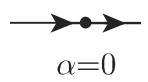


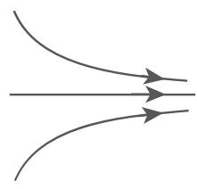


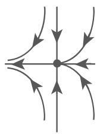
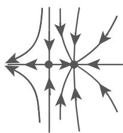

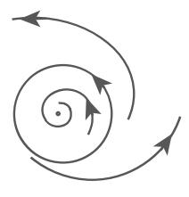


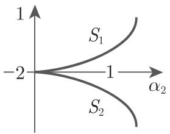
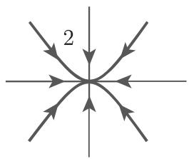
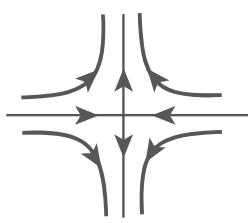

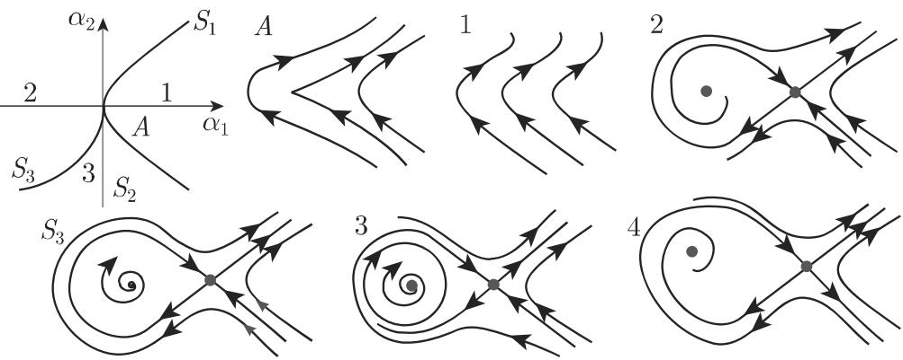

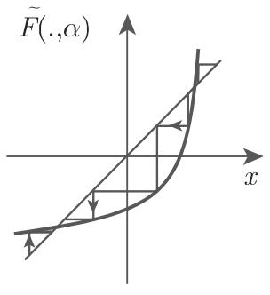


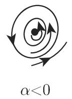
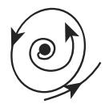

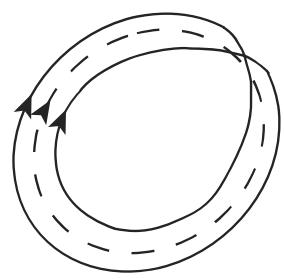

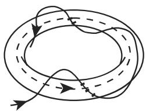

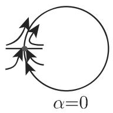

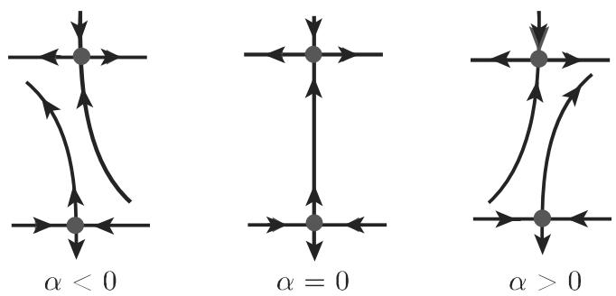
<!-- llm-wiki:embedded-images -->
