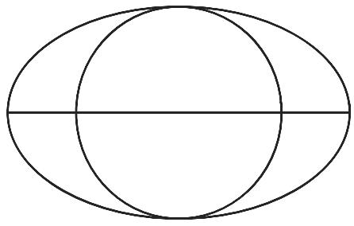
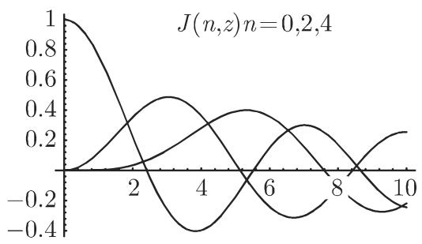
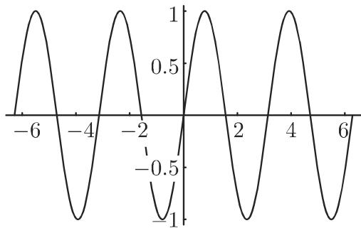
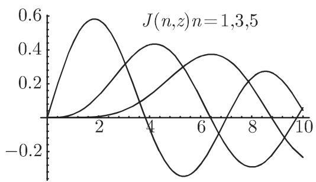
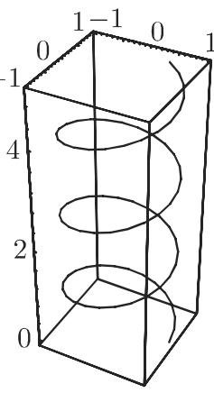

# 数学手册(原书第10版) 20.4 用Mathematica绘图

## 概述

本节是《数学手册（原书第10版）》第 20 章中关于 [[mathematica|Mathematica]] 的绘图专题，章末署名「（程钊译）」，故 frontmatter 之 authors 著录本章译者。开篇将图形表示定位为现代 [[计算机代数系统]] 在分析、向量演算与微分几何的公式处理以及工程设计中的核心能力，并断言「绘图是 Mathematica 的一项专长」（开篇「通过提供三维空间中……」疑脱「二维和」三字，见 [[20-4全节系统性转写讹误清单]]）。

全节以可复算的代码算例与四张命令表（表 20.14–20.17）为证据，构成 Mathematica 二维/三维绘图体系的紧凑介绍：图形基元 → 图形命令 → 图形选项 → Graphics/Show 句法 → 专用绘图命令族（Plot、ParametricPlot、Plot3D、ParametricPlot3D）→ 末段现代功能综述。绘图作为 CAS 的应用领域，是对 20.1 与 19.8.4 应用叙事的延伸（[[公式操作]]、[[计算机代数系统]]）。

## 章节结构

- 20.4.1 基本图形元素：Graphics[list] 句法与首例（式 20.37a–b，图 20.1）；缺省 AspectRatio 为 1:GoldenRatio。
- 20.4.2 图形基元：二维图形对象（表 20.14）与图形命令（表 20.15）。
- 20.4.3 图形选项：表 20.16。
- 20.4.4 图形表示的句法：20.4.4.1 构建图形对象（式 20.38a–b，图 20.2）；20.4.4.2 函数的图形表示（式 20.39–20.43，图 20.3 与 InputForm 内部结构）。
- 20.4.5 二维曲线：指数函数族（图 20.4a）、y = x + ArcCoth[x]（图 20.4b）、贝塞尔函数（式 20.44a–b，图 20.5）。
- 20.4.6 参数形式曲线的绘图：式 20.45；阿基米德螺线、对数螺线（图 20.6）、次摆线（图 20.7）。
- 20.4.7 曲面和空间曲线的绘图：20.4.7.1 Plot3D（式 20.46，图 20.8）；20.4.7.2 3D 图形选项（表 20.17）；20.4.7.3 参数表示的三维对象（式 20.47–20.49a，图 20.9）。
- 末段：第10版增补的一般性陈述（GUI、自动并行、CUDALink、Manipulate、云端、树蓝派计算机），无算例支撑。

## 核心主张

1. Mathematica 图形由内置基元组装为 `Graphics[list]` 对象，经 `Show` 显示；图形命令（指示）的作用域限于其所在花括号内（含嵌套），对括号外对象无效。
2. 缺省 `AspectRatio` 为 1:GoldenRatio（沿 x 方向与沿 y 方向长度之比 1:1/1.618 = 1:0.618），会使圆变形为椭圆；`Automatic` 保持图像不变形。此默认行为在图 20.3（Sin[2x]）中可观察，且 `InputForm[%]` 证实为 `AspectRatio->GoldenRatio^(-1)`。
3. `Plot` 由内部算法产生函数表，再以 `Line` 基元连线成图；图形对象表达式由基元子列表与默认选项子列表构成。
4. 专用命令族覆盖函数图（Plot，式 20.39/20.41）、参数曲线（ParametricPlot，式 20.45）、曲面（Plot3D，式 20.46；ParametricPlot3D，式 20.47）与空间曲线（式 20.48）；`Show` 可携新选项重显旧图（式 20.42）。
5. 末段为无算例支撑的现代功能陈述：GUI 交互、自动并行与 Parallelize/ParallelMap、CUDALink/OpenCLFunctionLoad 高层 GPU 编程、动态交互工具 Manipulate（展示曲线族参数依赖性）、云端工作、树蓝派计算机（Raspberry Pi，已获 Mathematica 免费使用许可）。

## 结构化数据转录

### 命令签名（式 20.39、20.41–20.43、20.45–20.48）

```mathematica
Plot[f[x], {x, xmin, xmax}]
Plot[{f1[x], f2[x], ...}, {x, xmin, xmax}]
Show[plot, options]
Show[GraphicsArray[list]]
ParametricPlot[{fx(t), fy(t)}, {t, t1, t2}]
Plot3D[f[x, y], {x, xa, xe}, {y, ya, ye}]
ParametricPlot3D[{fx[t,u], fy[t,u], fz[t,u]}, {t, ta, te}, {u, ua, ue}]
ParametricPlot3D[{fx[t], fy[t], fz[t]}, {t, ta, te}]
```

### 基本图形元素算例（式 20.37a–b）

```mathematica
In[1] := g = Graphics[{Line[{{0, 0}, {5, 5}, {10, 3}}], Circle[{5, 5}, 4],
        Text[Style["Example","Helvetica",Bold,25],{5,6}]},
        AspectRatio->Automatic]
```

a) 从点 (0,0) 出发穿过点 (5,5) 到点 (10,3) 画两线段组成的折线；b) 原文「(5,5) 为圆心、 为半径画圆」脱「以」「4」，应为「以 (5,5) 为圆心、4 为半径画圆」；c) 以粗体 Helvetica 字体写入文字内容 "Example"（显示以参考点 (5,6) 为中心）。调用 `Show[g]` 显示该图形（图 20.1）。

![图 20.1 Show[g] 的输出](../media/10-数学手册原书第10版--18-204-用mathematica绘图--f10hmv/001-9ed7004236ba95cc464fa43a1edb6bbcd3fa19edb261afbd1a8c9d7db277fa08.jpg)

### 构建图形对象算例（20.4.4.1，式 20.38a–b）

```mathematica
{object1, object2, ...}                                          (20.38a)
In[1] := o1 = {Circle[{5, 5}, {5, 3}], Line[{{0, 5}, {10, 5}}]}
In[2] := o2 = {Circle[{5, 5}, 3]}
In[3] := o3 = {Thickness[0.01], o2}
In[4] := g1 = Graphics[{o1, o2}]; g2 = Graphics[{o1, o3}]
Show[g1]  和  Show[g2, Axes -> True]                             (20.38b)
```

原文：「这个命令对于对应花括号中的所有对象都成立，也对嵌套对象成立，但对列表中花括号以外的对象不成立」——g1 与 g2 仅在第二个对象处表明圆的粗细度不同（图 20.2a/b）。




### 表 20.14 二维图形对象

| 条目 | 释义 |
|---|---|
| `Point[{x, y}]` | 位置 x,y 处的点 |
| `Line[{{x1,y1},{x2,y2},···}]` | 通过已知点的折线 |
| `Rectangle[{xlu,ylu},{xro,yro}]` | 填充具有给定的左下,右上坐标的矩形 |
| `Polygon[{{x1,y1},{x2,y2},···}]` | 填充具有给定顶点的多边形 |
| `Circle[{x,y},r]` | 以 x,y 为中心、半径为 r 的圆 |
| `Circle[{x,y},r,{α1,α2}]` | 以给定角为界限的圆弧 |
| `Circle[{x,y},{a,b}]` | 具有半轴 a 和 b 的椭圆 |
| `Circle[{x,y},{a,b},{α1,α2}]` | 椭圆弧 |
| `Disk[{x,y},r]`、`Disk[{x,y},{a,b}]` | 填充圆或椭圆 |
| `Text[text,{x,y}]` | 以点 x,y 为中心写入文字 |

### 表 20.15 图形命令

| 条目 | 释义 |
|---|---|
| `PointSize[a]` | 描绘半径为 a 的一个点作为整个图像的一部分 |
| `AbsolutePointSize[b]` | （以美制度量单位 pt（0.3515mm））表示该点的绝对半径 b |
| `Thickness[a]` | 描绘相对粗细度为 a 的线 |
| `AbsoluteThickness[b]` | 描绘绝对粗细度为 b（也以 pt 度量）的线 |
| `Dashing[{a1,a2,a3,...}]` | 描绘由一系列具有给定长度（按相对单位度量）的线条构成的线 |
| `AbsoluteDashing[{b1,b2,...}]` | 和前面一样但按绝对单位度量 |
| `GrayLevel[p]` | 指定灰度水平（p=0 表示黑, p=1 表示白） |

另有规模广泛的颜色可供选择，但其定义书中不做讨论。

### 表 20.16 一些图形选项

```txt
AspectRatio -> w 设置高宽比 w. Automatic, 由绝对坐标确定 w;
默认设置为 w = 1 : GoldenRatio
Axes -> True 画坐标轴
Axes -> False 不画坐标轴
Axes -> {True, False} 仅显示 x 轴
Frame -> True 显示框
GridLines -> Automatic 显示网格线
AxesLabel -> {x_symbol, y_symbol} 以给定符号表示轴
Ticks -> Automatic 自动表示刻度标记; 使用 None 它们将被禁止
Ticks -> {{x₁, x₂, …}, {y₁, y₂, …}} 将刻度标记置于给定的节点处
```

### 表 20.17 3D 图形选项

```txt
Boxed 默认设置是 True; 它描绘一个环绕曲面的三维框
HiddenSurface 设置曲面的不透明度; 默认设置是 True
ViewPoint 指定空间中的点 (x, y, z)，由此处观察曲面. 默认值是 {1.3, -2.4, 2}
Shading 默认设置是 True; 在曲面上加阴影; False 得到白色曲面
PlotRange 对于值 All 可以选择 {za, ze}, {{xa, xe}, {ya, ye}, {za, ze}}. 默认是 Automatic
```

### Plot 算例与 InputForm 内部结构（20.4.4.2）

```mathematica
In[1] := Plot[Sin[2 x], {x, -2 Pi, 2 Pi}]
In[2] := Plot[Sin[2 x], {x, -2 Pi, 2 Pi}, AspectRatio -> 1]   (20.40)
```

原文谓函数图形表示在「－加与加之间」的定义域上（「加」疑为「π」之讹，见 [[加号疑为π之辨]]），产生图 20.3；其中可见默认 AspectRatio 的影响（整个宽与整个高之比 1:0.618）。`InputForm[%]` 输出块原样转录如下（转写讹误密集，校勘见 [[InputForm图形对象内部结构转录校勘]]）：

```txt
Graphics[{{}, {}, {Directive[Opacity[1.], RGBColor[0.368417, 0.506779, 0.709798], AbsoluteThickness[1.6]], Line[{{-6.283185050723043, 2.5645654335783057*^{-7}}, ..., {6.283185050723043, -2.5645654335783057*^{-7}}}], {DisplayFunction->Identity, AspectRatio->GoldenRatio(-1), Axex->{True, True}, AxesLabel->{None, None}AxesOrigin->{0, 0}, DisplayFunction :> Identity, Frame->{{False, False}, {False, False}}, FrameLabel->{{None, None}, {None, None}}, FrameTicks->{{Automatic, Automatic}, {Automatic, Automatic}}, GridLines->{None, None}, GridLinesStyle->Directive[GrayLevel[0.5, 0.4]], Method->{"DefaultBoundaryStyle" -> Automatic," ScalingFunctions" -> None}, PlotRange->{{-2 * Pi, 2 * Pi}, {-0.9999996654606427, 0.9999993654113022}}, PlotRangeClipping->True, PlotRangePadding->{{Scaled[0.02], Scaled[0.02]}, {Scaled[0.05], Scaled[0.05]}}, Ticks->{Automatic, Automatic}}]
```

### 指数函数族算例（20.4.5.1）

```mathematica
In[1] := f[x_] := 2^x; g[x_] := 10^x;
In[2] := h[x_] := (1/2)^x; j[x_] := (1/E)^x; k[x_] := (1/10)^x
In[3] := p1 = Plot[{f[x], h[x]}, {x, -4, 4}, PlotStyle->Dashing[{0.001, 0.02}]]
In[4] := p2 = Plot[{Exp[x], j[x]}, {x, -4, 4}]
In[5] := p3 = Plot[{g[x], k[x]}, {x, -4, 4},
         PlotStyle->Dashing[{0.005, 0.02, 0.001, 0.02}]]
In[6] := Show[{p1, p2, p3}, PlotRange -> {0, 18}, AspectRatio -> 1.2]
```

e^x 无需定义（已内置于 Mathematica）。用图形基元 Text 可以在曲线上书写文字。回指第 92 页 2.6.1（指数函数）与「第 612.1」（疑第 6 章 2.1，函数一章）。

### 函数 y = x + ArcCoth[x] 算例（20.4.5.2）

```mathematica
In [1] := f1 = Plot[x + ArcCoth[x], {x, 1.000000000005, 7}]
In [2] := f2 = Plot[x + ArcCoth[x], {x, -7, -1.000000000005}]
In [3] := Show[{f1, f2}, PlotRange → {-10, 10}, AspectRatio → 1.2,
         Ticks → {{{-6, -6}, {-1, -1}, {1, 1}, {6, 6}}}, {{2.5, 2.5}, {10, 10}}},
         AxesOrigin → 0, 0]
```

原句「和— 的闭域邻内选取高精度的 值，是为了对所要求的 的值域得到足够大的函数值」句式残缺，应为「在 ±1 的闭域邻[近]内选取高精度的 x 值……」（方法见 [[奇点邻域高精度端点绘图法]]）。In[3] 之 Ticks 列表多一闭括号、AxesOrigin→0,0 脱花括号，全角箭头「→」宜作「->」。回指第 120 页 2.10（Arcoth x）。


![图 20.4(b) y = x + ArcCoth[x]](../media/10-数学手册原书第10版--18-204-用mathematica绘图--f10hmv/006-0da5c6d5e65e8965265c3676d4744c6761d28ae0c970347bae61384ebc35f83e.jpg)

### 贝塞尔函数算例（20.4.5.3，式 20.44a–b）

```mathematica
In[1] := bj0 = Plot[{BesselJ[0, z], BesselJ[2, z],
    BesselJ[4, z]}], {z, 0, 10}, PlotLabel->
    TraditionalForm[{BesselJ[0, z], BesselJ[2, z], BesselJ[4, z]}]     (20.44a)
In[2] := bj1 = Plot[{BesselJ[1, z], BesselJ[3, z],
    BesselJ[5,z]}, {z, 0, 10}, PlotLabel->
    TraditionalForm[{BesselJ[1,z], BesselJ[3,z], BesselJ[5,z]}]]       (20.44b)
In[3] := GraphicsRow[{bj0, bj1}]
```

In[1] 括号错位、正文「n = 0, 2, 4 = l, 3,」残缺（见 [[BesselJ绘图括号错位与n值列表讹误之辨]]）。回指第 743 页 9.1.2.6。




### 参数曲线算例（20.4.6）

```mathematica
In[1] := ParametricPlot[{t   Cos[t], t   Sin[t]}, {t, 0, 3 Pi}, AspectRatio->Automatic]
In[2] := ParametricPlot[{Exp[0.1 t] Cos[t], Exp[0.1 t] Sin[t]}, {t, 0, 3 Pi},
         AspectRatio->Automatic]
In[3] := ParametricPlot[{t - 2 Sin[t], 1 - 2 Cos[t]}, {t, -Pi, 11 Pi}, AspectRatio -> 0.3]
```

原文选项转写作 `AspectRatio_lutomatic_1`，系 `AspectRatio->Automatic` 之讹。阿基米德螺线回指第 136 页 2.14.1，对数螺线回指第 137 页 2.14.3，次摆线回指第 132 页 2.13.2。


### 三维算例（20.4.7.1 与 20.4.7.3，式 20.46–20.49a）

```mathematica
In[1] := Plot3D[x^2 + y^2, {x, -5, 5}, {y, -5, 5}, PlotRange > {0, 25}]
In[2] := Plot3D[(1 - Sin[x]) (2 - cos[2 y]), {x, -2, 2}, {y, -2, 2}]
In[3] := ParametricPlot3D[{Cos[t] Cos[u], Sin[t] Cos[u], Sin[u]},
         {t, 0, 2 Pi} {u, -Pi/2, Pi/2}]
In[4] := ParametricPlot3D[{Cos[t], Sin[t], t/4}, {t, 0, 20}]           (20.49a)
```

「对于这个抛物面，选项 PlotRange 是按所要求的 z 值给定的，因为这个立体是在 z = 25 时切割的」（原文「这个立体是= 25 时切割的」脱 z）。`PlotRange > {0, 25}` 脱箭头、`cos[2 y]` 小写、In[3] 两迭代器间脱逗号，式 20.49 仅有 a 无 b，均见相应查询页。

![图 20.8 抛物面与 (1−Sin[x])(2−Cos[2y])](../media/10-数学手册原书第10版--18-204-用mathematica绘图--f10hmv/012-3b6d551f7f229166d4b1f8af9d040002fe15ff4c6724e502701f51b500d4718d.jpg)


### 末段现代功能陈述（原样意录）

Mathematica 提供更多命令可生成密度图和轮廓图、条形图和扇形图及不同类型图的组合；「用 Mathematica 可以很容易地生成洛伦茨吸引子的图像（参见第 1153 17.2.4.3）」（[[洛伦茨方程组]]）。近期发展大部分未展示在书中：轻松构建 GUI 以利用交互功能；大部分计算自动并行，Parallelize、ParallelMap 供用户创建自己的并行程序；使用 CUDALink、OpenCLFunctionLoad 等可在非常高的层次上编程设计极其快速的图形卡；动态交互性工具的有用例子是 Manipulate（以最简单的实例展示一族曲线的参数依赖性）；还应该提及在云中工作或使用树蓝派计算机（Raspberry Pi，它已得到 Mathematica 的免费使用许可）——「树蓝派」译名存疑，见 [[树蓝派疑为树莓派之辨]]。

## 转写讹误与版本张力

本节转写讹误密集且成系统，总目见 [[20-4全节系统性转写讹误清单]]，专项另立：[[加号疑为π之辨]]、[[Axex疑为Axes之辨]]、[[PlotRange大于号疑为箭头之辨]]、[[BesselJ绘图括号错位与n值列表讹误之辨]]、[[式20-49无b之编号之辨]]、[[pt换算0点3515毫米之辨]]、[[树蓝派疑为树莓派之辨]]。

最重要的结构性张力是**版本混用**：式 20.43 用 `GraphicsArray`（Mathematica 5 时代命令，v6 起弃用），而 20.4.5.3 例又用 `GraphicsRow`（v6+）；表 20.17 的 `HiddenSurface`、`Shading` 亦为 pre-v6 遗留选项；但 InputForm 输出块的默认样式（`RGBColor[0.368417, 0.506779, 0.709798]`、`AbsoluteThickness[1.6]`）似为 v10+。这反映第10版在旧稿基础上局部增补、未全面统一版本基线，详见 [[GraphicsArray与GraphicsRow比较]]。语料结构上，本维基自 20.2.9 直接跳至 20.4，表 20.9–20.13 应属缺席的 20.3 节（[[20-3节与表20-9至20-13缺席之辨]]）；文末「21 表 格」为下一章起点标记。

## 与既有维基的联系

- [[mathematica]]：本节以其「绘图专长」定位，并新增 Raspberry Pi 免费许可、Manipulate/CUDALink 等现代功能知识点。
- 20.2 系列语法体系的直接应用与延伸：[[列表（Mathematica）]]（对象列表）、[[表达式（Mathematica）]]、[[Rule变换规则与替换算子]]（选项即 Rule）、[[Set指派与清除]]（g = Graphics[...]）、[[模式（Mathematica）]]（f[x_] := 定义）、[[Mathematica输入输出行记法]]、[[FullForm（完整形式）]]（InputForm 之近亲）。
- [[洛伦茨方程组]]：末段为其补充 Mathematica 可视化侧证；[[公式操作]] 与 [[数值计算（计算机代数应用领域）]]：绘图作为 CAS 应用领域的延伸。
- 回指缺口见 [[20-4未入库回指缺口]]。

## 证据强度评估

- 代码算例（式 20.37–20.49a）可逐条复算（强）：复算记录见各 finding 页。
- 默认值陈述（ViewPoint 默认 `{1.3, -2.4, 2}`、AspectRatio 默认 1:GoldenRatio）具版本依赖性（中）。
- 末段现代功能陈述无验证算例（弱，仅宜记录，不作为可复算证据）。

<!-- llm-wiki:embedded-images -->
## Embedded Images

### Document









<!-- llm-wiki:embedded-images -->
