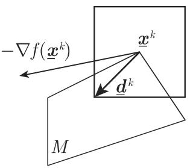

# 数学手册(原书第10版) 18.2.7 不等式类型约束下问题的梯度法

## 定位与概要

本节是《数学手册》(原书第 10 版) 第 18 章 18.2「非线性优化问题」下的算法节，处理不等式类型约束 $g_i(x)\leqslant 0$ 下的 [[concepts/非线性优化]] 问题，给出一个一般迭代框架与两个方法族：

- **[[concepts/可行方向方法]]**（18.2.7.1）：每步求解以 $\sigma$ 为目标的「方向搜索程序」获得当前点的可行下降方向，配套 [[concepts/ε-主动约束集]] 抑制锯齿形迭代；线性约束情形有简化程序；二次问题可借 [[concepts/共轭条件（二次问题有限步终止）]] 实现有限步终止。
- **[[concepts/梯度投影方法]]**（18.2.7.2）：在凸目标 + 线性约束设定下，当 $-\nabla f(x^k)$ 不可行时将其正交投影到主动约束所张线性流形取方向，以 $d^k=0$ 且 $u\geqslant 0$ 为终止判据。

本节使 18.2.1 的最优性理论与 18.2.2 的凸优化理论获得可实现算法：[[concepts/库恩—塔克条件]] 在两法的终止判据中被算法化，[[concepts/凸优化]] 的充分性保证梯度投影法终止点即全局极小点。原书本节为纯方法学论述，未出现任何人名、机构、软件或数据集（可行方向方法与梯度投影方法在文献中通常分别归于 Zoutendijk 与 Rosen，但原书未具名，本维基不据此新建人物实体页）。

## 一般迭代框架（式 18.95–18.98）

```
f(x) = min!,  约束条件为 g_i(x) ⩽ 0                     (18.95)
x^{k+1} = x^k + α_k d^k,  k = 1, 2, …                    (18.96)
α_k'' = {α ∈ R : x^k + α d^k ∈ M}                        (18.97)
α_k = min{α_k', α_k''}                                   (18.98)
```

其中 $\alpha_k'$ 由一维极小化 $f(x^k+\alpha d^k)=\min!,\ \alpha>0$ 确定（回指 18.2.4 的一维搜索方法，如 [[concepts/黄金分割法]]）。源内要点：

- 由于有界可行集，须遵守两条附加规则：(1) $d^k$ 必须是 $x^k$ 的可行下降方向；(2) 步长 $\alpha_k$ 必须使得 $x^{k+1}\in M$（原文句末疑脱「$\in M$」，见 [[queries/多处脱M符号及乱码疑为u之辨]]）；
- 若某步没有可行方向 $d^k$，则 $x^k$ 是平稳点；
- 分类学论断：基于 (18.96) 的各种方法的差别仅在于方向 $d^k$ 的构造。

转录与疑点详见 [[findings/式18-95至18-98梯度法一般格式与步长规则转录]]（其中式 18.97 以集合而非最大值定义 $\alpha_k''$，见 [[queries/式18-97疑缺max之辨]]）。

## 18.2.7.1 可行方向方法

### 1. 方向搜索程序（式 18.99–18.101）

```
σ = min!,                                               (18.99)
∇g_i(x^k)^T d ⩽ σ,   i ∈ I_0(x^k),                      (18.100a)
∇f(x^k)^T d ⩽ σ,                                        (18.100b)
‖d‖ ⩽ 1                                                 (18.100c)
I_{ε_k}(x^k) = {i ∈ {1,…,m} : −ε_k ⩽ g_i(x^k) ⩽ 0},  ε_k ⩾ 0   (18.101)
```

- $\sigma<0$ 时，(18.100a) 确保所得方向可行、(18.100b) 确保下降，规格化 (18.100c) 保证程序可行集有界；
- $\sigma=0$ 时 $x^k$ 是平稳点（源内理由句疑脱否定词，见 [[queries/σ为零平稳点理由句脱否定词之辨]]）；
- 以 $I_{\varepsilon_k}(x^k)$（$\varepsilon_k$-主动约束）替代 $I_0(x^k)$ 以避免锯齿形行为；修正后若 $\sigma=0$，仅当 $I_0(x^k)=I_{\varepsilon_k}(x^k)$ 时为平稳点，否则须减小 $\varepsilon_k$ 重解。

### 2. 线性约束的特殊情形（式 18.102–18.104）

当 $g_i(x)=a_i^{\mathrm{T}}x-b_i$ 时：

```
σ = ∇f(x^k)^T d = min!,                                 (18.102)
∇a_i^T d ⩽ 0,   i ∈ I_0(x^k) 或 i ∈ I_{ε_k}(x^k)        (18.103a)
‖d‖ ⩽ 1                                                 (18.103b)
d^{k−1 T} C d = 0                                       (18.104)
```

- 范数选择论断：$\|d\|_\infty\leqslant 1$ 等价于线性约束 $-1\leqslant d_i\leqslant 1$，程序成为线性规划，可由 [[concepts/单纯形法]] 求解；$\|d\|_2$ 所得方向与 $-\nabla f(x^k)$ 形成最小夹角（「某种意义上最佳」），但程序非线性、计算量更大；
- 对二次优化问题 $f(x)=x^{\mathrm{T}}Cx+p^{\mathrm{T}}x=\min!,\ Ax\leqslant b$：当 $\alpha_{k-1}=\alpha'_{k-1}$（$x^k$ 为「内」点）时在程序中加上共轭条件 (18.104)，此前已加的条件保留；当往后某步 $\alpha_k=\alpha_k''$ 时将其去掉，以保证有限步终止；
- 转写疑点：(18.103a) 冠于 $a_i$ 的 $\nabla$ 疑为衍文（见 [[queries/式18-103a冠于ai梯度算子疑为衍文之辨]]）；(18.104) 右端 $d$ 疑脱上标 $k$（见 [[queries/式18-104第二个d疑脱上标k之辨]]）。

转录复算详见 [[findings/式18-99至18-104方向搜索程序与ε主动约束集转录复算]]，迭代操作见 [[methodology/可行方向方法迭代流程]]。

## 18.2.7.2 梯度投影方法

### 1. 问题的提法和求解原理（式 18.105–18.106）

```
f(x) = min!,  a_i^T x ⩽ b_i,  i = 1,…,m                 (18.105)
d^k = −P_k ∇f(x^k) = −(I − A_k^T (A_k A_k^T)^{−1} A_k) ∇f(x^k)   (18.106)
```

若 $-\nabla f(x^k)$ 本身可行则直取为 $d^k$；否则 $x^k$ 在可行集边界上，$-\nabla f(x^k)$ 指向 $M$ 外，将其经线性映射投影到由主动约束子集确定的线性流形（棱边或面）上。前提假设：主动约束法向量线性无关（原文称「非降秩」，疑为「非退化」；「对于每个 $x\in\mathbb{R}^n$」疑应为 $x\in M$）。

### 2. 算法与注释

算法分 I、II、III 三步：I 判定 $-\nabla f$ 可行性或构造 $A_k$；II 投影取 $d^k$，若 $d^k=0$ 且 $u=-(A_kA_k^{\mathrm{T}})^{-1}A_k\nabla f(x^k)\geqslant 0$ 则由凸性得极小点（局部库恩—塔克条件 $-\nabla f(x^k)=\sum_{i\in I_0(x^k)}u_i a_i=A_k^{\mathrm{T}}u$ 显然满足），若某 $u_i<0$ 则删 $A_k$ 第 $i$ 行重返 II；III 求步长前进。注释：投影到包含 $x^k$ 的最小维子流形；$(A_kA_k^{\mathrm{T}})^{-1}$ 可由 $(A_{k-1}A_{k-1}^{\mathrm{T}})^{-1}$ 增删行递推。完整流程见 [[methodology/梯度投影法算法流程]]。

## 共用算例

两法使用同一题设、同一起点 $x^1=(3,0)^{\mathrm{T}}$：

```
f(x) = x₁² + 4x₂² − 10x₁ − 32x₂ = min!
g₁ = −x₁ ⩽ 0,  g₂ = −x₂ ⩽ 0,  g₃ = x₁ + 2x₂ − 7 ⩽ 0,  g₄ = 2x₁ + x₂ − 8 ⩽ 0
C = diag(1, 4)
α_k′ = − d^{kT}∇f(x^k) / (2 d^{kT}C d^k)
α_k″ = min{ −g_i(x^k) / (a_i^T d^k) : a_i^T d^k > 0 }
```

- 可行方向方法（$\|\cdot\|_\infty$）：四步收敛到 $x^*=(2,5/2)^{\mathrm{T}}$；逐项独立复算全部通过，终止处 $-\nabla f(x^*)=(6,12)=6\,a_3$、$u_3=6\geqslant 0$、$I_0(x^*)=\{3\}$，KKT 成立。见 [[findings/可行方向法算例四步复算]]（replicated: true）。
- 梯度投影方法：同一极小点，同样途经 $(3,2)$；端点全部验证，但有两处印刷疑点：$\alpha_1=1/2$ 疑为 $1/20$（[[queries/梯度投影算例α1二分之一疑为二十分之一之辨]]），$d^2$ 印刷值与式 (18.106) 直算值差 $87/4$ 倍（[[queries/梯度投影算例d2缩放差四分之八十七倍之辨]]）。见 [[findings/梯度投影法算例四步复算]]。
- 两法对照见 [[comparisons/可行方向方法与梯度投影方法比较]]。

## 证据强度与归属注意

- 理论论断为标准结果、推导自洽：强。
- 可行方向法算例逐项复算全部通过：强（replicated: true）。
- 梯度投影法算例除两处缩放疑点外全部通过：中强（须附疑点注记）。
- 论断归属不可混淆：$\sigma=0$ 平稳性属于方向搜索程序；$\ell_\infty/\ell_2$ 范数比较仅属线性约束情形的程序 (18.102–18.103)；共轭条件有限终止仅属可行方向方法施加于 [[concepts/二次优化]] 问题；$u\geqslant 0$ 终止判据仅属梯度投影方法且依赖 (18.105) 的凸性与线性约束假设。

## 转写疑点与回指

- 系统性 OCR 讹误（「由千/基千/千是」＝「于」、「矿」衍字、「共辄」＝「共轭」、“(18.lOOa)”＝“(18.100a)”、「前而」＝「前面」等）及结构性脱漏汇总于 [[queries/18-2-7全节系统性转写讹误清单]]。
- 回指落点与缺口见 [[queries/18-2-7未入库回指缺口]]：一维搜索回指 18.2.4，凸性设定回指 18.2.2，问题形式回指 18.2.1；18.2.3、18.2.5、18.2.6 仍未入库（[[queries/18-2小节覆盖与开放问题待明]] 部分解答）。

## 插图





## 关联页面

- 概念：[[concepts/可行方向方法]]、[[concepts/梯度投影方法]]、[[concepts/ε-主动约束集]]、[[concepts/共轭条件（二次问题有限步终止）]]
- 方法：[[methodology/可行方向方法迭代流程]]、[[methodology/梯度投影法算法流程]]
- 发现：[[findings/式18-95至18-98梯度法一般格式与步长规则转录]]、[[findings/式18-99至18-104方向搜索程序与ε主动约束集转录复算]]、[[findings/可行方向法算例四步复算]]、[[findings/梯度投影法算例四步复算]]
- 比较：[[comparisons/可行方向方法与梯度投影方法比较]]
- 相关节 source 页：[[sources/10-数学手册原书第10版--14-1821-问题的提法理论基础--16xlwe7]]（18.2.1）、[[sources/10-数学手册原书第10版--14-1822-特殊非线性优化问题--1d674j5]]（18.2.2）、[[sources/10-数学手册原书第10版--11-1824-数值搜索程序--nrqoi6]]（18.2.4）

<!-- llm-wiki:embedded-images -->
## Embedded Images

### Document


<!-- llm-wiki:embedded-images -->
