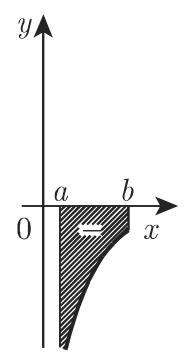
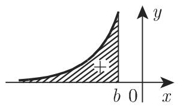
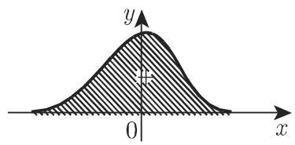
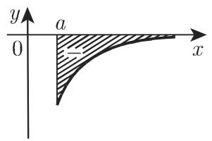
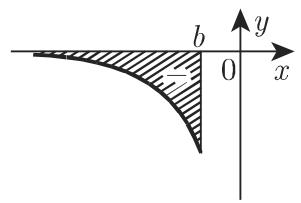

# 数学手册(原书第10版) 8.2.3 广义积分、斯蒂尔切斯积分与勒贝格积分

本节是《数学手册(原书第10版)》8.2 定积分的第三个小节，主题为[[concepts/广义积分]]、[[concepts/斯蒂尔切斯积分]]与[[concepts/勒贝格积分]]。其出发点是：8.2.1.1（第 657 页）把定积分作为黎曼积分引入时假设了两个条件——函数 $f(x)$ 有界、$[a,b]$ 为有限闭区间；在黎曼积分的推广中这两个条件都可以放宽。全节共 24 个编号公式（8.76–8.89，含 a/b/c/d 子编号）与 10 个算例（图 8.21 三例、幂判敛一例、图 8.22 四例、微积分基本定理例 E/F 两例），本 wiki 已对全部算例复算，均成立。

## 小节结构

| 小节 | 主题 | 公式 |
|---|---|---|
| 8.2.3.1 | 积分概念的推广（广义积分总纲、斯蒂尔切斯积分、勒贝格积分） | 8.76 |
| 8.2.3.2 | 具有无限积分限的积分（定义、几何意义、收敛充分条件、与无穷级数的关系） | 8.77–8.84 |
| 8.2.3.3 | 无界被积函数的积分（定义、几何意义、微积分基本定理的应用、收敛充分条件） | 8.85–8.89 |

## 公式逐字转录

### 8.2.3.1 积分概念的推广

推广路径有三：1) 广义积分——把被积函数推广到无界函数或者无限区间；2) 一元函数的斯蒂尔切斯积分——在有限区间 $[a,b]$ 上给定两个有限函数 $f(x)$ 与 $g(x)$，与黎曼积分一样分割区间，但与黎曼和 (8.38) 不同，考虑如下形式的和：

$$
\sum_{i=1}^{n} f(\xi_i)\,[g(x_i)-g(x_{i-1})]\tag{8.76}
$$

若无论如何选取分点 $x_i$ 与中间点 $\xi_i$，当子区间长度趋于 0 时极限 (8.76) 都存在，则称该极限为定斯蒂尔切斯积分（文献 [8.14]、[8.19]）。若 $g(x)=x$，则斯蒂尔切斯积分变成黎曼积分。3) 勒贝格积分——与测度论有关（第 905 页 12.9：集合的测度、测度空间、可测函数）；泛函分析中的勒贝格积分以这些概念为基础（[8.10]）定义（第 908 页 12.9.3.2）；相比黎曼积分，可把积分区域推广到 $\mathbb{R}$ 的更一般的子集上，把积分区域划分成可测子集。关于积分推广的不同记号参见 [8.14]。（原文「贮」应为 $\mathbb{R}$。）

### 8.2.3.2 具有无限积分限的积分

**定义**（收敛 ⇔ 极限存在；否则发散）：

$$
\int_a^{+\infty} f(x)\,\mathrm{d}x = \lim_{B\to\infty}\int_a^B f(x)\,\mathrm{d}x\tag{8.77}
$$

$$
\int_{-\infty}^{b} f(x)\,\mathrm{d}x = \lim_{A\to-\infty}\int_A^b f(x)\,\mathrm{d}x\tag{8.78a}
$$

$$
\int_{-\infty}^{+\infty}f(x)\,\mathrm{d}x = \lim_{\substack{A\to-\infty\\ B\to\infty}}\int_A^B f(x)\,\mathrm{d}x\tag{8.78b}
$$

(8.78b) 的 $A,B$ 相互独立；若其极限不存在而对称极限存在：

$$
\lim_{A\to\infty}\int_{-A}^{+A} f(x)\,\mathrm{d}x\tag{8.78c}
$$

则称 (8.78c) 为广义积分主值或[[concepts/柯西主值]]。原书随后断言「显然，$\lim_{x\to\infty}f(x)=0$ 是积分 (8.77) 收敛的必要非充分条件」（存疑，见下）。

**几何意义**：(8.77)、(8.78a)、(8.78b) 分别表示图 8.21 所示图形的面积。

**归化公式**（(8.78a) 经 $x\to-x$ 代换化为 (8.77) 型；(8.78b) 对任意实数 $c$ 分解）：

$$
\int_{-\infty}^{a} f(x)\,\mathrm{d}x = \int_{-a}^{+\infty} f(-x)\,\mathrm{d}x\tag{8.79}
$$

$$
\int_{-\infty}^{+\infty} f(x)\,\mathrm{d}x = \int_{-\infty}^{c} f(x)\,\mathrm{d}x + \int_c^{+\infty} f(x)\,\mathrm{d}x\tag{8.80}
$$

**充分条件一（绝对收敛）**：若积分

$$
\int_a^{+\infty} |f(x)|\,\mathrm{d}x\tag{8.81}
$$

收敛，则积分 (8.77) 也收敛；此时称 (8.77) 为绝对收敛，称 $f(x)$ 在 $[a,+\infty)$ 上绝对可积。

**充分条件二（比较审敛法）**：若

$$
f(x)>0,\quad \varphi(x)>0,\quad f(x)\leqslant\varphi(x)\quad(a\leqslant x<+\infty)\tag{8.82a}
$$

（此处原书中译本附译者注「（原文有误。——译者注）」，所指待考），则由 $\int_a^{+\infty}\varphi(x)\,\mathrm{d}x$（8.82b）收敛可得 $\int_a^{+\infty}f(x)\,\mathrm{d}x$（8.82c）收敛；反之由 (8.82c) 发散可得 (8.82b) 发散。

**充分条件三（幂判敛法）**：取 $\varphi(x)=1/x^{\alpha}$（8.83a）：

$$
\int_a^{+\infty}\frac{\mathrm{d}x}{x^{\alpha}}=\frac{1}{(\alpha-1)\,a^{\alpha-1}}\quad(a>0,\ \alpha>1)\tag{8.83b}
$$

收敛且等于右侧的值，$\alpha\leqslant1$ 时发散。由此：若 $f(x)>0$ 且存在 $\alpha>1$ 使得对足够大的 $x$ 都有

$$
f(x)\,x^{\alpha}<k<\infty\quad(k>0\ \text{且为常数})\tag{8.83c}
$$

则 (8.77) 收敛；若 $f(x)>0$ 且存在 $\alpha\leqslant1$ 使得自某个 $x_0$ 之后都有

$$
f(x)\,x^{\alpha}>c>0\quad(c>0\ \text{且为常数})\tag{8.83d}
$$

则 (8.77) 发散。

**与无穷级数的关系**：若 $a<x_1<x_2<\cdots<x_n<\cdots$ 且 $\lim_{n\to+\infty}x_n=\infty$（8.84a），$f(x)>0$，则 (8.77) 的收敛问题化为级数

$$
\int_a^{x_1} f(x)\,\mathrm{d}x + \int_{x_1}^{x_2} f(x)\,\mathrm{d}x + \cdots + \int_{x_{n-1}}^{x_n} f(x)\,\mathrm{d}x + \cdots\tag{8.84b}
$$

的收敛问题：同敛同散，收敛时 (8.77) 等于 (8.84b) 之和。因此可把级数的收敛条件用于广义积分；反之，由级数的积分审敛法（第 619 页 7.2.2.4）可用广义积分研究无穷级数。

### 8.2.3.3 无界被积函数的积分

**定义**（三种区间情形）：

$$
\int_a^{b} f(x)\,\mathrm{d}x = \lim_{\varepsilon\to+0}\int_a^{b-\varepsilon} f(x)\,\mathrm{d}x\tag{8.85}
$$

（$f$ 定义在 $[a,b)$，$\lim_{x\to b-0}f(x)=\infty$，奇点为右端点 $b$）

$$
\int_a^{b} f(x)\,\mathrm{d}x = \lim_{\varepsilon\to+0}\int_{a+\varepsilon}^{b} f(x)\,\mathrm{d}x\tag{8.86}
$$

（$f$ 定义在 $(a,b]$，$\lim_{x\to a+0}f(x)=\infty$，奇点为左端点 $a$）

$$
\int_a^{b} f(x)\,\mathrm{d}x = \lim_{\varepsilon\to+0}\int_a^{c-\varepsilon} f(x)\,\mathrm{d}x + \lim_{\delta\to+0}\int_{c+\delta}^{b} f(x)\,\mathrm{d}x\tag{8.87a}
$$

（内点 $c$（$a<c<b$）为奇点，$f$ 在 $c$ 处至少一侧极限为 $\infty$；$\varepsilon,\delta$ 彼此独立趋于 0）。若 (8.87a) 不存在但

$$
\lim_{\varepsilon\to+0}\left\{\int_a^{c-\varepsilon} f(x)\,\mathrm{d}x + \int_{c+\varepsilon}^{b} f(x)\,\mathrm{d}x\right\}\tag{8.87b}
$$

存在，则 (8.87b) 称为广义积分主值或柯西主值。

**几何意义**：求以一侧垂直渐近线为边界的图形的面积（图 8.22）。

**微积分基本定理的应用**：

$$
\int_a^{b} f(x)\,\mathrm{d}x = F(x)\Big|_a^b,\qquad F'(x)=f(x)\tag{8.88}
$$

计算形如 (8.87a) 的广义积分时，若不考虑区间 $[a,b]$ 中的奇点直接利用 (8.88)（第 667 页 8.2.2.2, 1.），会得到错误结论。**一般法则：仅当 $f(x)$ 的原函数在奇点连续时，(8.87a) 才可以使用微积分基本定理。**

**瑕积分收敛的充分条件**（8.2.3.3.4）：(1) 若 $\int_a^b|f(x)|\,\mathrm{d}x$ 收敛，则 $\int_a^b f(x)\,\mathrm{d}x$ 也收敛（绝对收敛积分、绝对可积函数）；(2) 幂判敛：

$$
f(x)\,(b-x)^{\alpha}<\infty\quad(\alpha<1)\ \Rightarrow\ \text{收敛}\tag{8.89a}
$$

$$
f(x)\,(b-x)^{\alpha}>c>0\quad(c\ \text{为常数},\ \alpha>1)\ \Rightarrow\ \text{发散}\tag{8.89b}
$$

（结论式中原书记作「积分 (8.87a)」；条件尺度 $(b-x)^{\alpha}$ 与小节标题 $\lim_{x\to b-0}f(x)=\infty$ 针对右端点奇点，见 [[findings/式8-89瑕积分幂判敛两条件]]。）

## 十个算例与复算结论

| # | 算例 | 出处 | 结果 | 复算 |
|---|---|---|---|---|
| 1 | A: $\int_1^{\infty}\mathrm{d}x/x=\lim_{B\to\infty}\ln\lvert B\rvert=\infty$ | 图 8.21 | 发散 | ✔ |
| 2 | B: $\int_2^{\infty}\mathrm{d}x/x^2=\lim_{B\to\infty}(1/2-1/B)=1/2$ | 图 8.21 | 收敛 | ✔ |
| 3 | C: $\int_{-\infty}^{+\infty}\mathrm{d}x/(1+x^2)=\pi/2-(-\pi/2)=\pi$ | 图 8.21 | 收敛 | ✔ |
| 4 | $\int_0^{+\infty}x^{3/2}\,\mathrm{d}x/(1+x^2)$：取 $\alpha=1/2$，$f\cdot x^{1/2}=x^2/(1+x^2)\to1>c$，$\alpha\leqslant1$ | 8.2.3.2.3 | 发散 | ✔ |
| 5 | A: $\int_0^b\mathrm{d}x/\sqrt{x}=2\sqrt{b}$（奇点 $x=0$，式 8.86） | 图 8.22 | 收敛 | ✔ |
| 6 | B: $\int_0^{\pi/2}\tan x\,\mathrm{d}x=\infty$（奇点 $x=\pi/2$，式 8.85） | 图 8.22 | 发散 | ✔ |
| 7 | C: $\int_{-1}^{8}\mathrm{d}x/\sqrt[3]{x}=9/2$（奇点 $x=0$，式 8.87a） | 图 8.22 | 收敛 | ✔ |
| 8 | D: $\int_{-2}^{2}2x\,\mathrm{d}x/(x^2-1)$（奇点 $x=\pm1$，式 8.87a） | 图 8.22 | 发散 | ✔ |
| 9 | E: 对例 D 形式套用 8.88 得 $\ln\lvert x^2-1\rvert\big\vert_{-2}^{2}=\ln3-\ln3=0$（错误结论） | 8.2.3.3.3 | 反例成立 | ✔ |
| 10 | F: $y=\tfrac32x^{2/3}$ 为 $1/\sqrt[3]{x}$ 在奇点 $x=0$ 连续的原函数，直接得 $9/2$ | 8.2.3.3.3 | 正确 | ✔ |

注：例 D 首段单侧极限实为 $-\infty$（$\ln(2\varepsilon+\varepsilon^2)-\ln3\to-\infty$），原书简写作 $\infty$，发散结论不受影响。

## 原书表述存疑处（非转写讹误）

1. 「$\lim_{x\to\infty}f(x)=0$ 是 (8.77) 收敛的必要非充分条件」——非充分性由例 A 支撑，但必要性在一般情形不成立（尖峰反例：$f$ 在 $[n,n+1/n^2]$ 上取 1、其余为 0，则 $\int f$ 收敛而 $f\not\to0$）；仅在极限存在或 $f$ 最终单调等附加前提下成立。见 [[queries/lim-f-x趋于0必要条件的适用前提]]。
2. 式 8.82a 后译者注「原文有误」所指无法从本源判定，见 [[queries/式8-82a译者注原文有误所指为何]]。
3. 式 8.89a「$f(x)(b-x)^\alpha<\infty$」疑脱漏常数上界 $k$（与 8.83c「$<k<\infty$」不平行）；8.89b 发散条件取 $\alpha>1$ 而 8.83d 取 $\alpha\leqslant1$，边界 $\alpha=1$ 处不对称（数学上 $\alpha=1$ 亦可判发散）。见 [[queries/式8-89a常数k脱漏与8-89b的α边界问题]]。

## 系统性转写讹误

沿袭本手册既往各节的转写规律（参见 [[queries/8-1-1全节系统性转写讹误清单]] 等），本节确认的讹误汇总于 [[queries/8-2-3全节系统性转写讹误清单]]，主要包括：「趋千/关千/等千」＝趋于/关于/等于；「儿何意义」＝几何意义；「叮又间」＝区间；(8.84b) 三处误作「(8.846)」；图 8.21 例 B 末乱码应为「（收敛）」；例 C 中间步骤「$\pi/2-\pi(-\pi/2)$」排印错乱；式 8.79 前句脱漏「经 $x\to-x$ 代换」；8.81 条件句主语脱漏；「贮」＝$\mathbb{R}$；「(O,b]」之 O 应为 0；多处脱漏变量名。

## 回指与未入库缺口

- 第 657 页 8.2.1.1（黎曼积分、黎曼和式 8.38）——[[concepts/定积分]] 已入库，8.2.1 子小节未单独入库
- 第 667 页 8.2.2.2（式 8.88 所本的微积分基本定理）——未入库，见 [[queries/表21-9与8-2-2-2及14-6-1未入库回指缺口]]
- 第 619 页 7.2.2.4（级数的积分审敛法）——已入库为 [[concepts/积分审敛法]]；本节式 8.84 给出其逆方向
- 第 905 页 12.9 与第 908 页 12.9.3.2（测度论与勒贝格积分）——未入库，见 [[queries/12-9测度论与勒贝格积分未入库回指缺口]]
- 文献 [8.10]、[8.14]、[8.19]（本源未给题目细节）

## 与既有 wiki 的关联

- 上游：[[sources/10-数学手册原书第10版--6-82-定积分--10if8co]]、[[concepts/定积分]]
- 本源部分填补 [[queries/8-2五个子小节未入库缺口]]（8.2.3）与 [[queries/表21-6及19-6与8-2-3-2未入库回指缺口]]（8.2.3.2 现已入库）
- 三条收敛判别法与级数版 [[concepts/比较审敛法]]、[[concepts/绝对收敛与条件收敛]]、[[concepts/积分审敛法]] 构成级数/积分平行对，见 [[comparisons/级数审敛法与广义积分审敛法平行比较]]
- 敛散性判定操作流程见 [[methodology/广义积分敛散性判定流程]]

## 图片

图 8.21（无穷限积分的几何意义）与图 8.22（瑕积分的几何意义，以垂直渐近线为边界）：

另有未标注的配套函数图形（同目录 001–006、011）。

<!-- llm-wiki:embedded-images -->
## Embedded Images

### Document

<!-- llm-wiki:embedded-images -->
