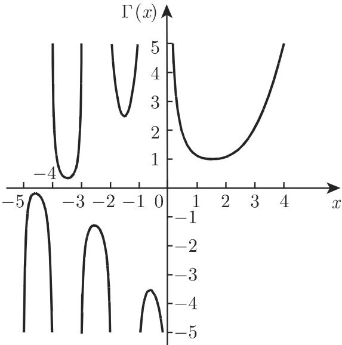

# 数学手册(原书第10版) 8.2.5 由级数展开式进行积分、特殊非初等函数

## 概述

本源是《数学手册(原书第10版)》8.2 定积分的第五个子小节，紧随 8.2.1（基本概念、法则和定理）与 8.2.2（定积分的应用）之后入库。全节回答一个问题：当初等函数的积分不再是初等函数时怎么办？原书开篇即给出方法论总纲（逐字转录）：

> 即使被积函数为初等函数，其积分也不一定总能由初等函数来表示，在很多情况下可以用级数展开式来表示这些非初等积分。若被积函数可以展成区间 $[a,b]$ 上一致收敛的级数，则通过逐项积分也可得到积分 $\int_a^x f(t)\,\mathrm{d}t$ 的一致收敛级数。

这是 [[逐项积分与逐项微分]]（源自 7.3 函数项级数）的直接应用，也是 [[级数展开求积分]] 与 [[非初等积分]]（源自 8.1.2 式 8.10–8.12）的系统化落实。在此总纲下，本节为七组特殊非初等函数（第 5 组将 Φ 与 erf 合并陈述）建立「积分定义＋级数表示＋关键性质＋查表出口」的完整档案。

## 公式逐字转录

### 1. 正弦积分（|x| < ∞；前向引用第 987 页 14.4.3.2, 2.）

```latex
\operatorname{Si}(x) = \int_{0}^{x} \frac{\sin t}{t}\,\mathrm{d}t = \frac{\pi}{2} - \int_{x}^{\infty} \frac{\sin t}{t}\,\mathrm{d}t
= x - \frac{x^{3}}{3 \cdot 3!} + \frac{x^{5}}{5 \cdot 5!} - + \dots + \frac{(-1)^{n} x^{2n+1}}{(2n+1) \cdot (2n+1)!} + \dots \tag{8.95}
```

### 2. 余弦积分（0 < x < ∞）与欧拉常数

```latex
\operatorname{Ci}(x) = -\int_{x}^{\infty} \frac{\cos t}{t}\,\mathrm{d}t = C + \ln x - \int_{0}^{x} \frac{1-\cos t}{t}\,\mathrm{d}t
= C + \ln x - \frac{x^{2}}{2 \cdot 2!} + \frac{x^{4}}{4 \cdot 4!} - + \dots + \frac{(-1)^{n} x^{2n}}{2n \cdot (2n)!} + \dots \tag{8.96a}

C = -\int_{0}^{\infty} \mathrm{e}^{-t} \ln t \,\mathrm{d}t = 0.577215665\dots \quad (\text{欧拉常数}) \tag{8.96b}
```

### 3. 对数积分（定义域括注转写已讹，复原读法见 [[柯西主值]]）

```latex
\operatorname{Li}(x) = \int_{0}^{x} \frac{\mathrm{d}t}{\ln t}
= C + \ln|\ln x| + \ln x + \frac{(\ln x)^{2}}{2 \cdot 2!} + \dots + \frac{(\ln x)^{n}}{n \cdot n!} + \dots \tag{8.97}
```

### 4. 指数积分（括注转写已讹，同上复原）

```latex
\operatorname{Ei}(x) = \int_{-\infty}^{x} \frac{\mathrm{e}^{t}}{t}\,\mathrm{d}t
= C + \ln|x| + x + \frac{x^{2}}{2 \cdot 2!} + \dots + \frac{x^{n}}{n \cdot n!} + \dots \tag{8.98a}

\operatorname{Ei}(\ln x) = \operatorname{Li}(x). \tag{8.98b}
```

### 5. 高斯误差积分与误差函数（前向引用第 1070 页 16.2.4.2、1458 页表 21.17）

```latex
\varPhi(x) = \frac{1}{\sqrt{2\pi}} \int_{-\infty}^{x} \mathrm{e}^{-\frac{t^{2}}{2}}\,\mathrm{d}t, \qquad \lim_{x\to\infty} \varPhi(x) = 1 \tag{8.99a,b}

\varPhi_{0}(x) = \frac{1}{\sqrt{2\pi}} \int_{0}^{x} \mathrm{e}^{-\frac{t^{2}}{2}}\,\mathrm{d}t = \varPhi(x) - \frac{1}{2} \tag{8.99c}

\operatorname{erf}(x) = \frac{2}{\sqrt{\pi}} \int_{0}^{x} \mathrm{e}^{-t^{2}}\,\mathrm{d}t = 2\varPhi_{0}(x\sqrt{2}), \qquad \lim_{x\to\infty} \operatorname{erf}(x) = 1 \tag{8.100a,b}

\operatorname{erf}(x) = \frac{2}{\sqrt{\pi}}\left(x - \frac{x^{3}}{1! \cdot 3} + \frac{x^{5}}{2! \cdot 5} - + \dots + \frac{(-1)^{n} x^{2n+1}}{n! \cdot (2n+1)} + \dots\right) \tag{8.100c}

\int_{0}^{x} \operatorname{erf}(t)\,\mathrm{d}t = x\operatorname{erf}(x) + \frac{1}{\sqrt{\pi}}\left(\mathrm{e}^{-x^{2}} - 1\right) \tag{8.100d}

\frac{\mathrm{d}\operatorname{erf}(x)}{\mathrm{d}x} = \frac{2}{\sqrt{\pi}} \mathrm{e}^{-x^{2}} \tag{8.100e}
```

原书明确说明：Φ(x) 是标准正态分布的分布函数（16.2.4.2），其值可查 1458 页的表 21.17；erf 与高斯误差积分存在密切关系。

### 6. 伽马函数与阶乘（又称「第二类欧拉积分」，回指式 (8.91)；取值查 1426 页表 21.10）

```latex
\Gamma(x) = \int_{0}^{\infty} \mathrm{e}^{-t} t^{x-1}\,\mathrm{d}t \quad (x>0) \qquad \text{或} \tag{8.101a}
\Gamma(x) = \lim_{n\to\infty} \frac{n^{x} \cdot n!}{x(x+1)(x+2)\cdots(x+n)} \quad (x \neq 0,-1,-2,\dots) \tag{8.101b}

\Gamma(x+1) = x\Gamma(x) \tag{8.102a}
\Gamma(n+1) = n! \quad (n=0,1,2,\dots) \tag{8.102b}
\Gamma(x)\Gamma(1-x) = \frac{\pi}{\sin \pi x} \quad (x \neq 0,\pm 1,\pm 2,\dots) \tag{8.102c}
\Gamma\!\left(\frac{1}{2}\right) = 2\int_{0}^{\infty} \mathrm{e}^{-t^{2}}\,\mathrm{d}t = \sqrt{\pi} \tag{8.102d}
\Gamma\!\left(n+\frac{1}{2}\right) = \frac{(2n)!\sqrt{\pi}}{n! \, 2^{2n}} \quad (n=0,1,2,\dots) \tag{8.102e}
\Gamma\!\left(-n+\frac{1}{2}\right) = \frac{(-1)^{n} n! \, 2^{2n} \sqrt{\pi}}{(2n)!} \quad (n=0,1,2,\dots) \tag{8.102f}

x! = \Gamma(x+1) \tag{8.103a}
x \text{ 为正整数}: x! = 1\cdot 2\cdot 3 \cdots x; \quad 0! = \Gamma(1) = 1; \quad x \text{ 为负整数}: x! = \pm\infty \tag{8.103b--d}
\left(\frac{1}{2}\right)! = \Gamma\!\left(\frac{3}{2}\right) = \frac{\sqrt{\pi}}{2}; \quad \left(-\frac{1}{2}\right)! = \Gamma\!\left(\frac{1}{2}\right) = \sqrt{\pi}; \quad \left(-\frac{3}{2}\right)! = \Gamma\!\left(-\frac{1}{2}\right) = -2\sqrt{\pi} \tag{8.103e--g}

n! \approx \left(\frac{n}{\mathrm{e}}\right)^{n} \sqrt{2\pi n}\left(1 + \frac{1}{12n} + \frac{1}{288n^{2}} + \dots\right) \tag{8.103h}
\ln(n!) \approx \left(n+\frac{1}{2}\right)\ln n - n + \ln\sqrt{2\pi} \tag{8.103i}
```

原书注明：当数 n 大于 10 或为分数时，都可用斯特林公式近似确定它的阶乘；阶乘概念原仅限于正整数（回指第 15 页 1.1.6.4, 3.）。转写文另称「当自变量为复数 z 时只要 Re(z) > 0，公式 (8.102a)(8.102c) 也成立」——此句存疑，见 [[式8-102复数条件Re-z大于0是否原书原文]]。

### 7. 椭圆积分（完全情形的级数展开；回指第 654 页 8.1.4.3, 2.）

```latex
K = \int_{0}^{\frac{\pi}{2}} \frac{\mathrm{d}\vartheta}{\sqrt{1-k^{2}\sin^{2}\vartheta}}
= \frac{\pi}{2}\left[1 + \left(\frac{1}{2}\right)^{2} k^{2} + \left(\frac{1\cdot 3}{2\cdot 4}\right)^{2} k^{4} + \left(\frac{1\cdot 3\cdot 5}{2\cdot 4\cdot 6}\right)^{2} k^{6} + \dots\right], \quad k^{2}<1 \tag{8.104}

E = \int_{0}^{\frac{\pi}{2}} \sqrt{1-k^{2}\sin^{2}\vartheta}\,\mathrm{d}\vartheta
= \frac{\pi}{2}\left[1 - \left(\frac{1}{2}\right)^{2} \frac{k^{2}}{1} - \left(\frac{1\cdot 3}{2\cdot 4}\right)^{2} \frac{k^{4}}{3} - \left(\frac{1\cdot 3\cdot 5}{2\cdot 4\cdot 6}\right)^{2} \frac{k^{6}}{5} - \dots\right], \quad k^{2}<1 \tag{8.105}
```

节末注明：1424 页表 21.9 给出了椭圆积分的数值。

## 复算验证状态

- 全部级数系数与特殊值（Γ(±1/2)、Γ(−3/2)、(±1/2)!、erf 的原函数与导数、Ei–Li 关系、erf = 2Φ₀(x√2) 的变量代换、K/E 级数前三项）均经独立复算核对一致，属可复核的确定性数学内容；逐条记录见六个 finding 页（式 8.95 至式 8.105）。
- 唯一实质存疑点：「Re(z)>0 时 (8.102a)(8.102c) 也成立」一句，与解析延拓的标准事实存在张力。

## 收敛域与适用条件的归属

各收敛域严格属于各自函数，不可互相迁移：Si 为 |x| < ∞；Ci 为 0 < x < ∞；Li 与 Ei 的柯西主值域（见 [[柯西主值]]）；K、E 级数为 k² < 1；斯特林公式的适用条件为「n 大于 10 或为分数」。

## 与既有维基页面的关系

- 扩展实体页：[[误差函数]]、[[对数积分Li]]、[[第一类椭圆积分]]、[[第二类椭圆积分]]、[[表21-9椭圆积分值表]]。
- 扩展概念页：[[级数展开求积分]]、[[非初等积分]]、[[逐项积分与逐项微分]]、[[完全与不完全椭圆积分]]；更新方法页 [[定积分计算方法选择流程]]（新增「非初等 → 特殊函数/查表」分支）。
- 部分闭合既有 query：[[8-2五个子小节未入库缺口]]（8.2.5 已入库，8.2.3/8.2.4 仍缺）、[[表21-9与8-2-2-2及14-6-1未入库回指缺口]]（预列的 8.2.5 项已闭合）。
- 旁证：[[根指数字母e是否原书记号]]——本书欧拉常数记作 C（式 8.96b），佐证 8.1.6 根指数中的 e 非欧拉常数。

## 转写讹误与前向引用缺口

- 系统性讹误（Li/Ei 括注、8.104/8.105 编号切位、OCR 噪声等）汇总于 [[8-2-5全节系统性转写讹误清单]]；讹误文字不作为事实入库，正文以复算结果与复原读法为准。
- 前向引用与回指缺口（表 21.10、表 21.17、14.4.3.2、16.2.4.2、1.1.6.4,3.、式 (8.91)）汇总于 [[表21-10表21-17及14-4-3-2与16-2-4-2未入库回指缺口]]。

## 插图

图 8.23（Γ(x) 的曲线）：



<!-- llm-wiki:embedded-images -->
## Embedded Images

### Document


<!-- llm-wiki:embedded-images -->
