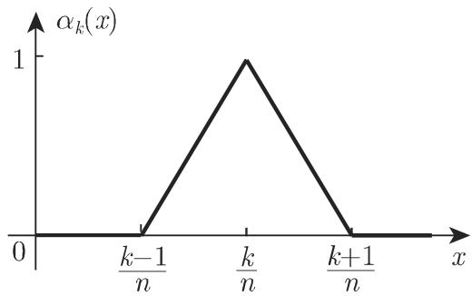

# 数学手册(原书第10版) 11.2.4 第二类弗雷德霍姆积分方程的数值解法

## 来源定位

本页对应《数学手册（原书第10版）》第 11 章积分方程中 11.2 节"第二类弗雷德霍姆积分方程"的第四小节（11.2.4），父节源页为 [[sources/10-数学手册原书第10版--16-112-第二类弗雷德霍姆积分方程--1hgvz4p]]。本节处理的问题是：当精确解法——11.2.1 的退化核方法（[[methodology/退化核求解流程]]）、11.2.2 的逐次逼近法（[[methodology/逐次逼近法]]，基于 [[concepts/诺伊曼级数]]）、11.2.3 的弗雷德霍姆解法（[[methodology/弗雷德霍姆解法]]）——"经常是不可能的，或者要做太多的工作"时，如何数值求解第二类弗雷德霍姆积分方程（[[entities/第二类弗雷德霍姆积分方程]]）。

引言原文"下面给出 种不同的方法"存在缺字，按小节结构推断应为"三"（见 [[queries/引言方法计数缺字]]）。三类方法为：

1. **积分的近似**（11.2.4.1）：以[[concepts/求积公式|求积公式]]离散积分算子，含半离散化（[[methodology/求积半离散化方法]]）与尼斯特伦法（[[methodology/尼斯特伦法]]）；
2. **核近似**（11.2.4.2）：以易解核 $\overline{K}$ 替换原核 $K$（[[methodology/核近似方法]]），含[[concepts/张量积近似|张量积近似]]与特殊样条函数法（[[concepts/特殊样条函数]]）两条路线；
3. **配置法**（11.2.4.3）：将解近似为基函数线性组合并在配置点强制满足方程（[[methodology/配置法]]）。

方法总览见 [[methodology/第二类弗雷德霍姆积分方程的数值解法]]，三类方法并排比较见 [[comparisons/三类数值解法比较]]。

## 逐字转录：目标方程与求积公式

目标方程（第二类弗雷德霍姆积分方程，见 [[concepts/第二类弗雷德霍姆积分方程]]）：

$$
\varphi(x) = f(x) + \lambda \int_a^b K(x, y)\,\varphi(y)\,\mathrm{d}y \tag{11.23}
$$

求积公式的一般形式：

$$
\int_a^b f(x)\,\mathrm{d}x \approx Q_{[a,b]}(f) = \sum_{k=1}^n \omega_k f(x_k) \tag{11.24}
$$

即以被积函数在插值节点 $x_k$ 处赋权 $\omega_k$ 的函数值之和代替积分；诸权值 $\omega_k$ 须适当选取（原文"以便与 无关"缺字，疑为 $f$）。

## 逐字转录：半离散问题（11.2.4.1.1）

$$
\varphi(x) \approx f(x) + \lambda\,Q_{[a,b]}\bigl(K(x,\cdot)\,\varphi(\cdot)\bigr) = f(x) + \lambda \sum_{k=1}^n \omega_k\,K(x, y_k)\,\varphi(y_k) \tag{11.25a}
$$

$$
\overline{\varphi}(x) = f(x) + \lambda \sum_{k=1}^n \omega_k\,K(x, y_k)\,\overline{\varphi}(y_k) \tag{11.25b}
$$

（11.25b）被视为一个半离散问题（[[concepts/半离散问题]]）：变量 $y$ 被转为离散值，而变量 $x$ 仍可为任意的（转写本此句 $x$、$y$ 缺字）。若（11.25b）对每个 $x\in[a,b]$ 成立，则在每个插值节点处成立：

$$
\overline{\varphi}(x_k) = f(x_k) + \lambda \sum_{j=1}^n \omega_j\,K(x_k, y_j)\,\overline{\varphi}(y_j), \quad k=1,2,\dots,n \tag{11.25c}
$$

这是关于 $n$ 个未知值 $\overline{\varphi}(x_k)$ 的 $n$ 个方程的线性方程组（转写本两处 $n$ 缺字）；把解代回（11.25b）即得半离散问题的解。

以左矩形公式（原书 19.3.2.1，第 1253 页，未入库）与等距划分 $y_k = x_k = a + h(k-1)$，$h=(b-a)/n$ 为例：

$$
\int_a^b K(x, y)\,\overline{\varphi}(y)\,\mathrm{d}y \approx \sum_{k=1}^n h\,K(x, y_k)\,\overline{\varphi}(y_k) \tag{11.26a}
$$

记号：

$$
K_{jk} = K(x_j, y_k), \quad f_k = f(x_k), \quad \varphi_k = \overline{\varphi}(x_k) \tag{11.26b}
$$

方程组（11.25c）成为：

$$
\begin{array}{c}
(1 - \lambda h K_{11})\varphi_1 - \lambda h K_{12}\varphi_2 - \dots - \lambda h K_{1n}\varphi_n = f_1,\\
-\lambda h K_{21}\varphi_1 + (1 - \lambda h K_{22})\varphi_2 - \dots - \lambda h K_{2n}\varphi_n = f_2,\\
\cdots\cdots\\
-\lambda h K_{n1}\varphi_1 - \lambda h K_{n2}\varphi_2 - \dots + (1 - \lambda h K_{nn})\varphi_n = f_n.
\end{array} \tag{11.26c}
$$

原文声称"相同的方程组被包含在弗雷德霍姆解法（11.2.3）中"，此结构性对应的核对见 [[comparisons/矩形公式系统与弗雷德霍姆解法方程组比较]]。矩形公式精度不足时须增加插值节点数目，但方程组维数随之增加，故须另寻求积公式（见 [[comparisons/高斯求积与矩形公式比较]]）。

## 逐字转录：高斯求积公式推导与尼斯特伦法（11.2.4.1.2）

尼斯特伦法（Nystrom method）用高斯求积公式（[[concepts/高斯求积公式]]）近似积分（原书 19.3.3.3，第 1254 页，未入库）。考虑

$$
I = \int_a^b f(x)\,\mathrm{d}x \tag{11.27a}
$$

以插值多项式 $p(x) = \sum_{k=1}^n L_k(x)f(x_k)$ 代替被积函数，其中拉格朗日插值基函数

$$
L_k(x) = \frac{(x - x_1)\cdots(x - x_{k-1})(x - x_{k+1})\cdots(x - x_n)}{(x_k - x_1)\cdots(x_k - x_{k-1})(x_k - x_{k+1})\cdots(x_k - x_n)} \tag{11.27b}
$$

$$
p(x_k) = f(x_k), \qquad k = 1, \dots, n \tag{11.27c}
$$

$$
\int_a^b f(x)\,\mathrm{d}x \approx \int_a^b p(x)\,\mathrm{d}x = \sum_{k=1}^n f(x_k)\int_a^b L_k(x)\,\mathrm{d}x = \sum_{k=1}^n \omega_k f(x_k) \tag{11.27d}
$$

其中 $\omega_k = \int_a^b L_k(x)\,\mathrm{d}x$。对高斯求积公式，插值节点不能任意选取，须用

$$
x_k = \frac{a+b}{2} + \frac{b-a}{2}\,t_k, \quad k = 1, 2, \dots, n \tag{11.28a}
$$

选取，这 $n$ 个 $t_k$ 值是第一类勒让德多项式（[[entities/勒让德多项式]]，原书 9.1.2.6，第 748 页）

$$
P_n(t) = \frac{1}{2^n \cdot n!}\,\frac{\mathrm{d}^n[(t^2-1)^n]}{\mathrm{d}t^n} \tag{11.28b}
$$

的 $n$ 个根，全部落在区间 $[-1,+1]$ 中。由代换 $x - x_k = \frac{b-a}{2}(t - t_k)$ 计算诸系数：

$$
\omega_k = \int_a^b L_k(x)\,\mathrm{d}x = (b-a)\cdot\frac{1}{2}\int_{-1}^{1} \frac{(t - t_1)\cdots(t - t_{k-1})(t - t_{k+1})\cdots(t - t_n)}{(t_k - t_1)\cdots(t_k - t_{k-1})(t_k - t_{k+1})\cdots(t_k - t_n)}\,\mathrm{d}t = (b-a)\,A_k \tag{11.29}
$$

### 表 11.1（第一类勒让德多项式的根 $t_k$ 与权值 $A_k$，$n=1,\dots,6$）

| n | t | A | n | t | A |
|---|---|---|---|---|---|
| 1 | t₁=0 | A₁=1 | 5 | t₁=−0.9062 | A₁=0.1185 |
| 2 | t₁=−0.5774 | A₁=0.5 |  | t₂=−0.5384 | A₂=0.2393 |
|  | t₂=0.5774 | A₂=0.5 |  | t₃=0 | A₃=0.2844 |
| 3 | t₁=−0.7746 | A₁=0.2778 |  | t₄=0.5384 | A₄=0.2393 |
|  | t₂=0 | A₂=0.4444 |  | t₅=0.9062 | A₅=0.1185 |
|  | t₃=0.7746 | A₃=0.2778 | 6 | t₁=−0.9324 | A₁=0.0857 |
| 4 | t₁=−0.8612 | A₁=0.1739 |  | t₂=−0.6612 | A₂=0.1804 |
|  | t₂=−0.3400 | A₂=0.3261 |  | t₃=−0.2386 | A₃=0.2340 |
|  | t₃=0.3400 | A₃=0.3261 |  | t₄=0.2386 | A₄=0.2340 |
|  | t₄=0.8612 | A₄=0.1739 |  | t₅=0.6612 | A₅=0.1804 |
|  |  |  |  | t₆=0.9324 | A₆=0.0857 |

**约定警示**（复算结论）：本表中的 $A_k$ 恰为标准 Gauss–Legendre 权的一半，因为 $\omega_k=(b-a)A_k$ 已吸收区间长度因子（标准权在 $[-1,1]$ 上总和为 2，此处 $A_k$ 总和为 1）；各根值与标准表一致。跨文献对照时须注意此约定，详见 [[findings/式11-27a至11-29与表11-1高斯求积推导转录复算]]。

## 逐字转录：核近似（11.2.4.2）

用一个核 $\overline{K}(x,y)$ 代替核 $K(x,y)$，使得在 $a\le x\le b$、$a\le y\le b$ 上有 $\overline{K}(x,y)\approx K(x,y)$，并选取使下列方程最易求解的核：

$$
\overline{\varphi}(x) = f(x) + \lambda\int_a^b \overline{K}(x, y)\,\overline{\varphi}(y)\,\mathrm{d}y \tag{11.30}
$$

### 张量积近似（11.2.4.2.1）

$$
K(x,y) \approx \overline{K}(x,y) = \sum_{j=0}^n \sum_{k=0}^n d_{jk}\,\alpha_j(x)\,\beta_k(y) \tag{11.31a}
$$

其中 $\alpha_0(x),\dots,\alpha_n(x)$ 与 $\beta_0(y),\dots,\beta_n(y)$ 是给定的线性无关函数，系数 $d_{jk}$ 须选取得使二重和在某种意义下充分逼近核。用一个退化核（[[concepts/退化核]]）改写：

$$
\overline{K}(x,y) = \sum_{j=0}^n \alpha_j(x)\left[\sum_{k=0}^n d_{jk}\,\beta_k(y)\right], \quad \delta_j(y) = \sum_{k=0}^n d_{jk}\,\beta_k(y), \quad \overline{K}(x,y) = \sum_{j=0}^n \alpha_j(x)\,\delta_j(y) \tag{11.31b}
$$

于是可把 11.2.1 的解法用于

$$
\overline{\varphi}(x) = f(x) + \lambda\int_a^b \left[\sum_{j=0}^n \alpha_j(x)\,\delta_j(y)\right]\overline{\varphi}(y)\,\mathrm{d}y \tag{11.31c}
$$

应选取使 $d_{jk}$ 易算、且（11.31c）的解不难计算的函数组。

> 译者注（转写本标记残缺为"叩"）：原文把 (11.31b) 后两等式连在一起了：$\delta_j(y) = \sum_{k=0}^n d_{jk}\beta_k(y)\quad \overline{K}(x,y) = \sum_{j=0}^n \alpha_j(x)\delta_j(y)$。

### 特殊样条函数法（11.2.4.2.2）

在 $[a,b]=[0,1]$ 上取帽函数（[[concepts/特殊样条函数]]）：

$$
\alpha_k(x) = \beta_k(x) = \begin{cases} 1 - n\left|x - \dfrac{k}{n}\right|, & \dfrac{k-1}{n} \le x \le \dfrac{k+1}{n},\\ 0, & \text{其他情形}, \end{cases} \tag{11.32}
$$

$\alpha_k(x)$ 仅在所谓的承载区间（carrier interval）$\left(\frac{k-1}{n}, \frac{k+1}{n}\right)$ 上取非零值（原文"承栽区间"系 OCR 讹误）。图 11.1：

在点 $x = l/n$、$y = i/n$（$l, i = 0, 1, \dots, n$）处考虑 $\overline{K}$，则有（δ 性质）：

$$
\alpha_j\!\left(\frac{l}{n}\right)\alpha_k\!\left(\frac{i}{n}\right) = \begin{cases} 1, & j = l,\ k = i,\\ 0, & \text{其他情形}, \end{cases} \tag{11.33}
$$

故 $\overline{K}(l/n, i/n) = d_{li}$，即 $d_{li} = \overline{K}(l/n, i/n) = K(l/n, i/n)$，于是

$$
\overline{K}(x,y) = \sum_{j=0}^n \sum_{k=0}^n K\!\left(\frac{j}{n}, \frac{k}{n}\right)\alpha_j(x)\,\beta_k(y) \tag{11.34}
$$

（11.31c）的解有形式（直接引用 11.2.1 退化核解结构）：

$$
\overline{\varphi}(x) = f(x) + A_0\,\alpha_0(x) + \dots + A_n\,\alpha_n(x) \tag{11.35}
$$

其中 $A_0\alpha_0(x) + \dots + A_n\alpha_n(x)$ 是在 $x_k = k/n$ 处取替换值 $A_k$ 的分段线性函数。用退化核方法解（11.31c）得关于 $A_0,\dots,A_n$ 的线性方程组：

$$
\begin{array}{c}
(1 - \lambda c_{00})A_0 - \lambda c_{01}A_1 - \dots - \lambda c_{0n}A_n = b_0,\\
-\lambda c_{10}A_0 + (1 - \lambda c_{11})A_1 - \dots - \lambda c_{1n}A_n = b_1,\\
\cdots\cdots\\
-\lambda c_{n0}A_0 - \lambda c_{n1}A_1 - \dots + (1 - \lambda c_{nn})A_n = b_n.
\end{array} \tag{11.36a}
$$

其中（**注意**：转写本求和号内作 $\alpha_j(x)$，按 (11.31b) 的 $\delta_j$ 定义与后文展开式应为 $\alpha_i(x)$，见 [[queries/式11-36b求和内αj疑为αi]]）：

$$
c_{jk} = \int_0^1 \delta_j(x)\,\alpha_k(x)\,\mathrm{d}x = \int_0^1 \left[\sum_{i=0}^n K\!\left(\frac{j}{n}, \frac{i}{n}\right)\alpha_j(x)\right]\alpha_k(x)\,\mathrm{d}x = K\!\left(\frac{j}{n}, \frac{0}{n}\right)\int_0^1 \alpha_0(x)\alpha_k(x)\,\mathrm{d}x + \dots + K\!\left(\frac{j}{n}, \frac{n}{n}\right)\int_0^1 \alpha_n(x)\alpha_k(x)\,\mathrm{d}x \tag{11.36b}
$$

Gram 积分的显式值（已独立复算验证，见 [[findings/式11-32至11-36e特殊样条核近似转录复算]]）：

$$
I_{jk} = \int_0^1 \alpha_j(x)\,\alpha_k(x)\,\mathrm{d}x = \begin{cases} \dfrac{1}{3n}, & j=0,\ k=0 \ \text{和}\ j=n,\ k=n,\\[4pt] \dfrac{2}{3n}, & j=k,\ 1 \le j \le n,\\[4pt] \dfrac{1}{6n}, & j=k+1,\ j=k-1,\\[4pt] 0, & \text{其他情形}, \end{cases} \tag{11.36c}
$$

$$
b_k = \int_0^1 f(x)\left[\sum_{j=0}^n K\!\left(\frac{k}{n}, \frac{j}{n}\right)\alpha_j(x)\right]\mathrm{d}x \tag{11.36d}
$$

以 $c_{jk}$ 组成矩阵 $C$、值 $K(j/n, k/n)$ 组成矩阵 $B$、值 $I_{jk}$ 组成矩阵 $A$、$b_0,\dots,b_n$ 组成向量 $\underline{\boldsymbol{b}}$、$A_0,\dots,A_n$ 组成向量 $\underline{\boldsymbol{a}}$，则（11.36a）有形式：

$$
(I - \lambda C)\,\underline{a} = (I - \lambda BA)\,\underline{a} = \underline{b} \tag{11.36e}
$$

原文："若矩阵 $(I-\lambda BA)$ 是正规的时，这个方程组有一个唯一解"——"正规的"疑为 regulär（正则/非奇异）之译法问题，见 [[queries/式11-36e正规的疑为正则非奇异]]。注意本节记号复用：$A_k$ 既是高斯权（表 11.1）又是样条解系数（11.35、11.36a）；矩阵 $A$ 在 (11.36e) 为 Gram 矩阵、在 (11.37e) 为配置基值矩阵。

## 逐字转录：配置法（11.2.4.3）

设 $[a,b]$ 中 $n$ 个线性无关函数 $\varphi_1(x),\dots,\varphi_n(x)$，构成解的近似：

$$
\varphi(x) \approx \overline{\varphi}(x) = a_1\,\varphi_1(x) + a_2\,\varphi_2(x) + \dots + a_n\,\varphi_n(x) \tag{11.37a}
$$

在积分区间中界定 $n$ 个插值点（配置点）$x_1,\dots,x_n$，使近似函数至少在这些点上满足积分方程：

$$
\overline{\varphi}(x_k) = a_1\varphi_1(x_k) + \dots + a_n\varphi_n(x_k) = f(x_k) + \lambda\int_a^b K(x_k, y)\left[a_1\varphi_1(y) + \dots + a_n\varphi_n(y)\right]\mathrm{d}y \quad (k=1,\dots,n) \tag{11.37b}
$$

（转写本此处另有一个空编号 "(11.37c)"，疑为 (11.37b) 两行显示式的第二行编号，见 [[queries/式11-37c空编号归属]]。）经一些变换：

$$
\left[\varphi_1(x_k) - \lambda\int_a^b K(x_k, y)\varphi_1(y)\,\mathrm{d}y\right]a_1 + \dots + \left[\varphi_n(x_k) - \lambda\int_a^b K(x_k, y)\varphi_n(y)\,\mathrm{d}y\right]a_n = f(x_k) \quad (k=1,\dots,n) \tag{11.37d}
$$

定义矩阵与向量：

$$
\boldsymbol{A} = \begin{pmatrix} \varphi_1(x_1) & \dots & \varphi_n(x_1)\\ \vdots & & \vdots\\ \varphi_1(x_n) & \dots & \varphi_n(x_n) \end{pmatrix}, \qquad \boldsymbol{B} = \begin{pmatrix} \beta_{11} & \dots & \beta_{1n}\\ \vdots & & \vdots\\ \beta_{n1} & \dots & \beta_{nn} \end{pmatrix}, \tag{11.37e}
$$

其中 $\beta_{jk} = \int_a^b K(x_j, y)\varphi_k(y)\,\mathrm{d}y$，以及

$$
\underline{\boldsymbol{a}} = (a_1, \dots, a_n)^{\mathrm{T}}, \qquad \underline{\boldsymbol{b}} = (f(x_1), \dots, f(x_n))^{\mathrm{T}}, \tag{11.37f}
$$

则方程组可写成矩阵形式：

$$
(\boldsymbol{A} - \lambda\boldsymbol{B})\,\underline{\boldsymbol{a}} = \underline{\boldsymbol{b}}. \tag{11.37g}
$$

配置点选取无理论约束；若解函数在某个子区间中极为振荡，须在该区间中增加插值节点数目。高次多项式基在数值上不稳定，改进精度宜换用 11.2.4.2 的分段线性样条基（见 [[comparisons/多项式基与样条基配置比较]]）。

## 算例数据

### 算例 1：尼斯特伦法（$n=3$，核 $e^{xy}$）

用尼斯特伦法对 $n=3$ 解积分方程（$\lambda=1$ 隐含）：

$$
\varphi(x) = \cos \pi x + \frac{x}{x^2 + \pi^2}(\mathrm{e}^x + 1) + \int_0^1 \mathrm{e}^{xy}\,\varphi(y)\,\mathrm{d}y.
$$

由表 11.1（$n=3$）：$A_1 = 0.2778$，$A_2 = 0.4444$，$A_3 = 0.2778$；节点 $x_2 = 0.5$，$x_3 = 0.8873$（**转写本缺录 $x_1$，应为 $0.5(1-0.7746)=0.1127$**，见 [[queries/尼斯特伦法算例x1缺录]]）。函数值 $f_1 = 0.96214$，$f_2 = 0.13087$，$f_3 = -0.65251$；核值 $K_{11} = 1.01278$，$K_{22} = 1.28403$，$K_{33} = 2.19746$，$K_{12} = K_{21} = 1.05797$，$K_{13} = K_{31} = 1.10517$，$K_{23} = K_{32} = 1.55838$。

关于 $\varphi_1, \varphi_2, \varphi_3$ 的方程组（11.25c）：

$$
\begin{array}{rl}
&0.71864\,\varphi_1 - 0.47016\,\varphi_2 - 0.30702\,\varphi_3 = 0.96214,\\
&-0.29390\,\varphi_1 + 0.42938\,\varphi_2 - 0.43292\,\varphi_3 = 0.13087,\\
&-0.30702\,\varphi_1 - 0.69254\,\varphi_2 + 0.38955\,\varphi_3 = -0.65251.
\end{array}
$$

解为 $\varphi_1 = 0.93651$，$\varphi_2 = -0.00144$，$\varphi_3 = -0.93950$；精确解（$\varphi(x)=\cos\pi x$，隐含）在插值节点处的代换值为 $\varphi(x_1) = 0.93797$，$\varphi(x_2) = 0$，$\varphi(x_3) = -0.93797$。独立复算（含精确解验证 $\int_0^1 \mathrm{e}^{xy}\cos\pi y\,\mathrm{d}y = -x(\mathrm{e}^x+1)/(x^2+\pi^2)$）全部一致，误差约 $1.5\times10^{-3}$；个别系数末位有 $10^{-4}\sim10^{-5}$ 级出入，详见 [[findings/尼斯特伦法算例指数核复算]]。

### 算例 2：配置法（二次基，节点 $0, 0.5, 1$，核 $\sqrt{xy}$）

$$
\varphi(x) = \frac{\sqrt{x}}{2} + \int_0^1 \sqrt{xy}\,\varphi(y)\,\mathrm{d}y \quad (\lambda = 1\ \text{隐含}).
$$

近似函数 $\overline{\varphi}(x) = a_1x^2 + a_2x + a_3$，即 $\varphi_1(x)=x^2$，$\varphi_2(x)=x$，$\varphi_3(x)=1$；插值节点 $x_1=0$，$x_2=0.5$，$x_3=1$。

$$
\boldsymbol{A} = \begin{pmatrix} 0 & 0 & 1\\ \frac{1}{4} & \frac{1}{2} & 1\\ 1 & 1 & 1 \end{pmatrix}, \quad \boldsymbol{B} = \begin{pmatrix} 0 & 0 & 0\\ \frac{\sqrt{2}}{7} & \frac{\sqrt{2}}{5} & \frac{\sqrt{2}}{3}\\ \frac{2}{7} & \frac{2}{5} & \frac{2}{3} \end{pmatrix}, \quad \underline{\boldsymbol{b}} = \begin{pmatrix} 0\\ \frac{1}{2\sqrt{2}}\\ \frac{1}{2} \end{pmatrix}.
$$

方程组（原文仅展示两行，第一行 $a_3=0$ 隐含）：

$$
\begin{array}{c}
\left(\frac{1}{4} - \frac{\sqrt{2}}{7}\right)a_1 + \left(\frac{1}{2} - \frac{\sqrt{2}}{5}\right)a_2 + \left(1 - \frac{\sqrt{2}}{3}\right)a_3 = \frac{1}{2\sqrt{2}},\\
\frac{5}{7}a_1 + \frac{3}{5}a_2 + \frac{1}{3}a_3 = \frac{1}{2},
\end{array}
$$

解为 $a_1 = -0.8197$，$a_2 = 1.8092$，$a_3 = 0$，故 $\overline{\varphi}(x) = -0.8197x^2 + 1.8092x$（原文"l.8092x"系 1.8092 之讹），因而 $\overline{\varphi}(0) = 0$，$\overline{\varphi}(0.5) = 0.6997$，$\overline{\varphi}(1) = 0.9895$。精确解为 $\varphi(x) = \sqrt{x}$：$\varphi(0)=0$，$\varphi(0.5)=0.7070$，$\varphi(1)=1$。矩阵、解与函数值均已独立复算一致，误差约 $7\times10^{-3}\sim10^{-2}$，详见 [[findings/配置法算例平方根核复算]]。

## 主要论断

1. **三分类主张**：精确解法不可行时可用三类数值方法——积分近似、核近似、配置法；三套推导自洽，属标准数值分析结果。
2. **结构性对应**（仅关于矩形公式系统 11.26c）：该方程组"被包含在弗雷德霍姆解法（11.2.3）中"。
3. **精度—维数权衡**：矩形公式精度不足→增加节点→方程组维数增大→改用高斯求积（尼斯特伦法），由算例 1 支持精度可达 $10^{-3}$ 量级。
4. **退化核归约**（仅关于张量积/样条核近似）：式 (11.31b) 把张量积核改写为退化核，解形式 (11.35) 直接引用 11.2.1 结果——张量积近似是[[concepts/退化核]]的构造性生成方式。
5. **唯一性条件**（仅关于样条核近似系统）：$(I-\lambda BA)$ 正则（原文"正规的"）时 $(I-\lambda BA)\underline{a}=\underline{b}$ 有唯一解。
6. **稳定性主张**（仅关于配置法的高次多项式基）：高次多项式数值不稳定，分段线性样条更好；配置点选取无理论约束。

## 与现有维基的联系

- [[methodology/第二类弗雷德霍姆积分方程的数值解法]]：本源即该方法页的完整内容，已扩充为三方法总览。
- [[concepts/退化核]] 与 [[methodology/退化核求解流程]]：张量积近似（11.31b）是退化核的构造性生成方式，(11.35) 直接引用 11.2.1 解结构。
- [[methodology/弗雷德霍姆解法]]：(11.26c) 与弗雷德霍姆解法方程组的同一性声称，属新增对应关系。
- [[methodology/逐次逼近法]]、[[concepts/诺伊曼级数]]：引言中作为"不可行/太费工"的精确解法被引用，属背景强化。
- [[entities/勒让德多项式]]：式 (11.28b) Rodrigues 公式与表 11.1 根值扩展了该实体的应用面（根作高斯求积节点）。
- [[concepts/积分方程的核]]：核近似主题直接相关。
- [[concepts/偏微分方程的逼近方法]]：结构上平行的"方程类逼近方法总览"页面，可互为参照。
- 算例记录方式沿用 11.2.1 算例 A/B 的 finding 先例。

## 转写疑点汇总

全部 OCR 讹误与缺字集中记录于 [[queries/11-2-4全节系统性转写讹误清单]]；需单独裁决的疑点另立查询页：[[queries/尼斯特伦法算例x1缺录]]、[[queries/引言方法计数缺字]]、[[queries/式11-36b求和内αj疑为αi]]、[[queries/式11-36e正规的疑为正则非奇异]]、[[queries/式11-37c空编号归属]]；未入库回指（19.3.2.1、19.3.3.3、表 11.1、图 11.1）见 [[queries/11-2-4未入库回指缺口]]。

<!-- llm-wiki:embedded-images -->
## Embedded Images

### Document

<!-- llm-wiki:embedded-images -->
