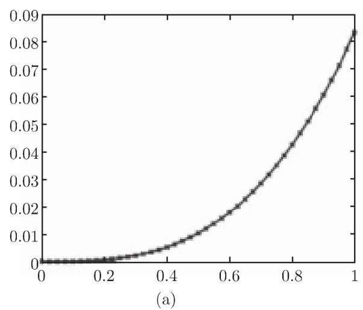
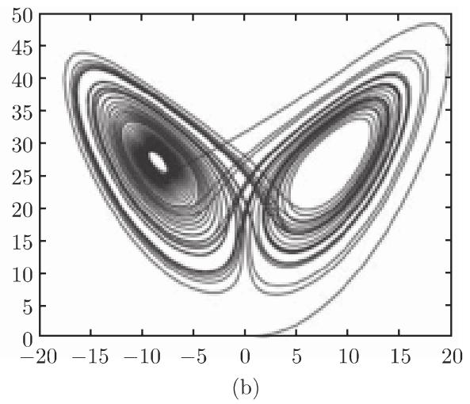
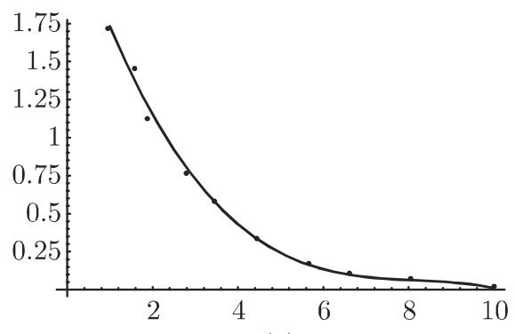
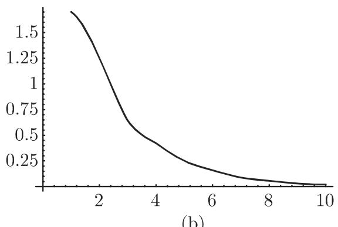

# 数学手册(原书第10版) 19.8.4 交互程序系统和计算机代数系统的应用

本源是 [[sources/10-数学手册原书第10版--9-198-使用计算机--17tehs0]]（19.8 使用计算机）的第 4 小节，含编号公式 (19.291)–(19.296)、表 19.5–19.8、图 19.19–19.22。三小节依次讨论 [[entities/matlab]]（19.8.4.1）、[[entities/mathematica]]（19.8.4.2）、[[entities/maple]]（19.8.4.3）在同一组数值问题上的应用；手册明言「在后面 Mathematica、Maple 的数值应用中，将同样讨论这些问题」，故三小节构成一组同题跨系统对照（见 [[comparisons/Matlab-Mathematica-Maple同题数值比较]]）。译者署名「余德浩、李金译」出现于 Maple 小节末尾；其后残存一句「我们能确定解，例如在 x=0.5 处的值」（应属 dsolve 算例）及第 20 章标题残句「20章计算机代数系统——以 Mathematica 为例 / 20.1 引言」，属下一文件内容。

## 19.8.4.1 Matlab（要点）

- 性质（据本源）：商用程序系统「矩阵实验室」，数学求解公式问题的交互环境与科学技术计算的高级编程语言；优先设置线性代数的问题和算法；按 IEEE 标准（表 19.4）以双精度浮点数运行；兼容的可免费下载系统有 Scilab、Octave；另有工具箱（曲线拟合、滤波器、商业数学、时间序列分析、信号和模式处理、神经网络、优化、偏微分方程、样条、统计、小波）。
- 数值线性代数：[[concepts/反斜杠算符]]；[L,R,P]=lu(A) 三角分解；hilb(13) 触发 RCOND 警告（[[concepts/希尔伯特矩阵与条件数警告]]）；超定方程组经 QR 分解处理线性拟合。
- 方程数值求解：多项式以系数行向量表示；polyval/polyder/roots（根作为伴随矩阵特征值确定）；fzero 求非线性标量方程近似解（本源称「二分法和试位法的组合」，回指 19.1.1.3）。
- 插值：interp1/polyfit；interp2 对二维矩形网格（'spline' 即双三次样条，回指 19.7.2.1）；griddata 对非规则数据；10 点数据集同题复用。
- 数值积分：[[concepts/quad与quadl自适应求积]]。
- 微分方程：ode45（4/5 阶自适应龙格—库塔，回指 19.4.1.2）、ode113（预估—校正型线性多步法，回指 19.4.1.4）、刚性专用程序（回指 19.4.1.5,4）；算例 y′=¼(x²+y²) 与 [[concepts/洛伦茨方程组]]（命令行截断）。

## 19.8.4.2 Mathematica（要点）

- 方法论告诫：数值程序基于函数数值表而非符号计算，点数有限须假定连续性，答案可能仍然是错的；建议尽可能利用符号信息（[[concepts/交互程序系统与计算机代数系统]]）。
- 曲线拟合与插值：Fit（式 19.291，最小二乘/离散平均逼近，回指 6.2.5、19.6.2.2）；Interpolation（表 19.6）。
- 多项式方程数值解：NSolve（回指 20.3.2.1）。
- 数值积分：NIntegrate（式 19.292 奇点列出语法）；MinRecursion/MaxRecursion（默认 6）；峰值丢失算例（[[findings/NIntegrate峰值丢失与递归选项复算]]）。
- 微分方程：NDSolve 与 InterpolatingFunction（表 19.7）；选项 AccuracyGoal、PrecisionGoal、WorkingPrecision（更高精度应增五个单位）、MaxSteps（默认 500，可取 Infinity）；两例：摩擦介质中重物运动、傅科摆。

## 19.8.4.3 Maple（要点）

- 全局变量 Digits 规定计算精度，取大降低速度。
- 数值求值：evalf(expr,n)（式 19.293）与 evalhf（[[concepts/evalf与evalhf]]）。
- 方程数值解：fsolve（式 19.294，表 19.8）。
- 数值积分：evalf(int(f(x),x=a..b),n)（式 19.295）；大区间情形 readlib('evalf/int') 与内部记号 _NCrule。
- 微分方程：dsolve(deqn,var,numeric)（式 19.296）返回程序对象，应用龙格—库塔法；默认相对/绝对误差 10^(−Digits+3)，可经 _RELERR/_ABSERR 修改。

## 结构化数据转录

### Matlab 函数清单（德文原文，已校正明显 OCR 讹误）

```txt
Allgemeine mathematische Funktionen（一般数学函数）
  1. Trigonometrie                             5. Koordinatentransformationen
  2. Exponentialfunktion, Logarithmen          6. Rundung und gebrochener Teil
  3. Spezielle Funktionen                      7. Diskrete Mathematik
  4. Komplexe Arithmetik                       8. Mathematische Konstanten

Numerische lineare Algebra（数值线性代数）
  1. Manipulation von Feldern und Matrizen     5. Eigenwerte und Singularwerte
  2. Spezielle Matrizen                        6. Matrix-Faktorisierungen
  3. Matrix-Analysis (Normen, Kondition)       7. Matrixfunktionen
  4. Lineare Gleichungssysteme                 8. Verfahren für dünn besetzte Matrizen

Numerische Verfahren（数值方法）
  1. Berechnung statistischer Daten            7. Ermittlung der konvexen Hülle
  2. Korrelation und Regression                8. Numerische Integration
  3. Diskrete Fouriertransformation            9. Gewöhnliche Differentialgleichungen
  4. Polynome und Splines                     10. Partielle Differentialgleichungen
  5. Ein- und mehrdimensionale Interpolation  11. Nichtlineare Gleichungen
  6. Triangulationen und Zerlegungen          12. Minimierung von Funktionen
```

（源文讹误：Hiille→Hülle、diinn→dünn、Gewohnliche→Gewöhnliche、fiir→für、「N umerische lineare Alge bra」等。）

### 命令行算例

以下转录已按 [[queries/19-8-4全节系统性转写讹误清单]] 校正明显的字符讹误（£zero→fzero、quad1→quadl、interpl→interp1、x=O→x=0、「五[3]:＝」→In[3]:=、连写字符串补顿号等）；数值输出一律保持源文原样。

Matlab 数值线性代数：

```txt
>> A = [1 0 3; 2 1 1; 1 2 3];  b = [-2; 3; 2];  x = A\b, norm(A*x - b)
x = (1.0000, 2.0000, -1.0000)ᵀ      ans = 8.8818e-016
>> [L, R, P] = lu(A)
L = [1.0000       0        0
     0.5000  1.0000       0
     0.5000 -0.3333  1.0000]
R = [2.0000 1.0000 1.0000
     0      1.5000 2.5000
     0      0      3.3333]
P = [0 1 0
     0 0 1
     1 0 0]
>> x = hilb(13)\ones(13,1)
Warning: Matrix is close to singular or badly scaled.
Results may be inaccurate. RCOND = 2.409320e-017.
>> A = [1 0 3; 2 1 1; 1 2 3; 1 1 -1];  b = [-2; 3; 2; 1];  x = A\b, norm(A*x - b)
x = (0.4673, 1.4393, -0.4953)ᵀ      ans = 2.0508
>> [Q, R] = qr(A)
Q = [-0.3780 -0.4583  0.6466  0.4785
     -0.7559 -0.2750 -0.2321 -0.5469
     -0.3780  0.8250  0.4145 -0.0684
     -0.3780  0.1833 -0.5969  0.6836]
R = [-2.6458 -1.8898 -2.6458
      0       1.5584  0.6417
      0       0       3.5480
      0       0       0      ]
```

（正文「得三角分解 PA = LA」为讹误，复算证实 PA = LR，见 [[queries/PA等于LA疑为PA等于LR之辨]]；R(3,3) 之 3.5480 与复算值 3.5483 末位不符。）

Matlab 求根、插值、积分、微分方程：

```txt
>> p = [1 0 0 0 3 0 -5];
>> polyval(p,1)    ans = -1
>> polyder(p)      ans = 6 0 0 0 6 0
>> roots(p)        ans = 0.8673+1.1529i, 0.8673-1.1529i, 1.0743,
                         -0.8673+1.1529i, -0.8673-1.1529i, -1.0743
>> fzero(@(x)exp(-x^3) - 4*x^2, 1)    ans = 0.4741
>> fzero(@(x)exp(-x^3) - 4*x^2, 0)    ans = -0.5413
>> fzero(@(x)exp(-x^3) - 4*x^2, -1)   ans = -1.2085
```

```matlab
>> plot([1.70045, 1.2523, 0.638803, 0.423479, 0.249091, 0.160321, ...
        0.0883432, 0.0570776, 0.0302744, 0.0212794]);
>> [X,Y]=meshgrid(-2:1:2); F=4-sqrt(16-X.^2-Y.^2);
>> [Xe,Ye]=meshgrid(-2:0.1:2); S=interp2(X,Y,F,Xe,Ye,'spline');
>> surf(Xe,Ye,S)
>> hold on; stem3(X,Y,F,'fill')
```

（命令中 F=4−sqrt(16−…) 与正文 f(x,y)=sqrt(16−x²−y²) 差常数项 4−。）

```txt
>> format long; [I, fwerte] = quad(@(x)(sin(x)./x), 0, 1)
I = 0.94608307007653    fwerte = 14
>> format long; [I, fwerte] = quadl(@(x)(sin(x)./x), 0, 1)
I = 0.94608307036718    fwerte = 19
>> format long; [I, fwerte] = quad(@(x)(sin(x)./x), 0, 1, 1e-14)
I = 0.94608307036718    fwerte = 258
>> format long; [I, fwerte] = quadl(@(x)(sin(x)./x), 0, 1, 1e-14)
I = 0.94608307036718    fwerte = 19
>> format long; [I, fwerte] = quad(@(x)(exp(-x.^2)), -1000, 1000, 1e-10)
I = 1.77245385094233    fwerte = 585
>> format long; [I, fwerte] = quadl(@(x)(exp(-x.^2)), -1000, 1000, 1e-10)
I = 1.77245385090571    fwerte = 768
```

```txt
>> [x,y] = ode45(@(x,y)((x.^2 + y.^2)./4), [0 1], 0); plot(x,y)
>> [t, x] = ode45(@(t, x)([10*(x(2) - x(1)); …
```

（洛伦茨 ode45 命令行在源中截断。）

Mathematica：

```txt
In[1] := l = {1.70045, 1.2523, 0.638803, 0.423479, 0.249091, 0.160321,
              0.0883432, 0.0570776, 0.0302744, 0.0212794};   （其后数据区大面积乱码）
In[2] := f1 = Fit[l, {1, x, x^2, x^3, x^4}, x]
Out[2] = 2.48918 - 0.853487 x + 0.0998996 x^2 - 0.00371393 x^3 - 0.0000219224 x^4
In[3] := Plot[ListPlot[l, {x, 10}], f1, {x, 1, 10}, AxesOrigin -> {0, 0}]
In[3] := Plot[Interpolation[l][x], {x, 1, 10}]

In[1] := NSolve[x^6 + 3x^2 - 5 == 0]
Out[1] = {x -> -1.07432}, {x -> -0.867262 - 1.15292 I}, {x -> -0.867262 + 1.15292 I},
         {x -> 0.867262 - 1.15292 I}, {x -> 0.867262 + 1.15292 I}, {x -> 1.07432}

A: In[1] := NIntegrate[Exp[-x^2], {x, -Infinity, Infinity}]      Out[1] = 1.77245.
B: In[2] := NIntegrate[1/x^2, {x, -1, 1}]
   Power::infy: Infinite expression 1/0 encountered.
   NIntegrate::inum: Integrand ComplexInfinity is not numerical at {x} = {0}.

In[3] := NIntegrate[Exp[-x^2], {x, -1000, 1000}]     （源文此行严重乱码，依上下文复原）
   NIntegrate::ploss: 数值积分因失去精度停止……
   Out[3] = 1.34946·10^-26
In[4] := NIntegrate[Exp[-x^2], {x, -1000, 1000}, MinRecursion -> 3, MaxRecursion -> 10]
   Out[4] = 1.77245

In[1] := dg = NDSolve[{x''[t] == -0.1 Sqrt[x'[t]^2 + y'[t]^2] x'[t],
                       y''[t] == -10 - 0.1 Sqrt[x'[t]^2 + y'[t]^2] y'[t],
                       x[0] == y[0] == 0, x'[0] == 100, y'[0] == 200},
                      {x, y}, {t, 1 5}]
Out[1] = {{x -> InterpolatingFunction[{0., 15.}, <>],
           y -> InterpolatingFunction[{0., 15.}, <>]}}
In[2] := ParametricPlot[{x[t], y[t]} /. dg, {t, 0, 2}, PlotRange -> All]

In[3] := dg3 = NDSolve[{x''[t] == -x[t] + 0.05 y'[t], y''[t] == -y[t] - 0.05 x'[t],
                        x[0] == 0, y[0] == 10, x'[0] == y'[0] == 0},
                       {x, y}, {t, 0, 40}]
Out[3] = {{x -> InterpolatingFunction[{0., 40.}, <>],
           y -> InterpolatingFunction[{0., 40.}, <>]}}
In[4] := ParametricPlot[{x[t], y[t]} /. dg3, {t, 0, 40}, AspectRatio -> 1]
```

（摩擦算例命令区间「{t, 1 5}」疑为 {t, 0, 15}，且正文初值 y(0)=10 与命令 y[0]==0 矛盾，见 [[queries/摩擦算例y初值与t区间之辨]]；两个 In[3] 编号重复为源文原样。）

Maple：

```txt
> f := z -> sqrt(z) + ln(z);          （源文回显误作 sqrt(x)+ln x）
> for x from 1 by 0.2 to 4 do print(f[x] = evalf(f(x), 12)) od
  （输出为形如 f[3.2] = 2.95200519181 的函数值表；源文「2095200519181」为小数点转写讹误）

> eq := x^6 + 3*x^2 - 5 = 0
> fsolve(eq, x);                      -1.074323739, 1.074323739
> fsolve(eq, x, complex);             -1.074323739, -0.8672620244 - 1.152922012 I,
                                      -0.8672620244 + 1.152922012 I, …（其余根输出区乱码）
> eq := exp(-x^3) - 4*x^2 = 0
> fsolve(eq, x);                      0.4740623572
> fsolve(eq, x, x = -2..0);           -0.5412548544

> int(exp(-x^3), x = -2..2);          （原样返回，原函数未知）
> evalf(int(exp(-x^3), x = -2..2), 15);      277.745841695583
> evalf(int(exp(-x^2), x = -1000..1000));    （误差信息）
> readlib('evalf/int'):
> 'evalf/int'(exp(-x^2), x = -1000..1000, 10, _NCrule);    1.772453851

> r := dsolve({diff(y(x), x) = (1/4)*(x^2 + y(x)^2), y(0) = 0}, y(x), numeric);
      r := proc 'dsolve/numeric/result2'(x, 1592392, [1]) end
> r(0.5);      {x(.5) = 0.5000000000, y(x)(.5) = 0.01041860472}
```

（例 A 正文作「x⁶+3x³−5=0」，命令为 x^6+3*x^2−5，三系统根值证实为 3x²，见 [[queries/Maple例A之3x3疑为3x2之辨]]。）

## 复算与验证状态

- 已复算证实：PA=LR（逐行乘积复核）；超定算例最小二乘解 (0.4673, 1.4393, −0.4953)ᵀ 与残量范数 2.0508（正规方程复算）；qr 的 R 对角元（−2.6458=−√7、1.5584=√(17/7)，R(3,3) 末位有微差）；x⁶+3x²−5 六根（三系统互证、t=x² 代入复算）；e^(−x³)−4x²=0 三根（逐一代入）；Si(1)=0.946083070367183 与 √π=1.772453850905516 吻合；傅科摆命令系数 0.05=2Ω；Maple 积分 277.745841695583（级数复算）；y(0.5)=0.01041860472（级数解复算）；f[3.2]=2.95200519181。
- 未独立复算/存疑：hilb(13) 的 RCOND=2.409320e-017（软件输出转录，量级合理）；Fit 系数逐位值；洛伦茨 ode45 算例（命令截断）。
- 负结果：正文「e^(1−0.5x) 的级数展开取了前四项」与拟合系数复算不符（[[findings/Mathematica-Fit系数与e的1减0点5x级数之说不符]]）。

## 转写质量

本源转写讹误密集且成系统（字母 l 与数字 1 混淆、「千」→「于」、脱符号 A/n/t/x、连写字符串脱顿号、大面积乱码块等），汇总于 [[queries/19-8-4全节系统性转写讹误清单]]；回指未入库章节的清单见 [[queries/19-8-4未入库回指缺口]]。德文函数清单与 Fit 数据区乱码仅编目、不尝试复原；第 20 章残句留给下一源文件处理。

## 图

- 图 19.19(a)（Matlab，10 点数据集的三次插值样条与四阶最佳逼近多项式）：
- 图 19.19(b)（Matlab，interp2 'spline' 二元三次样条插值与数据点）：
- 图 19.20(a)（Matlab，ode45 解 y′=¼(x²+y²)）：
- 图 19.20(b)（Matlab，洛伦茨方程组 (x₁,x₃) 平面相图）：
- 图 19.21(a)（Mathematica，Fit 四次多项式与数据）：
- 图 19.21(b)（Mathematica，Interpolation 结果）：
- 图 19.22(a)（Mathematica，摩擦介质中重物运动参数曲线）：
- 图 19.22(b)（Mathematica，傅科摆解的参数曲线）：

## 关联页面

- 实体：[[entities/matlab]]、[[entities/mathematica]]、[[entities/maple]]
- 概念：[[concepts/反斜杠算符]]、[[concepts/希尔伯特矩阵与条件数警告]]、[[concepts/quad与quadl自适应求积]]、[[concepts/交互程序系统与计算机代数系统]]、[[concepts/evalf与evalhf]]、[[concepts/洛伦茨方程组]]
- 发现：[[findings/式19-291至19-296命令格式与表19-5至19-8转录]]、[[findings/Matlab线性代数算例复算]]、[[findings/跨系统求根复算]]、[[findings/quad与quadl求值次数复算]]、[[findings/NIntegrate峰值丢失与递归选项复算]]、[[findings/Maple积分与dsolve算例复算]]、[[findings/Mathematica-Fit系数与e的1减0点5x级数之说不符]]
- 比较：[[comparisons/quad与quadl比较]]、[[comparisons/Matlab-Mathematica-Maple同题数值比较]]
- 查询：[[queries/19-8-4全节系统性转写讹误清单]]、[[queries/19-8-4未入库回指缺口]] 等 10 页

<!-- llm-wiki:embedded-images -->
## Embedded Images

### Document


<!-- llm-wiki:embedded-images -->
