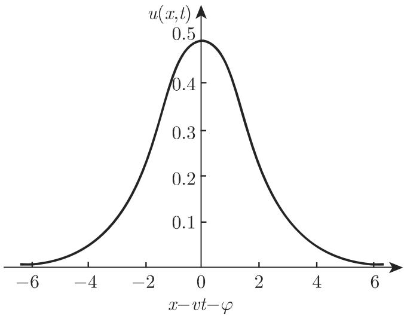
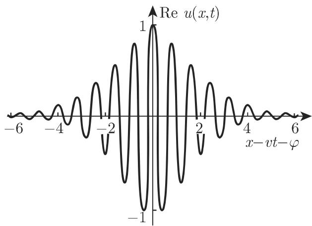
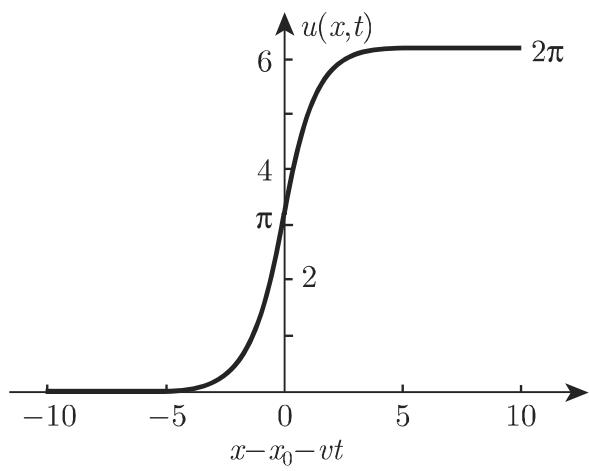

# 数学手册(原书第10版) 9.2.5 非线性偏微分方程：孤子、周期模式和混沌

本节是手册第 9 章 9.2「偏微分方程」的非线性收官部分，结构为：9.2.5.1 物理—数学问题的阐述（孤子概念、五大典型方程、弹性相互作用、周期模式、耗散孤子、非线性发展方程）、9.2.5.2 KdV 方程、9.2.5.3 非线性薛定谔方程、9.2.5.4 正弦戈登方程、9.2.5.5 更多具有孤子解的非线性发展方程。本节把 9.2.3、9.2.4 引入的线性发展方程（波方程、热方程、薛定谔方程）扩展到非线性对应物，完成全章「线性 → 非线性」的收束。文末署名「（陆柱家译）」，其后为下一章标题「10 变分法」。

## 五大典型方程（逐字转录，式 9.148–9.152）

```latex
(9.148) = (9.153)  KdV:  u_t + 6 u u_x + u_{xxx} = 0
(9.149) = (9.158)  NLS:  i u_t + u_{xx} \pm 2 |u|^2 u = 0
(9.150) = (9.162)  SG:   u_{tt} - u_{xx} + \sin u = 0
(9.151)              GL:  u_t - u - (1 + \mathrm{i}b)\, u_{xx} + (1 + \mathrm{i}c)\, |u|^2 u = 0
(9.152)              KS:  u_t + u_{xx} + u_{xxxx} + u_x^2 = 0
```

约定：下标表示偏导数（如 u_{xx} = ∂²u/∂x²）；考虑一维情形 u = u(x,t)；自变量为无量纲标量，实际应用中须乘以具有相应量纲并反映问题特征的量，对速度亦然。KdV、NLS、SG 无耗散；GL、KS 为非线性耗散方程，除时空周期解外还有时空无序（混沌）解。

## 附加七方程（逐字转录，式 9.172–9.179）

```latex
(9.172)  变形 KdV (mKdV):        u_t \pm 6 u^2 u_x + u_{xxx} = 0
(9.173)  广义 KdV:               u_t + u^p u_x + u_{xxx} = 0
(9.175)  双曲正弦戈登方程:       u_{tt} - u_{xx} + \sinh u = 0
(9.176)  布西内斯克方程:         u_{xx} - u_{tt} + (u^2)_{xx} + u_{xxxx} = 0
(9.177)  广田 (Hirota) 方程:     u_t + \mathrm{i}\,3\alpha |u|^2 u_x + \beta u_{xx}
                                  + \mathrm{i}\sigma u_{xxx} + \delta |u|^2 u = 0,\quad \alpha\beta = \sigma\delta
(9.178)  伯格斯 (Burgers) 方程:  u_t - u_{xx} + u u_x = 0
(9.179a) KP（源拼 Kadomzev-Pedviashwili）:  (u_t + 6 u u_x + u_{xxx})_x = u_{yy}
```

## 关键解（逐字转录，复算涉及者）

```latex
(9.154) KdV 单孤子:
u(x,t) = (v/2) sech^2[ (1/2)√v (x - v t - φ) ],  v > 0

(9.155) N-孤子渐近表示:
u(x,t) ~ Σ_{n=1}^{N} u_n(x,t)   (t → ±∞)

(9.156) KdV 双孤子（按转写；k_n = ½√v_n，α_n = ½√v_n (x − v_n t − φ_n)，n = 1,2）:
u = 8 { k_1^2 e^{α_1} + k_2^2 e^{α_2}
      + (k_1 − k_2)^2 e^{(α_1+α_2)} [ 2 + (k_1^2 e^{α_1} + k_2^2 e^{α_2}) / (k_1 + k_2)^2 ] }
  / [ 1 + e^{α_1} + e^{α_2} + ((k_1 − k_2)/(k_1 + k_2))^2 e^{(α_1+α_2)} ]^2

(9.157a) 位势 KdV:  w_t + 6 (w_x)^2 + w_{xxx} = 0,  其中 w = F_x/F
(9.157b)(9.157c)   F 的具体表达式在转写中丢失（仅余残句「1a) 对于 F(x,t)=1+…」）

(9.159) NLS 亮孤子:
u = 2η exp(−i[2ξx + 4(ξ² − η²)t − χ]) / cosh[2η(x + 4ξt − φ)]
（包络速度 v = −4ξ；相速度 2(η² − ξ²)/ξ）

(9.160) NLS 暗孤子:
u = ( i v/2 + √(η² − v²/4) · tanh[√(η² − v²/4)(x − v t)] ) · exp[−i(2η² t + χ)],  v < 2η

(9.161) 带背景速度 c 的通解（按转写）:
u = ( i v/2 + √(η² − v²/4) ) tanh[√(η² − v²/4)(x − v t − c t)]
    × exp[−i( 2η² t + χ − (c/2) x + (c²/4) t )]

(9.163) 扭曲孤子:  u = 4 arctan e^{γ(x − x_0 − v t)},  γ = 1/√(1 − v²),  −1 < v < 1
(9.164)             −u_t/v = u_x = 2γ / cosh[γ(x − x_0 − v t)]
(9.165) 反扭曲孤子: u = 4 arctan e^{−γ(x − x_0 − v t)}
(9.166) 静态解:    u = 4 arctan e^{±(x − x_0)}
(9.167) 扭曲-扭曲碰撞:     u = 4 arctan[ v sinh(γx) / cosh(γvt) ]
(9.168) 扭曲-反扭曲碰撞:   u = 4 arctan[ (1/v) sinh(γvt) / cosh(γx) ]
(9.169) 呼吸子:             u = 4 arctan[ (√(1−ω²)/ω) sin(ωt) / cosh(√(1−ω²) x) ]
(9.170a) 周期扭曲格:        u = 2 arcsin[ ± sn( (x − vt)/(k√(1−v²)), k ) ] + π
(9.170b)                    λ = 4 K(k) · k · √(1 − v²)
(9.170c) k = 1 (λ → ∞):    u = 4 arctan e^{±γ(x − vt)}

(9.171a) sn x = sin φ(x,k)
(9.171b) x = ∫_0^{sinφ(x,k)} dq / √((1−q²)(1−k² q²))
(9.171c) K(k) = ∫_0^{π/2} dΘ / √(1 − k² sin²Θ)

(9.174) 广义 KdV 孤子:
u = [ (½|v|(p+1)(p+2)) / cosh²(½ p √|v| (x − v t − φ)) ]^{1/p}

(9.179b) KP lump:
u(x,y,t) = 2 ∂²/∂x² ln[ 1/k² + |x + i k y − 3k² t|² ]
```

## 核心主张（严格按对象归属）

1. 三大保守方程 KdV/NLS/SG 给出典型孤子：解无耗散、碰撞弹性（每个孤子渐近保持形状与速度，仅相移 φ_n^- ≠ φ_n^+）、渐近线性叠加为 N-孤子解 (9.155)。
2. 孤子参数依赖三定理，三者互不相同、不可互推：KdV 孤子 (9.154) 的速度唯一决定振幅与宽度（高波快于矮波）；NLS 亮孤子 (9.159) 的振幅（2η）与速度（−4ξ）可独立选取（共 4 个参数 η, ξ, φ, χ）；SG 扭曲孤子 (9.163) 的速度（|v| < 1）与振幅无关（共 2 个参数 v 与 x₀）。
3. 暗孤子 (9.160) 依赖 3 个参数 η, v, χ，以速度 v < 2η 在常数背景 |u| = η 上传播；带背景速度 c 的通解为 (9.161)。
4. GL (9.151) 与 KS (9.152) 为非线性耗散方程，兼具时空周期解与混沌解；时空模式或结构的出现是变成混沌的特征。耗散孤子仅在参数空间单个点处存在（离差—非线性与能量/粒子流—耗散的双重平衡），与保守孤子的连续解族成对照。
5. 附加七方程扩充孤子方程目录；Burgers 方程经霍普夫—科尔变换线性化为扩散方程；KP 方程展示两个空间变量的孤子方程（lump 解）。
6. 「孤子数目不依赖脉冲形状、只依赖总面积 ∫u(x,0)dx」置于总论 9.2.5.1(3)，实为 KdV 初值问题的陈述且属简化，见 [[findings/孤子数目依赖总面积陈述为简化转录]]。

## 复算结论摘要

经独立复算验证成立（强证据）：(9.154)、(9.157a) 的位势关系 u = 2w_x、KdV 反孤子换号陈述、(9.159)（包络速度 −4ξ、相速度 2(η²−ξ²)/ξ 全部复现）、(9.160)（v = 0 黑孤子直接代入散焦 NLS 验证）、(9.164)、(9.167)–(9.169)（与经典 Perring–Skyrme 解一致）、(9.170a)–(9.170c)（化为摆方程 f″ = sin f 逐项验证，恒等式 2arcsin(tanh s) + π = 4arctan e^{2s} 数值核验）、(9.171a–c)、(9.174)（p = 1、p = 2 直接代入验证）。

复算定位的转写疑误（本源最有价值的增量）：

1. [[queries/式9-156指数定义与系数交叉配对疑误]]——(9.156) 指数因子与系数配对双重疑点；
2. [[queries/式9-157b至9-157c公式内容缺失]]——F 的表达式丢失；
3. [[queries/式9-161括号位置与暗孤子伽利略提升]]——tanh 作用范围与括号位置；
4. [[queries/式9-179a右端是否漏因子3]]——右端疑应为 3u_{yy}（KPI 型）；
5. [[queries/式9-177广田方程i的位置与参数约束]]——i 的位置导致 NLS 极限无孤子解。

## 与既有维基的联系

- 回指 9.2.3：[[concepts/波方程]]（源：「波方程（参见第 777 9.2.3.2）」）、热方程（「参见第 779 9.2.3.3」，对应 [[concepts/热导方程]]，与 9.2.2 的 [[concepts/热传导方程]] 双页并存）。
- 回指 9.2.4：薛定谔方程作为线性发展方程的例子（「参见 780 9.2.4.1」），见 [[sources/10-数学手册原书第10版--9-924-薛定谔方程--1lweyuj]] 与 [[comparisons/含时与定常薛定谔方程比较]]；本节为其提供非线性对应物 [[concepts/非线性薛定谔方程]]。
- 全章收束：[[concepts/偏微分方程]]、[[concepts/二阶线性偏微分方程]]、[[concepts/偏微分方程的逼近方法]]。
- 未入库回指（17.3 混沌、14.6.2 椭圆函数、8.2.5.7 完全椭圆积分级数）见 [[queries/9-2-5未入库回指缺口]]。

## 转录质量与术语说明

- 系统性错讹：「千」→「于」遍布全文（「对千」「等价千」「快千」「基千」等）；「超流氮-(³He)」应为「超流氦」；「顶要例子」应为「重要例子」；多处「N-孤子解」的 N 丢失；「NLS 孤子由 个无量纲参数」漏「4」；「依赖于其总 ∫u dx」漏「面积」；「扭曲孤子由两个无量纲参数和 x₀」漏 v；「在立体中」疑为「在固体中」。
- 「sn 周期」表述错乱：应为「具有参数 k、周期 4K(k)」；(9.174) 后的译者注「也即 4K snx 的一个周期」疑错位（应属 (9.171) 段）。
- 术语：源以「离差」译 dispersion（通译「色散」）、「扭曲孤子」译 kink soliton（通译「扭结孤子」）、「兰道」译 Landau、「科尔泰沃赫」译 Korteweg；GL 拼法「Ginsburg-Landau」（标准 Ginzburg–Landau）；KP 拼法「Kadomzev-Pedviashwili」（标准 Kadomtsev-Petviashvili）。
- 9.2.5.1(6) 所列非线性项含 u_x²（属 KS (9.152)），但枚举只写 (9.148)–(9.150)；「（除了(9.151)是例外）不含参数」只有在枚举包含 GL、KS 时才通顺——疑转写丢失「(9.151)、(9.152)」。
- CD-ROM 句「解线性偏微分方程的傅里叶变换和逆散射理论」中「线性」疑应为「非线性」。
- 全部错讹汇总见 [[queries/9-2-5全节系统性转写讹误清单]]。

## 引证与附属物

- 文内引证：[9.33]（耗散孤子）、[9.34]（NLS 周期解）、[9.39]、[9.41]（暗孤子）——均仅编号引用，无书目信息。
- 插图：图 9.22（KdV 孤子，v = 1）、图 9.23（(9.159) 的实部，η = 1/2、ξ = 4——ξ 疑为 1/4）、图 9.24（SG 扭曲孤子，v = 1/2）。
- 末段提及德文版 CD-ROM 含更多非线性发展方程及傅里叶变换、逆散射理论的应用。
- 译者署名：陆柱家；其后为下一章标题「10 变分法」。

<!-- llm-wiki:embedded-images -->
## Embedded Images

### Document




<!-- llm-wiki:embedded-images -->
