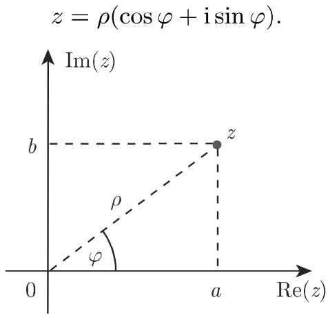
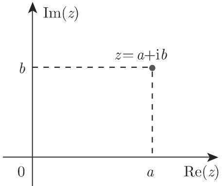
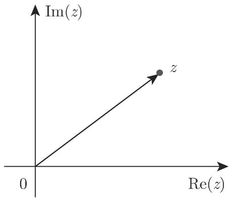
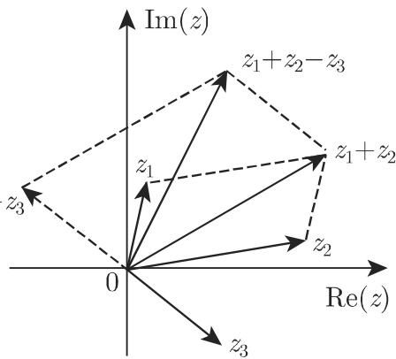

# 数学手册(原书第10版) 1.5 复数

本节是《数学手册(原书第10版)》第 1 章第 5 节，系统给出[[concepts/复数]]的定义、几何表示与运算规则，式号覆盖 (1.131)–(1.141)。逻辑主线为：由[[concepts/虚数单位]] i（i² = −1，电学中记作 j）引入复数 → [[concepts/高斯平面]]上的点/向量表示 → [[concepts/复数的模与辐角]]与三角形式 → 经[[concepts/欧拉公式]]（手册称"欧拉关系式"）得到指数形式 → 按代数、三角、指数三种形式平行给出四则运算、幂（[[concepts/棣莫弗公式]]）与 n 次根（[[concepts/复数的n次根]]）的公式 → 以[[concepts/共轭复数]]实现除法的分母实数化。

## 章节结构

| 小节 | 内容 |
|------|------|
| 1.5.1.1 虚数单位 | i² = −1；电学中用 j 代替 i 以避免与电流强度记号混淆 |
| 1.5.1.2 复数 | 代数形式、实部/虚部、纯虚数、复数集 ℂ、实数为子集；复变函数 ω = f(z) 前向引用函数论（原书第 953 页 14.1 及其后） |
| 1.5.2.1 向量表示 | 高斯平面：实轴、虚轴，点与位置向量双重表示（图 1.5、1.6） |
| 1.5.2.2 复数的相等 | 实部虚部对应相等；"大于""小于"对复数无意义 |
| 1.5.2.3 三角形式 | 模与辐角定义（1.132c）、坐标换算与辐角分段公式（1.133a–e）、图 1.7 |
| 1.5.2.4 指数形式 | z = ρ e^{iφ}（1.134a）、欧拉关系式（1.134b）、三种形式互化示例 |
| 1.5.2.5 共轭复数 | 定义（1.135a）、三种形式（1.135b/c）、记号 z* 或 z̄ |
| 1.5.3.1 加法和减法 | 式 (1.136)；向量加减的几何解释（图 1.8） |
| 1.5.3.2 乘法 | 式 (1.137a–c)；旋转加伸缩的几何解释（图 1.9、1.10）；zz* = \|z\|² |
| 1.5.3.3 除法 | 式 (1.138a–c)；乘法的逆运算；除以零不存在 |
| 1.5.3.4 基本运算法则 | 二项式法则并计入 i² = −1；共轭实数化分母（1.139）；综合例题 |
| 1.5.3.5 复数的幂 | 棣莫弗公式（1.140a）；i 幂的周期性（1.140b/c） |
| 1.5.3.6 复数的 n 次根 | 式 (1.141a/b)；正 n 边形顶点分布（图 1.11） |

## 关键断言

- 实数是复数的子集（b = 0 时 z = a）；a = 0 时 z = ib 为"纯虚数"。
- 复数无大小序："大于""小于"无意义，只能比较相等，故[[concepts/数区间]]的概念不适用于 ℂ。
- 加、减、乘、除与整数次幂结果唯一；n 次方根有 n 个不同值（本节唯一的多值运算）。
- 乘 z₂ 的几何解释：旋转 arg z₂ 并伸缩 |z₂| 倍；乘 i 即旋转 π/2 且模不变；除以 z₂ 即旋转 −arg z₂ 并收缩 |z₂| 倍。
- z + z* 总是实数，z − z* 是纯虚数（宽松表述）。
- z = 0 时辐角无定义；除以零不存在。
- 复数的 n 次幂"可用二项式公式计算，非常不便"，实用算法为棣莫弗公式。

## 公式总表（逐式保留）

| 式号 | 内容 |
|------|------|
| (1.131a) | z = a + ib（代数形式） |
| (1.131b) | a = Re(z)，b = Im(z) |
| (1.132a) | z = a + ib（代数形式重述） |
| (1.132b) | 三角形式（正文缺失，仅存编号与图 1.7；由 (1.135b) 反推为 z = ρ(cos φ + i sin φ)） |
| (1.132c) | ρ = \|z\|，φ = arg z = ω + 2kπ；0 ⩽ ρ < ∞，−π < ω ⩽ +π，k = 0, ±1, ±2, … |
| (1.133a) | a = ρ cos φ |
| (1.133b) | b = ρ sin φ |
| （无编号） | ρ = √(a² + b²) |
| (1.133c) | φ 的 arccos 分段式（见下方代码块） |
| (1.133d) | 编号空悬于 arctan 分段式之前（归属存疑） |
| (1.133e) | φ 的 arctan 分段式（见下方代码块） |
| (1.134a) | z = ρ e^{iφ}（指数形式） |
| (1.134b) | e^{iφ} = cos φ + i sin φ（欧拉关系式） |
| (1.135a) | Re(z*) = Re(z)，Im(z*) = −Im(z) |
| (1.135b) | z = a + ib = ρ(cos φ + i sin φ) = ρ e^{iφ} |
| (1.135c) | z* = a − ib = ρ(cos φ − i sin φ) = ρ e^{−iφ} |
| (1.136) | z₁ + z₂ − z₃ + … = (a₁ + a₂ − a₃ + …) + i(b₁ + b₂ − b₃ + …) |
| (1.137a) | z₁z₂ = (a₁a₂ − b₁b₂) + i(a₁b₂ + b₁a₂) |
| (1.137b) | z₁z₂ = ρ₁ρ₂[cos(φ₁ + φ₂) + i sin(φ₁ + φ₂)]（模相乘、辐角相加） |
| (1.137c) | z₁z₂ = ρ₁ρ₂ e^{i(φ₁ + φ₂)} |
| (1.138a) | z₁/z₂ = (a₁a₂ + b₁b₂)/(a₂² + b₂²) + i(a₂b₁ − a₁b₂)/(a₂² + b₂²) |
| (1.138b) | z₁/z₂ = (ρ₁/ρ₂)[cos(φ₁ − φ₂) + i sin(φ₁ − φ₂)]（模相除、辐角相减） |
| (1.138c) | z₁/z₂ = (ρ₁/ρ₂) e^{i(φ₁ − φ₂)} |
| (1.139) | (a + ib)(a − ib) = a² + b² |
| （无编号） | zz* = p² = \|z\|² = a² + b²（1.5.3.2；p 疑为 ρ 排印之误） |
| (1.140a) | [ρ(cos φ + i sin φ)]ⁿ = ρⁿ(cos nφ + i sin nφ)（棣莫弗公式） |
| (1.140b) | i² = −1，i³ = −i，i⁴ = +1 |
| (1.140c) | i^{4n+k} = i^k |
| (1.141a) | z^{1/n} = ⁿ√z（n > 0，n 为整数） |
| (1.141b) | ω_k = ⁿ√ρ [cos((φ + 2kπ)/n) + i sin((φ + 2kπ)/n)]，k = 0, 1, …, n−1 |

## 分段公式原文

```
(1.133c)  φ = { arccos(a/ρ),    b ⩾ 0, ρ > 0
              { −arccos(a/ρ),   b < 0,  ρ > 0
              { 无定义,          ρ = 0

(1.133e)  φ = { arctan(b/a),             a > 0
              { π/2,                      a = 0, b > 0
              { −π/2,                     a = 0, b < 0
              { arctan(b/a) + π,          a < 0, b ⩾ 0
              { arctan(b/a) − π,          a < 0, b < 0

(1.141b)  ω_k = ⁿ√ρ [cos((φ + 2kπ)/n) + i sin((φ + 2kπ)/n)],  k = 0, 1, 2, …, n−1
```

## 已核验的例题

```
(1.5.2.4 例)  z = 1 + i√3 = 2(cos π/3 + i sin π/3) = 2 e^{iπ/3}
              且对辐角加 2kπ 仍成立：z = 2 exp[i(π/3 + 2kπ)], k = 0, ±1, ±2, …

(1.5.3.4 例)  ((3 − 4i)(−1 + 5i)²)/(1 + 3i) + (10 + 7i)/(5i) = 10 + 38.2i
```

经逐步核算：两例均正确；分段公式 (1.133c) 与 (1.133e) 在边界情形（b = 0、a < 0 且 b = 0）给出一致结果（φ = 0 或 π），与主值区间 (−π, +π] 自洽。

## 转写与排印疑点

1. **辐角主值标注内部矛盾**：(1.132c) 定义 φ = arg z = ω + 2kπ 且 −π < ω ⩽ +π，其后却写"φ 称为复数的辐角主值"——按定义主值应为 ω 而非 φ → [[queries/式1.132c辐角主值应记为ω还是φ]]
2. **p 疑为 ρ 之误**：1.5.3.2 末"zz* = p² = |z|² = a² + b²"中 p 与全节统一的模记号 ρ 不符 → [[queries/式1.137节zz星号等于p平方中p是否为ρ排印之误]]
3. **式 (1.132b) 正文缺失**：三角形式公式内容仅存于图 1.7，正文只有编号占位 → [[queries/式1.132b三角形式公式正文是否转写缺失]]
4. **式 (1.133c)/(1.133d) 编号浮动**：ρ = √(a² + b²) 无编号，arccos 分段式标 (1.133c)，(1.133d) 空悬于 arctan 分段式之前；可能 ρ 公式应为 (1.133c)、arccos 式为 (1.133d)。
5. **"z − z* 是纯虚数"为宽松表述**：Im(z) = 0 时 z − z* = 0，严格说并非纯虚数（与已入库的"赫尔德条件未明示"类精度问题同型）。

本节内容与通行数学定义一致，对现有维基页面只构成扩展而非挑战。

## 与现有维基的联系

- [[comparisons/数系分类层级]]：本节提供最顶层 ℂ（实数经 b = 0 嵌入为子集）。
- [[findings/实数与复数的三角不等式及差的绝对值估计]]：该 finding 所用的 |z| 与 z* 在本节获得正式定义，可回链定义出处。
- [[concepts/二项式定理]]：复数 n 次幂"可用二项式公式计算，非常不便"，是其在含 i 二项上的应用场景。
- [[concepts/三角函数]]、[[concepts/反三角函数]]、[[concepts/指数函数]]：三角形式、辐角分段计算与虚指数的依托。
- [[concepts/数轴]]、[[concepts/数区间]]：高斯平面是数轴的一维到二维推广；复数无大小序使区间概念失效。
- 前向引用待回链：原书 14.1 函数论（复变函数）、3.5.1.1 向量、3.5.2.2 极坐标。

## 关键插图




<!-- llm-wiki:embedded-images -->
## Embedded Images

### Document







<!-- llm-wiki:embedded-images -->
