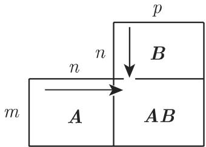

# 数学手册(原书第10版) 4.1 矩阵

《数学手册》(原书第10版) 第 4 章（线性代数）的首个小节，系统给出矩阵的初等理论：矩阵概念与特殊类型（式 4.1–4.18）、算术运算与运算法则（式 4.20–4.44）、向量范数与矩阵范数（式 4.45–4.54）。本节为定义—公式型参考材料，非论证性文本；它是本 wiki 线性代数域的首个入库来源，此前入库内容均属第 3 章（向量代数、解析几何、微分几何）。

## 小节结构

| 小节 | 内容 | 式号 |
|---|---|---|
| 4.1.1 矩阵的概念 | 大小 $(m,n)$、实/复矩阵与分解 $A+\mathrm{i}B$、共轭、转置、共轭转置 $A^{\mathrm H}$、零矩阵 | 4.1–4.5 |
| 4.1.2 方阵 | 方阵与主对角元、[[concepts/对角矩阵]]、标量矩阵、[[concepts/矩阵的迹]]、[[concepts/对称矩阵]]、[[concepts/正规矩阵]]、[[concepts/反对称矩阵]]、[[concepts/埃尔米特矩阵]]、[[concepts/反埃尔米特矩阵]]、[[concepts/恒等矩阵]]与克罗内克符号、[[concepts/三角矩阵]] | 4.6–4.18 |
| 4.1.3 向量 | 列向量/行向量的矩阵观、零向量记号 | 4.19a–b |
| 4.1.4 矩阵的算术运算 | 相等、加减、数乘、除以标量、矩阵乘积与非交换性、法尔克格式乘法、复矩阵实虚分解、标量积与并积、秩、逆、正交、酉 | 4.20–4.32 |
| 4.1.5 矩阵的运算法则 | 恒等/标量/零矩阵乘法、零因子、结合律、转置与逆的法则、幂、[[concepts/克罗内克积]]、微分 | 4.33–4.44 |
| 4.1.6 向量范数和矩阵范数 | [[concepts/范数]]公理、相容与从属、三种向量范数、三种矩阵范数 | 4.45–4.54 |

## 公式层内容与复核状态

| 式号 | 内容 | 状态 |
|---|---|---|
| (4.1)–(4.5) | 矩阵定义、复分解 $A+\mathrm{i}B$、共轭、转置、共轭转置、零矩阵 | 无误 |
| (4.6)–(4.9) | 方阵、对角、标量、迹 | 无误 |
| (4.10)–(4.12) | 对称、正规 | 无误 |
| (4.13a–d) | 反对称及对称/反对称分解 | (4.13b) 有讹 |
| (4.14)–(4.15c) | 埃尔米特（行列式为实数）、反埃尔米特及分解 | (4.15b) 存疑 |
| (4.16)–(4.18) | 恒等矩阵与克罗内克符号、上/下三角 | 无误 |
| (4.20)–(4.25) | 相等、加减、数乘、乘积、标量积、并积 | 无误（正文有索引疑点） |
| (4.26a–f) | 秩的六条性质与正则/奇异判据 | 无误 |
| (4.27)–(4.29) | 逆矩阵、二阶逆公式、除法不可定义 | 无误 |
| (4.30)–(4.32) | 正交、酉 | 无误 |
| (4.33)–(4.40) | 运算法则（含零因子、幂） | 无误 |
| (4.41)–(4.43) | 克罗内克积 | 无误（算例已复算） |
| (4.44) | 元素式微分 | 无误 |
| (4.45)–(4.54) | 范数公理、相容性、六种范数、从属配对 | 无误 |

**疑点一（4.13b）**：印作 $a_{\mu\nu}=-a_{\mu\nu}$，仅零矩阵可满足；由 (4.13a) 应为 $a_{\mu\nu}=-a_{\nu\mu}$，疑下标转写脱落。见 [[queries/式4-13b反对称元素式是否应为aμν等于负aνμ]]。

**疑点二（4.15b）**：断言反埃尔米特矩阵 $a_{\mu\mu}=0$、迹为零；但由 (4.15a) 只能推出对角元为纯虚数（$A=\mathrm{i}I$ 为反例）。见 [[queries/式4-15b反埃尔米特对角元为零是否应为纯虚数]]。

## 已验证算例（可复算）

**矩阵乘积（式 4.23 后）**：

$$A=\begin{pmatrix}1&3&7\\2&-1&4\end{pmatrix},\quad B=\begin{pmatrix}3&2\\-5&1\\0&3\end{pmatrix},\quad c_{22}=2\cdot2-1\cdot1+4\cdot3=15.$$

**数乘（式 4.22a 后）**：

$$3\begin{pmatrix}1&3&7\\0&-1&4\end{pmatrix}=\begin{pmatrix}3&9&21\\0&-3&12\end{pmatrix}.$$

**复矩阵恒等式（4.1.4.5(4)）**：

$$(A+\mathrm{i}B)(A-\mathrm{i}B)=A^2+B^2+\mathrm{i}(BA-AB).$$

**零因子算例（式 4.36，Falk 布局）**——两非零矩阵之积为零：

```text
        1 1
        0 0
  -------------
  0 1  |  0 0
  0 1  |  0 0
```

**克罗内克积算例（式 4.41 后，逐块复算全对）**：$A=\begin{pmatrix}3&-5&0\\2&1&3\end{pmatrix}$（(2,3) 型），$B=\begin{pmatrix}1&3\\2&-1\end{pmatrix}$（(2,2) 型）：

$$A\otimes B=\begin{pmatrix}3&9&-5&-15&0&0\\6&-3&-10&5&0&0\\2&6&1&3&3&9\\4&-2&2&-1&6&-3\end{pmatrix}\quad((4,6)\ \text{型}).$$

## 转写质量

公式层基本完好（仅上述两处元素级断言存疑），文字层讹误密集：

- 「千」代「于」遍布全节：等千、对千、关千、由千、位千、大千、多千、千是。
- 「共扼」「共辄」代「共轭」；「井积/并积」混用。
- λ 转写为「入」（「的第入列」「每个实数入 λ」）。
- 矩阵名 $A,B$、维数 $m,n$、秩 $r$、参数 $t$ 等符号成片脱落。
- 噪声字与残句：「!!」「尘」「茎」「控」「竺」「$\nabla B$」「$\delta\cdot U\cdot\delta u$」（式 4.35 前）。
- 式 (4.21a) 后的加法算例整体损毁；4.1.3 的维数与行列标签脱落、错位。

以上将既有「系统性丢字」假说的证据从第 3 章扩展到第 4 章，见 [[queries/4-1节千于共扼与符号成片脱落是否为系统性转写丢字]]、[[queries/3-5-2节符号成片脱落与λ转写为入是否为转写丢字]]、[[queries/3-6节微分儿何与依赖千等转写讹误是否为系统性丢字]]。

## 与既有 wiki 的连接

- [[concepts/法尔克图式]]（源自 3.5.3）：本节是该图式的正典出处——一般布局（图 4.1）、$A_{(3,3)}\times B_{(3,2)}$ 应用（图 4.2）、式 (4.36) 零积算例的 Falk 布局。
- [[concepts/旋转矩阵与正交坐标变换]]、[[concepts/方向余弦]]：本节以式 (4.30)–(4.31) 给出 [[concepts/正交矩阵]]的抽象定义并回指 3.5.3.3。
- [[concepts/标量积]]（3.5.1）：式 (4.24) 以矩阵乘法重新导出；[[concepts/向量积]]：外积/叉积提示（回指 3.5.1.5）；[[concepts/三角不等式]]：范数公理三；[[concepts/向量]]、[[concepts/线性组合]]：行/列向量的矩阵观与秩的定义。
- 交叉引用指向的未入库小节：4.2（行列式、余子式、伴随矩阵）、4.5.2.4（高斯算法）、4.6.1（特征值）、5.3.8.2、12.3.1（范数公理），存在依赖缺口。

## 译名与别名记录

原书译名「恒等矩阵」（通行别名「单位矩阵」）、「上确界范数或一致范数」、「法尔克 (Falk) 格式」；人名冠名 Falk、Hermitian（埃尔米特）、Kronecker（克罗内克）仅作词源，无生平内容，不单独立页。

## 引用图片

- `media/10-数学手册原书第10版--5-41-矩阵--1kmyh8y/001-0983f16c305188b75cc25fd0b9104167887f3a5e6d4929804e6141b29692bc37.jpg` — 图 4.1：法尔克格式一般布局。
- `media/10-数学手册原书第10版--5-41-矩阵--1kmyh8y/002-07128cd826adcd33d44b9fb9318ac635e43ccb7427d3b48e5452094e63c14147.jpg` — 图 4.2：$A_{(3,3)}$ 与 $B_{(3,2)}$ 的法尔克格式乘法应用。

<!-- llm-wiki:embedded-images -->
## Embedded Images

### Document



<!-- llm-wiki:embedded-images -->
