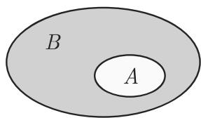
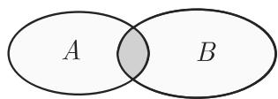
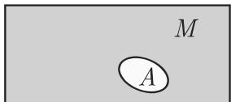
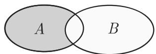
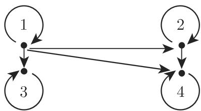
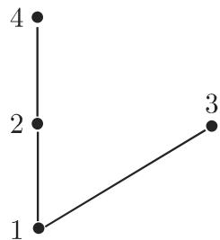

# 数学手册(原书第10版) 5.2 集论

## 来源定位

本页对应导入文件 `数学手册(原书第10版)/5.2 集论.md`，是本 wiki 收录的**首个第 5 章来源**（此前仅有第 3、4 章几何与线性代数内容），系统覆盖集论基础：集合、集合运算、关系、映射、等价与序、基数。原书作者与出版信息未随导入文本载明，frontmatter 的 authors/year 暂缺，待补。本节开篇断言集论创始人为 [[entities/georg-cantor]]（1845–1918），并称集论「在数学所有分支中都有决定性的作用」。

**质量警示**：转写质量差——公式连接词讹误（式 5.42、5.64b、5.65b）、符号成片脱落（「胪」代 𝒫、「屈」代 ℝ、「千」代「于」、集合字母与箭头丢失）、5.2.5 末句疑似截断。公式级引用前须先经 [[queries/5-2全节系统性转写讹误清单]] 勘误。

## 章节结构

- **5.2.1 集合的概念、特殊集**：从属关系、数集记号、外延性原则、子集与真子集、空集、集合相等、幂集、基数。
- **5.2.2 集合运算**：维恩图；并、交、补；集代数基本律；差集、对称差、笛卡儿积。
- **5.2.3 关系和映射**：n 元/二元关系、箭头图、关系矩阵、关系积与逆关系、二元关系六性质、传递闭包、映射与复合。
- **5.2.4 等价性和序关系**：等价关系、等价类与商集、分拆与分解定理、偏序与线性序、戴德金分割、哈塞图。
- **5.2.5 集合的基数**：等计数、无限集刻画、ℵ₀、可数性、康托尔定理、连续统（末句疑似截断）。

## 关键公式（保留原文编号与结构）

### 5.2.1 集合基础

$$A = B \Leftrightarrow \forall x (x \in A \Leftrightarrow x \in B) \tag{5.36}$$
$$\forall x (x \in A \Rightarrow x \in B) \tag{5.37}$$
$$A = B \Leftrightarrow A \subseteq B \land B \subseteq A \tag{5.38}$$

幂集：$\mathbb{P}(M) = \{A \mid A \subseteq M\}$；若 $|M| = m$ 则 $|\mathbb{P}(M)| = 2^m$。基数记作 $\operatorname{card} M$ 或 $|M|$。

### 5.2.2 集合运算

$$A \cup B = \{x \mid x \in A \lor x \in B\} \tag{5.39}$$
$$A \cap B = \{x \mid x \in A \land x \in B\} \tag{5.40}$$
$$A \cap B = \varnothing \ (\text{不相交}) \tag{5.41}$$
$$C_{M}(A) = \{x \mid x \in M \lor x \notin A\} \tag{5.42}$$

⚠️ 式 (5.42) 的连接词疑为转写讹误，应为 $\land$（见 [[queries/式5-42补集定义应为合取吗]]）。

集代数基本律（5.43–5.63）：

$$
\begin{aligned}
&(A \cap B) \cap C = A \cap (B \cap C) \tag{5.43}\\
&(A \cup B) \cup C = A \cup (B \cup C) \tag{5.44}\\
&A \cap B = B \cap A \tag{5.45}\\
&A \cup B = B \cup A \tag{5.46}\\
&(A \cup B) \cap C = (A \cap C) \cup (B \cap C) \tag{5.47}\\
&(A \cap B) \cup C = (A \cup C) \cap (B \cup C) \tag{5.48}\\
&A \cap (A \cup B) = A \tag{5.49}\\
&A \cup (A \cap B) = A \tag{5.50}\\
&A \cap A = A \tag{5.51}\\
&A \cup A = A \tag{5.52}\\
&\overline{A \cap B} = \overline{A} \cup \overline{B} \tag{5.53}\\
&\overline{A \cup B} = \overline{A} \cap \overline{B} \tag{5.54}\\
&A \cap \overline{A} = \varnothing \tag{5.55}\\
&A \cup \overline{A} = M \ (M \text{ 是基本集}) \tag{5.56}\\
&A \cap M = A \tag{5.57}\\
&A \cup \varnothing = A \tag{5.58}\\
&A \cap \varnothing = \varnothing \tag{5.59}\\
&A \cup M = M \tag{5.60}\\
&\overline{M} = \varnothing \tag{5.61}\\
&\overline{\varnothing} = M \tag{5.62}\\
&\overline{\overline{A}} = A \tag{5.63}
\end{aligned}
$$

书中指出：此表可由**命题演算基本律**（5.1.1，未入库）经代换 $\cap \leftrightarrow \land$、$\cup \leftrightarrow \lor$、$M \leftrightarrow$ 真、$\varnothing \leftrightarrow$ 假 得到，「这个一致性不是偶然的」，将在 5.7 布尔代数中讨论（见 [[comparisons/集代数与命题演算对应比较]]）。

其他集运算：

$$A \backslash B = \{x \mid x \in A \land x \notin B\} \tag{5.64a}$$
$$A \triangle B = \{x \mid (x \in A \lor x \notin B) \land (x \in B \lor x \notin A)\} \tag{5.64b}$$
$$A \triangle B = (A \backslash B) \cup (B \backslash A) = (A \cup B) \backslash (A \cap B) \tag{5.64c}$$
$$A \times B = \{(a, b) \mid a \in A \land b \in B\} \tag{5.65a}$$
$$(a, b) = (c, d) \Leftrightarrow a = c \vee b = d \tag{5.65b}$$
$$\operatorname{card}(A \times B) = (\operatorname{card} A)(\operatorname{card} B) \tag{5.65c}$$
$$A_{1} \times A_{2} \times \dots \times A_{n} = \left\{(a_{1}, \dots, a_{n}) \mid a_{i} \in A_{i}\ (i = 1, \dots, n)\right\} \tag{5.66a}$$
$$\operatorname{card}(A_{1} \times \dots \times A_{n}) = \operatorname{card} A_{1} \operatorname{card} A_{2} \dots \operatorname{card} A_{n} \tag{5.66b}$$

⚠️ 式 (5.64b) 连接词错乱、式 (5.65b) 的 $\lor$ 疑应为 $\land$（分别见 [[queries/式5-64b对称差定义连接词讹误]]、[[queries/式5-65b有序对相等应为合取吗]]）。

### 5.2.3 关系与映射

$$T = \{(a, b) \mid a, b \in A \land a \text{ 是 } b \text{ 的因子}\} = \{(1,1),(1,2),(1,3),(1,4),(2,2),(2,4),(3,3),(4,4)\} \tag{5.67a,b}$$
$$R \circ S = \{(a, c) \mid \exists b (b \in B \land a R b \land b S c)\} \tag{5.68}$$
$$R^{-1} = \{(b, a) \mid (a, b) \in R\} \tag{5.69}$$
$$
\begin{aligned}
&(R \cup S) \circ T = (R \circ T) \cup (S \circ T) \tag{5.70a}\\
&(R \cap S) \circ T \subseteq (R \circ T) \cap (S \circ T) \tag{5.70b}\\
&(R \cup S)^{-1} = R^{-1} \cup S^{-1} \tag{5.70c}\\
&(R \cap S)^{-1} = R^{-1} \cap S^{-1} \tag{5.70d}\\
&(R \circ S)^{-1} = S^{-1} \circ R^{-1} \tag{5.70e}
\end{aligned}
$$

二元关系的六条性质：

$$
\begin{aligned}
&\text{自反：} && \forall a \in A\ a R a \tag{5.71a}\\
&\text{非自反：} && \forall a \in A\ \neg a R a \tag{5.71b}\\
&\text{对称：} && \forall a, b \in A\ (a R b \Rightarrow b R a) \tag{5.71c}\\
&\text{反对称：} && \forall a, b \in A\ (a R b \land b R a \Rightarrow a = b) \tag{5.71d}\\
&\text{传递：} && \forall a, b, c \in A\ (a R b \land b R c \Rightarrow a R c) \tag{5.71e}\\
&\text{线性：} && \forall a, b \in A\ (a R b \lor b R a) \tag{5.71f}
\end{aligned}
$$

传递性可用关系积刻画：$R \circ R \subseteq R$。传递闭包：

$$\operatorname{tra}(R) = \bigcup_{n \geqslant 1} R^{n} = R^{1} \cup R^{2} \cup R^{3} \cup \dots \tag{5.72}$$

映射与复合：

$$f = \{(a, f(a)) \mid a \in A\} \subseteq A \times B \tag{5.73}$$
$$(f \circ g) = g(f(a)) \tag{5.74}$$

⚠️ 式 (5.74) 为**图序复合**（先 f 后 g），与通行文献的 $(f \circ g)(x) = f(g(x))$ 相反；书中自注「注意这个方程中 f 和 g 的顺序（在文献中它有不同的处理！）」（见 [[queries/式5-74复合顺序是否原书图序约定]]）。

### 5.2.4 等价与序

$$[a]_{R} := \{b \mid b \in A \land a \sim_{R} b\} \tag{5.75}$$
$$[a]_{R} \neq \varnothing,\quad a \sim_{R} b \Leftrightarrow [a]_{R} = [b]_{R},\quad a \nsim_{R} b \Leftrightarrow [a]_{R} \cap [b]_{R} = \varnothing \tag{5.76}$$
$$A / R = \{[a]_{R} \mid a \in A\} \tag{5.77}$$
$$\varnothing \notin Z,\quad X, Y \in Z \land X \neq Y \Rightarrow X \cap Y = \varnothing,\quad \bigcup_{X \in Z} = A \tag{5.78}$$
$$a \sim_{R} b \Leftrightarrow \exists X \in Z (a \in X \land b \in X) \tag{5.79}$$

⚠️ 式 (5.78) 末项 $\bigcup_{X \in Z}$ 疑脱落被并变量 $X$（见 [[queries/式5-78分拆定义并集是否脱落X]]）。

## 表格数据（原样保留）

**整除关系 T（A = {1,2,3,4}）的关系矩阵**（已复算，见 [[findings/整除关系与关系矩阵算例]]）：

| T | 1 | 2 | 3 | 4 |
|---|---|---|---|---|
| 1 | 1 | 1 | 1 | 1 |
| 2 | 0 | 1 | 0 | 1 |
| 3 | 0 | 0 | 1 | 0 |
| 4 | 0 | 0 | 0 | 1 |

**5 元集上二元关系 R 的关系矩阵 M、M²、M³**（布尔乘法，已复算，见 [[findings/传递闭包布尔矩阵算例]]）：

| M | 1 | 2 | 3 | 4 | 5 |
|---|---|---|---|---|---|
| 1 | 1 | 0 | 0 | 1 | 0 |
| 2 | 0 | 0 | 0 | 1 | 0 |
| 3 | 0 | 0 | 1 | 0 | 1 |
| 4 | 0 | 1 | 0 | 0 | 1 |
| 5 | 0 | 1 | 0 | 0 | 0 |

| M² | 1 | 2 | 3 | 4 | 5 |
|---|---|---|---|---|---|
| 1 | 1 | 1 | 0 | 1 | 1 |
| 2 | 0 | 1 | 0 | 0 | 1 |
| 3 | 0 | 1 | 1 | 0 | 1 |
| 4 | 0 | 1 | 0 | 1 | 0 |
| 5 | 0 | 0 | 0 | 1 | 0 |

| M³ | 1 | 2 | 3 | 4 | 5 |
|---|---|---|---|---|---|
| 1 | 1 | 1 | 0 | 1 | 1 |
| 2 | 0 | 1 | 0 | 1 | 0 |
| 3 | 0 | 1 | 1 | 1 | 1 |
| 4 | 0 | 1 | 0 | 1 | 1 |
| 5 | 0 | 1 | 0 | 0 | 1 |

**M ∨ M² ∨ M³（书中断言即 tra(R) 的关系矩阵，已复算一致，更高次幂不添新元素）**：

| M∨M²∨M³ | 1 | 2 | 3 | 4 | 5 |
|---|---|---|---|---|---|
| 1 | 1 | 1 | 0 | 1 | 1 |
| 2 | 0 | 1 | 0 | 1 | 1 |
| 3 | 0 | 1 | 1 | 1 | 1 |
| 4 | 0 | 1 | 0 | 1 | 1 |
| 5 | 0 | 1 | 0 | 1 | 1 |

## 算例与复算状态

- 空集例：$\{x \mid x \in \mathbb{R} \land x^{2} + 2x + 2 = 0\} = \varnothing$（判别式 $-4 < 0$，可复算）。
- 幂集例：$M = \{a,b,c\}$ 的幂集有 $2^3 = 8$ 个元素（已核对）。
- 集合运算例：$\{1,2,3,4\} \backslash \{3,4,5\} = \{1,2\}$；$\{1,2,3,4\} \triangle \{3,4,5\} = \{1,2,5\}$；$A \times B$ 与 $B \times A$（card 均为 6，且 $A \times B \neq B \times A$）；$\mathbb{R}^2 = \mathbb{R} \times \mathbb{R}$（均已核对）。
- gcd 例：$T(12) \cap T(18)$ 含公因子，$\gcd(12,18) = 6$（参见未入库的 5.4.1.4）。
- **两个矩阵算例经独立复算全部吻合**（整除关系矩阵；M、M²、M³ 与 tra(R)），是本源最高价值的可验证内容。

## 与既有 wiki 的联系

- **承接第 4 章**：关系矩阵显式引用「第 361 页 4.1.1」，与 [[concepts/矩阵]]、[[concepts/矩阵的秩]] 互链；$\mathbb{R}^2 = \mathbb{R} \times \mathbb{R}$ 与 4.3 张量章的 $\mathbb{R}^3$ 记号体系衔接（[[entities/数集记号]]）。
- **确证全书性转写病灶**：本节再现 [[queries/4-1节千于共扼与符号成片脱落是否为系统性转写丢字]]、[[queries/4-3全节系统性转写讹误]] 所追踪的「千/于」「幕/幂」「胪」「屈」及符号成片脱落模式，见 [[queries/5-2全节系统性转写讹误清单]]。
- **未入库依赖**：5.1.1（命题演算）、5.4.1.4（gcd）、5.7（布尔代数）、5.8.2.1（图论路径）、2.1.1.1（函数）、1.1.1.2（区间套），见 [[queries/5-1与5-7等未入库依赖缺口]]。

<!-- llm-wiki:embedded-images -->
## Embedded Images

### Document

<!-- llm-wiki:embedded-images -->
