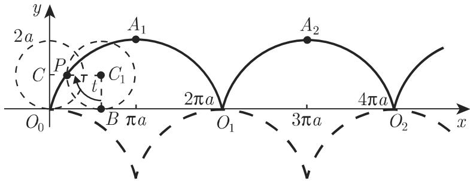
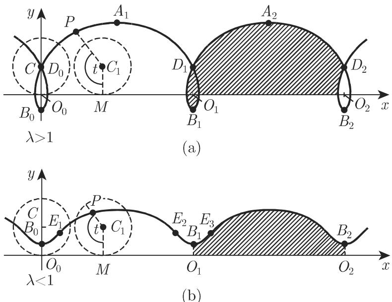
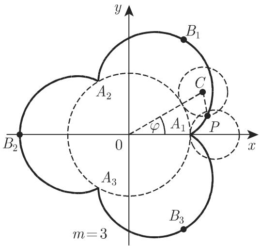
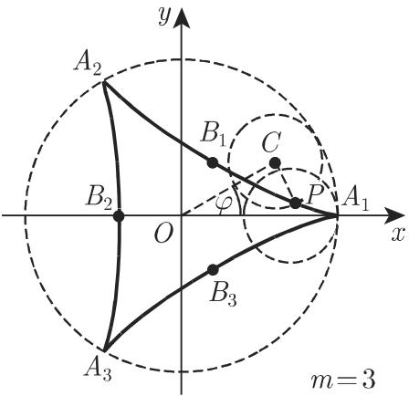
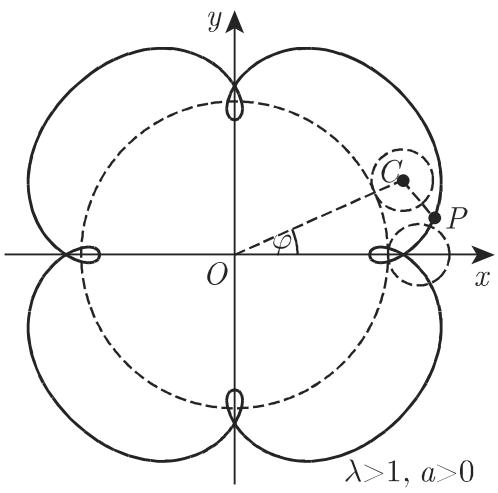
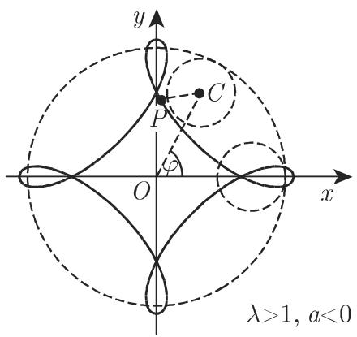

# 数学手册(原书第10版) 2.13 摆线

## 概述

本节是手册第 2 章曲线部分的收尾，系统给出**摆线族**五种曲线的定义、方程与几何量：2.13.1 常见（标准）摆线、2.13.2 长摆线与短摆线（次摆线）、2.13.3 外摆线、2.13.4 内摆线与星形线、2.13.5 长短幅外摆线与内摆线（外旋轮线与内旋轮线）。全节以「无滑动滚动」为统一定成机制，按**滚动基（直线 / 定圆外侧 / 定圆内侧）× 追踪点位置（λ 相对于 1）**两轴展开，族谱总览见 [[concepts/摆线族]] 与 [[comparisons/摆线族两轴分类比较]]。

本节同时把摆线族与 2.11–2.12 的代数曲线体系连接起来：[[concepts/星形线]] 是六次代数曲线，[[concepts/心脏线]] 与 [[concepts/帕斯卡蜗线]] 是蚌线族（2.12）与摆线族（2.13）的公共成员，椭圆以 A = 2a 内旋轮线特例的身份出现。

## 结构与关键公式（原文照录）

### 2.13.1 常见（标准）摆线

圆沿直线无滑动滚动时圆周上一定点的轨迹，其中 $a$ 为圆的半径，$t$ 为角 $\angle PC_1B$ 的弧度：

$$x = a (t - \sin t), \quad y = a (1 - \cos t) \quad (a > 0,\ -\infty < t < \infty),\tag{2.242a}$$

$$x + \sqrt {y (2 a - y)} = a\,\mathrm{arc}_{k}\cos \frac{a - y}{a} \quad (a > 0,\ k = 0, \pm 1, \pm 2, \dots).\tag{2.242b}$$

几何量：周期 $\overline{O_0O_1} = 2\pi a$；尖点 $O_k = (2k\pi a,\ 0)$；最高点 $A_{k+1} = ((2k+1)\pi a,\ 2a)$；弧长 $L = 8a\sin^2(t/4)$；单拱长 $L_{O_0A_1O_1} = 8a$；单拱面积 $S = 3\pi a^2$；曲率半径 $r = 4a\sin(t/2)$，最高点处 $r_A = 4a$；渐屈线（前向引用第 340 页 3.6.1.6）为全等的摆线（图 2.67 虚线）。

图 2.67（实线为摆线，虚线为其渐屈线）

### 2.13.2 长摆线与短摆线（次摆线）

圆沿直线无滑动滚动时，固定在以圆心为始点的半直线上的圆内或圆外一定点的轨迹（$\lambda a = \overline{C_1P}$）：

$$x = a (t - \lambda \sin t), \qquad y = a (1 - \lambda \cos t).\tag{2.243a–b}$$

λ > 1 为长摆线，λ < 1 为短摆线。极大点 $A_{k+1} = ((2k+1)\pi a,\ (1+\lambda)a)$，极小点 $B_k = (2k\pi a,\ (1-\lambda)a)$；长摆线有二重点 $D_k = (2k\pi a,\ a(1-\sqrt{\lambda^2-t_0^2}))$，$t_0$ 为 $t=\lambda\sin t$ 的最小正根；短摆线有拐点 $E_{k+1} = [\,a(\operatorname{arc}_k\cos\lambda - \lambda\sqrt{1-\lambda^2}),\ a(1-\lambda^2)\,]$。周期长 $L = a\int_0^{2\pi}\sqrt{1+\lambda^2-2\lambda\cos t}\,dt$；一周期阴影面积 $S = \pi a^2(2+\lambda^2)$；曲率半径 $r = a\dfrac{(1+\lambda^2-2\lambda\cos t)^{3/2}}{\lambda(\cos t - \lambda)}$，$r_A = -a\dfrac{(1+\lambda)^2}{\lambda}$，$r_B = a\dfrac{(1-\lambda)^2}{\lambda}$。

图 2.68

### 2.13.3 外摆线

动圆沿定圆外侧无滑动滚动时圆周上一点的轨迹，$A$ 为定圆半径，$a$ 为动圆半径，$\varphi$ 为角 $\angle C_0x$，形态由商 $m = A/a$ 决定：

$$x = (A + a) \cos \varphi - a \cos \tfrac{A + a}{a} \varphi, \qquad y = (A + a) \sin \varphi - a \sin \tfrac{A + a}{a} \varphi \quad (-\infty < \varphi < \infty).\tag{2.244}$$

- **m = 1**：曲线为心脏线（参见第 129 页 2.12.4）。
- **m 为整数**：由围绕定圆的 m 个相同分支组成；尖点 $(\rho = A,\ \varphi = 2k\pi/m)$，顶点 $(\rho = A+2a,\ \varphi = \tfrac{2\pi}{m}(k+\tfrac12))$，$k = 0, 1, \dots, m-1$。
- **m 为非整有理数**：相同分支依次绕定圆并与前一分支相交，动点经有限次循环后回到起点。
- **m 为无理数**：动点往返无穷多次，永不回到起点。

单支长 $L_{A_1B_1A_2} = \dfrac{8(A+a)}{m}$，整数 m 时总长 $L_{\text{总}} = 8(A+a)$；区域 $A_1B_1A_2A_1$（**不包括定圆部分**）面积 $S = \pi a^2\dfrac{3A+2a}{A}$；曲率半径 $r = \dfrac{4a(A+a)}{2a+A}\sin\dfrac{A\varphi}{2a}$，顶点处 $r_B = \dfrac{4a(A+a)}{2a+A}$。

图 2.69(a)（m 为整数）

图 2.69(b)（m 为非整有理数）

### 2.13.4 内摆线与星形线

动圆内切于定圆做无滑动滚动时圆周上一点的轨迹。手册明言：内摆线的方程、顶点、尖点、弧长、面积、曲率半径公式都与外摆线相应公式「类似，只需用 −a 代替原来的 +a」，且现在要求 $m > 1$；尖点个数分类与外摆线相同。特例：

- **m = 2**：曲线退化为定圆的直径。
- **m = 3**：三个分支，方程与几何量为

$$x = a (2 \cos \varphi + \cos 2 \varphi), \quad y = a (2 \sin \varphi - \sin 2 \varphi),\qquad L_{\text{总}} = 16a,\quad S_{\text{总}} = 2\pi a^{2}.\tag{2.245a}$$

- **m = 4**：四个分支，称为星形线：

$$x ^ {\frac{2}{3}} + y ^ {\frac{2}{3}} = A ^ {\frac{2}{3}},\tag{2.245b}$$

$$x = A \cos^{3}\varphi,\quad y = A \sin^{3}\varphi \quad (0 \leqslant \varphi < \pi),\tag{2.245c}$$

$$L_{\text{总}} = 24a = 6A,\qquad S_{\text{总}} = \tfrac{3}{8}\pi A^2.$$

图 2.70(a)（m = 3）

图 2.70(b)（m = 4，星形线）

### 2.13.5 长短幅外摆线与内摆线（外旋轮线与内旋轮线）

动圆绕定圆外侧（外旋轮线）或内侧（内旋轮线）无滑动滚动时，从动圆圆心出发的射线上一点的轨迹（$\lambda a = \overline{CP}$，λ > 1 长幅、λ < 1 短幅）：

$$x = (A + a) \cos \varphi - \lambda a \cos \left(\tfrac{A + a}{a} \varphi\right), \qquad y = (A + a) \sin \varphi - \lambda a \sin \left(\tfrac{A + a}{a} \varphi\right).\tag{2.246a}$$

内旋轮线由「−a 代换 +a」得到。两个特化：

$$x = a (1 + \lambda) \cos \varphi, \quad y = a (1 - \lambda) \sin \varphi \quad (0 \leqslant \varphi < 2\pi)\tag{2.246b}$$

（A = 2a、λ ≠ 1 的内旋轮线，为半轴 $a(1+\lambda)$、$a(1-\lambda)$ 的椭圆）；

$$x = a (2 \cos \varphi - \lambda \cos 2 \varphi), \qquad y = a (2 \sin \varphi - \lambda \sin 2 \varphi)\tag{2.246c}$$

（A = a 的外旋轮线，为帕斯卡蜗线）。

图 2.71(a)

图 2.71(b)

图 2.72(a)

图 2.72(b)

## 跨章参数换算注（原文照录）

> 注：对于 128 页 2.12.3 中的帕斯卡蜗线，用 a 表示的量此处用 $2a\lambda$ 表示，l 是此处的直径 2a。另外坐标系不同。

这是手册中罕见的跨章显式参数换算，仅对帕斯卡蜗线给出；对心脏线只写「参见第129页2.12.4」而未给换算（见 [[queries/心脏线在2-12-4与2-13-3的参数换算]]）。

## 记法与转写疑点

- **arc_k cos 分支记法**：式 2.242b 与短摆线拐点公式中带整数下标 k 的 $\operatorname{arc}_k\cos$ 表示多值反余弦的各支。手册未明说分支取法；按上下文应为 $2k\pi \pm \arccos$（解读性注释，非原文），与 [[concepts/主值]]、[[concepts/反三角函数]] 的主值概念相关。
- 「A 为定圆**为**半径」应为「A 为定圆**的**半径」；「$\not\prec C_0x$」应为角 $\angle C_0x$（转写小疵）。
- 2.13.1 称最高点处「曲率 $r_A = 4a$」，实为曲率半径；2.13.2 的 $r_A$ 则带符号（见 [[queries/次摆线曲率半径符号约定与2-13-1是否统一]]）。
- 式 2.245c 参数域 $(0 \leqslant \varphi < \pi)$ 只能描出星形线上半支（见 [[queries/式2-245c参数上限π是否应为2π]]）。
- 2.13.4 的「面积公式只需 −a 代换」与随后给出的 $S_{\text{总}}$ 所指面积不一致（见 [[queries/内摆线面积负a代换与S总所指面积是否一致]]）。

## 与既有 wiki 的联系

- 扩展 [[concepts/心脏线]]：新增「m = 1 外摆线」与「λ = 1、A = a 外旋轮线」两种生成定义。
- 扩展 [[concepts/帕斯卡蜗线]]：新增式 2.246c 刻画与跨章参数换算注，可为 [[queries/帕斯卡蜗线定义引用式2-232还是式2-234]] 提供旁证。
- 与 2.11–2.12 的 [[concepts/代数曲线]] 叙事形成对照与交汇：星形线（六次）、心脏线与帕斯卡蜗线（四次）是两族公共成员。
- 对 [[queries/心脏线面积文字圆的面积与直径a乘积的六倍是否为误]] 的补充信息：2.13.3 的「不含定圆面积 5πa²」（全面积 6πa²）与 2.12.4 的面积陈述属不同参数化、不同区域，核对前须先换算。

<!-- llm-wiki:embedded-images -->
## Embedded Images

### Document

<!-- llm-wiki:embedded-images -->
