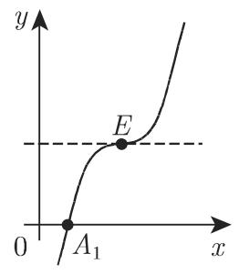
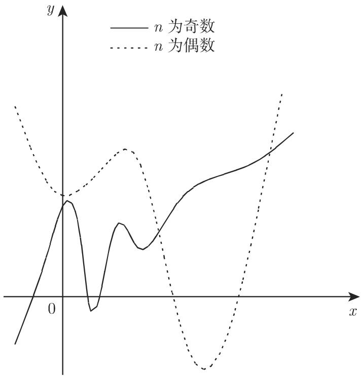
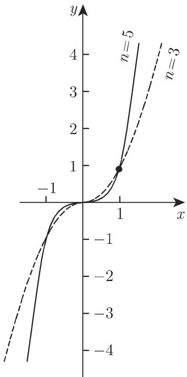

# 数学手册(原书第10版) 2.3 多项式

《数学手册(原书第10版)》第 2 章 2.3 节「多项式」，系统给出一次、二次、三次与一般 n 次多项式函数的图像要素（截距、对称轴、极值点、拐点、端部行为）及按判别式的形态分类，末尾附程序性作图方法。本节是母书 [[数学手册原书第10版]] 已入库的第九个章节片段，直接承接 2.1.5 函数的连续性（索引中无 2.2 节，见文末缺口说明）。

## 各小节要点与公式

### 2.3.1 线性函数（式 2.39–2.40，图 2.11）

$$
y = a x + b \tag{2.39}
$$

图像为一条直线，比例因子为 a；a>0 单调递增，a<0 单调递减，a=0 时为零次多项式（常函数）。截距点为 $A\left(-\frac{b}{a},\,0\right)$ 与 $B(0,\,b)$（原文参见第 262 页 3.5.2.6,1）。b=0 时为正比例函数

$$
y = a x \tag{2.40}
$$

图像为过原点的直线。详见 [[线性函数]]、[[正比例函数]]。

### 2.3.2 二次多项式（式 2.41，图 2.12）

$$
y = a x^{2} + b x + c \tag{2.41}
$$

定义一条以 $x = -\frac{b}{2a}$ 为垂直对称轴的抛物线；a>0 时先单调递减取得最小值再单调递增，a<0 时先单调递增取得最大值再单调递减。关键点：

| 点 | 坐标 | 条件/含义 |
|---|---|---|
| $A_1, A_2$ | $\left(\frac{-b \pm \sqrt{b^2-4ac}}{2a},\ 0\right)$ | $b^2-4ac>0$：与 x 轴两个交点 |
| （切点） | — | $b^2-4ac=0$：一个交点 |
| （无交点） | — | $b^2-4ac<0$：与 x 轴不相交 |
| $B$ | $(0,\ c)$ | 与 y 轴交点 |
| $C$ | $\left(-\frac{b}{2a},\ \frac{4ac - b^2}{4a}\right)$ | 极值点（顶点） |

抛物线的详细说明原文置于第 275 页 3.5.2.10（尚未入库）。详见 [[二次多项式]]、[[抛物线]]。

### 2.3.3 三次多项式（式 2.42，图 2.13）

$$
y = a x^{3} + b x^{2} + c x + d \tag{2.42}
$$

曲线形状与函数性质依赖于 a 与「判别式」$\Delta = 3ac - b^2$：

- $\Delta \geqslant 0$：函数单调（a>0 递增，a<0 递减）；
- $\Delta < 0$：恰有一个局部极大值与一个局部极小值；a>0 时 y 由 $-\infty$ 增至极大、减至极小、再增至 $+\infty$，a<0 时相反。

与 x 轴的交点为 y=0 时式 (2.42) 的实根，可能有 1、2（此时存在一点，x 轴在该点为曲线的切线，即二重根）或 3 个。关键点：

| 点 | x 坐标 | y 坐标 | 含义 |
|---|---|---|---|
| $B$ | $0$ | $d$ | 与 y 轴交点 |
| $C, D$ | $-\frac{b \pm \sqrt{-\Delta}}{3a}$（原文转写） | $\frac{d + 2b^{3} - 9abc \pm (6ac - 2b^{2})\sqrt{-\Delta}}{27a^{2}}$ | 极值点（仅 $\Delta<0$ 时存在）；± 配对方向与横坐标负号位置有转写歧义，见疑点 6 |
| $E$ | $-\frac{b}{3a}$ | $\frac{2b^{3} - 9abc}{27a^{2}} + d$ | 拐点 = 曲线对称中心 |

E 处切线斜率 $\tan \varphi = \left(\frac{\mathrm{d}y}{\mathrm{d}x}\right)_E = \frac{\Delta}{3a}$。详见 [[三次多项式]]、[[拐点]]。

**术语警示**：此 $\Delta = 3ac - b^2$ 不含 d，控制的是单调/极值形态（本质是导数判别式的 $-\frac{1}{4}$ 倍），与 1.6.3.2 含 d 的三次方程**根**判别式不是同一对象，辨析见 [[三次多项式形态判别式与三次方程根判别式比较]] 与 [[三次多项式判别式与三次方程根判别式口径冲突]]。

### 2.3.4 n 次多项式（式 2.43，图 2.14）

$$
y = a_{n} x^{n} + a_{n-1} x^{n-1} + \dots + a_{1} x + a_{0} \tag{2.43}
$$

原文称「n 次整有理函数」，图像为「抛物型 n 次或 n 阶曲线」（第 261 页 3.5.2.5）：

| n 奇偶 | 端部行为（$a_n>0$） | 端部行为（$a_n<0$） | 与 x 轴 | 极值个数 | 拐点个数 |
|---|---|---|---|---|---|
| 奇 | $-\infty \to +\infty$ | $+\infty \to -\infty$ | 相交或相切至多 n 次，**至少一个交点** | 0 或不超过 n−1 的偶数 | 介于 1 与 n−2 之间的奇数 |
| 偶 | $+\infty \to$ 极小 $\to +\infty$ | $-\infty \to$ 极大 $\to -\infty$ | 相交或相切至多 n 次，可能不交 | 奇数 | 偶数或 0 |

两情形均：极大值与极小值交错出现；不存在渐近线或奇点。原文作图程序：

> 在画函数图像之前, 首先应确定极值点、拐点以及这些点的一阶导数, 再画出这些点的切线, 最后连续地连接这些点.

（程序化整理见 [[多项式图像绘制法]]。）n 次方程求解原文参见第 56 页 1.6.3.1 与第 1237 页 19.1.2。详见 [[n次多项式]]。

### 2.3.5 n 次抛物线（式 2.44，图 2.15）

$$
y = a x^{n} \quad (n \text{ 为大于零的整数}) \tag{2.44}
$$

- **a = 1**：曲线 $y = x^n$ 过点 $(0,0)$ 与 $(1,1)$，原点为与 x 轴的切点或交点；n 偶时关于 y 轴对称、在原点取得极小值；n 奇时关于原点对称、原点为拐点；无渐近线。
- **a ≠ 0**：将 $y = x^n$ 的坐标拉伸 $|a|$ 倍得 $y = ax^n$；a<0 时再沿 x 轴反射（原句主语疑错位，见疑点 4）。

详见 [[n次抛物线]]。

## 与既有维基内容的联系

- **强化 1.6**（[[10-数学手册原书第10版--12-16-代数方程和超越方程--2jobwm]]）：2.3.2 的三分类是 [[二次方程判别式三分类与手册反号约定]] 的图像化复述（交点即根、切点即二重根）；2.3.3 的实根 1/2/3 情形对应 [[三次方程判别式的三情形]]；2.3.4「奇 n 至少一个交点」复用 [[奇次实系数方程至少有一个实根]]。
- **扩展既有概念**：[[判别式]]（新增 $\Delta = 3ac-b^2$ 用法）、[[极值]]（极值个数的奇偶规律）、[[单调函数]]（三次按 $\Delta$ 的单调判据）、[[二次方程]]/[[三次方程]]（补图像解释互链）。
- **弱关联**：[[初等函数的连续性]]（多项式处处连续，2.3.4「连续变化」隐含）、[[泰勒展开式]]（本节坐标公式的独立验证工具）。

## 本节疑点（均已开 query）

1. $\Delta = 3ac-b^2$ 与 1.6.3.2 根判别式同名异物：[[三次多项式判别式与三次方程根判别式口径冲突]]
2. 2.3.2 的正向 $b^2-4ac$ 约定与既有 finding 所记 1.6「反号约定」待核对：[[2-3-2与1-6的二次判别式符号约定是否一致]]
3. 奇次拐点规律在 n=1 时空集失效：[[奇次多项式拐点规律在n等于1时是否失效]]
4. 2.3.5 (2) 反射句主语疑错位：[[2-3-5反射句主语是否错位]]
5. 2.3.1「直线与坐标轴的交点为 b」与 $B(0,b)$ 口径不一：[[2-3-1与坐标轴交点为b是否应为纵截距]]
6. 三次极值点横坐标的负号位置与 ± 配对方向的转写歧义（ingest 复核时发现）：[[三次极值点横坐标公式的负号位置是否转写有误]]

## 本节产出的 findings

- [[线性函数的单调性截距与正比例特例]]
- [[二次多项式的抛物线要素与判别式三分类]]
- [[三次多项式按判别式的单调与双极值二分]]
- [[三次多项式极值点与对称中心坐标公式]]
- [[n次多项式奇偶分支行为规律]]
- [[n次抛物线的对称性与伸缩反射变换]]

## 插图与组织缺口

本节含图 2.11–2.15 共 10 幅插图（线性 2 幅、二次 2 幅、三次 3 幅、n 次 1 幅、n 次抛物线 2 幅），已本地化保存于 `media/10-数学手册原书第10版--6-23-多项式--l0zhnw/`。组织上，索引中 2.1.5 之后直接承接本节，**缺 2.2 节**的 source 页，待查是未处理还是原书编号跳跃。

<!-- llm-wiki:embedded-images -->
## Embedded Images

### Document

<!-- llm-wiki:embedded-images -->
