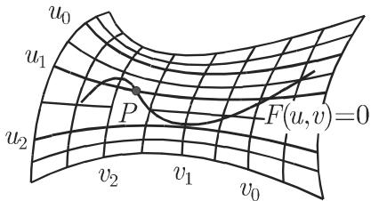
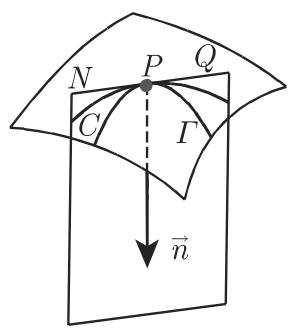
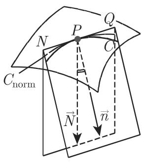
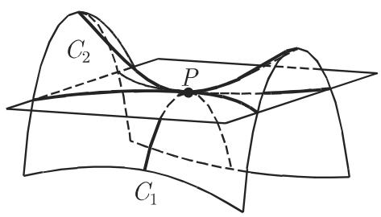

# 数学手册(原书第10版) 3.6.3 曲面

《数学手册(原书第10版)》第 3.6.3 节「曲面」是 [[微分几何学]]（3.6 节）的主体小节，系统给出经典曲面微分几何的完整纲要：曲面的四种表示形式与 [[曲线坐标-高斯坐标|高斯坐标]]、[[切平面]]与[[曲面法线]]、曲面[[奇点]]、[[第一基本形式]]与[[第二基本形式]]、曲率理论（[[默尼耶定理]]、[[欧拉公式-法截线曲率|欧拉公式]]、[[主曲率与主方向]]、[[曲面上点的分类]]、[[平均曲率]]与[[高斯曲率]]）、[[直纹曲面]]与[[可展曲面]]、[[测地线]]。全节共 6 个小节，公式 (3.544)–(3.568)、表 3.29、图 3.245–3.251；文末署名「（程钊译）」。数学内容经 Stage 1 对多数公式作独立推导或数值核验，置信度高；转写质量差（见「转写质量问题」）。

## 小节结构

### 3.6.3.1 曲面的定义方式（式 3.544–3.548）

四种表示形式：隐式 $F(x,y,z)=0$（3.544）、显式 $z=f(x,y)$（3.545）、参数式 $x=x(u,v),\,y=y(u,v),\,z=z(u,v)$（3.546）、向量式 $\vec r=\vec r(u,v)$（3.547）。显式是参数式取 $u=x,\ v=y$ 的特款；参数式消参（若可能）得隐式。球面三重表示见式 (3.548a–c)。参数形式在曲面上诱导高斯坐标：球面上 $u$ 为地理经度、$v$ 为极距，v 线为子午线 APB、u 线为平行圆 CPD（图 3.246）。详见 [[曲面方程四形式与球面三重表示]]。

### 3.6.3.2 切平面和曲面法线（式 3.549–3.552、表 3.29）

正则点条件：邻域映射 $(u,v)\to\vec r(u,v)$ 可逆，$\vec r_u$ 与 $\vec r_v$ 连续且不平行。切平面由 $\vec r_u,\vec r_v$ 张成；法向量 $\vec N_0=\vec r_u\times\vec r_v/|\vec r_u\times\vec r_v|$（3.549b），指向依赖参数次序。若 $\vec r_u\parallel\vec r_v$ 对任何参数成立，该点为奇点；解析条件为 (3.551)，此时切线构成二阶锥面 (3.552)。表 3.29（verbatim 见下）给出四种表示下的切平面与法线方程；球面算例 (3.550a–d) 已独立核验。详见 [[切平面与曲面法线方程表]]、[[曲面奇点条件与二阶切锥]]。

### 3.6.3.3 曲面的线素（式 3.553–3.558）

第一基本形式 $\mathrm ds^2=E\,\mathrm du^2+2F\,\mathrm du\,\mathrm dv+G\,\mathrm dv^2$，$E=\vec r_u^2,\ F=\vec r_u\cdot\vec r_v,\ G=\vec r_v^2$（3.553）。球面算例 (3.554)：$E=a^2\sin^2v,\ F=0,\ G=a^2$；显式算例 (3.555)：$E=1+p^2,\ F=pq,\ G=1+q^2$，均已核验。度量三公式：弧长 (3.556)、夹角 (3.557)（坐标线正交 ⇔ $F=0$）、面积元素 (3.558)。弯曲下第一基本形式不变，相同第一基本形式的两曲面可互相贴合。详见 [[第一基本形式系数与两算例]]、[[曲面上度量三公式与正交条件]]、[[弯曲不变性与等距贴合断言]]。

### 3.6.3.4 曲面的曲率（式 3.559–3.566）

- 默尼耶定理 (3.559)：$\rho=R\cos(\vec n,\vec N)$；欧拉公式 (3.560)：$1/R=\cos^2\alpha/R_1+\sin^2\alpha/R_2$（该段转写受损最重，见 [[默尼耶定理与欧拉公式]]）。
- 主方向方程 (3.561)（显式）与 (3.563a)（参数）；主曲率半径二次方程 (3.562a) 与 (3.563b)；第二基本形式系数 (3.563c–e)。曲率线由积分 (3.561)/(3.563a) 得到（见 [[主方向与主曲率半径方程组]]）。
- 点分类 (3.564)：椭圆点 $LN-M^2>0$、圆点/脐点 $R_1=R_2$、双曲点 $LN-M^2<0$、抛物点 $LN-M^2=0$；椭球面全为椭圆点、单叶双曲面为双曲点、柱面为抛物点（见 [[曲面上点四分类判据与三例曲面]]）。
- $H=\frac12(1/R_1+1/R_2)$、$K=1/(R_1R_2)$（3.565）；显式公式 (3.566a,b)；圆柱面算例 $H=1/(2a),\ K=0$，已核验（见 [[平均曲率高斯曲率公式与圆柱算例]]）。
- 按曲率分类：[[极小曲面]]（$H\equiv 0$，$R_1=-R_2$）与 [[常曲率曲面]]（$K=$ 常数；$K>0$ 球面、$K<0$ [[伪球面]]，即曳物线绕对称轴旋转所得）。

### 3.6.3.5 直纹面和可展曲面（式 3.567）

直纹面由移动直线生成；可展曲面为可展开于平面而不拉伸压缩的直纹面，判据：a) $K=0$；b) $rt-s^2=0$（等价，已核验）。锥面、柱面可展；单叶双曲面与双曲抛物面是直纹面但不可展。详见 [[可展曲面判据与四例曲面归类]]。

### 3.6.3.6 曲面上的测地线（式 3.568）

测地线：每点处主法线与曲面法线同向的曲线；三条性质（最短曲线、约束质点轨迹、拉紧松紧带的形状）；显式微分方程 (3.568)。圆柱面上测地线为圆柱螺旋线。源中交叉引用「第 213 页 3.4.1.1, 3」即球面大圆为测地线，与 [[大圆航线]] 桥接。方程 (3.568) 已经 Christoffel 符号推导核验并经球面大圆数值验证（见 [[测地线微分方程与核验]]）。

## 表 3.29：切平面和曲面法线的方程（verbatim）

注（源文）：x, y, z 与 r⃗ 是曲面上点 P 的坐标和向径；X, Y, Z 与 R⃗ 是点 P 处切平面和曲面法线上动点的坐标和向径；$\vec r_1=\partial\vec r/\partial u$，$\vec r_2=\partial\vec r/\partial v$；$p=\partial z/\partial x$，$q=\partial z/\partial y$。＊关于三个向量的混合积，参见第 249 页 3.5.1.6, 2（即 [[混合积]]）。源文注末句「p = ∂z/∂x, q = ∂z/∂y 是法向量」疑有脱落，见 [[表3-29注p与q是法向量措辞是否原文如此]]。

| 方程类型 | 切平面 | 曲面法线 |
|---|---|---|
| (3.544) 隐式 | $\frac{\partial F}{\partial x}(X-x)+\frac{\partial F}{\partial y}(Y-y)+\frac{\partial F}{\partial z}(Z-z)=0$ | $\frac{X-x}{\partial F/\partial x}=\frac{Y-y}{\partial F/\partial y}=\frac{Z-z}{\partial F/\partial z}$ |
| (3.545) 显式 | $Z-z=p(X-x)+q(Y-y)$ | $\frac{X-x}{p}=\frac{Y-y}{q}=\frac{Z-z}{-1}$ |
| (3.546) 参数 | $\begin{vmatrix}X-x&Y-y&Z-z\\ x_u&y_u&z_u\\ x_v&y_v&z_v\end{vmatrix}=0$ | $\frac{X-x}{\begin{vmatrix}y_u&z_u\\y_v&z_v\end{vmatrix}}=\frac{Y-y}{\begin{vmatrix}z_u&x_u\\z_v&x_v\end{vmatrix}}=\frac{Z-z}{\begin{vmatrix}x_u&y_u\\x_v&y_v\end{vmatrix}}$ |
| (3.547) 向量 | $(\vec R-\vec r)\,\vec r_1\,\vec r_2=0^*$ 或 $(\vec R-\vec r)\vec N=0$ | $\vec R=\vec r+\lambda(\vec r_1\times\vec r_2)$ 或 $\vec R=\vec r+\lambda\vec N$ |

## 关键公式选录（verbatim）

测地线微分方程（式 3.568）：

$$(1+p^2+q^2)\frac{\mathrm d^2y}{\mathrm dx^2}=pt\left(\frac{\mathrm dy}{\mathrm dx}\right)^3+(2ps-qt)\left(\frac{\mathrm dy}{\mathrm dx}\right)^2+(pr-2qs)\frac{\mathrm dy}{\mathrm dx}-qr$$

偏导数记号（式 3.562b）：$p=\frac{\partial z}{\partial x},\ q=\frac{\partial z}{\partial y},\ r=\frac{\partial^2z}{\partial x^2},\ s=\frac{\partial^2z}{\partial x\partial y},\ t=\frac{\partial^2z}{\partial y^2}$，$h=\sqrt{1+p^2+q^2}$。

第二基本形式系数中的行列式（式 3.563d，verbatim）：

$$d=\begin{vmatrix}x_{uu}&y_{uu}&z_{uu}\\ x_u&y_u&z_u\\ x_v&y_v&z_v\end{vmatrix},\qquad d'=\begin{vmatrix}x_{uv}&y_{uv}&z_{uv}\\ x_u&y_u&z_u\\ x_v&y_v&z_v\end{vmatrix},\qquad d''=\begin{vmatrix}x_{vv}&y_{vv}&z_{vv}\\ x_u&y_u&z_u\\ x_v&y_v&z_v\end{vmatrix}$$

## 已独立核验的公式

式 (3.548)、(3.550)、(3.554)、(3.555)、(3.561)、(3.562a)、(3.566a,b)、(3.567)、(3.568) 经 Stage 1 独立推导或数值核验全部通过：其中 (3.566) 由一般式 $H=(EN-2FM+GL)/(2(EG-F^2))$、$K=(LN-M^2)/(EG-F^2)$ 推导核验；(3.568) 由 Christoffel 符号推导，并代入球面 $z=\sqrt{a^2-x^2-y^2}$ 与大圆 $y=mx$ 验证右端恒为零。

## 转写质量问题

延续 3.6 节既有模式（见 [[3-6节微分儿何与依赖千等转写讹误是否为系统性丢字]]），本节新证据：

1. 字符级讹误：「千」代「于」（关千/对千/等千/位千/垂直千/依赖千）、「而」代「面」（曲而/柱而/双曲抛物而/可展曲而）、「笫」代「第」、「跻点」应为「脐点」、「隐形」应为「隐式」、「换旬话」应为「换句话」、「妇人 v̇₂」的「妇」为噪声字、曲线「I'」应为 Γ。
2. 成片符号脱落：P、u、v、「u 线/v 线」、「x = 常数/y = 常数」、脐点条目的「1/R」、极小曲面定义的「H = 0」、常曲率曲面的「K」、可展属性 a) 的「0」等整段缺符（见 [[极小曲面定义句是否脱落H等于零]]）。
3. 乱码：默尼耶定理段出现「$\yen 123,456$」明文乱码，夹角符号 $(\vec n,\vec N)$ 与主法线单位向量 $\vec n$ 脱落，为全节受损最重处（见 [[默尼耶定理段乱码与夹角符号脱落]]）。
4. 符号冲突：(3.563c) 中 $L=\vec r_{uu}\vec R$ 的 R⃗ 与表 3.29 动点向径 R⃗ 冲突，疑应为单位法向量 N⃗（见 [[式3-563c的向量R是否应为单位法向量N]]）。
5. 表述精度：测地线「两点之间最短的曲线」严格应为局部最短（见 [[测地线最短性表述是否应为局部最短]]）。
6. 文末混入下一章标题残片「章线性代数」，为转写噪声。

## 与现有维基的联系

- [[微分几何学]]：本节是 3.6 概览页的具体化主体，提纲内容在此获得完整公式支撑。
- [[奇点]]：本节给出曲面奇点条件 (3.551) 与二阶切锥 (3.552)，为该页的实质性扩展。
- [[直纹曲面]]：本节补入可展性维度（K=0 判据、不可展反例），形成「3.5.3 代数描述 → 3.6.3 度量判据」的证据链。
- [[二次曲面]]：椭球面/单叶双曲面/柱面/锥面/双曲抛物面的点型与可展性归类（图 3.192/3.196/3.197/3.198 出自 3.5.3）。
- [[混合积]]、[[向量积]]：表 3.29 注交叉引用第 249 页 3.5.1.6；$\vec N_0$ 由向量积构造。
- [[球坐标系]]、[[球坐标极角与地理纬度记号比较]]：球面参数化 u=经度、v=极距直接呼应。
- [[大圆航线]]：球面大圆为测地线，为 [[测地线]] 提供球面实例桥接。
- [[微分几何性质四分类框架]]、[[坐标依赖性质与不变性质]]：第一基本形式的弯曲不变性是该框架的最佳实例。
- [[高斯—克吕格坐标系]]：与本节「高斯坐标」同名异义（地图投影坐标 vs 曲面曲线坐标），勿混淆。

## 弱化内容

曳物线（图 2.79 属原书第 2 章，本维基未覆盖）、图形文件本身、译者署名、文末残片。

<!-- llm-wiki:embedded-images -->
## Embedded Images

### Document

<!-- llm-wiki:embedded-images -->
