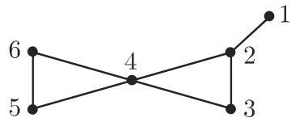

# 数学手册(原书第10版) 5.8.4 匹配

本页是《数学手册(原书第10版)》第 5 章 5.8「图论算法」第 4 子节「匹配」的入库摘要，为 [[sources/10-数学手册原书第10版--7-58-图论算法--wf3s74]]（5.8 引言）与 [[sources/10-数学手册原书第10版--11-581-基本概念和记号--1us4sp9]]（5.8.1 基本概念和记号）的直接续篇。本节**首次将匹配理论引入本维基**：给出匹配的四分定义、[[concepts/完全匹配]] 存在的充要判据 [[concepts/塔特定理]]、[[concepts/交错路]] 与 [[concepts/递增路]]、[[concepts/贝格定理]] 及其翻转构造，并以图 5.55 的 M₁/M₂ 算例演示「饱和 ⇏ 极大」与翻转增边；末尾以指针提及埃德蒙兹 (Edmonds) 算法（[5.48]），未展开。

## ⚠️ 术语警示（先读）

本节手册用词与通行中文图论术语**系统性错位**，全维基跨页引用必须先经下表换算（基准页：[[comparisons/饱和极大完全匹配比较]]；追踪页：[[queries/匹配术语译名与通行术语冲突]]）：

| 手册术语 | 手册定义 | 通行中文对应 | 英文对应 |
|---|---|---|---|
| 饱和匹配 | 按包含关系极大 | 极大匹配 | maximal matching |
| 极大匹配 | 按基数最大 | 最大匹配 | maximum matching |
| 完全匹配 | 覆盖全部顶点 | 完美匹配 | perfect matching |
| 递增路 | 端点均不被 M 覆盖的开交错路 | 增广路 | augmenting path |

（映射为依源中定义所做的对照推断，非源文明示。）本维基匹配类页面一律沿用手册术语并标注通行对应。

## 内容结构

本节按五个条目组织：

1. **匹配**（定义组 + 图 5.55 算例）→ [[concepts/匹配]]、[[findings/匹配定义四分与图5-55算例]]
2. **塔特 (Tutte) 定理**（完全匹配存在性）→ [[concepts/塔特定理]]、[[findings/塔特定理与完全匹配存在性三类]]
3. **交错路** → [[concepts/交错路]]
4. **贝格 (Berge) 定理**（极大性判据 + 翻转构造 + 算例）→ [[concepts/贝格定理]]、[[findings/贝格定理翻转构造与m1到m2算例]]
5. **极大匹配的确定**（三步流程 + Edmonds 指针）→ [[methodology/极大匹配三步确定流程]]

### 关键陈述（逐字重构，▯ 表示转写脱落的变元）

定义组：

```text
▯(⊆E) 称为 ▯ 中的一个匹配，当且仅当 ▯ 不含环，并且 ▯ 的任何两条不同的边都没有公共端点。
G 的匹配 M* 称作饱和匹配，如果 ▯ 中不存在匹配 M 使得 M* ⊂ M。
G 的匹配 M** 称作极大匹配，如果 ▯ 中不存在匹配 M 使得 |M| > |M**|。
如果 ▯ 的匹配 ▯ 使得 ▯ 的每个顶点都是 ▯ 的一条边的端点，那么 ▯ 称为完全匹配。
```

塔特定理与存在性三类：

```text
设 q(G−S) 表示 G−S 的具有奇数个顶点的分量的个数。
图 G = (V, E) 有完全匹配 ⟺ |V| 是偶数，并且对于顶点集的每个子集 S ⊆ V：q(G−S) ⩽ |S|。
完全匹配存在于（例如）有偶数个顶点的完全图、完全二部图 K_{n,m} 以及任意次数 r > 0 的正则二部图中。
```

（K_{n,m} 一条按本节定义不精确——需 n = m，见 [[queries/完全二部图knm是否应为knn]]。）

贝格定理与翻转构造：

```text
▯ 中匹配 ▯ 是极大的，当且仅当 ▯ 中不存在递增交错路。
如果 ▯ 是一条递增交错路，并且对应的遍历边的集合是 E(W)，那么
  M′ = (M ∖ E(W)) ∪ (E(W) ∖ M) 形成 ▯ 中一个匹配，并且 |M′| = |M| + 1。
```

（原文定理句作 |M₁| + 1，定理语境中 M₁ 无定义，疑为算例下标窜入，见 [[queries/贝格翻转公式m1是否应为m]]。）

### 图 5.55 算例



```text
M₁ = {{2,3},{5,6}}         —— 饱和匹配
M₂ = {{1,2},{3,4},{5,6}}   —— 极大匹配，并且也是完全匹配
W  = ({1,2},{2,3},{3,4})   —— 关于 M₁ 的递增交错路，翻转得 M₂，且 |M₂| = |M₁| + 1（已复算）
```

## 原始转写存档

```text
#### 5.8.4 匹配

1. 匹配

的边集 称为 中的一个匹配，当且仅当 不含环，并且 的任何两条不同的边都没有公共端点

的匹配 $M ^ { * }$ 称作饱和匹配，如果 中不存在匹配 使得 $M ^ { * } \subset M$ .G的匹配 $M ^ { * * }$ 称作极大匹配，如果 中不存在匹配 使得 $| M | > | M ^ { * * } |$

如果 的匹配 使得 的每个顶点都是 的一条边的端点那么 称为完全匹配

• 在图 5.55 $M _ { 1 } = \{ \{ 2 , 3 \} , \{ 5 , 6 \} \}$ ｝是饱和匹配，而 $M _ { 2 } = \{ \{ 1 , 2 \} , \{ 3 , 4 \} , \{ 5 , 6 \} \}$ 是极大匹配，并且也是完全匹配

2. 塔特 (Tutte) 定理

设 $q ( G - S )$ 表示 $G - S$ 的具有奇数个顶点的分量的个数．图 $G = ( V , E )$ 有完全匹配，当且仅当 IVI 是偶数，并且对千顶点集的每个子集 $q ( G - S ) \leqslant | S |$ 这里 G-S 表示从 中去掉 的顶点以及与这些顶点关联的边所得到的图

完全匹配存在千（例如）有偶数个顶点的完全图、完全二部图 $K _ { n , m }$ 以及任意次数 $r > 0$ 的正则二部图中．

3. 交错路

是一个有匹配 的图 中的一条路 称作交错路，当且仅当在每条使得 $e \in M$ （ $e \not \in M )$ 的边 都有一条边 $e ^ { \prime }$ 跟随，并且 $e ^ { \prime } \not \in M$ （或 $e \in M )$ 1

开交错路称为递增路，当且仅当路中没有端点与 的边关联

4. 贝格 (Berge) 定理

中匹配 是极大的，当且仅当 中不存在递增交错路

如果 是一条递增交错路，并且对应的遍历边的集合是 $E ( W )$ ，那么 $M ^ { \prime } =$ $( M \setminus E ( W ) ) \cup ( E ( W ) \setminus M )$ 形成 中一个匹配，并且 $| M ^ { \prime } | = | M _ { 1 } | + 1$

• 在图 5.55 中，（｛ 1,2},{2,3},{3,4}) 是对千匹配 $M _ { 1 }$ 的递增交错路如上面所述得到匹配 $M _ { 2 }$ 并且 $| M _ { 2 } | = | M _ { 1 } | + 1$

5. 极大匹配的确定

是一个具有匹配 的图

a) 首先形成一个饱和匹配 $M ^ { * }$ ，并且 $M \subseteq M ^ { * }$

b) 选取 的一个不与 $M ^ { * }$ ＊的边关联的顶点 ，并且确定 中一条从 开始的递增交错路

c) 如果这样的路存在，那么上面叙述的方法产生一个匹配 $M ^ { \prime }$ ，并且 $| { \cal { M } } ^ { \prime } | >$ $\lvert M ^ { * } \rvert$ ．如果这样的路不存在，那么在 中去掉顶点 以及所有与 关联的边并且重复步骤 b).

有一个埃德蒙兹 (Edmonds) 算法是搜索极大匹配的有效方法但它的叙述相当复杂（见 [5.48]).
```

## 转写损伤

与 5.4–5.7 各节同型的系统性损伤：行内变元（G、M、S、v、W、M*）在中文正文中几乎全部脱落，仅 LaTeX 残片存留；「对于/存在于」误作「对千/存在千」；「|V|」误作「IVI」；交错路定义句末游离「1」；括号全半角混用；M₁ 集合后多出全角「｝」；「M* ＊」重复星号；M′ 误作花体 𝓜′。图号 5.55 延续第 5 章图表统一编号（5.20 → 5.25 → 5.55）。完整清单见 [[queries/5-8-4全节系统性转写讹误清单]]。

## 前置概念（已入库，互链）

- [[concepts/图论]]、[[concepts/图与关联函数]]、[[concepts/邻接性与端点]]（端点、关联、公共端点）
- [[concepts/重边环与简单图]]（环）
- [[concepts/顶点次数与正则图]]（次数 r、正则）
- [[concepts/完全图]]（K_n）、[[concepts/二部图与完全二部图]]（K_{n,m}）
- [[concepts/子图导出子图部分图与因子]]（G−S 的构造方式；完全匹配 = 1-因子）

## 开放问题

- [5.48] 具体指代何种文献（Edmonds 原始论文抑或专著）——待查手册文献表。
- 原文究竟是 K_{n,m} 还是 K_{n,n}（[[queries/完全二部图knm是否应为knn]]）。
- 贝格定理句的 |M₁| + 1 是否为 |M| + 1 之讹（[[queries/贝格翻转公式m1是否应为m]]）。
- 脱落变元的原文复原需对照原书扫描。
- 5.8.2、5.8.3 未入库（[[queries/5-8-2与5-8-3未入库缺口]]）。

<!-- llm-wiki:embedded-images -->
## Embedded Images

### Document


<!-- llm-wiki:embedded-images -->
