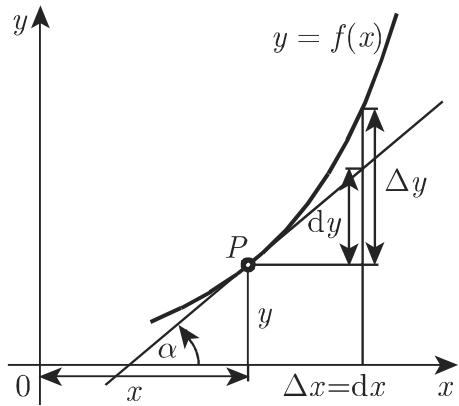
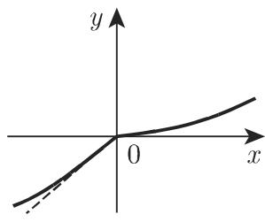

# 数学手册(原书第10版) 6.1.1 微商

## 来源概述

本页对应《数学手册(原书第10版)》第 6 章（微分学）6.1.1 小节「微商」。这是本 wiki 首个入库的第 6 章小节，将手册覆盖范围从第 5 章的图论（5.8.x）与模糊逻辑（5.9.x）延伸至分析学（微分学），开启新的章节维度。

小节由四个条目组成：

1. **函数的微商或导数**——以差商极限定义固定点处的微商，并定义 [[导函数]]（式 6.1）；
2. **导数的几何表示**——在笛卡儿坐标系中以切线斜率刻画导数（式 6.2）；
3. **可微性**——微商取有限值即可微；讨论连续但导数不存在的情形，附算例 A（垂直切线）与算例 B（差商无极限）；
4. **左、右侧可微性**——定义左、右导数（式 6.3），引出 [[尖点]]，附算例 C。

## 逐字保留的公式与记号

```latex
% 式 6.1（微商 / 导函数定义）
f'(x) = \lim_{\Delta x \to 0} \frac{f(x+\Delta x) - f(x)}{\Delta x}

% 式 6.2（导数的几何意义；前提：x 轴与 y 轴单位相同）
f'(x) = \tan\alpha

% 式 6.3（左、右导数；曲线在尖点处有两个正切值）
f'(a-0) = \tan\alpha_1,\qquad f'(a+0) = \tan\alpha_2

% 导函数的记号集
y',\ \dot{y},\ Dy,\ \frac{\mathrm{d}y}{\mathrm{d}x},\ Df(x),\ \frac{\mathrm{d}f(x)}{\mathrm{d}x}

% 例 A（垂直切线情形）
f(x) = \sqrt[3]{x}:\quad f'(x) = \frac{1}{3\sqrt[3]{x^2}},\quad f'(0) = \infty

% 例 B（连续但差商极限不存在）
f(x) = x\sin\frac{1}{x}\ (x \neq 0),\quad 补充定义 f(0)=0

% 例 C（尖点 / 左右导数不等）
f(x) = \frac{x}{1+e^{1/x}}\ (x \neq 0),\quad 补充定义 f(0)=0;\quad f'(-0)=1,\ f'(+0)=0
```

## 三个不可导算例

手册以三个算例展示「连续但不可导」的三种典型情形（三个算例各属一种情形，结论互不转移）：

| 算例 | 函数 | 在 x=0 处的表现 | 情形 | 图版 | 复算状态 |
|---|---|---|---|---|---|
| A | f(x)=∛x | f′(x)=1/(3∛(x²))，f′(0)=∞，导数不存在 | 切线垂直于 x 轴 | 图 6.2(a) | 已验证 |
| B | f(x)=x·sin(1/x)，补充定义 f(0)=0 | 连续，但式 (6.1) 极限不存在 | 无切线 | 图 6.2(b) | 已验证 |
| C | f(x)=x/(1+e^(1/x))，补充定义 f(0)=0 | f′(−0)=1，f′(+0)=0，双侧极限不存在 | 尖点（knee） | 图 6.2(c)、图 6.3 | 已验证 |

## 证据强度总评

数学内容为标准单变量微分学，全部可独立复算，证据强。但转写质量差：存在系统性 OCR 讹误（「关千→关于」「儿何→几何」「增最→增量」等）与多句变量名脱落，完整清单见 [[6-1-1全节系统性转写讹误清单]]。引用本节公式须以逐字转录加独立复算双保险；本 wiki 的三个算例结论均已手工复算确认。

## 图版

- 图 6.1：`media/10-数学手册原书第10版--6-611-微商--y9fryb/001-8e9eebdf691aaa4e55c096a514c6e8587bce31300806472d63e5755e364474fe.jpg`
- 图 6.2(a)：`media/10-数学手册原书第10版--6-611-微商--y9fryb/002-37007e23d5722449572a922a47ee02f0ac757b850caea06afd22a7e479c70cea.jpg`
- 图 6.2(b)：`media/10-数学手册原书第10版--6-611-微商--y9fryb/003-405eae5ecd0c6d6aace4b95858a388634adeac71183b3c3d6d996a92eb67a10b.jpg`
- 图 6.2(c)：`media/10-数学手册原书第10版--6-611-微商--y9fryb/004-707e03f0c7aef3a202fff0b4deac6ef574a787851e591c47c97b8f1e6f7e039a.jpg`
- 图 6.3：`media/10-数学手册原书第10版--6-611-微商--y9fryb/005-9b789ece01da329fc27aef3d31e60afced71d4bcd5a176feef93ee6fc1d92567.jpg`

## 关联页面

- 概念：[[微商]]、[[导函数]]、[[导数的几何意义]]、[[可微性]]、[[左导数与右导数]]、[[尖点]]
- 发现：[[微商与导函数的定义-式6-1]]、[[导数的几何意义-式6-2]]、[[立方根函数垂直切线算例-图6-2a]]、[[xsin1-x连续不可导算例-图6-2b]]、[[左右导数尖点算例-式6-3]]
- 疑问：[[6-1-1全节系统性转写讹误清单]]、[[参见第3273-6-1-2交叉引用是否为粘连讹误]]、[[尖点译名与knee角点术语问题]]、[[两正切值是否应为两条切线]]、[[图6-2c与图6-3的内容分工]]、[[6-1-2未入库缺口]]
- 比较：[[垂直切线与尖点两种不可导情形比较]]、[[可微与连续关系比较]]
- 同书系已入库章节：第 5 章图论与模糊逻辑各节，如 [[10-数学手册原书第10版--7-59-模糊逻辑--150f34q]]

<!-- llm-wiki:embedded-images -->
## Embedded Images

### Document






<!-- llm-wiki:embedded-images -->
