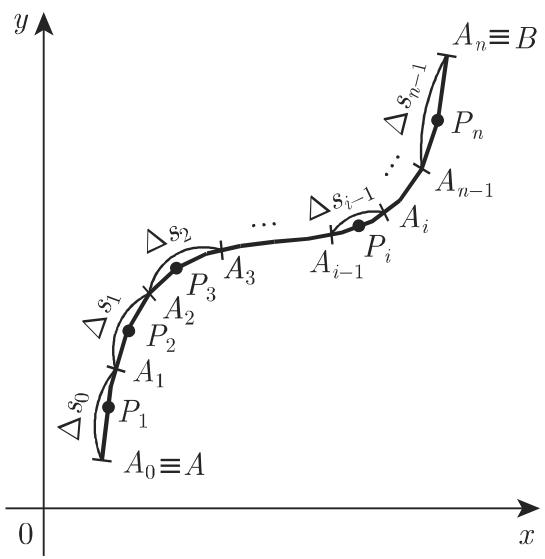
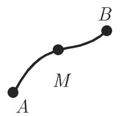
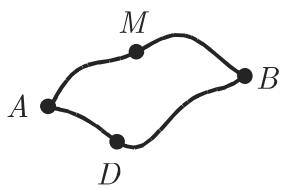
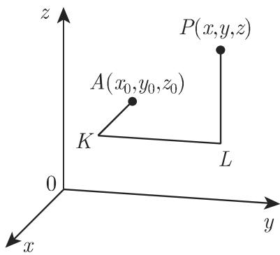

# 数学手册(原书第10版) 8.3 线积分

## 来源定位

本页是《数学手册（原书第10版）》第 8 章第 3 节「线积分」的入库摘要，承接 [[sources/10-数学手册原书第10版--7-81-不定积分--1fcvveq]]（8.1 不定积分）与 [[sources/10-数学手册原书第10版--6-82-定积分--10if8co]]（8.2 定积分），是积分学章的第三块。开篇点明推广主旨：正如通常 [[concepts/定积分]] 的定义域为数轴上的一个区间，[[concepts/线积分]] 的定义域为一条平面曲线或空间曲线；若积分路径是封闭曲线，则称之为 [[concepts/环路积分]]，它给出函数沿曲线的循环量（转写原文作「函数沿曲线的循环」，疑脱一「量」字）。

## 章节结构

| 小节 | 主题 | 关键公式与数据 |
|---|---|---|
| 8.3.1 第一类线积分 | 定义、存在定理、化定积分、应用 | 式 8.106–8.109b；[[entities/表8-6第一类线积分应用表]]、[[entities/表8-7曲线微元表]] |
| 8.3.2 第二类线积分 | 投影定义、存在定理、化定积分 | 式 8.110a–8.117 |
| 8.3.3 一般类型的线积分 | 定义、三性质、沿闭曲线的积分 | 式 8.118a–8.123 |
| 8.3.4 线积分与积分路径无关 | 全微分的可积性、原函数、功 | 式 8.124–8.133 |

## 核心内容

### 三分类体系

手册按被积微元把线积分分为三类：[[concepts/第一类线积分]]（对弧长的积分，微元 $\Delta s$，方向无关）、[[concepts/第二类线积分]]（投影积分，微元为坐标轴投影 $\Delta x/\Delta y/\Delta z$，路径反向则变号）、[[concepts/一般类型的线积分]]（各投影第二类积分之和 $P\,\mathrm{d}x+Q\,\mathrm{d}y(+R\,\mathrm{d}z)$，功与环流的载体）。两类差异的系统对比见 [[comparisons/第一类线积分与第二类线积分比较]]。

### 化定积分公式（两类对比的枢纽）

$$\int_{(C)} f(x,y)\,\mathrm{d}s = \int_{t_0}^{T} f[x(t),y(t)]\sqrt{[x'(t)]^2+[y'(t)]^2}\,\mathrm{d}t \tag{8.108a，要求 $t_0<T$}$$

$$\int_{(C)} f(x,y)\,\mathrm{d}x = \int_{t_0}^{T} f[x(t),y(t)]\,x'(t)\,\mathrm{d}t \tag{8.116a，不要求 $t_0<T$}$$

操作流程见 [[methodology/线积分化定积分计算流程]]。

### 路径无关与原函数（理论核心）

[[concepts/线积分与积分路径无关]]（全微分的可积性）给出二维四层等价链：路径无关（式 8.124–8.125）⇔ 存在原函数 $U$（式 8.126a/b）⇔ $P\,\mathrm{d}x+Q\,\mathrm{d}y=\mathrm{d}U$ ⇔（单连通域、偏导连续）$\frac{\partial P}{\partial y}=\frac{\partial Q}{\partial x}$（式 8.127）；三维为三个旋度型方程（式 8.129c）。功 $W=V(P_2)-V(P_1)$（式 8.130）。原函数由折线构造（式 8.131–8.133，见 [[methodology/原函数折线构造法]]）。

## 结构化数据表（逐字转录）

**表 8.6 第一类线积分的应用**（详注见 [[entities/表8-6第一类线积分应用表]]）：

| 应用 | 公式 |
|---|---|
| 曲线段 C 的长 | $L=\int_{(C)} \mathrm{d}s$ |
| 质地不均匀的曲线段 C 的质量 | $M=\int_{(C)}\varrho\,\mathrm{d}s$（$\varrho=f(x,y,z)$ 为密度函数） |
| 重心的坐标 | $x_C=\frac{1}{L}\int_{(C)}x\varrho\,\mathrm{d}s,\quad y_C=\frac{1}{L}\int_{(C)}y\varrho\,\mathrm{d}s,\quad z_C=\frac{1}{L}\int_{(C)}z\varrho\,\mathrm{d}s$ |
| 平面曲线在 xOy 面的转动惯量 | $I_x=\int_{(C)}x^2\varrho\,\mathrm{d}s,\quad I_y=\int_{(C)}y^2\varrho\,\mathrm{d}s$ |
| 空间曲线关于坐标轴的转动惯量 | $I_x=\int_{(C)}(y^2+z^2)\varrho\,\mathrm{d}s,\quad I_y=\int_{(C)}(x^2+z^2)\varrho\,\mathrm{d}s,\quad I_z=\int_{(C)}(x^2+y^2)\varrho\,\mathrm{d}s$ |
| （注） | 对于质地均匀的曲线，令 $\rho=1$ |

**表 8.7 曲线微元**（详注见 [[entities/表8-7曲线微元表]]）：

| 曲线 | 坐标/参数形式 | ds |
|---|---|---|
| xOy 面中的平面曲线 | 笛卡儿坐标 $x,\ y=y(x)$ | $ds=\sqrt{1+[y'(x)]^2}\,dx$ |
| | 极坐标 $\varphi,\ \rho=\rho(\varphi),\ x=\rho(\varphi)\cos\varphi,\ y=\rho(\varphi)\sin\varphi$ | $ds=\sqrt{\rho^2(\varphi)+[\rho'(\varphi)]^2}\,d\varphi$ |
| | 笛卡儿坐标系下的参数形式 $x=x(t),\ y=y(t)$ | $ds=\sqrt{[x'(t)]^2+[y'(t)]^2}\,dt$ |
| 空间曲线 | 笛卡儿坐标系下的参数形式 $x=x(t),\ y=y(t),\ z=z(t)$ | $ds=\sqrt{[x'(t)]^2+[y'(t)]^2+[z'(t)]^2}\,dt$ |

## 例题复算（全部吻合）

| 算例 | 位置 | 结果 | 复算 |
|---|---|---|---|
| 例 A 螺旋线一圈 $\int(xy\,\mathrm{d}x+yz\,\mathrm{d}y+zx\,\mathrm{d}z)$ | 8.3.3.2 | $-\pi a^2 b/2$ | ✓（三项分别为 $0,\ -\pi a^2b/2,\ 0$） |
| 例 B 抛物线 $y^2=9x$ 弧 $\int[y^2\,\mathrm{d}x+(xy-x^2)\,\mathrm{d}y]$ | 8.3.3.2 | $\frac{123}{20}=6\frac{3}{20}$ | ✓（$\int_0^3\frac{y^3}{3}\,dy-\int_0^3\frac{y^4}{81}\,dy=\frac{27}{4}-\frac{3}{5}$） |
| 原函数例 A $-\frac{y\,\mathrm{d}x}{x^2+y^2}+\frac{x\,\mathrm{d}y}{x^2+y^2}$ | 8.3.4.4 | $U=-\arctan\frac{x}{y}+C=\arctan\frac{y}{x}+C_1$（基点 $(0,1)$） | ✓（$\frac{\partial P}{\partial y}=\frac{\partial Q}{\partial x}=\frac{y^2-x^2}{(x^2+y^2)^2}$；$U_x=P,\ U_y=Q$） |
| 原函数例 B（三元） | 8.3.4.4 | $U=\arctan\frac{z}{x}-\frac{z}{xy}+C$（基点 $(1,1,0)$） | ✓（$U_x=P,\ U_y=Q,\ U_z=R$ 逐项回代） |

复算细节见 [[findings/式8-118至8-121一般线积分三性质与两算例复算]] 与 [[findings/式8-131至8-133原函数折线构造与两算例复算]]。

## 与既有 wiki 的联系

- **扩展** [[concepts/定积分]]：本节开篇明言由区间推广到曲线。
- **确证** [[concepts/弧长与弧微分]]：表 8.7 四式与 8.2.2 弧长公式（式 8.61a–d）完全一致，互证成立，并补极坐标与空间参数形式。
- **扩展** [[concepts/重心的积分公式]]：表 8.6 第三行给出曲线重心坐标，构成既有「四情形」（[[comparisons/重心公式四情形比较]]）之外的第五情形。
- **扩展** [[concepts/转动惯量的积分公式]]：表 8.6 后两行给出细线转动惯量；平面行下标存在互换疑点（见下）。
- **扩展** [[concepts/定积分的力学与物理应用]]：8.3.4.3 将功 $W$ 表述为线积分/势能差（式 8.130），明确回指第 670 页 8.2.2.3。
- **类比** [[concepts/微积分基本定理]] 与 [[concepts/变上限积分]]：式 8.130（功 = 势能差）与式 8.131（变终点积分定义原函数）分别是二者的线积分类比。
- **辨析** [[concepts/原函数]]：本节把原函数推广为二元/三元情形（$P=U_x,\ Q=U_y(,R=U_z)$），物理学中即势能。

## 矛盾与存疑

1. **表 8.6 平面行 $I_x/I_y$ 疑似互换**：平面行写 $I_x=\int x^2\varrho\,\mathrm{d}s$，而同表空间行采用「到 $x$ 轴距离平方」约定 $I_x=\int(y^2+z^2)\varrho\,\mathrm{d}s$——同表内部不一致，强烈提示转写互换或原书笔误，详见 [[queries/表8-6平面曲线Ix与Iy是否互换]]。
2. **引用错位**：8.3.4.4 例 A 为二维例子，满足的是 (8.127)，文中却引「满足条件 (8.129c)」（三维条件组），详见 [[queries/例A引用式8-129c而非8-127]]。
3. **单连通前提的张力**：8.3.4.1 明示 $P$、$Q$ 定义在单连通区域，8.3.4.3（三维）未重申；例 A 被积函数在去心平面（非单连通）上满足 (8.127)，而绕原点闭路积分 $\oint\frac{x\,\mathrm{d}y-y\,\mathrm{d}x}{x^2+y^2}=2\pi\neq 0$，全局路径无关并不成立，详见 [[queries/单连通前提与例A去心平面的失效边界]]。
4. **式 8.130 转写讹误**：$\mathrm{d}\vec s=dx\,\vec e_x+dy\,\vec e_y+dz\,\vec e_x$，第三个分量应为 $\vec e_z$。
5. **式 8.133 哑变量不一致**：第三积分写作 $R(x,y,\xi)\,\mathrm{d}\xi$，例 B 实用 $\zeta$；另式 8.107b 极限下标 $\Delta s_i\to 0$ 与和式 $\Delta s_{i-1}$ 指标错位。
6. **式 8.113a 整式被打乱**：积分号与 $\lim$ 融合为 `\int \limsupits`，且极限下标脱 $\Delta$。
7. **系统性 OCR 讹误**：趋千/等千/对千/位千（=趋于/等于/对于/位于）、笫（=第）、8.1126/8.1136/8.1166（=8.112b/8.113b/8.116b）、大量符号脱漏（分成 [n] 个小弧段、趋千 [0]、沿曲线 [C] 可积、起点 [A] 终点 [B]、点 [M]、面积 [S]、[x]/y/z 轴、「还有其他 [5] 条可能的积分路径」）、尾注残片「＠同CD.」、8.3.1.2 与 8.3.2.2 两个存在定理陈述的符号脱漏——一次性登记于 [[queries/8-3全节系统性转写讹误清单]]。

## 未入库回指

- 第 938 页 13.3.1.1：一般类型线积分的向量表示及其在力学中的应用。
- 第 941 页 13.3.1.6：守恒场、零值围道积分。
- 第 348 页：螺旋线（例 A 的积分路径 $x=a\cos t,\ y=a\sin t,\ z=bt$）。
- 第 670 页 8.2.2.3：功的定义（已由 [[sources/10-数学手册原书第10版--10-822-定积分的应用--fz8et6]] 入库，基本消化）。

详见 [[queries/13-3向量分析与第348页螺旋线未入库回指缺口]]。

## 附图

| 图号 | 内容 | 路径 |
|---|---|---|
| 图 8.24 | 第一类线积分的定义（分割与取点） | media/10-数学手册原书第10版--6-83-线积分--13ru9gk/001-76ec9dfed4291cbd81ee0ed2dc3202c5521e1607466c2fc752e756ce5a60e381.jpg |
| 图 8.25 | 第二类线积分的投影定义 | media/10-数学手册原书第10版--6-83-线积分--13ru9gk/002-62e5a97f6508d85394880184092b5949c74124c7c614572d1b3756a4b789d9aa.jpg |
| 图 8.26 | 积分路径的分解（点 M） | media/10-数学手册原书第10版--6-83-线积分--13ru9gk/003-dbf006d6bb0c8557761f5e13989c2f8e94a15eef8060189df90bab622b106be9.jpg、media/10-数学手册原书第10版--6-83-线积分--13ru9gk/004-5bc196ba8261b2d708a1f9284bd46bd600c36bf0601b2a33f5abebc7d320be63.jpg |
| 图 8.27 | 路径的相关性（两条路径） | media/10-数学手册原书第10版--6-83-线积分--13ru9gk/005-e16ea64c4c5783cf03d4b92f20072387a146952e079642fb77b780d509f590cd.jpg |
| 图 8.28 | 二维原函数的折线构造 AKP/ALP | media/10-数学手册原书第10版--6-83-线积分--13ru9gk/006-e009e8d984b25bb87b27738f76730209b15e091be54073e48ad870a42436c5cd.jpg |
| 图 8.29 | 三维原函数的折线构造 AKLP | media/10-数学手册原书第10版--6-83-线积分--13ru9gk/007-e2db5c3dfb414e6d3d3e3cf26083d5bdb3862e9cb25dab300b5259d3e746.jpg |

<!-- llm-wiki:embedded-images -->
## Embedded Images

### Document

<!-- llm-wiki:embedded-images -->
