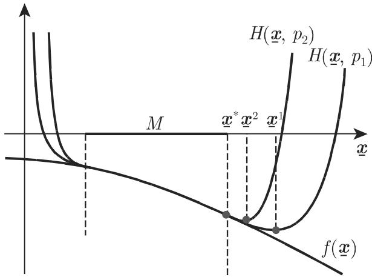

# 数学手册(原书第10版) images-64 插图资产（00de987f，内容待鉴定）

本源为《数学手册(原书第10版)》images 目录下的一枚 JPEG 图像资产，属既有的 images-64 锚位哈希资产序列，为该序列第十六枚已入库成员。所提供的源材料仅含文件元数据与媒体引用，未附可辨识的视觉内容信息，图像内容处于待鉴定状态，母书为 [[entities/数学手册原书第10版]]。

## 资产元数据

| 字段 | 值 |
|---|---|
| 文件名 | `00de987f2ba81ed700ee364e752d2655854c10777c04a43216335a26f6eb33fc.jpg` |
| 大小 | 23.0 KB |
| 所在目录 | `数学手册(原书第10版)/images/` |
| 锚位 | images-64 |
| 媒体短代码 | `1rj5waj` |
| 完整哈希（64 位） | `00de987f2ba81ed700ee364e752d2655854c10777c04a43216335a26f6eb33fc` |

## 媒体引用

## 入库记录

- 本资产此前未入 wiki：索引中现有 images-64 哈希资产序列覆盖 0a74ffc6 至 0d833452 等十五个前缀，未见 00de987f。
- 计入本枚后，该序列已入库计数更新为十六枚，见 [[findings/images-64锚位哈希资产增至十六枚]]。
- 登记流程遵循 [[methodology/插图资产哈希入库法]]：以完整文件哈希为唯一标识、逐资产建页、并开立归属查询 [[queries/00de987f图像归属何章何节之辨]]。

## 证据缺口与鉴定悬置

- 本源材料未附可辨识视觉内容——图像主题、所属章节、是否与其他资产内容重复，目前均无从判断，一切归属判断须予悬置。
- 23.0 KB 的体量与 [[sources/10-数学手册原书第10版--6-images--64-0c0342eebd8b160348c25123cdd4dcc81b15cd6e6ef9bd43ddd5d8ba39e2a470--1e5tdtk]]（24.0 KB）相近，但文件大小不构成内容判断依据。
- 在鉴定完成前，本页不写入任何章节归属猜测，亦不与第 20 章（Mathematica 截图）或第 21 章（表格图）建立断言性关联。

## 关联

- 对位框架：[[concepts/图像资产与文本对位]]——本资产的对位目标未知，是该框架下又一待解实例。
- 同类悬案：[[queries/images目录图像未鉴定之辨]]、[[queries/images-64锚位双哈希资产之辨]]

<!-- llm-wiki:embedded-images -->
## Embedded Images

### Document

<!-- llm-wiki:embedded-images -->
